# Implantar a Imagem do Servidor de Gráficos e do Marketplace do Cliente

## Introdução

Este laboratório apresenta as etapas para implantar e configurar o kit Graph Server e Client em uma instância de computação por meio de uma pilha do Oracle Cloud Marketplace. Você precisará fornecer as informações de chave SSH, VCN e Sub-rede e o URL JDBC da instância do ADB durante o processo de implantação.

Tempo estimado: 7 minutos

### Objetivos

*   Saiba como implantar a imagem do Graph Server e do Client OCI Marketplace.

### Pré-requisitos

*   Chaves SSH a serem usadas para estabelecer conexão com uma instância de computação
*   Uma instância do ADB com a wallet baixada

## Tarefa 1: Criar Rede para o Servidor de Gráficos

1.  Vá para a console do Oracle Cloud > Networking > Virtual Cloud Networks
    
    
    
2.  Iniciar Assistente de VCN > Criar VCN com Conectividade de Internet > Iniciar Assistente de VCN
    
    *   NOME da VCN: por exemplo, **vcn1**
    *   O resto dos itens: Não precisa ser alterado
3.  Você precisa abrir a porta 7007. Vá para Redes Virtuais na Nuvem > vcn1 > Sub-rede Pública-vcn1 > Lista de Segurança Padrão para vcn1 > Adicionar Regras de Entrada e crie a regra abaixo:
    
    *   Tipo de Origem: **CIDR**
    *   CIDR de Origem: **0.0.0.0/0** (Esta definição é somente para teste. Substitua o endereço IP das máquinas cliente para uso real.)
    *   Protocolo IP: **TCP**
    *   Intervalo de Portas de Origem: **(Todos)**
    *   Intervalo de Portas de Destino: **7007**
    *   Descrição: por exemplo, **Para Servidor de Gráficos**
    
    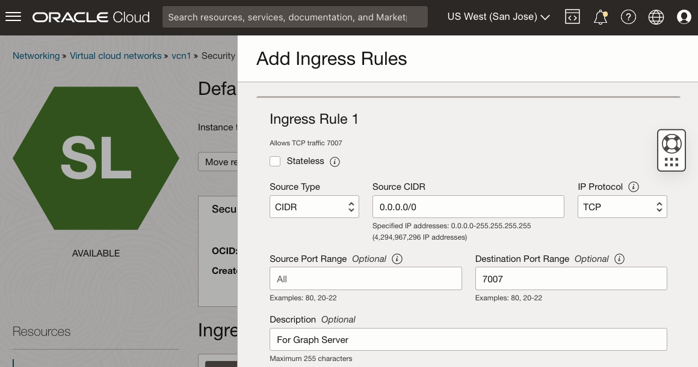
    

## Tarefa 2: Localizar o Servidor de Gráficos e o Cliente no Marketplace

O Oracle Cloud Marketplace é uma plataforma on-line que oferece software da Oracle e de parceiros como soluções de clique para implementar criadas para estender produtos e serviços da Oracle Cloud.

As pilhas do Oracle Cloud Marketplace são um conjunto de modelos do Terraform que fornecem uma implantação de ponta a ponta totalmente automatizada de uma solução de parceiro na Oracle Cloud Infrastructure.

1.  Vá para a Console do Cloud. Navegue até a guia **Marketplace** e digite "Graph Server and Client" na barra de pesquisa. Clique na pilha do Oracle Graph Server and Client.
    
    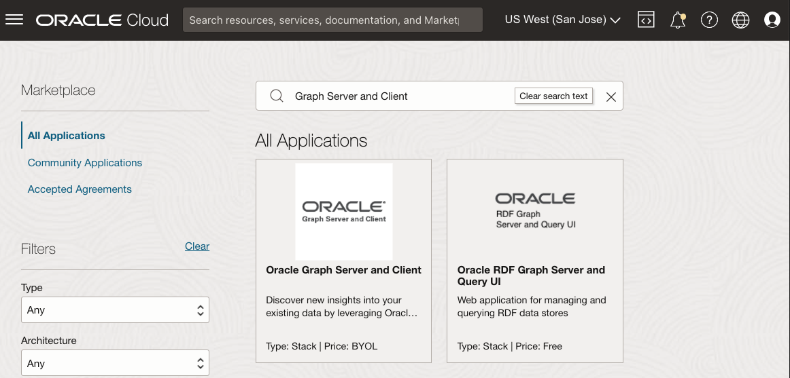
    
2.  Selecione a pilha e, em seguida, revise os Requisitos do Sistema e as Instruções de Uso. Em seguida, selecione a versão **22.4.x** (versão de patch de 18 meses) e escolha um compartimento e clique em **Iniciar Pilha**.
    
    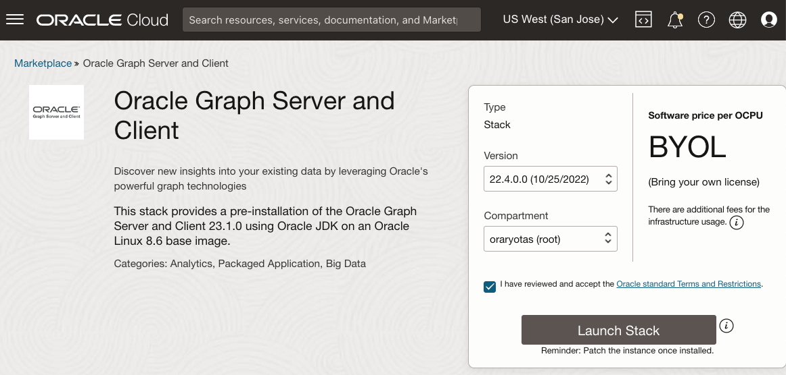
    
3.  **Informações da Pilha**: Você não precisa alterar. Prossiga com **Próximo**.
    
    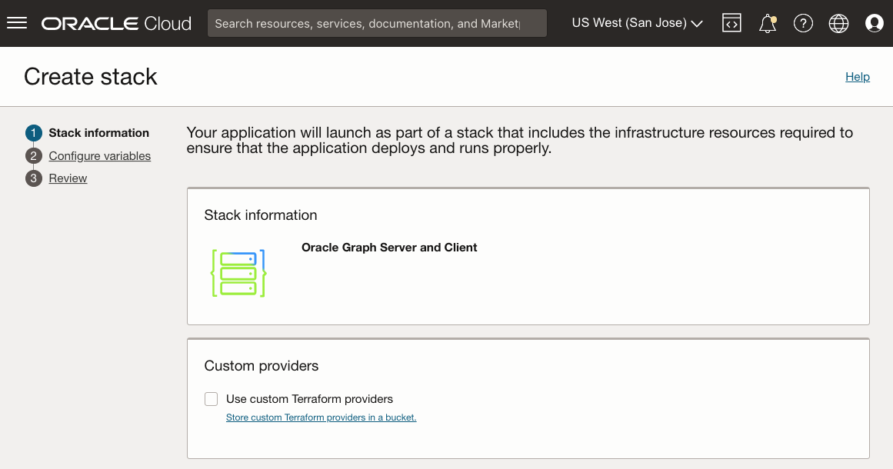
    
4.  **Configurar Variáveis**: Você precisará escolher ou fornecer o seguinte:
    
    *   Forma do Oracle Graph Server: uma forma elegível sempre gratuita é **VM.Standard.E2.1. Micro**
    *   Chave Pública SSH: é usada quando você acessa a instância provisionada posteriormente.
    
    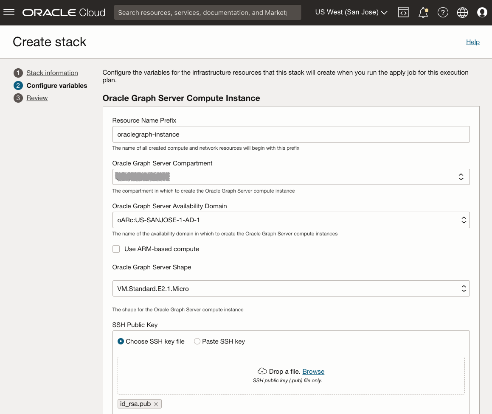
    
    *   Rede virtual na nuvem existente: a criada acima, **vcn1**
    *   Sub-rede Existente: A criada acima, **Sub-rede Pública-vcn1**
    *   URL JDBC para autenticação: **`jdbc:oracle:thin:@adb1_low?TNS_ADMIN=/etc/oracle/graph/wallets`**
    
    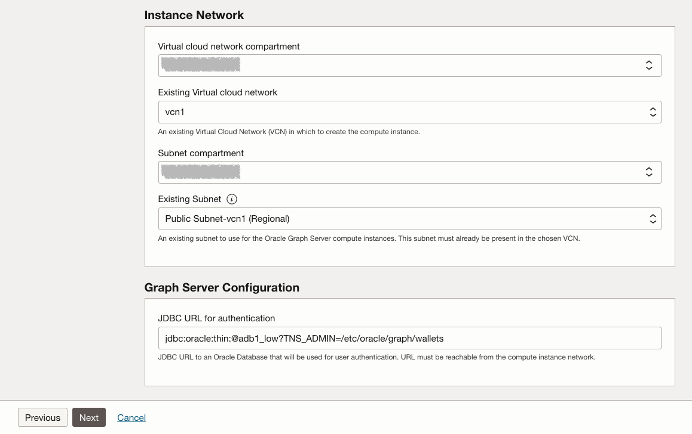
    
    Sobre o URL JDBC acima:
    
    *   Estes são os pontos de entrada TNS\_ADMIN para o diretório no qual você **fará** upload e descompactará a wallet **na instância do serviço Compute** que será criada nesse processo
    *   Se você nomeou seu banco de dados com outro nome, por exemplo, **adb2**, substitua **`@adb1_low`** por **`@adb2_low`** no URL JDBC
    *   Este URL JDBC é armazenado em **/etc/oracle/graph/pgx.conf**, que pode ser atualizado posteriormente, se necessário
5.  Clique em **Próximo** para iniciar o Job do Resource Manager para a pilha. O trabalho levará de 2 a 3 minutos para ser concluído.
    
    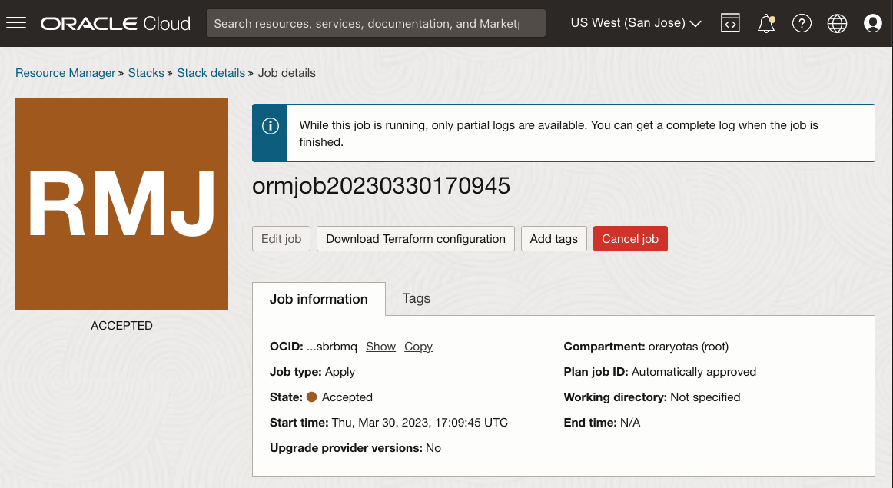
    
    Você verá o andamento na saída do log.
    
    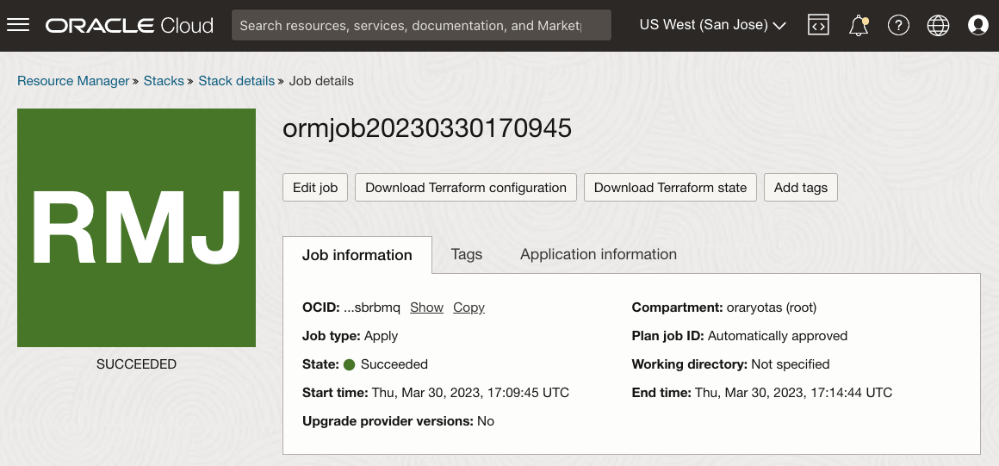
    
    Depois que o job for concluído com sucesso, o status mudará de "Em Andamento" para "Bem-sucedido". Se você obtiver **"shape VM.Standard.E2.1. Erro "Micro encontrado"**; o domínio de disponibilidade não pode fornecer a forma selecionada. Edite o job e altere o domínio de disponibilidade e tente novamente. (Uma VM de computação sempre gratuita só pode ser criada na sua região home. Se você tiver criado anteriormente uma VM de computação sempre gratuita, essa nova VM.Standard.E2.1. A microinstância só pode ser criada no mesmo domínio de disponibilidade que a anterior.)
    
    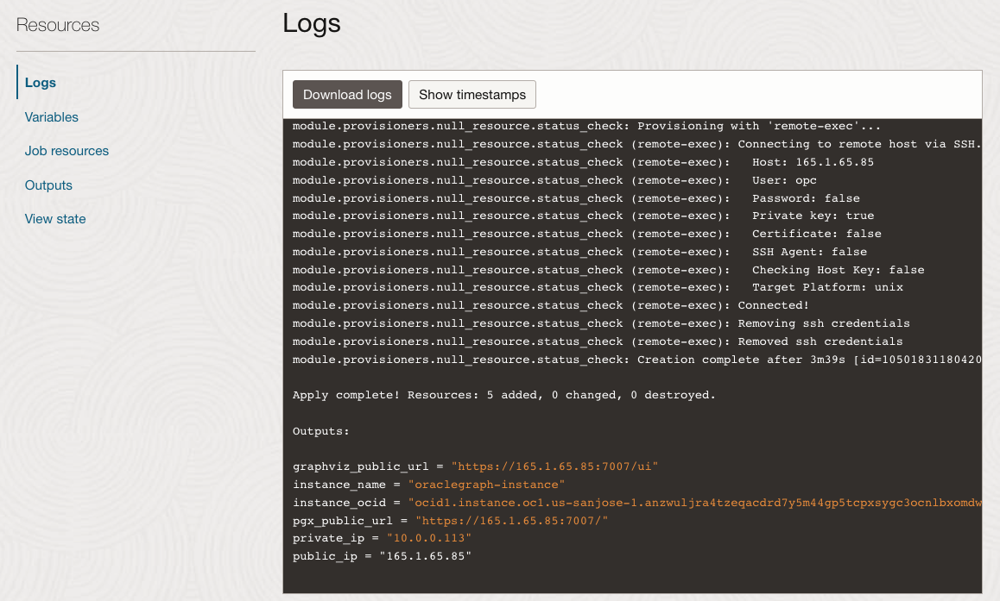
    
    _**OBSERVAÇÃO:**_ _Na conclusão, anote **public\_ip** e **graphviz\_public\_url** para que você possa usar SSH na instância em execução e acessar a visualização de gráfico posteriormente neste laboratório._
    

## Tarefa 3: Fazer Download da Wallet do ADB

1.  Vá para a console da Nuvem, em **Oracle Database**, selecione **Autonomous Transaction Processing**. Se você não vir sua instância, certifique-se de que o **Tipo de Carga de Trabalho** seja **Processamento de Transações** ou **Todos**.
    
    
    
2.  Clique na sua instância do Autonomous Database. Na sua página Autonomous Database Details, clique em **Database Connection**.
    
    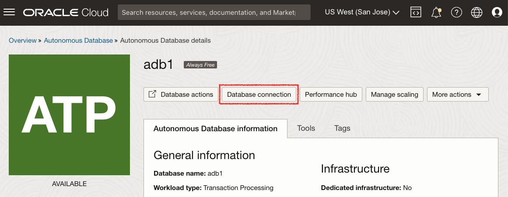
    
3.  Na janela Conexão de Banco de Dados, selecione **Wallet da Instância** como Tipo de Wallet e clique em **Fazer Download da Wallet**.
    
    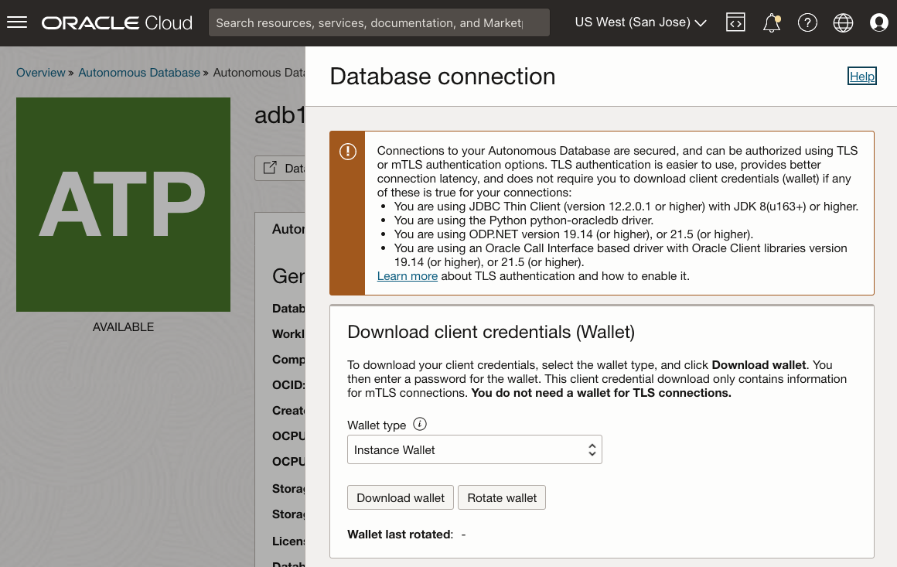
    
4.  Na caixa de diálogo Fazer Download da Wallet, informe uma (nova) senha da wallet nos campos Senha. Essa senha protege o wallet de credenciais do cliente submetido a download.
    
    Clique em **Download** para salvar o arquivo zip das credenciais de segurança do cliente. 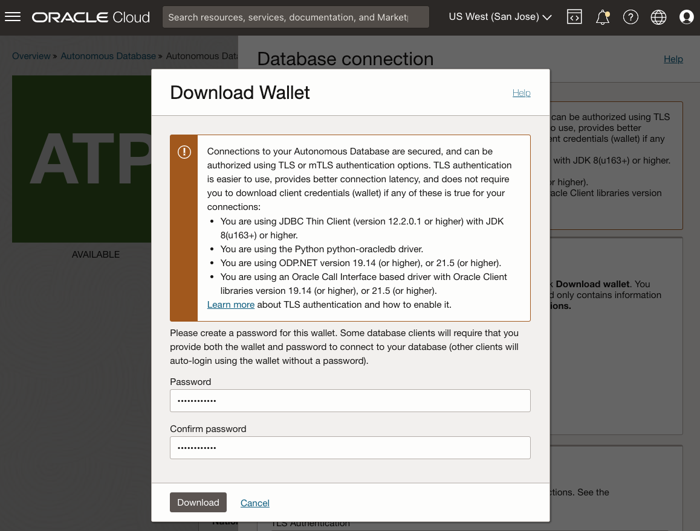
    
    Por padrão, o nome do arquivo é **Wallet\_<database\_name>.zip**
    

O conteúdo desta seção é adaptado de [Fazer Download das Credenciais do Cliente (Wallets)](https://docs.oracle.com/en/cloud/paas/autonomous-data-warehouse-cloud/user/connect-download-wallet.html#GUID-B06202D2-0597-41AA-9481-3B174F75D4B1)

## Tarefa 4: Fazer Upload da Wallet do ADB

Nesta etapa, você precisa da ferramenta shell para executar os comandos **scp** e **ssh**, por exemplo, Oracle Cloud Shell, Terminal se estiver usando MAC ou Gitbash se estiver usando o Windows.

Copie a wallet da sua máquina local para a instância do Servidor de Gráficos no OCI.

    <copy>
    scp -i <private_key> <Wallet_database_name>.zip opc@<public_ip_for_compute>:/etc/oracle/graph/wallets
    </copy>
    

Exemplo:

    <copy>
    scp -i key.pem ~/Downloads/Wallet_adb1.zip opc@203.0.113.14:/etc/oracle/graph/wallets
    </copy>
    

## Tarefa 5: Descompactar Wallet do ADB

1.  Conecte-se à instância de computação via SSH como usuário **opc**, usando a chave privada criada anteriormente.
    
        <copy>
        ssh -i <private_key> opc@<public_ip_for_compute>
        </copy>
        
    
    Exemplo:
    
        <copy>
        ssh -i key.pem opc@203.0.113.14
        </copy>
        
2.  Descompacte a wallet do ADB no diretório **/etc/oracle/graph/wallets/** e altere a permissão do grupo.
    
        <copy>
        cd /etc/oracle/graph/wallets/
        unzip Wallet_adb1.zip
        chgrp oraclegraph *
        </copy>
        
3.  Opcionalmente, verifique se você usou o nome de serviço correto no URL JDBC informado ao configurar a pilha do OCI.
    
        <copy>
        cat /etc/oracle/graph/wallets/tnsnames.ora
        </copy>
        
    
    Você verá a entrada `adb1_low` semelhante a:
    
        <copy>
        adb1_low =
            (description=
                (address=
                    (https_proxy=proxyhostname)(https_proxy_port=80)(protocol=tcps)(port=1521)
                    (host=adwc.example.oraclecloud.com)
                )
                (connect_data=(service_name=adwc1_low.adwc.oraclecloud.com))
                (security=(ssl_server_cert_dn="adwc.example.oraclecloud.com,OU=Oracle BMCS US,O=Oracle Corporation,L=Redwood City,ST=California,C=US"))
        )
        </copy>
        

Agora você pode ir para o próximo laboratório.

## Agradecimentos

*   **Autor** - Jayant Sharma
*   **Colaboradores** - Arabella Yao, Jenny Tsai
*   **Última Atualização em/Data** - Ryota Yamanaka, março de 2023