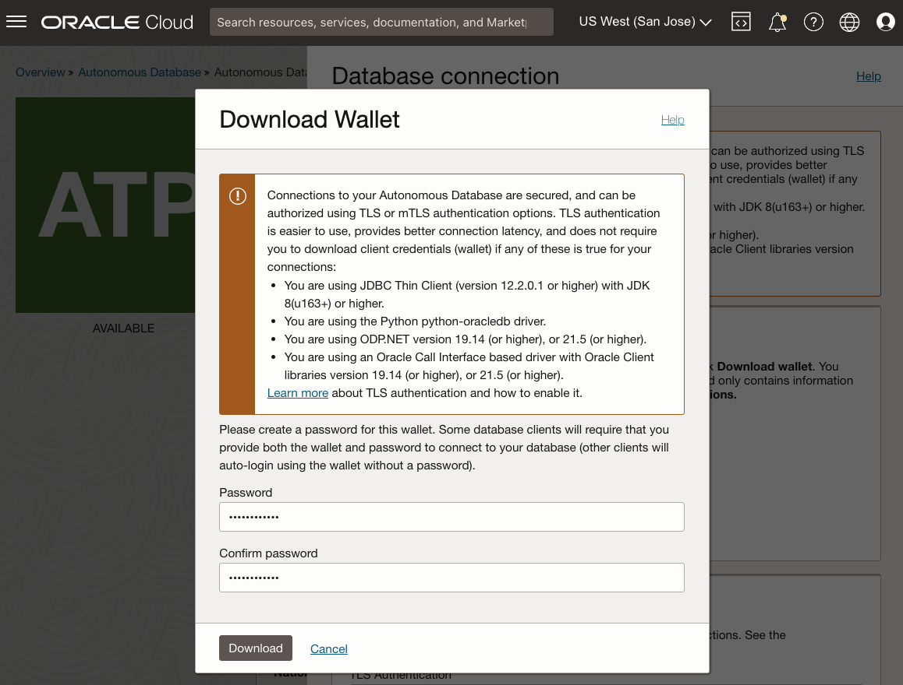

# 部署图形服务器和客户端市场映像

## 简介

此实验室将指导您完成通过 Oracle Cloud Marketplace 堆栈在计算实例上部署和配置 Graph Server 和 Client 套件的步骤。在部署过程中，您需要提供 ADB 实例的 SSH 密钥、VCN 和子网信息以及 JDBC URL。

估计时间：7 分钟

### 目标

*   了解如何部署 Graph Server 和 Client OCI Marketplace 映像。

### 先备条件

*   用于连接到计算实例的 SSH 密钥
*   具有已下载 wallet 的 ADB 实例

## 任务 1：为图形服务器创建网络

1.  转至 Oracle Cloud 控制台 > 网络 > 虚拟云网络
    
    
    
2.  启动 VCN 向导 > 创建具有 Internet 连接的 VCN > 启动 VCN 向导
    
    *   VCN 名称：例如 **vcn1**
    *   其余的项目：不需要更改
3.  您需要打开端口 7007。转到“Virtual Cloud Networks（虚拟云网络）”> vcn1 >“Public Subnet-vcn1（公共子网）”>“Default Security List for vcn1（默认安全列表）”>“Add Ingress Rules（添加入站规则）”，然后在下面创建规则：
    
    *   源类型： **CIDR**
    *   源 CIDR：**0.0.0.0/0** （此设置仅用于测试）。请替换为客户端计算机的 IP 地址以供实际使用。)
    *   IP 协议： **TCP**
    *   源端口范围：**（全部）**
    *   目的地端口范围： **7007**
    *   说明：例如**对于图形服务器**
    
    
    

## 任务 2：在市场中找到图形服务器和客户端

Oracle Cloud Marketplace 是一个在线平台，提供 Oracle 和合作伙伴软件，作为一键部署解决方案，可扩展 Oracle Cloud 产品和服务。

Oracle Cloud Marketplace 堆栈是一组 Terraform 模板，可在 Oracle Cloud Infrastructure 上全自动部署合作伙伴解决方案。

1.  转到云控制台。导航到 **Marketplace（市场）**选项卡，然后在显示栏中输入 "Graph Server and Client"（图形服务器和客户端）。单击 Oracle Graph Server and Client 堆栈。
    
    
    
2.  选择堆栈，然后查看系统要求和使用说明。然后选择版本 **22.4.x** （18 个月补丁程序发行版），选择一个区间并单击**启动堆栈**。
    
    
    
3.  **堆栈信息**：无需更改。继续执行**下一步**。
    
    
    
4.  **配置变量**：您需要选择或提供以下内容：
    
    *   Oracle Graph Server 配置：始终免费的合格配置是 **VM.Standard.E2.1。微**
    *   SSH 公共密钥：此密钥将在以后 ssh 到预配的实例时使用。
    
    
    
    *   现有虚拟云网络：上面创建的虚拟云网络 **vcn1**
    *   现有子网：上面创建的子网 **Public Subnet-vcn1**
    *   用于验证的 JDBC URL：**`jdbc:oracle:thin:@adb1_low?TNS_ADMIN=/etc/oracle/graph/wallets`**
    
    
    
    关于上面的 JDBC URL：
    
    *   这是您**将**上载和解压缩**在计算实例上**将在此过程中创建的 wallet 的目录的 TNS\_ADMIN 入口点
    *   如果将数据库命名为其他名称，例如 **adb2** ，则在 JDBC URL 中将 **`@adb1_low`** 替换为 **`@adb2_low`**
    *   此 JDBC URL 存储在 **/etc/oracle/graph/pgx.conf** 中，如果需要，可以稍后更新该 URL
5.  单击**下一步**可启动堆栈的资源管理器作业。完成此工作需要 2-3 分钟。
    
    
    
    您将在日志输出中看到进度。
    
    
    
    作业成功完成后，状态将从“进行中”更改为“成功”。如果获得 **"shape VM.Standard.E2.1”。找不到 Micro"** 错误，可用性域无法提供所选配置。请编辑作业并更改可用性域，然后重试。（只能在主区域中创建始终免费的计算 VM）。如果您以前创建过始终免费的计算 VM，则此新的 VM.Standard.E2.1。微实例只能在与上一个可用性域相同的可用性域中创建。)
    
    
    
    _**注意：**_ _完成后，请记下 **public\_ip** 和 **graphviz\_public\_url** ，以便您可以通过 SSH 连接到正在运行的实例，并在本练习的后面部分中访问图形视图。_
    

## 任务 3：下载 ADB Wallet

1.  转到云控制台，在 **Oracle Database** 下选择**自治事务处理**。如果您看不到实例，请确保**工作量类型**为**事务处理**或**全部**。
    
    
    
2.  单击 Autonomous Database 实例。在“Autonomous Database Details（自治数据库详细信息）”页面中，单击 **Database Connection（数据库连接）**。
    
    
    
3.  在“数据库连接”窗口中，选择**实例 Wallet** 作为 Wallet 类型，单击**下载 Wallet** 。
    
    
    
4.  在 "Download Wallet"（下载 Wallet）对话框中，在 "Password"（密码）字段中输入（新的）Wallet 密码。此密码保护下载的客户端凭据 wallet。
    
    单击 **Download（下载）**以保存客户端安全凭据 zip 文件。 
    
    默认情况下，文件名为：**Wallet\_<database\_name>.zip**
    

此部分中的内容根据[下载客户端身份证明（钱包）](https://docs.oracle.com/en/cloud/paas/autonomous-data-warehouse-cloud/user/connect-download-wallet.html#GUID-B06202D2-0597-41AA-9481-3B174F75D4B1)进行调整

## 任务 4：上载 ADB Wallet

在此步骤中，您需要使用 shell 工具来运行 **scp** 和 **ssh** 命令，例如 Oracle Cloud Shell、Terminal（如果使用 MAC）或 Gitbash（如果使用 Windows）。

将 wallet 从本地计算机复制到 OCI 上的 Graph Server 实例。

    <copy>
    scp -i <private_key> <Wallet_database_name>.zip opc@<public_ip_for_compute>:/etc/oracle/graph/wallets
    </copy>
    

示例：

    <copy>
    scp -i key.pem ~/Downloads/Wallet_adb1.zip opc@203.0.113.14:/etc/oracle/graph/wallets
    </copy>
    

## 任务 5：解压缩 ADB Wallet

1.  使用您之前创建的私有密钥，以 **opc** 用户身份通过 SSH 连接到计算实例。
    
        <copy>
        ssh -i <private_key> opc@<public_ip_for_compute>
        </copy>
        
    
    示例：
    
        <copy>
        ssh -i key.pem opc@203.0.113.14
        </copy>
        
2.  将 ADB wallet 解压缩到 **/etc/oracle/graph/wallets/** 目录并更改组权限。
    
        <copy>
        cd /etc/oracle/graph/wallets/
        unzip Wallet_adb1.zip
        chgrp oraclegraph *
        </copy>
        
3.  （可选）检查在配置 OCI 堆栈时输入的 JDBC URL 中是否使用了正确的服务名。
    
        <copy>
        cat /etc/oracle/graph/wallets/tnsnames.ora
        </copy>
        
    
    您将看到条目 `adb1_low`，类似于：
    
        <copy>
        adb1_low =
            (description=
                (address=
                    (https_proxy=proxyhostname)(https_proxy_port=80)(protocol=tcps)(port=1521)
                    (host=adwc.example.oraclecloud.com)
                )
                (connect_data=(service_name=adwc1_low.adwc.oraclecloud.com))
                (security=(ssl_server_cert_dn="adwc.example.oraclecloud.com,OU=Oracle BMCS US,O=Oracle Corporation,L=Redwood City,ST=California,C=US"))
        )
        </copy>
        

现在，您可以进入下一个实验室。

## 确认

*   **作者** - Jayant Sharma
*   **贡献者** - Arabella Yao、Jenny Tsai
*   **上次更新者/日期** - Ryota Yamanaka，2023 年 3 月