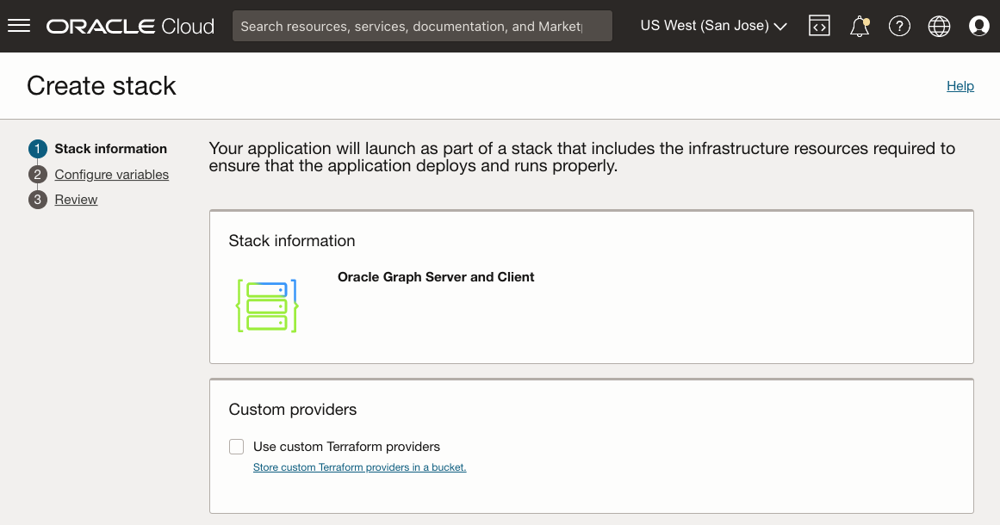

# 部署 Graph Server 與 Client Marketplace 影像

## 簡介

這個實驗室會逐步介紹透過 Oracle Cloud Marketplace 堆疊在運算執行處理上部署及設定圖表伺服器和從屬端套件的步驟。您必須在部署處理作業期間提供 ADB 執行處理的 SSH 金鑰、VCN 與子網路資訊，以及 JDBC URL。

估計時間：7 分鐘

### 目標

*   瞭解如何部署 Graph Server 和 Client OCI Marketplace 映像檔。

### 先決條件

*   用於連線至運算執行處理的 SSH 金鑰
*   具有下載公事包的 ADB 執行處理

## 作業 1：建立圖表伺服器的網路

1.  前往 Oracle Cloud 主控台 > 網路 > 虛擬雲端網路
    
    
    
2.  啟動 VCN 精靈 > 建立具有網際網路連線的 VCN > 啟動 VCN 精靈
    
    *   VCN 名稱：例如 **vcn1**
    *   其餘項目：不需要變更
3.  您必須開啟連接埠 7007。前往虛擬雲端網路 > vcn1 > 公用子網路 -vcn1 > vcn1 的預設安全清單 > 新增傳入規則，並在下方建立規則：
    
    *   來源類型： **CIDR**
    *   來源 CIDR：**0.0.0.0/0** (此設定僅供測試使用)。請取代用戶端機器的 IP 位址，以供實際使用。)
    *   IP 協定： **TCP**
    *   來源連接埠範圍： **(全部)**
    *   目的地連接埠範圍： **7007**
    *   描述：例如 **For Graph Server**
    
    
    

## 作業 2：在市集中尋找圖表伺服器與用戶端

Oracle Cloud Marketplace 是一個線上平台，提供 Oracle 和夥伴軟體作為可擴展 Oracle Cloud 產品和服務所建置的點擊部署解決方案。

Oracle Cloud Marketplace 堆疊是一組 Terraform 範本，提供 Oracle Cloud Infrastructure 上合作夥伴解決方案的完全自動化端對端部署。

1.  前往您的雲端主控台。瀏覽至 **Marketplace** 標籤，然後在搜尋列中輸入「Graph Server and Client」。按一下 Oracle Graph Server and Client 堆疊。
    
    
    
2.  選取堆疊，然後複查「系統需求與使用說明」。接著選取版本 **22.4.x** (18 個月的修正程式版本)，然後選擇區間並按一下**啟動堆疊**。
    
    
    
3.  **堆疊資訊**：您不需要變更。繼續**下一步 (Next)** 。
    
    
    
4.  **設定變數**：您必須選擇或提供下列項目：
    
    *   Oracle Graph Server 資源配置：永遠免費適用的資源配置為 **VM.Standard.E2.1。微型**
    *   SSH 公開金鑰：以後當您登入佈建的執行處理時會使用此金鑰。
    
    
    
    *   現有的虛擬雲端網路：上面建立的虛擬雲端網路：**vcn1**
    *   現有子網路：上面建立的子網路：**公用子網路 -vcn1**
    *   用於認證的 JDBC URL：**`jdbc:oracle:thin:@adb1_low?TNS_ADMIN=/etc/oracle/graph/wallets`**
    
    
    
    關於上面的 JDBC URL：
    
    *   這是 TNS\_ADMIN 項目指向您**將**上傳並解壓縮**運算執行處理**公事包的目錄，此公事包將在此處理作業中建立
    *   如果您將資料庫命名為其他資料庫，例如 **adb2** ，請在 JDBC URL 中將 **`@adb1_low`** 取代為 **`@adb2_low`**
    *   此 JDBC URL 儲存在 **/etc/oracle/graph/pgx.conf** 中，可視需要於稍後更新
5.  按一下**下一步 (Next)** 以起始堆疊的「資源管理程式工作 (Resource Manager Job)」。工作將需要 2-3 分鐘才能完成。
    
    
    
    您會在日誌輸出中看到進度。
    
    
    
    工作順利完成之後，狀態就會從「進行中」變更為「成功」。如果取得 **"shape VM.Standard.E2.1"。找不到微型 "** 錯誤，可用性網域無法提供選取的資源配置。請編輯工作並變更可用性網域，然後重試。(只能在您的主要區域中建立永遠免費運算 VM. 如果您先前已經建立永遠免費運算 VM，那麼這個新的 VM.Standard.E2.1。微執行處理只能在與先前相同的可用性網域中建立。)
    
    
    
    _**附註：**_ _完成時，請記下 **public\_ip** 和 **graphviz\_public\_url** ，讓您可以透過 SSH 登入執行中的執行處理，並於稍後在此實驗室中存取圖表精靈。_
    

## 作業 3：下載 ADB 公事包

1.  前往您的雲端主控台，在 **Oracle Database** 下，選取 **Autonomous Transaction Processing** 。如果您未見到執行處理，請確定**工作負載類型**為**交易處理**或**全部**。
    
    
    
2.  按一下您的 Autonomous Database 執行處理。在 Autonomous Database 詳細資訊頁面中，按一下**資料庫連線**。
    
    
    
3.  在「資料庫連線」視窗中，選取**執行處理公事包**作為您的「公事包類型」，按一下**下載公事包**。
    
    
    
4.  在「下載公事包」對話方塊的「密碼」欄位中，輸入 (新) 公事包密碼。此密碼可保護下載的用戶端認證公事包。
    
    按一下**下載**以儲存用戶端安全證明資料 zip 檔案。 
    
    檔案預設為：**Wallet\_<database\_name>.zip**
    

此區段中的內容是從[下載從屬端證明資料 (公事包)](https://docs.oracle.com/en/cloud/paas/autonomous-data-warehouse-cloud/user/connect-download-wallet.html#GUID-B06202D2-0597-41AA-9481-3B174F75D4B1) 所調適

## 作業 4：上傳 ADB 公事包

在此步驟中，您需要使用 Shell 工具執行 **scp** 和 **ssh** 指令，例如 Oracle Cloud Shell、Terminal (如果您使用的是 MAC)，或者 Gitbash (如果您使用的是 Windows)。

將公事包從您的本機機器複製到 OCI 上的 Graph Server 執行處理。

    <copy>
    scp -i <private_key> <Wallet_database_name>.zip opc@<public_ip_for_compute>:/etc/oracle/graph/wallets
    </copy>
    

範例：

    <copy>
    scp -i key.pem ~/Downloads/Wallet_adb1.zip opc@203.0.113.14:/etc/oracle/graph/wallets
    </copy>
    

## 作業 5：解壓縮 ADB 公事包

1.  請使用先前建立的私密金鑰，以 **opc** 使用者身分透過 SSH 連線至運算執行處理。
    
        <copy>
        ssh -i <private_key> opc@<public_ip_for_compute>
        </copy>
        
    
    範例：
    
        <copy>
        ssh -i key.pem opc@203.0.113.14
        </copy>
        
2.  將 ADB 公事包解壓縮至 **/etc/oracle/graph/wallets/** 目錄，並變更群組權限。
    
        <copy>
        cd /etc/oracle/graph/wallets/
        unzip Wallet_adb1.zip
        chgrp oraclegraph *
        </copy>
        
3.  或者，檢查您在設定 OCI 堆疊時所輸入的 JDBC URL 中是否使用正確的服務名稱。
    
        <copy>
        cat /etc/oracle/graph/wallets/tnsnames.ora
        </copy>
        
    
    您將會看到類似以下的項目 `adb1_low`：
    
        <copy>
        adb1_low =
            (description=
                (address=
                    (https_proxy=proxyhostname)(https_proxy_port=80)(protocol=tcps)(port=1521)
                    (host=adwc.example.oraclecloud.com)
                )
                (connect_data=(service_name=adwc1_low.adwc.oraclecloud.com))
                (security=(ssl_server_cert_dn="adwc.example.oraclecloud.com,OU=Oracle BMCS US,O=Oracle Corporation,L=Redwood City,ST=California,C=US"))
        )
        </copy>
        

您現在可以繼續下一個實驗室。

## 確認

*   **作者** - Jayant Sharma
*   **貢獻者** - Arabella Yao、Jenny Tsai
*   **上次更新者 / 日期** - Ryota Yamanaka，2023 年 3 月