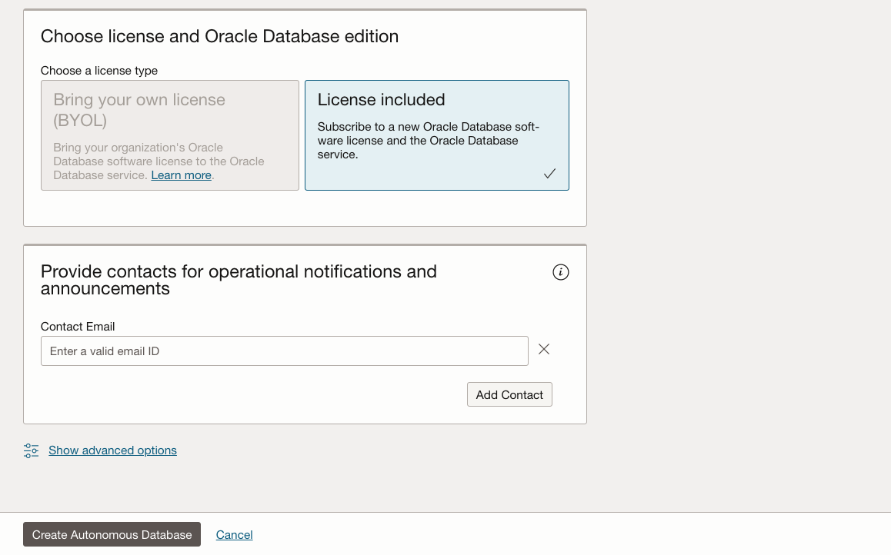

# Gemeinsame Autonomous Database-Free Tier-Instanz bereitstellen

## Einführung

In dieser Übung werden die Schritte für die ersten Schritte mit Oracle Autonomous Database (Autonomous Data Warehouse \[ADW\] und Autonomous Transaction Processing \[ATP\]) in Oracle Cloud beschrieben. Sie stellen eine neue ATP-Instanz über die Cloud-Konsole bereit.

_Note1: Während in dieser Übung ATP verwendet wird, sind die Schritte zum Erstellen und Herstellen einer Verbindung zu einer ADW-Datenbank identisch._

_Note2: Wenn Sie eine autonome Datenbank vom Typ "Immer kostenlos" erstellen möchten, müssen Sie sich in einer Region befinden, in der Ressourcen vom Typ "Immer kostenlos" verfügbar sind. (Nicht alle Regionen verfügen über Ressourcen vom Typ "Immer kostenlos")_

Voraussichtliche Zeit: 5 Minuten

Sehen Sie sich eine Videodemonstration zum Provisioning einer autonomen Datenbank in Autonomous Transaction Processing an (diese Schritte gelten auch für das Provisioning einer autonomen Datenbank in Autonomous Data Warehouse):

[YouTube](youtube:Q6hxMaAPghI)

### Ziele

*   Erfahren Sie, wie Sie eine neue kostenlose Autonomous Transaction Processing-Instanz bereitstellen

### Voraussetzungen

*   Ein [Oracle Cloud-Account](https://www.oracle.com/cloud/free/). Sie können Ihren eigenen Cloud-Account, einen Cloud-Account, den Sie durch eine Testversion erhalten haben, einen Free Tier-Account oder einen Schulungsaccount verwenden, dessen Details Ihnen ein Oracle-Dozent mitgeteilt hat.

## Aufgabe 1: Wählen Sie im Menü "Services" die Option "Verfügbarkeit".

1.  Melden Sie sich bei Oracle Cloud an.
    
2.  Sobald Sie angemeldet sind, gelangen Sie zum Cloud-Service-Dashboard, in dem Sie alle für Sie verfügbaren Services anzeigen können. Klicken Sie oben links auf das Navigationsmenü, um Navigationsoptionen der obersten Ebene anzuzeigen.
    
    **Hinweis:** Sie können auch direkt auf Ihren Autonomous Data Warehouse- oder Autonomous Transaction Processing-Service im Abschnitt **Schnellaktionen** des Dashboards zugreifen.
    
    
    
3.  Die folgenden Schritte gelten gleichermaßen für Autonomous Data Warehouse oder Autonomous Transaction Processing. In dieser Übung wird das Provisioning einer Autonomous Transaction Processing-(ATP-)Datenbank angezeigt. Klicken Sie oben links auf das **Navigationsmenü**, navigieren Sie zu **Oracle Database**, und wählen Sie **Autonomous Transaction Processing** aus.
    
    
    
4.  Stellen Sie sicher, dass der Workload-Typ **Transaktionsverarbeitung** oder **Alle** lautet, um Ihre Autonomous Transaction Processing-Instanzen anzuzeigen. Mit dem Dropdown-Menü **Listengeltungsbereich** können Sie ein Compartment auswählen. Wählen Sie Ihr **Root Compartment** oder **ein anderes Compartment Ihrer Wahl** aus, in dem Sie die neue ATP-Instanz erstellen. Wenn Sie ein neues Compartment erstellen oder mehr darüber erfahren möchten, klicken Sie [hier](https://docs.cloud.oracle.com/iaas/Content/Identity/Tasks/managingcompartments.htm#three).
    
    _**Hinweis**: Vermeiden Sie die Verwendung des Compartments ManagedCompartmentforPaaS, da dies ein Oracle-Standardwert ist, der für Oracle Platform Services verwendet wird._
    

## Aufgabe 2: ADB-Instanz erstellen

1.  Klicken Sie auf **Autonomous Database erstellen**, um den Instanzerstellungsprozess zu starten.
    
    
    
2.  Daraufhin wird der Bildschirm **Autonomous Database erstellen** angezeigt, in dem Sie die Konfiguration der Instanz angeben.
    
3.  Geben Sie grundlegende Informationen für Autonomous Database an:
    
    *   **Compartment auswählen**: Wählen Sie in der Dropdown-Liste ein Compartment für die Datenbank aus.
    *   **Anzeigename** - Geben Sie einen unvergesslichen Namen für die Datenbank zu Anzeigezwecken ein. Für diese Übung verwenden Sie **ATP Graph**.
    *   **Database Name** - Verwenden Sie nur Buchstaben und Zahlen, die mit einem Buchstaben beginnen. Die maximale Länge beträgt 14 Zeichen. (Unterstriche werden anfänglich nicht unterstützt.) Verwenden Sie für diese Übung **ATPGRAPH**.
4.  Wählen Sie einen Workload-Typ aus. Wählen Sie den Workload-Typ für die Datenbank aus:
    
    *   **Transaktionsverarbeitung** - In dieser Übung wählen Sie als Workload-Typ **Transaktionsverarbeitung**.
    *   **Data Warehouse** - Alternativ können Sie Data Warehouse als Workload-Typ auswählen.
    
    
    
5.  Wählen Sie einen Deployment-Typ. Wählen Sie den Deployment-Typ für die Datenbank aus:
    
    *   **Gemeinsame Infrastruktur** - Wählen Sie für diese Übung die Option **Gemeinsame Infrastruktur** als Deployment-Typ aus.
    *   **Dedizierte Infrastruktur** - Alternativ können Sie "Dedizierte Infrastruktur" als Workload-Typ auswählen.
    
    
    
6.  Konfigurieren Sie die Datenbank, und wählen Sie die Option **Immer kostenlos**:
    
    *   **Immer kostenlos** - In dieser Übung können Sie diese Option auswählen, um eine autonome Datenbank vom Typ "Immer kostenlos" zu erstellen, oder Sie können diese Option nicht auswählen und eine Datenbank mit Ihrem kostenpflichtigen Abonnement erstellen. Eine immer kostenlose Datenbank verfügt über 1 CPU und 20 GB Speicher. Die Auswahl von "Immer kostenlos" reicht für diese Übung aus.
    *   **Datenbankversion auswählen**: Wählen Sie eine der verfügbaren Datenbankversionen aus (`19c` oder `21c`).
    *   **OCPU-Anzahl** - Anzahl CPUs.
    *   **Automatische Skalierung** - Für diese Übung deaktivieren Sie **automatische Skalierung**.
    *   **Storage (TB)** - Speicherkapazität in Terabyte.
    *   **Neue Datenbankvorschau** - Wenn ein Kontrollkästchen zur Vorschau einer neuen Datenbankversion verfügbar ist, **nicht** aktivieren.
    
    
    
7.  Administratorzugangsdaten erstellen:
    
    *   **Kennwort und Kennwort bestätigen**: Geben Sie das Kennwort für den ADMIN-Benutzer der Serviceinstanz an. Das Passwort muss die folgenden Anforderungen erfüllen:
    *   Das Kennwort muss zwischen 12 und 30 Zeichen umfassen und mindestens einen Großbuchstaben, einen Kleinbuchstaben und ein numerisches Zeichen enthalten.
    *   Das Kennwort kann nicht den Benutzernamen enthalten.
    *   Das Kennwort darf keine doppelten Anführungszeichen (") enthalten.
    *   Das Kennwort muss sich von den letzten 4 verwendeten Kennwörtern unterscheiden.
    *   Das Kennwort darf nicht mit einem Kennwort übereinstimmen, das vor weniger als 24 Stunden festgelegt wurde.
    *   Geben Sie das Kennwort erneut ein, um es zu bestätigen. Notieren Sie sich das Kennwort.
    
    
    
8.  Netzwerkzugriff auswählen:
    
    *   Übernehmen Sie für diese Übung den Standardwert "Sicherer Zugriff von überall".
    *   Wenn Sie einen privaten Endpunkt verwenden möchten, wählen Sie im Bereich "Netzwerkzugriff auswählen" die Option "Virtuelles Cloud-Netzwerk" aus, um Traffic nur vom angegebenen VCN zuzulassen. Dabei wird der Zugriff auf die Datenbank von allen öffentlichen IPs oder VCNs blockiert.
    *   Sie können den Zugriff auf Autonomous Database kontrollieren und einschränken, indem Sie ACLs (Network Access Control Lists) festlegen. Sie können aus 4 IP-Notationstypen auswählen: IP-Adresse, CIDR-Block, Virtuelles Cloud-Netzwerk, OCID des virtuellen Cloud-Netzwerks.
    
    
    
9.  Wählen Sie einen Lizenztyp aus. Wählen Sie für diese Übung die Option **Lizenz inklusive** aus. Die beiden Lizenztypen sind:
    
    *   **Bring Your Own License (BYOL)** - Wählen Sie diesen Typ aus, wenn Ihre Organisation über vorhandene Datenbanklizenzen verfügt.
    *   **Lizenz inklusive**: Wählen Sie diesen Typ aus, wenn Sie neue Datenbanksoftwarelizenzen und den Datenbank-Cloud-Service abonnieren möchten.
10.  Klicken Sie auf **Autonomous Database erstellen**.
    
    
    
11.  Ihre Instanz beginnt mit dem Provisioning. In wenigen Minuten wechselt der Status von Provisioning zu Verfügbar. Jetzt ist Ihre Autonomous Transaction Processing-Datenbank einsatzbereit! Sehen Sie sich hier die Details Ihrer Instanz an, einschließlich Name, Datenbankversion, OCPU-Anzahl und Speichergröße.  
    

Sie können jetzt mit der nächsten Übung fortfahren.

## Sie möchten mehr erfahren?

Klicken Sie [hier](https://docs.oracle.com/en/cloud/paas/autonomous-data-warehouse-cloud/user/autonomous-workflow.html#GUID-5780368D-6D40-475C-8DEB-DBA14BA675C3), um eine Dokumentation zum typischen Workflow für die Verwendung von Autonomous Data Warehouse zu erhalten.

## Danksagungen

*   **Autor** - Nilay Panchal
*   **Adapted for Cloud by** - Richard Green
*   **Zuletzt aktualisiert am/um** - Ryota Yamanaka, März 2023
*   **Autor** - Nilay Panchal
*   **Adapted for Cloud by** - Richard Green
*   **Zuletzt aktualisiert am/um** - Ryota Yamanaka, März 2023