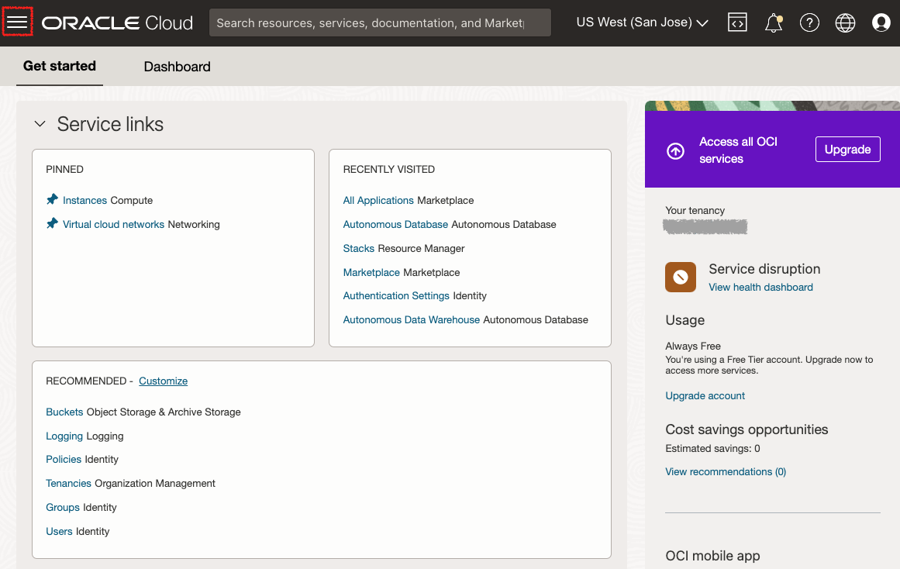
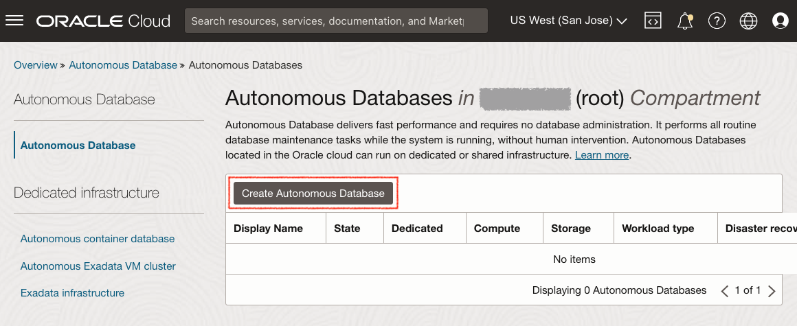
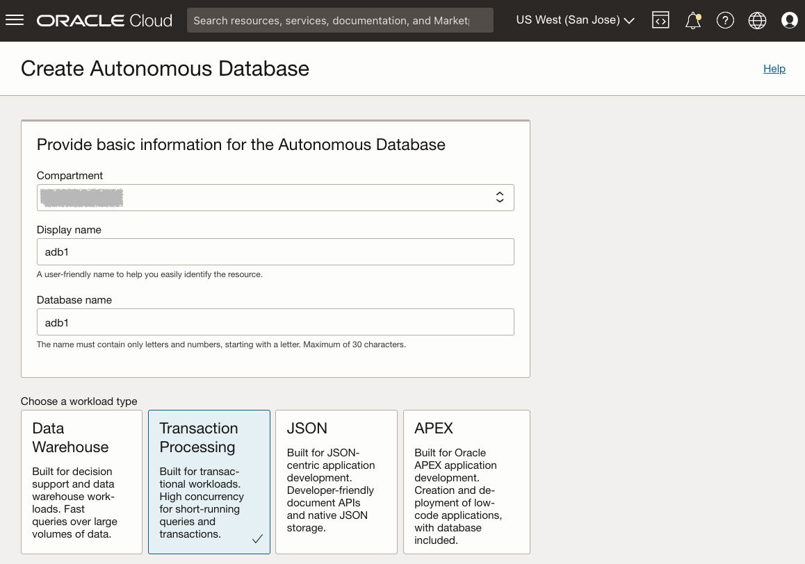
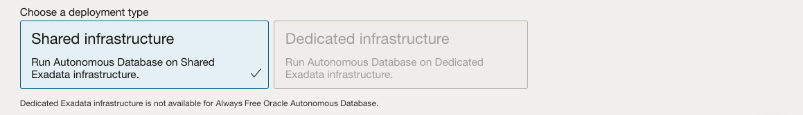
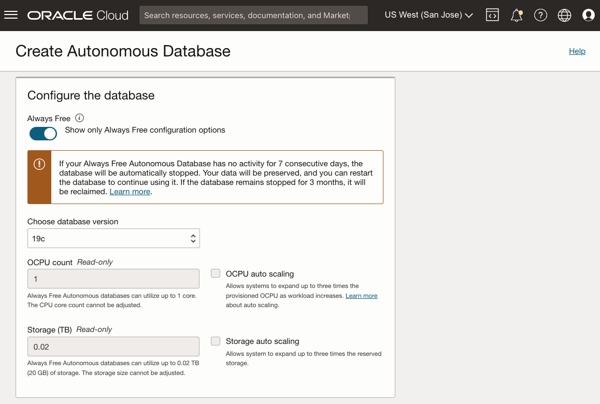
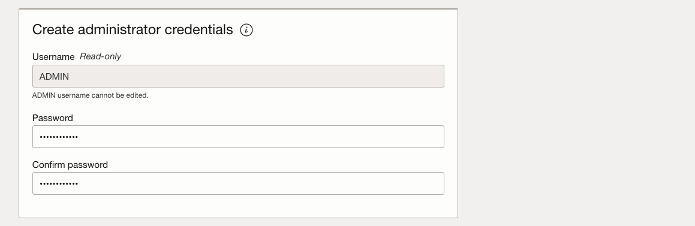
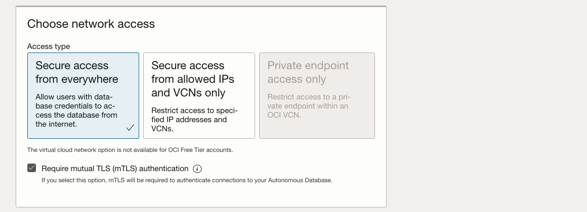
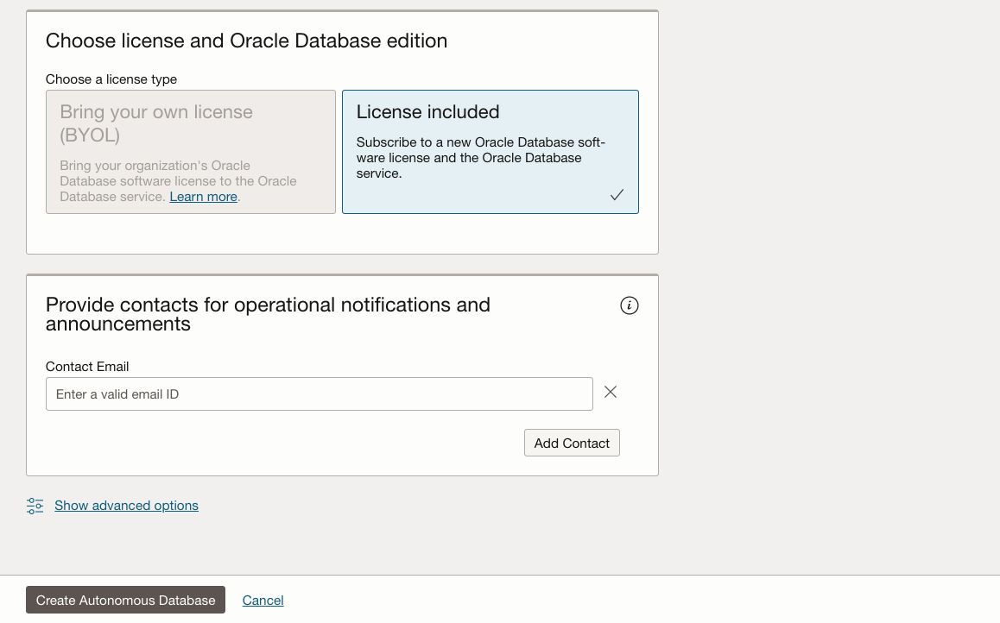
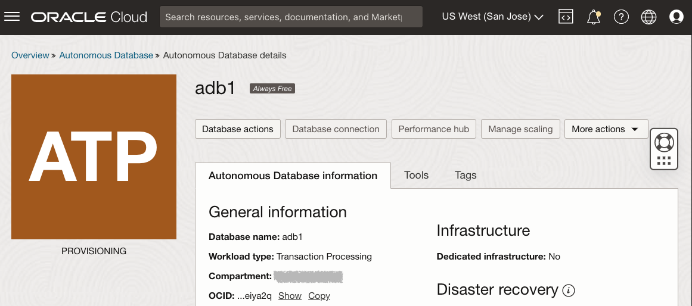
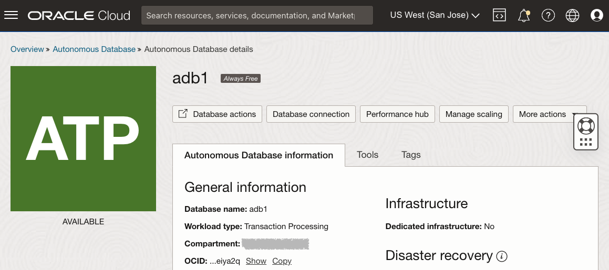

# Aprovisionamiento de una instancia de cuenta gratuita compartida de Autonomous Database

## Introducción

En este laboratorio se muestran los pasos para empezar a utilizar Oracle Autonomous Database (Autonomous Data Warehouse \[ADW\] y Autonomous Transaction Processing \[ATP\]) en Oracle Cloud. Aprovisionará una nueva instancia de ATP mediante la consola en la nube.

_Note1: aunque este ejercicio práctico utiliza ATP, los pasos son idénticos para crear y conectarse a una base de datos de ADW._

_Note2: si desea crear una base de datos autónoma Siempre gratis, debe estar en una región en la que estén disponibles los recursos Siempre gratis. (No todas las regiones tienen recursos Siempre gratis)_

Tiempo estimado: 5 minutos

Vea una demostración en vídeo del aprovisionamiento de una base de datos autónoma en Autonomous Transaction Processing (los mismos pasos se aplican al aprovisionamiento de una base de datos autónoma en Autonomous Data Warehouse):

[YouTube](youtube:Q6hxMaAPghI)

### Objetivos

*   Descubra cómo aprovisionar una nueva instancia gratuita de Autonomous Transaction Processing

### Requisitos

*   Una [cuenta de Oracle Cloud](https://www.oracle.com/cloud/free/). Puede utilizar su propia cuenta en la nube, una cuenta en la nube que haya obtenido a través de una prueba, una cuenta de cuenta gratuita o una cuenta de formación cuyos detalles le haya proporcionado un instructor de Oracle.

## Tarea 1: Seleccionar ATP del menú Servicios

1.  Inicie sesión en Oracle Cloud.
    
2.  Una vez que haya iniciado sesión, accederá al panel de control de servicios en la nube, donde podrá ver todos los servicios disponibles. Haga clic en el menú de navegación en la parte superior izquierda para mostrar las opciones de navegación de nivel superior.
    
    **Nota:** También puede acceder directamente al servicio Autonomous Data Warehouse o Autonomous Transaction Processing en la sección **Acciones rápidas** del panel de control.
    
    
    
3.  Los siguientes pasos se aplican de forma similar a Autonomous Data Warehouse o Autonomous Transaction Processing. En este laboratorio se muestra el aprovisionamiento de una base de datos de Autonomous Transaction Processing (ATP). Haga clic en el **menú de navegación** en la parte superior izquierda, vaya a **Oracle Database** y seleccione **Autonomous Transaction Processing**.
    
    
    
4.  Asegúrese de que el tipo de carga de trabajo es **Transaction Processing** o **All** para ver las instancias de Autonomous Transaction Processing. Puede utilizar el menú desplegable **Ámbito de lista** para seleccionar un compartimento. Seleccione el **compartimento raíz** o **otro compartimento de su elección** donde creará la nueva instancia de ATP. Si desea crear un nuevo compartimento o obtener más información sobre ellos, haga clic [aquí](https://docs.cloud.oracle.com/iaas/Content/Identity/Tasks/managingcompartments.htm#three).
    
    _**Nota**: evite el uso del compartimento ManagedCompartmentforPaaS, ya que es un valor por defecto de Oracle utilizado para Oracle Platform Services._
    

## Tarea 2: Creación de la instancia de ADB

1.  Haga clic en **Crear Autonomous Database** para iniciar el proceso de creación de la instancia.
    
    
    
2.  Aparecerá la pantalla **Create Autonomous Database**, donde especificará la configuración de la instancia.
    
3.  Proporcione información básica para Autonomous Database:
    
    *   **Seleccionar un compartimento**: seleccione un compartimento para la base de datos en la lista desplegable.
    *   **Display Name**: introduzca un nombre fácil de usar para mostrar la base de datos. Para esta práctica de laboratorio, utilice **ATP Graph**.
    *   **Nombre de base de datos**: utilice solo letras y números, empezando por una letra. La longitud máxima es de 14 caracteres. (Los caracteres de subrayado no se admiten inicialmente). Para esta práctica de laboratorio, utilice **ATPGRAPH**.
4.  Seleccione un tipo de carga de trabajo. Seleccione el tipo de carga de trabajo para la base de datos entre las siguientes opciones:
    
    *   **Procesamiento de transacciones**: en esta práctica de laboratorio, seleccione **Procesamiento de transacciones** como tipo de carga de trabajo.
    *   **Almacén de datos**: como alternativa, podría haber elegido el almacén de datos como tipo de carga de trabajo.
    
    
    
5.  Seleccione un tipo de despliegue. Seleccione el tipo de despliegue para la base de datos de entre las opciones:
    
    *   **Shared Infrastructure**: para esta práctica de laboratorio, seleccione **Shared Infrastructure** como tipo de despliegue.
    *   **Infraestructura dedicada**: como alternativa, podría haber elegido Infraestructura dedicada como tipo de carga de trabajo.
    
    
    
6.  Configure la base de datos y seleccione la opción **Siempre gratis**:
    
    *   **Siempre gratis**: en este laboratorio, puede seleccionar esta opción para crear una base de datos autónoma siempre gratuita o no seleccionar esta opción y crear una base de datos mediante su suscripción de pago. Una base de datos siempre gratis viene con 1 CPU y 20 GB de almacenamiento. Seleccionar Siempre gratis será suficiente para este laboratorio.
    *   **Seleccionar la versión de base de datos**: seleccione una versión de base de datos de las versiones disponibles (`19c` o `21c`).
    *   **OCPU Count**: número de CPU.
    *   **Escala automática**: para este laboratorio, mantenga la escala automática **desactivada**.
    *   **Storage (TB)**: capacidad de almacenamiento en terabytes.
    *   **Nueva vista previa de base de datos**: si hay una casilla de control disponible para obtener una vista previa de una nueva versión de base de datos, **no** la seleccione.
    
    
    
7.  Cree las credenciales de administrador:
    
    *   **Password y Confirmar Contraseña**: especifique la contraseña para el usuario ADMIN de la instancia de servicio. La contraseña debe cumplir los siguientes requisitos:
    *   La contraseña debe tener entre 12 y 30 caracteres de longitud y debe incluir al menos una letra en mayúsculas, una letra en minúsculas y un carácter numérico.
    *   La contraseña no puede contener el nombre de usuario.
    *   La contraseña no puede contener comillas dobles (").
    *   La contraseña debe ser diferente a las 4 últimas contraseñas utilizadas.
    *   La contraseña no debe ser la misma que se haya establecido hace menos de 24 horas.
    *   Vuelva a introducir la contraseña para confirmarla. Anote esta contraseña.
    
    
    
8.  Seleccionar acceso de red:
    
    *   Para esta práctica de laboratorio, acepte el valor por defecto, "Protección de acceso desde cualquier lugar".
    *   Si desea un punto final privado, para permitir el tráfico solo desde la VCN que especifique, donde se bloquea el acceso a la base de datos desde todas las IP públicas o las VCN, seleccione "Red virtual en la nube" en el área Choose network access.
    *   Puede controlar y restringir el acceso a Autonomous Database definiendo listas de control de acceso de red (ACL). Puede seleccionar entre 4 tipos de notación IP: dirección IP, bloque de CIDR, red virtual en la nube, OCID de red virtual en la nube.
    
    
    
9.  Seleccione un tipo de licencia. Para esta práctica de laboratorio, seleccione **Licencia incluida**. Los dos tipos de licencia son:
    
    *   **Bring su propia licencia (BYOL)**: seleccione este tipo si su organización ya dispone de licencias de base de datos.
    *   **Licencia incluida**: seleccione este tipo cuando desee suscribirse a nuevas licencias de software de base de datos y al servicio de base de datos en la nube.
10.  Haga clic en **Crear Autonomous Database**.
    
    
    
11.  La instancia comenzará a aprovisionarse. En unos minutos, el estado pasará de Aprovisionamiento a Disponible. En este punto, la base de datos de Autonomous Transaction Processing está lista para su uso. Consulte los detalles de la instancia aquí, incluidos el nombre, la versión de la base de datos, el recuento de OCPU y el tamaño de almacenamiento.  
    

Ahora puede pasar a la siguiente práctica de laboratorio.

## Más información

Haga clic [aquí](https://docs.oracle.com/en/cloud/paas/autonomous-data-warehouse-cloud/user/autonomous-workflow.html#GUID-5780368D-6D40-475C-8DEB-DBA14BA675C3) para obtener documentación sobre el flujo de trabajo típico para utilizar Autonomous Data Warehouse.

## Reconocimientos

*   **Autor**: Nilay Panchal
*   **Adaptado para la nube por** - Richard Green
*   **Última actualización por/fecha**: Ryota Yamanaka, marzo de 2023
*   **Autor**: Nilay Panchal
*   **Adaptado para la nube por** - Richard Green
*   **Última actualización por/fecha**: Ryota Yamanaka, marzo de 2023