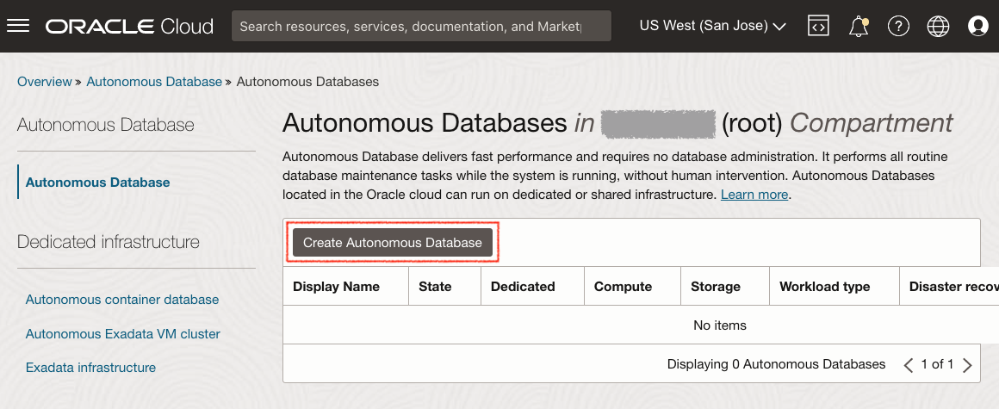

# Provisionner une instance de niveau gratuit partagée Autonomous Database

## Présentation

Cet atelier vous explique les étapes à suivre pour commencer à utiliser Oracle Autonomous Database (Autonomous Data Warehouse \[ADW\] et Autonomous Transaction Processing \[ATP\]) sur Oracle Cloud. Vous provisionnerez une nouvelle instance ATP à l'aide de la console cloud.

_Note1 : bien que cet exercice utilise ATP, les étapes sont identiques pour la création et la connexion à une base de données ADW._

_Note2 : si vous voulez créer une base de données autonome Toujours gratuit, vous devez vous trouver dans une région où les ressources Toujours gratuit sont disponibles. (Toutes les régions ne disposent pas de ressources Toujours gratuit)_

Durée estimée : 5 minutes

Regardez une démonstration vidéo du provisionnement d'une base de données autonome dans Autonomous Transaction Processing (les mêmes étapes s'appliquent au provisionnement d'une base de données autonome dans Autonomous Data Warehouse) :

[YouTube](youtube:Q6hxMaAPghI)

### Objectifs

*   Découvrez comment provisionner une nouvelle instance Autonomous Transaction Processing de niveau gratuit

### Prérequis

*   Un [compte Oracle Cloud](https://www.oracle.com/cloud/free/). Vous pouvez utiliser votre propre compte cloud, un compte cloud que vous avez obtenu via un compte d'essai, un compte Niveau gratuit ou un compte de formation dont les détails vous ont été communiqués par un formateur Oracle.

## Tâche 1 : Choisissez DAV dans le menu Services

1.  Connectez-vous à Oracle Cloud.
    
2.  Une fois connecté, vous accédez au tableau de bord des services cloud où vous pouvez voir tous les services à votre disposition. Cliquez sur le menu de navigation en haut à gauche pour afficher les options de navigation de niveau supérieur.
    
    **Remarque :** vous pouvez également accéder directement à votre service Autonomous Data Warehouse ou Autonomous Transaction Processing dans la section **Actions rapides** du tableau de bord.
    
    
    
3.  Les étapes suivantes s'appliquent de la même manière à Autonomous Data Warehouse ou Autonomous Transaction Processing. Cet atelier présente le provisionnement d'une base de données Autonomous Transaction Processing (ATP). Cliquez sur le **menu de navigation** en haut à gauche, accédez à **Oracle Database** et sélectionnez **Autonomous Transaction Processing**.
    
    
    
4.  Assurez-vous que le type de charge globale est **Transaction Processing** ou **All** pour voir vos instances Autonomous Transaction Processing. Vous pouvez utiliser le menu déroulant **Portée de la liste** pour sélectionner un compartiment. Sélectionnez le **compartiment racine** ou **un autre compartiment de votre choix** dans lequel créer l'instance ATP. Pour créer un compartiment ou en savoir plus, cliquez [ici](https://docs.cloud.oracle.com/iaas/Content/Identity/Tasks/managingcompartments.htm#three).
    
    _**Remarque :** évitez d'utiliser le compartiment ManagedCompartmentforPaaS car il s'agit d'une valeur par défaut Oracle utilisée pour Oracle Platform Services._
    

## Tâche 2 : Créer l'instance ADB

1.  Cliquez sur **Create Autonomous Database** pour démarrer le processus de création d'instance.
    
    
    
2.  L'écran **Create Autonomous Database** apparaît. Vous indiquez ainsi la configuration de l'instance.
    
3.  Fournissez les informations de base pour Autonomous Database :
    
    *   **Choisir un compartiment :** sélectionnez un compartiment pour la base de données dans la liste déroulante.
    *   **Nom d'affichage :** entrez un nom mémorable pour la base de données à des fins d'affichage. Pour cet exercice, utilisez **Graphique ATP**.
    *   **Nom de base de données :** utilisez uniquement des lettres et des chiffres, en commençant par une lettre. La longueur maximale est de 14 caractères (les traits d'annulation ne sont pas initialement pris en charge). Pour cet exercice, utilisez **ATPGRAPH**.
4.  Choisissez un type de charge globale. Sélectionnez le type de charge globale de votre base de données parmi les choix suivants :
    
    *   **Transaction Processing** - Pour cet exercice, choisissez **Transaction Processing** comme type de charge globale.
    *   **Data Warehouse** - Vous pouvez également choisir Data Warehouse comme type de charge globale.
    
    
    
5.  Choisissez un type de déploiement. Sélectionnez le type de déploiement de votre base de données parmi les options suivantes :
    
    *   **Infrastructure partagée :** pour cet exercice, choisissez **Infrastructure partagée** comme type de déploiement.
    *   **Infrastructure dédiée :** vous pouvez également choisir Infrastructure dédiée comme type de charge globale.
    
    
    
6.  Configurez la base de données, sélectionnez l'option **Toujours gratuit** :
    
    *   **Toujours gratuit :** pour cet atelier, vous pouvez sélectionner cette option pour créer une base de données autonome toujours gratuite, ou ne pas sélectionner cette option et créer une base de données à l'aide de votre abonnement payant. Une base de données toujours gratuite est fournie avec 1 CPU et 20 Go de stockage. La sélection de Toujours gratuit suffira pour cet exercice.
    *   **Sélectionner une version de base de données :** sélectionnez une version de base de données parmi celles qui sont disponibles (`19c` ou `21c`).
    *   **Nombre d'OCPU :** nombre d'UC.
    *   **Redimensionnement automatique :** pour cet exercice, continuez à le faire **désactivé**.
    *   **Stockage (To)** - Capacité de stockage en téraoctets.
    *   **Aperçu de la nouvelle base de données** - Si une case à cocher est disponible pour prévisualiser une nouvelle version de base de données, ne la sélectionnez **pas**.
    
    
    
7.  Créez des informations d'identification d'administrateur :
    
    *   **Mot de passe et mot de passe de confirmation :** indiquez le mot de passe de l'utilisateur ADMIN de l'instance de service. Le mot de passe doit répondre aux exigences suivantes :
    *   Le mot de passe doit comporter entre 12 et 30 caractères, et inclure au moins une lettre majuscule, une lettre minuscule et un caractère numérique.
    *   Le mot de passe ne peut pas contenir le nom utilisateur.
    *   Le mot de passe ne peut pas contenir de apostrophes (").
    *   Le mot de passe doit être différent des 4 derniers mots de passe utilisés.
    *   Le mot de passe ne doit pas être le même qu'il y a moins de 24 heures.
    *   Saisissez à nouveau le mot de passe pour le confirmer. Notez ce mot de passe.
    
    
    
8.  Choisissez l'accès réseau :
    
    *   Pour cet exercice, acceptez la valeur par défaut, "Secure access fromwhere".
    *   Si vous voulez une adresse privée, pour autoriser uniquement le trafic à partir du VCN indiqué, où l'accès à la base de données à partir de toutes les adresses IP ou réseaux cloud virtuels publics est bloqué, sélectionnez "Réseau cloud virtuel" dans la zone Choisir l'accès réseau.
    *   Vous pouvez contrôler et restreindre l'accès à votre instance Autonomous Database en définissant des listes de contrôle d'accès réseau. Vous pouvez choisir parmi 4 types de notation d'adresse IP : adresse IP, bloc CIDR, réseau cloud virtuel, OCID de réseau cloud virtuel.
    
    
    
9.  Choisissez un type de licence. Pour cet exercice, choisissez **Licence incluse**. Les deux types de licence sont les suivants :
    
    *   **Bring Your Own License (BYOL)** - Select this type when your organization has existing database licenses.
    *   **Licence incluse :** sélectionnez ce type pour vous abonner à de nouvelles licences du logiciel de base de données et au service cloud de base de données.
10.  Cliquez sur **Create Autonomous Database**.
    
    
    
11.  Votre instance commencera le provisionnement. Dans quelques minutes, l'état passe de Provisionnement à Disponible. A ce stade, votre base de données Autonomous Transaction Processing est prête à être utilisée. Consultez les détails de l'instance ici, notamment son nom, sa version de base de données, son nombre d'OCPU et sa taille de stockage.  
    

Vous pouvez maintenant passer à l'exercice suivant.

## Pour en savoir plus

Cliquez [ici](https://docs.oracle.com/en/cloud/paas/autonomous-data-warehouse-cloud/user/autonomous-workflow.html#GUID-5780368D-6D40-475C-8DEB-DBA14BA675C3) pour obtenir de la documentation sur le workflow standard d'utilisation d'Autonomous Data Warehouse.

## Accusés de réception

*   **Auteur** - Nilay Panchal
*   **Adapté pour le cloud par** - Richard Green
*   **Dernière mise à jour par/date** - Ryota Yamanaka, mars 2023
*   **Auteur** - Nilay Panchal
*   **Adapté pour le cloud par** - Richard Green
*   **Dernière mise à jour par/date** - Ryota Yamanaka, mars 2023