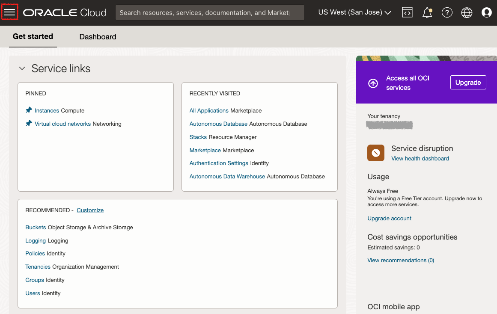
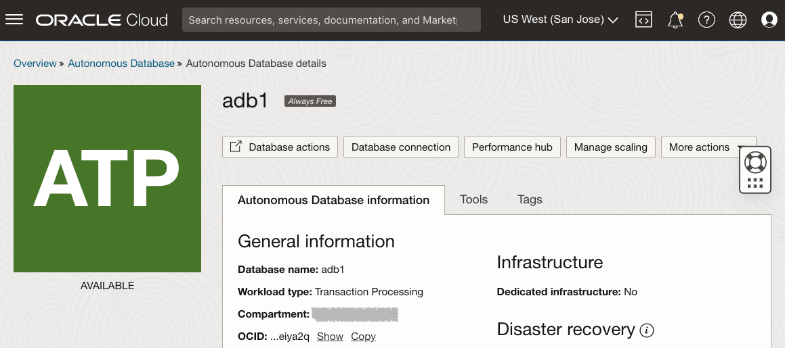

# Autonomous Database 공유 Free Tier 인스턴스 프로비저닝

## 소개

이 실습에서는 Oracle Cloud에서 Oracle Autonomous Database(Autonomous Data Warehouse \[ADW\] 및 Autonomous Transaction Processing \[ATP\]) 사용을 시작하는 단계를 안내합니다. 클라우드 콘솔을 사용하여 새 ATP 인스턴스를 프로비저닝합니다.

_Note1: 이 연습에서는 ATP를 사용하지만 ADW 데이터베이스를 생성하고 연결하는 단계는 동일합니다._

_Note2: 항상 무료 자율운영 데이터베이스를 생성하려면 항상 무료 리소스를 사용할 수 있는 지역에 있어야 합니다. (모든 지역에 항상 무료 리소스가 있는 것은 아님)_

예상 시간: 5분

Autonomous Transaction Processing에서 자율운영 데이터베이스를 프로비저닝하는 비디오 데모를 시청하십시오(Autonomous Data Warehouse에서 자율운영 데이터베이스를 프로비저닝하는 경우에도 동일한 단계가 적용됨).

[유튜브](youtube:Q6hxMaAPghI)

### 목표

*   새로운 무료 계층 Autonomous Transaction Processing 인스턴스를 프로비저닝하는 방법 알아보기

### 필요 조건

*   [Oracle Cloud 계정](https://www.oracle.com/cloud/free/). 자신의 클라우드 계정, 체험판을 통해 얻은 클라우드 계정, Free Tier 계정 또는 Oracle 강사가 세부 정보를 제공한 교육 계정을 사용할 수 있습니다.

## 태스크 1: 서비스 메뉴에서 ATP 선택

1.  Oracle Cloud에 로그인합니다.
    
2.  로그인하면 사용 가능한 모든 서비스를 볼 수 있는 클라우드 서비스 대시보드로 이동합니다. 왼쪽 위에 있는 탐색 메뉴를 눌러 최상위 레벨 탐색 선택을 표시합니다.
    
    **참고:** 대시보드의 **빠른 작업** 섹션에서 Autonomous Data Warehouse 또는 Autonomous Transaction Processing 서비스에 직접 액세스할 수도 있습니다.
    
    
    
3.  다음 단계는 Autonomous Data Warehouse 또는 Autonomous Transaction Processing과 유사하게 적용됩니다. 이 실습에서는 ATP(Autonomous Transaction Processing) 데이터베이스의 프로비저닝을 보여줍니다. 왼쪽 위에 있는 **탐색 메뉴**를 누르고 **Oracle Database**로 이동한 다음 **Autonomous Transaction Processing**을 선택합니다.
    
    
    
4.  Autonomous Transaction Processing 인스턴스를 보려면 작업 로드 유형이 **트랜잭션 처리** 또는 **모두**인지 확인하십시오. **목록 범위** 드롭다운 메뉴를 사용하여 구획을 선택할 수 있습니다. 새 ATP 인스턴스를 생성할 **루트 구획** 또는 **선택한 다른 구획**을 선택합니다. 새 구획을 생성하거나 이에 대해 자세히 알아보려면 [여기](https://docs.cloud.oracle.com/iaas/Content/Identity/Tasks/managingcompartments.htm#three)를 누르십시오.
    
    _**주** - ManagedCompartmentforPaaS 구획은 Oracle Platform Services에 사용되는 Oracle 기본값이므로 사용하지 마십시오._
    

## 작업 2: ADB instance 생성

1.  **Autonomous Database 생성**을 눌러 인스턴스 생성 프로세스를 시작합니다.
    
    
    
2.  그러면 인스턴스 구성을 지정할 수 있는 **Autonomous Database 생성** 화면이 나타납니다.
    
3.  Autonomous Database에 대한 기본 정보 제공:
    
    *   **구획 선택** - 드롭다운 목록에서 데이터베이스의 구획을 선택합니다.
    *   **표시 이름** - 표시할 데이터베이스의 기억에 남는 이름을 입력합니다. 이 실습에서는 **ATP 그래프**를 사용합니다.
    *   **데이터베이스 이름** - 문자와 숫자만 사용하고 문자로 시작합니다. 최대 길이는 14자입니다. 처음에는 밑줄이 지원되지 않습니다. 이 실습의 경우 **ATPGRAPH**를 사용하십시오.
4.  작업 로드 유형을 선택하십시오. 다음 중에서 데이터베이스의 작업 로드 유형을 선택합니다.
    
    *   **트랜잭션 처리** - 이 실습에서는 **트랜잭션 처리**를 작업 로드 유형으로 선택합니다.
    *   **데이터 웨어하우스** - 또는 데이터 웨어하우스를 작업 로드 유형으로 선택할 수 있습니다.
    
    
    
5.  배치 유형을 선택합니다. 다음 중에서 데이터베이스의 배치 유형을 선택합니다.
    
    *   **공유 기반 구조** - 이 실습에서는 **공유 기반 구조**를 배치 유형으로 선택합니다.
    *   **전용 인프라** - 또는 작업 로드 유형으로 전용 인프라를 선택할 수 있습니다.
    
    
    
6.  데이터베이스를 구성하고 **항상 무료** 옵션을 선택합니다.
    
    *   **항상 무료** - 이 실습에서는 이 옵션을 선택하여 항상 무료 자율운영 데이터베이스를 생성하거나 이 옵션을 선택하지 않고 유료 구독을 사용하여 데이터베이스를 생성할 수 있습니다. 항상 무료 데이터베이스는 CPU 1개와 20GB의 스토리지를 제공합니다. Always Free를 선택하면 이 실습에 충분합니다.
    *   **데이터베이스 버전 선택** - 사용 가능한 버전(`19c` 또는 `21c`)에서 데이터베이스 버전을 선택합니다.
    *   **OCPU Count(OCPU 수)** - CPU 수입니다.
    *   **자동 스케일링** - 이 실습에서는 자동 스케일링을 **사용 안함**으로 유지합니다.
    *   **스토리지(TB)** - 스토리지 용량(TB)입니다.
    *   **새 데이터베이스 미리보기** - 새 데이터베이스 버전을 미리 볼 수 있는 확인란이 있는 경우 선택하지 **마십시오**.
    
    
    
7.  관리자 인증서 생성:
    
    *   **비밀번호 및 비밀번호 확인** - 서비스 인스턴스의 ADMIN 사용자에 대한 비밀번호를 지정합니다. 비밀번호가 다음 요구사항을 충족해야 합니다.
    *   비밀번호는 12자에서 30자 사이여야 하며 대문자, 소문자 및 숫자를 하나 이상 포함해야 합니다.
    *   비밀번호에 사용자 이름을 포함할 수 없습니다.
    *   비밀번호에 대문자를 포함할 수 없습니다.
    *   비밀번호는 마지막으로 사용된 4개의 비밀번호와 달라야 합니다.
    *   비밀번호는 24시간 전에 설정된 것과 동일한 비밀번호가 아니어야 합니다.
    *   확인을 위해 비밀번호를 다시 입력합니다. 이 비밀번호를 기록해 둡니다.
    
    
    
8.  네트워크 액세스 선택:
    
    *   이 연습에서는 기본값인 "Secure access from everywhere"를 적용합니다.
    *   전용 끝점이 지정된 VCN의 트래픽만 허용하도록 하려면 모든 공용 IP 또는 VCN의 데이터베이스에 대한 액세스가 차단되는 경우 네트워크 선택 액세스 영역에서 "가상 클라우드 네트워크"를 선택합니다.
    *   네트워크 액세스 제어 목록(ACL)을 설정하여 Autonomous Database에 대한 액세스를 제어하고 제한할 수 있습니다. IP 주소, CIDR 블록, 가상 클라우드 네트워크, 가상 클라우드 네트워크 OCID의 네 가지 IP 표기법 유형 중에서 선택할 수 있습니다.
    
    
    
9.  라이센스 유형을 선택하십시오. 이 실습에서는 **라이센스 포함**을 선택합니다. 두 가지 라이센스 유형은 다음과 같습니다.
    
    *   **BYOL(Bring Your Own License)** - 조직에 기존 데이터베이스 라이센스가 있는 경우 이 유형을 선택합니다.
    *   **라이센스 포함됨** - 새 데이터베이스 소프트웨어 라이센스 및 데이터베이스 클라우드 서비스를 구독하려는 경우 이 유형을 선택합니다.
10.  **Create Autonomous Database**를 누릅니다.
    
    
    
11.  인스턴스 프로비전이 시작됩니다. 몇 분 안에 상태가 프로비저닝에서 사용 가능으로 바뀝니다. 이제 Autonomous Transaction Processing 데이터베이스를 사용할 준비가 되었습니다! 여기서 이름, 데이터베이스 버전, OCPU 수 및 스토리지 크기를 포함한 인스턴스의 세부정보를 확인하십시오.  
    

이제 다음 실습을 진행할 수 있습니다.

## 자세히 알아보겠습니까?

Autonomous Data Warehouse를 사용하는 일반적인 워크플로우에 대한 설명서를 보려면 [여기](https://docs.oracle.com/en/cloud/paas/autonomous-data-warehouse-cloud/user/autonomous-workflow.html#GUID-5780368D-6D40-475C-8DEB-DBA14BA675C3)를 클릭하십시오.

## 확인

*   **작성자** - Nilay Panchal
*   **클라우드 도입** - Richard Green
*   **최종 업데이트 수행자/날짜** - Ryota Yamanaka, 2023년 3월
*   **작성자** - Nilay Panchal
*   **클라우드 도입** - Richard Green
*   **최종 업데이트 수행자/날짜** - Ryota Yamanaka, 2023년 3월