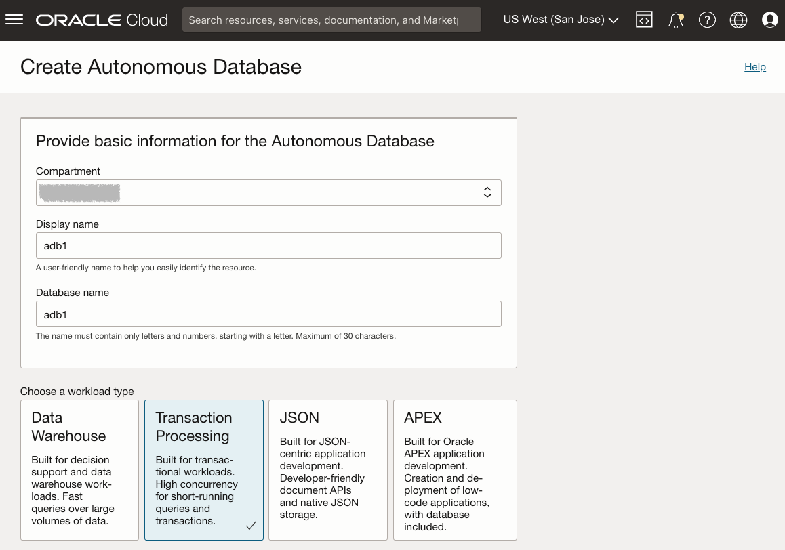

# Provisionar Instância Free Tier Compartilhada do Autonomous Database

## Introdução

Este laboratório apresenta as etapas para começar a usar o Oracle Autonomous Database (Autonomous Data Warehouse \[ADW\] e o Autonomous Transaction Processing \[ATP\]) no Oracle Cloud. Você provisionará uma nova instância ATP usando a console na nuvem.

_Note1: Enquanto este laboratório usa ATP, as etapas são idênticas para criar e estabelecer conexão com um banco de dados ADW._

_Note2: Se quiser criar um banco de dados autônomo Always Free, você precisará estar em uma região em que Recursos Always Free estejam disponíveis. (Nem todas as regiões têm Recursos Always Free)_

Tempo estimado: 5 minutos

Assista a uma demonstração em vídeo do provisionamento de um banco de dados autônomo no Autonomous Transaction Processing (as mesmas etapas se aplicam ao provisionamento de um banco de dados autônomo no Autonomous Data Warehouse):

[youtube](youtube:Q6hxMaAPghI)

### Objetivos

*   Saiba como provisionar uma nova instância do Autonomous Transaction Processing de camada gratuita

### Pré-requisitos

*   Uma [Conta do Oracle Cloud](https://www.oracle.com/cloud/free/). Você pode usar sua própria conta na nuvem, uma conta na nuvem que obteve por meio de uma avaliação, uma conta Free Tier ou uma conta de treinamento cujos detalhes foram fornecidos a você por um instrutor da Oracle.

## Tarefa 1: Escolher ATP no Menu Serviços

1.  Faça login no Oracle Cloud.
    
2.  Depois de fazer log-in, você será levado ao painel de serviços de nuvem, onde poderá ver todos os serviços disponíveis para você. Clique no menu de navegação no canto superior esquerdo para mostrar as opções de navegação de nível superior.
    
    **Observação:** você também pode acessar diretamente seu serviço Autonomous Data Warehouse ou Autonomous Transaction Processing na seção **Ações Rápidas** do painel de controle.
    
    
    
3.  As etapas a seguir se aplicam de forma semelhante ao Autonomous Data Warehouse ou ao Autonomous Transaction Processing. Este laboratório mostra o provisionamento de um banco de dados Autonomous Transaction Processing (ATP). Clique no **Menu de Navegação** na parte superior esquerda, navegue até o **Oracle Database** e selecione **Autonomous Transaction Processing**.
    
    
    
4.  Certifique-se de que seu Tipo de Carga de Trabalho seja **Processamento de Transações** ou **Tudo** para ver suas instâncias do Autonomous Transaction Processing. Você pode usar o menu drop-down **Escopo da Lista** para selecionar um Compartimento. Selecione seu **compartimento raiz** ou **outro compartimento de sua escolha** no qual você criará sua nova instância ATP. Se quiser criar um novo compartimento ou saber mais sobre ele, clique [aqui](https://docs.cloud.oracle.com/iaas/Content/Identity/Tasks/managingcompartments.htm#three).
    
    _**Observação** - Evite o uso do compartimento ManagedCompartmentforPaaS, pois esse é um padrão Oracle usado para o Oracle Platform Services._
    

## Tarefa 2: Criando a instância do ADB

1.  Clique em **Create Autonomous Database** para iniciar o processo de criação de instâncias.
    
    
    
2.  Isso ativa a tela **Create Autonomous Database**, na qual você especificará a configuração da instância.
    
3.  Forneça informações básicas para o Autonomous Database:
    
    *   **Escolher um compartimento** - Selecione um compartimento para o banco de dados na lista drop-down.
    *   **Display Name** - Digite um nome memorável para o banco de dados para fins de exibição. Para este laboratório, use **Gráfico ATP**.
    *   **Nome do Banco de Dados** - Use apenas letras e números, começando com uma letra. O tamanho máximo é de 14 caracteres. (Subnúcleos não suportados inicialmente.) Para este laboratório, use **ATPGRAPH**.
4.  Escolha um tipo de carga de trabalho. Selecione o tipo de carga de trabalho para seu banco de dados entre as opções:
    
    *   **Processamento de Transação** - Para este laboratório, escolha **Processamento de Transação** como o tipo de carga de trabalho.
    *   **Data Warehouse** - Como alternativa, você poderia ter escolhido o Data Warehouse como o tipo de carga de trabalho.
    
    
    
5.  Escolha um tipo de implantação. Selecione o tipo de implantação para seu banco de dados entre as opções:
    
    *   **Shared Infrastructure** - Para este laboratório, escolha **Shared Infrastructure** como o tipo de implantação.
    *   **Infraestrutura Dedicada** - Como alternativa, você poderia ter escolhido Infraestrutura Dedicada como o tipo de carga de trabalho.
    
    
    
6.  Configure o banco de dados, selecione a opção **Always Free**:
    
    *   **Always Free** - Para este laboratório, você pode selecionar esta opção para criar um banco de dados autônomo sempre gratuito ou não selecionar esta opção e criar um banco de dados usando sua assinatura paga. Um banco de dados sempre gratuito vem com 1 CPU e 20 GB de armazenamento. A seleção de Always Free será suficiente para este laboratório.
    *   **Selecionar versão do banco de dados** - Selecione uma versão do banco de dados entre as versões disponíveis (`19c` ou `21c`).
    *   **OCPU Count** - Número de CPUs.
    *   **Escalonamento automático** - Para este laboratório, mantenha o dimensionamento automático **desativado**.
    *   **Storage (TB)** - Capacidade de armazenamento em terabytes.
    *   **Nova Visualização do Banco de Dados** - Se uma caixa de seleção estiver disponível para visualizar uma nova versão do banco de dados, **não** selecione-a.
    
    
    
7.  Crie credenciais de administrador:
    
    *   **Password and Confirm Password** - Especifique a senha para o usuário ADMIN da instância de serviço. A senha deve atender aos seguintes requisitos:
    *   A senha deve ter de 12 a 30 caracteres e deve incluir pelo menos uma letra alta, uma letra baixa e um caractere numérico.
    *   A senha não pode conter o nome de usuário.
    *   A senha não pode conter o caractere de aspas duplas (").
    *   A senha deve ser diferente das 4 últimas senhas usadas.
    *   A senha não deve ser a mesma que foi definida há menos de 24 horas.
    *   Digite novamente a senha para confirmá-la. Anote essa senha.
    
    
    
8.  Escolha o acesso à rede:
    
    *   Para este laboratório, aceite o padrão, "Acesso seguro de todos os lugares".
    *   Se você quiser um ponto final privado, para permitir o tráfego apenas da VCN especificada - em que o acesso ao banco de dados de todos os IPs ou VCNs públicos seja bloqueado, selecione "Rede virtual na nuvem" na área Escolher acesso à rede.
    *   Você pode controlar e restringir o acesso ao seu Autonomous Database definindo listas de controle de acesso à rede (ACLs). Você pode selecionar entre 4 tipos de notação IP: Endereço IP, Bloco CIDR, Rede Virtual na Nuvem, OCID da Rede Virtual na Nuvem.
    
    
    
9.  Escolha um tipo de licença. Para este laboratório, escolha **Licença Incluída**. Os dois tipos de licença são:
    
    *   **BYOL (Bring Your Own License)** - Selecione este tipo quando a sua organização tiver licenças de banco de dados existentes.
    *   **License Included** - Selecione este tipo quando quiser assinar novas licenças de software de banco de dados e o serviço de nuvem de banco de dados.
10.  Clique em **Criar Autonomous Database**.
    
    
    
11.  Sua instância começará a provisionar. Em alguns minutos, o estado passará de Provisionamento para Disponível. Nesse momento, seu banco de dados Autonomous Transaction Processing está pronto para uso! Veja os detalhes da sua instância aqui, incluindo Nome, Versão do Banco de Dados, Contagem de OCPUs e tamanho do Armazenamento.  
    

Agora você pode ir para o próximo laboratório.

## Quer saber mais?

Clique [aqui](https://docs.oracle.com/en/cloud/paas/autonomous-data-warehouse-cloud/user/autonomous-workflow.html#GUID-5780368D-6D40-475C-8DEB-DBA14BA675C3) para obter documentação sobre o workflow típico para usar o Autonomous Data Warehouse.

## Agradecimentos

*   **Autor** - Nilay Panchal
*   **Adaptado à Nuvem por** - Richard Green
*   **Última Atualização em/Data** - Ryota Yamanaka, março de 2023
*   **Autor** - Nilay Panchal
*   **Adaptado à Nuvem por** - Richard Green
*   **Última Atualização em/Data** - Ryota Yamanaka, março de 2023