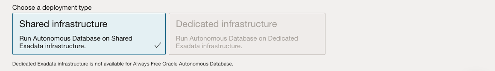
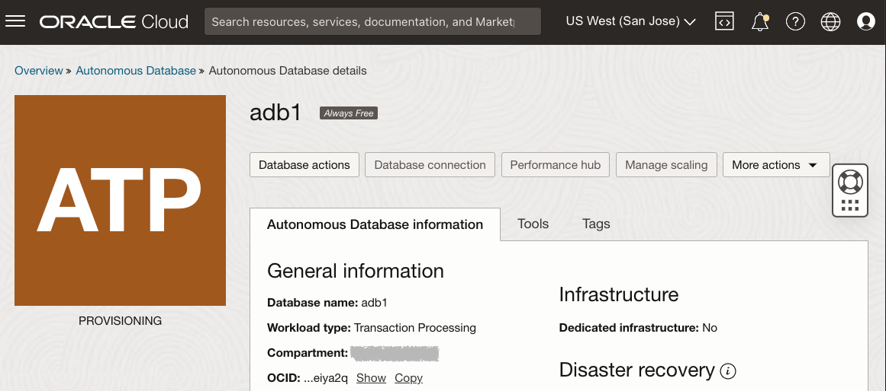

# 预配 Autonomous Database 共享免费套餐实例

## 简介

此实验室将指导您逐步开始在 Oracle Cloud 上使用 Oracle Autonomous Database（Autonomous Data Warehouse \[ADW\] 和 Autonomous Transaction Processing \[ATP\]）。您将使用云控制台预配新的 ATP 实例。

_Note1：本练习使用 ATP 时，创建和连接到 ADW 数据库的步骤相同。_

_Note2：如果要创建“始终免费”自治数据库，则需要位于“始终免费资源”可用的区域中。（并非所有区域都具有“始终免费资源”）_

估计时间：5 分钟

观看视频演示，了解如何在自治事务处理中预配自治数据库（在 Autonomous Data Warehouse 中预配自治数据库采用相同的步骤）：

[YouTube](youtube:Q6hxMaAPghI)

### 目标

*   了解如何预配新的免费套餐自治事务处理实例

### 先备条件

*   [Oracle Cloud 账户](https://www.oracle.com/cloud/free/)。您可以使用自己的云账户、通过试用获得的云账户、免费套餐账户或 Oracle 教师向您提供其详细信息的培训账户。

## 任务 1：从“服务”菜单中选择 ATP

1.  登录到 Oracle Cloud。
    
2.  登录后，您将转到云服务仪表盘，您可以在其中查看可用的所有服务。单击左上角的导航菜单以显示顶层导航选项。
    
    **注：**您还可以在仪表盘的**快速操作**部分中直接访问 Autonomous Data Warehouse 或 Autonomous Transaction Processing 服务。
    
    
    
3.  以下步骤与 Autonomous Data Warehouse 或 Autonomous Transaction Processing 类似。此实验室显示自治事务处理 (ATP) 数据库的预配。单击左上角的**导航菜单**，导航到 **Oracle Database** ，然后选择**自治事务处理**。
    
    
    
4.  确保您的工作量类型为**事务处理**或**全部**，以查看自治事务处理实例。可以使用**列表范围**下拉菜单选择区间。选择**根区间**或**您选择的另一个区间**，在其中创建新的 ATP 实例。如果要创建新区间或了解有关它们的更多信息，请单击[此处](https://docs.cloud.oracle.com/iaas/Content/Identity/Tasks/managingcompartments.htm#three)。
    
    _**注** - 避免使用 ManagedCompartmentforPaaS 区间，因为这是用于 Oracle Platform Services 的 Oracle 默认值。_
    

## 任务 2：创建 ADB 实例

1.  单击**创建 Autonomous Database** 以启动实例创建过程。
    
    
    
2.  此时将显示**创建 Autonomous Database** 屏幕，您可以在其中指定实例的配置。
    
3.  提供 Autonomous Database 的基本信息：
    
    *   **选择区间** - 从下拉列表中选择数据库的区间。
    *   **Display Name（显示名称）** \- 为数据库输入可记忆的名称以供显示。对于此练习，请使用 **ATP Graph** 。
    *   **Database Name（数据库名称）** \- 仅使用字母和数字，以字母开头。最大长度为 14 个字符。（最初不支持下划线。）对于此实验室，请使用 **ATPGRAPH** 。
4.  选择工作负载类型。从以下选项中选择数据库的工作量类型：
    
    *   **事务处理** - 对于此实验室，选择**事务处理**作为工作量类型。
    *   **数据仓库** - 您也可以选择“数据仓库”作为工作量类型。
    
    
    
5.  选择部署类型。从以下选项中选择数据库的部署类型：
    
    *   **共享基础结构** - 在此实验室中，选择**共享基础结构**作为部署类型。
    *   **专用基础设施** - 您也可以选择专用基础设施作为工作负载类型。
    
    
    
6.  配置数据库，选择**始终免费**选项：
    
    *   **始终免费** - 在此实验室中，您可以选择此选项来创建始终免费的自治数据库，也可以不选择此选项并使用付费订阅创建数据库。始终免费的数据库提供 1 个 CPU 和 20 GB 存储。选择“始终免费”就足以支持此实验室。
    *   **选择数据库版本** - 从可用版本（`19c` 或 `21c`）中选择数据库版本。
    *   **OCPU 计数** \-CPU 数。
    *   **自动缩放** - 对于此实验室，保持**禁用**自动缩放。
    *   **存储 (TB)** - 存储容量 (TB)。
    *   **新建数据库预览** - 如果有一个复选框可用于预览新数据库版本，请**不要**选择它。
    
    
    
7.  创建管理员身份证明：
    
    *   **密码和确认密码** - 指定服务实例的 ADMIN 用户的密码。密码必须符合以下要求：
    *   密码的长度必须介于 12 到 30 个字符之间，并且必须至少包含一个大写字母，一个小写字母和一个数字字符。
    *   密码不能包含用户名。
    *   密码不能包含双引号 (") 字符。
    *   密码必须不同于使用的最后 4 个密码。
    *   密码不得为 24 小时内设置的同一密码。
    *   重新输入口令进行确认。记下此密码。
    
    
    
8.  选择网络访问：
    
    *   对于此练习，接受默认值“Secure access from everywhere（从任何位置安全访问）”。
    *   如果要使用专用端点，则仅允许您指定的 VCN（阻止从所有公共 IP 或 VCN 访问数据库的位置）的流量，请在“Choose network access（选择网络访问）”区域中选择“Virtual cloud network（虚拟云网络）”。
    *   您可以通过设置网络访问控制列表 (ACL) 来控制和限制对 Autonomous Database 的访问。您可以选择 4 种 IP 表示法类型：IP 地址、CIDR 块、虚拟云网络、虚拟云网络 OCID。
    
    
    
9.  选择许可证类型。对于此实验室，选择**包括许可证**。两种许可证类型是：
    
    *   **自带许可证 (Bring Your Own License，BYOL)** - 当您的组织具有现有数据库许可证时，选择此类型。
    *   **包括的许可证** - 如果要订阅新的数据库软件许可证和数据库云服务，请选择此类型。
10.  Click **Create Autonomous Database**.
    
    
    
11.  您的实例将开始预配。几分钟后，该状态将从“预配”变为“可用”。此时，自治事务处理数据库已做好使用准备！请在此处查看实例的详细信息，包括名称、数据库版本、OCPU 计数和存储大小。 
    

现在，您可以进入下一个实验室。

## 是否想要了解更多信息？

单击[此处](https://docs.oracle.com/en/cloud/paas/autonomous-data-warehouse-cloud/user/autonomous-workflow.html#GUID-5780368D-6D40-475C-8DEB-DBA14BA675C3)获取有关使用 Autonomous Data Warehouse 的典型工作流的文档。

## 确认

*   **作者** - Nilay Panchal
*   **针对云进行了调整** - Richard Green
*   **上次更新者/日期** - Ryota Yamanaka，2023 年 3 月
*   **作者** - Nilay Panchal
*   **针对云进行了调整** - Richard Green
*   **上次更新者/日期** - Ryota Yamanaka，2023 年 3 月