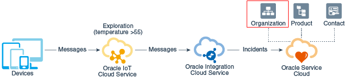

# 실험실의 제목

## 소개

_실습을 한두 문장으로 설명:_ 이 실습에서는 다음과 같은 단계를 안내합니다.

예상 작업 시간: -- 분

### <Product/Technology> 정보(선택 사항)

이 실습에 사용된 기술/기능 또는 제품에 대한 배경 정보를 입력하십시오. 이 소개에서 다룬 내용을 반복할 필요가 없습니다. 이 부분을 상당히 간결하게 유지하십시오. 두 개 이상의 섹션/단락이 필요한 경우 "자세히 알아보기" 섹션을 사용하십시오.

### 목표

_아래 형식을 사용하여 이 실습의 목표 나열_

이 실습에서는 다음을 수행합니다.

*   목표 1
*   목표 2
*   목표 3

### 필요 조건(선택사항)

_아래 형식을 사용하여 이 실습의 필요 조건을 나열합니다. 실습을 완료하는 데 필요한 지식, 계정 등을 모두 기입하십시오. 이전의 각 실습을 선수 과정으로 나열하지 마십시오._

이 실습에서는 다음을 가정합니다.

*   Oracle Cloud 계정
*   모든 이전 실습이 성공적으로 완료되었습니다.

_"폴드"입니다. 아래 항목은 기본적으로 축소됩니다._

## 태스크 1: 간략한 태스크 설명

(선택 사항) 작업 1 여는 단락.

1.  단계 1
    
    
    
2.  단계 2
    

4.  인라인 탐색 아이콘 이 있는 예에서는 **탐색**을 누릅니다.
    
5.  굵게 표시된 **text**의 예
    
    다른 단락을 추가하는 경우 선 앞에 3개의 공백을 추가합니다.
    

## 태스크 2: 간략한 태스크 설명

1.  1단계 - 테이블 샘플

테이블을 거의 사용하지 않음

| 열 1 | 열 2 | 열 3 |
| --- | --- | --- |
| 1개 | 일부 텍스트 또는 링크 | 추가 텍스트 |
| 2개 | 일부 텍스트 또는 링크 | 추가 텍스트 |
| 3개 | 일부 텍스트 또는 링크 | 추가 텍스트 |

2.  글머리 기호 목록을 포함할 수도 있습니다. 4개의 공백을 들여쓰십시오.
    
    *   목록 항목 1
    *   목록 항목 2
3.  코드 예제
    
        Adding code examples
        	Indentation is important for the code example to appear inside the step
        Multiple lines of code
        	<copy>Enclose the text you want to copy in <copy></copy>.</copy>
        
4.  변수를 포함하는 코드 예제
    

ssh -i

    
    ## Learn More
    
    *(optional - include links to docs, white papers, blogs, etc)*
    
    * [URL text 1](http://docs.oracle.com)
    * [URL text 2](http://docs.oracle.com)
    
    ## Acknowledgements
    * **Author** - <Name, Title, Group>
    * **Contributors** -  <Name, Group> -- optional
    * **Last Updated By/Date** - <Name, Month Year>