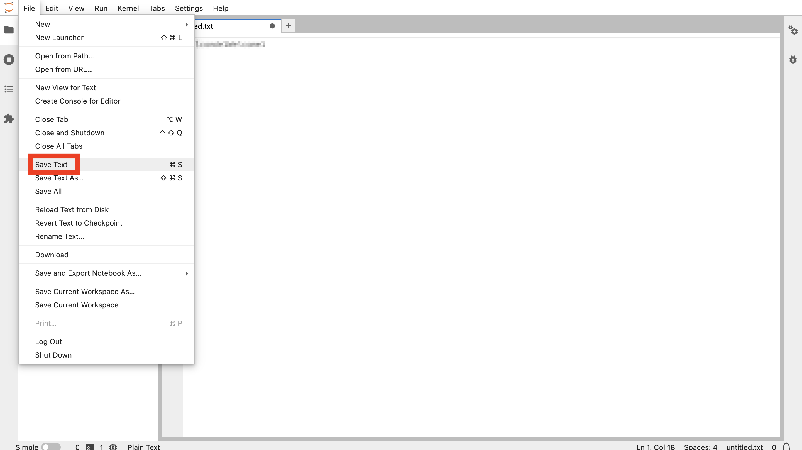
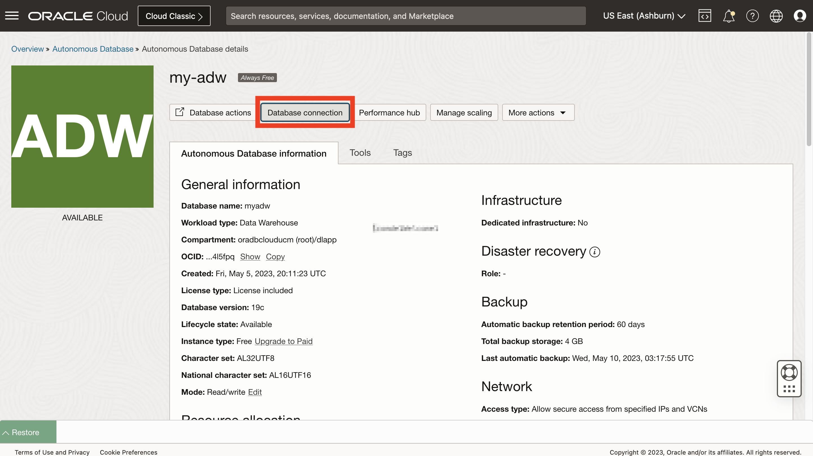
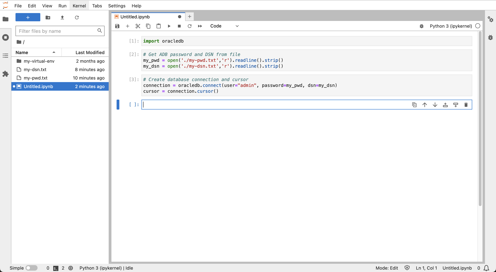

# Verbindung zu Autonomous Database über Python herstellen

## Einführung

Um sich auf das Laden und Analysieren von Daten vorzubereiten, stellen Sie zunächst eine Verbindung von Python zu Autonomous Database her. Der python-oracledb-Treiber unterstützt diese Verbindung und alle nachfolgenden Datenbankinteraktionen. Sie verwenden den "Thin"-Modus des python-oracledb-Treibers, der direkt mit Oracle Database verbunden wird und keine Oracle-Client-Librarys benötigt.

Geschätzte Laborzeit: 5 Minuten

### Ziele

*   Verbindung zu Autonomous Database über Python herstellen

### Voraussetzungen

*   Abschluss von Übung 3: Starten Sie JupyterLab

## Aufgabe 1: Verbindungsparameterdateien erstellen

1.  Um zu vermeiden, dass Datenbankverbindungsinformationen direkt in Ihr Notizbuch aufgenommen werden, erstellen Sie Dateien mit diesen Informationen, auf die Ihr Notizbuch verweisen kann. Klicken Sie in JupyterLab auf die Kachel "Textdatei", um eine neue Textdatei zu erstellen. 
    
2.  Geben Sie Ihr ADB-ADMIN-Benutzerkennwort ein. Wählen Sie dann im Menü "Datei" die Option **Text speichern**. 
    
3.  Wenn Sie dazu aufgefordert werden, geben Sie **my-pwd.txt** als Dateinamen ein, und klicken Sie auf **Umbenennen**. 
    
4.  Schließen Sie die Registerkarte "Textdatei", um zur Seite "Launcher" zurückzukehren. 
    
5.  Kehren Sie zur Oracle Cloud-Browserregisterkarte zurück, und minimieren Sie Cloud Shell. 
    
6.  Klicken Sie auf **Datenbankverbindung**. 
    
7.  Blättern Sie nach unten zum Abschnitt Verbindungszeichenfolgen. Wählen Sie für die TLS-Authentifizierung die Option **TLS** aus. Dies ist erforderlich, um Verbindungen im Thin-Modus zuzulassen. Klicken Sie dann unter Verbindungszeichenfolge auf **Kopieren**, um den TNS-Namen mit der Endung \_low anzuzeigen. 
    
8.  Kehren Sie zur Browserregisterkarte JupyterLab zurück. Klicken Sie wie zuvor auf die Kachel "Textdatei", um eine neue Textdatei zu erstellen. Fügen Sie die soeben aus Autonomous Database kopierte Verbindungszeichenfolge ein. Speichern Sie die Datei, und benennen Sie sie in **my-dsn.txt** um. 
    

Schließen Sie wie zuvor die Registerkarte "Textdatei", um zur Seite "Launcher" zurückzukehren.

## Aufgabe 2: Notizbuch erstellen und Verbindung zu Autonomous Database herstellen

1.  Klicken Sie im Launcher auf die Kachel **Python 3**, um ein neues Notizbuch zu erstellen. 
    
2.  Fügen Sie in der ersten Zelle die folgende Anweisung ein, und klicken Sie auf die Schaltfläche **Ausführen**. Dadurch wird das python-oracedb-Modul geladen, das die Interaktion mit Oracle Database verarbeitet.
    
        <copy>
        import oracledb
        </copy>
        
    
    
    
3.  Fügen Sie in der nächsten Zelle die folgenden Anweisungen ein, und klicken Sie auf die Schaltfläche **Ausführen**. Dadurch wird das ADB-Kennwort und der DSN in Variablen geladen
    
        <copy>
        # Get ADB password and DSN from file
        my_pwd = open('./my-pwd.txt','r').readline().strip()
        my_dsn = open('./my-dsn.txt','r').readline().strip()
        </copy>
        
    
    
    
4.  Fügen Sie in der nächsten Zelle die folgenden Anweisungen ein, und klicken Sie auf die Schaltfläche **Ausführen**. Dadurch wird eine Verbindung zu Ihrer ADB hergestellt.
    
        <copy>
        # Create database connection and cursor
        connection = oracledb.connect(user="admin", password=my_pwd, dsn=my_dsn)
        cursor = connection.cursor()
        </copy>
        
    
    
    
5.  Fügen Sie in der nächsten Zelle die folgenden Anweisungen ein, und klicken Sie auf die Schaltfläche **Ausführen**. Dadurch wird eine Testabfrage ausgeführt, um eine erfolgreiche Verbindung zu ADB zu prüfen.
    
        <copy>
        # Run a test query
        cursor.execute("select object_type, count(*) from all_objects group by object_type")
        for row in cursor.fetchmany(size=10):
          print(row)
        </copy>
        
    
    
    
6.  Klicken Sie im linken Bereich mit der rechten Maustaste auf die Notizbuchdatei Untitled.ipynb, und wählen Sie **Umbenennen** aus.
    
    
    
7.  Geben Sie **my-notebook** (oder einen Namen Ihrer Wahl) ein. Beachten Sie, dass der Notizbuchname geändert wurde.
    
    
    

Sie können jetzt **mit der nächsten Übung fortfahren**.

## Weitere Informationen

*   Weitere Informationen zu python-oracledb-Verbindungen zu Autonomous Database finden Sie in der [Dokumentation](https://python-oracledb.readthedocs.io/en/latest/user_guide/connection_handling.html#connecting-to-oracle-cloud-autonomous-databases).

## Danksagungen

*   **Autor** - David Lapp, Database Product Management, Oracle
*   **Mitwirkende** - Rahul Tasker, Denise Myrick, Ramu Gutierrez
*   **Zuletzt aktualisiert am/um** - David Lapp, August 2023