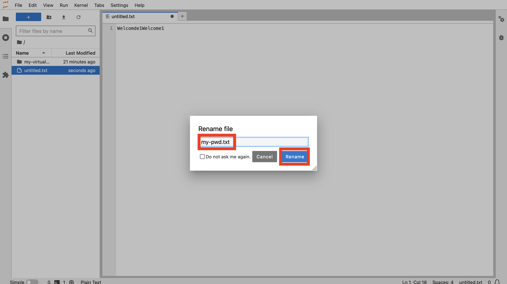
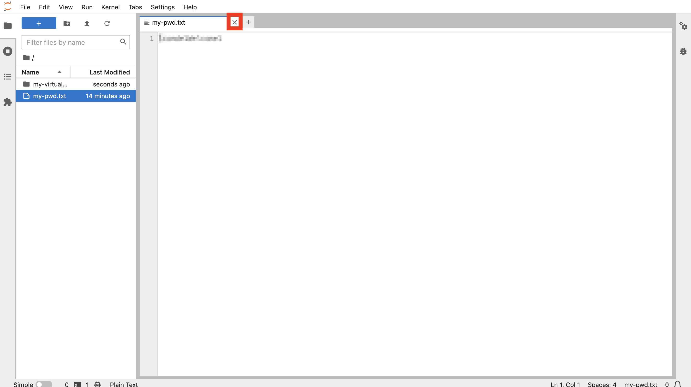
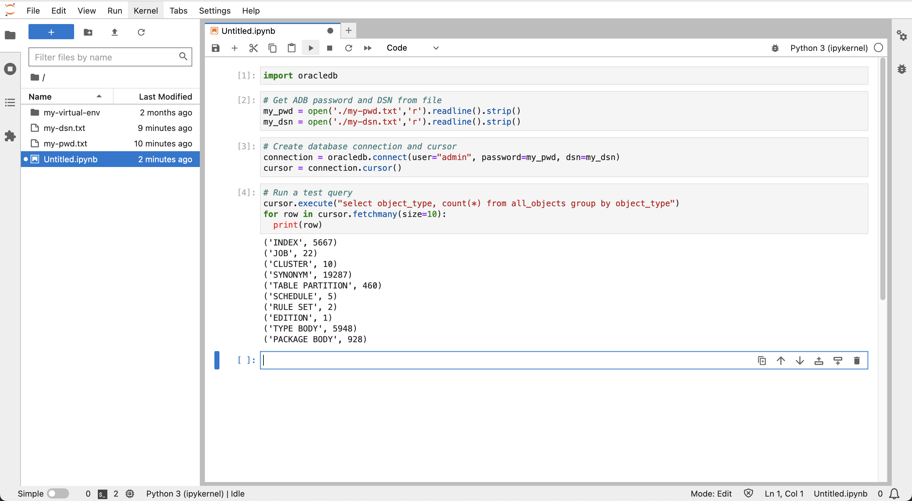

# Conexión a Autonomous Database desde Python

## Introducción

Para prepararse para la carga y el análisis de datos, primero debe establecer una conexión de Python a Autonomous Database. El controlador python-oracledb soporta esta conexión y todas las interacciones de base de datos posteriores. Utilizará el modo 'Thin' del controlador python-oracledb, que se conecta directamente a Oracle Database y no necesita bibliotecas de cliente de Oracle.

Tiempo de laboratorio estimado: 5 minutos

### Objetivos

*   Conexión a Autonomous Database desde Python

### Requisitos

*   Finalización del laboratorio 3: inicie JupyterLab

## Tarea 1: Crear archivos de parámetros de conexión

1.  Para evitar incluir información de conexión a la base de datos directamente en el bloc de notas, cree archivos con esta información a la que el bloc de notas pueda hacer referencia. En JupyterLab, haga clic en el mosaico Archivo de texto para crear un nuevo archivo de texto. 
    
2.  Introduzca la contraseña de usuario ADB ADMIN. A continuación, en el menú Archivo, seleccione **Guardar texto**. 
    
3.  Cuando se le solicite, introduzca **my-pwd.txt** como nombre de archivo y haga clic en **Cambiar nombre**. 
    
4.  Cierre el separador del archivo de texto para volver a la página Launcher. 
    
5.  Vuelva al separador del explorador de Oracle Cloud y minimice Cloud Shell. 
    
6.  Haga clic en **Conexión a base de datos**. 
    
7.  Desplácese hacia abajo hasta la sección Connection Strings. Para la autenticación TLS, seleccione **TLS**. Esto es necesario para permitir conexiones en modo fino. A continuación, en Cadena de conexión, haga clic en **Copiar** para que el nombre de TNS termine en \_low. 
    
8.  Vuelva al separador del explorador JupyterLab. Como se ha hecho anteriormente, haga clic en el mosaico Archivo de texto para crear otro archivo de texto nuevo. Pegue la cadena de conexión que acaba de copiar de su instancia de Autonomous Database. A continuación, guarde el archivo y cambie el nombre a **my-dsn.txt**. 
    

Como se ha hecho anteriormente, cierre el separador de archivo de texto para volver a la página Launcher.

## Tarea 2: Creación de bloc de notas y conexión a Autonomous Database

1.  En Launcher, haga clic en el mosaico **Python 3** para crear un nuevo bloc de notas. 
    
2.  En la primera celda, pegue la siguiente sentencia y, a continuación, haga clic en el botón **ejecutar**. De esta forma, se carga el módulo python-oracedb que gestiona la interacción con Oracle Database.
    
        <copy>
        import oracledb
        </copy>
        
    
    
    
3.  En la siguiente celda, pegue las siguientes sentencias y, a continuación, haga clic en el botón **ejecutar**. De esta forma, se carga la contraseña de ADB y el DSN en variables
    
        <copy>
        # Get ADB password and DSN from file
        my_pwd = open('./my-pwd.txt','r').readline().strip()
        my_dsn = open('./my-dsn.txt','r').readline().strip()
        </copy>
        
    
    
    
4.  En la siguiente celda, pegue las siguientes sentencias y, a continuación, haga clic en el botón **ejecutar**. Esto crea una conexión a la ADB.
    
        <copy>
        # Create database connection and cursor
        connection = oracledb.connect(user="admin", password=my_pwd, dsn=my_dsn)
        cursor = connection.cursor()
        </copy>
        
    
    
    
5.  En la siguiente celda, pegue las siguientes sentencias y, a continuación, haga clic en el botón **ejecutar**. Esto ejecuta una consulta de prueba para verificar la conexión correcta a ADB.
    
        <copy>
        # Run a test query
        cursor.execute("select object_type, count(*) from all_objects group by object_type")
        for row in cursor.fetchmany(size=10):
          print(row)
        </copy>
        
    
    
    
6.  Haga clic con el botón derecho en el archivo de bloc de notas Untitled.ipynb en el panel izquierdo y seleccione **Cambiar nombre**.
    
    
    
7.  Introduzca **my-notebook** (o un nombre de su elección). Observe que se cambia el nombre del bloc de notas.
    
    
    

Ahora puede **proceder al siguiente laboratorio**.

## Más información

*   Para obtener más información sobre las conexiones de python-oracledb a Autonomous Database, consulte la [documentación](https://python-oracledb.readthedocs.io/en/latest/user_guide/connection_handling.html#connecting-to-oracle-cloud-autonomous-databases).

## Reconocimientos

*   **Autor**: David Lapp, Database Product Management, Oracle
*   **Contribuyentes**: Rahul Tasker, Denise Myrick, Ramu Gutiérrez
*   **Última actualización por/fecha**: David Lapp, agosto de 2023