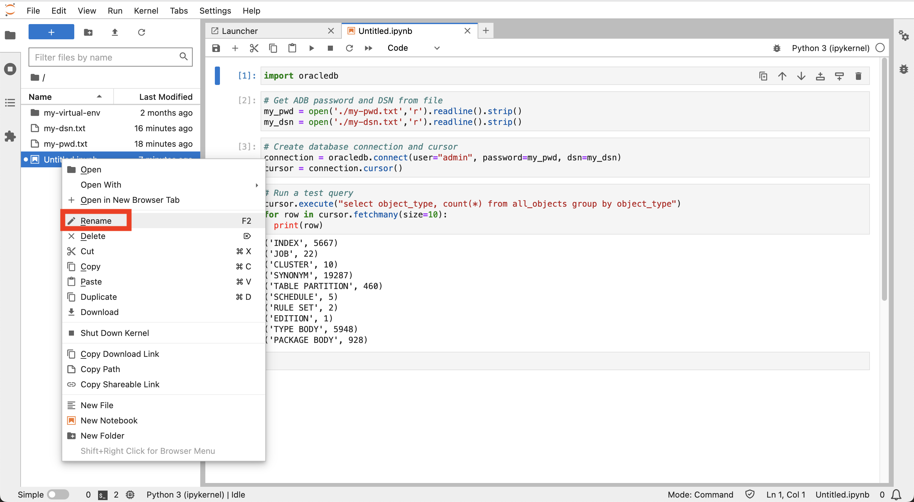

# Connexion à Autonomous Database à partir de Python

## Présentation

Pour préparer le chargement et l'analyse des données, vous devez d'abord établir une connexion entre Python et votre instance Autonomous Database. Le pilote python-oracledb prend en charge cette connexion et toutes les interactions de base de données ultérieures. Vous utiliserez le mode "Thin" du pilote python-oracledb qui se connecte directement à Oracle Database et n'a pas besoin des bibliothèques client Oracle.

Temps de laboratoire estimé : 5 minutes

### Objectifs

*   Connexion à Autonomous Database à partir de Python

### Prérequis

*   Achèvement de l'atelier 3 : Démarrer JupyterLab

## Tâche 1 : créer des fichiers de paramètres de connexion

1.  Pour éviter d'inclure les informations de connexion à la base de données directement dans votre bloc-notes, vous créez des fichiers avec ces informations que votre bloc-notes peut référencer. Dans JupyterLab, cliquez sur la mosaïque Fichier texte pour créer un fichier texte. 
    
2.  Entrez votre mot de passe utilisateur ADB ADMIN. Puis, dans le menu Fichier, sélectionnez **Enregistrer le texte**. 
    
3.  Lorsque vous y êtes invité, entrez **my-pwd.txt** comme nom de fichier et cliquez sur **Renommer**. 
    
4.  Fermez l'onglet du fichier texte pour revenir à la page Lanceur. 
    
5.  Revenez à l'onglet du navigateur Oracle Cloud et réduisez Cloud Shell. 
    
6.  Cliquez sur **Connexion à la base de données**. 
    
7.  Faites défiler l'affichage jusqu'à la section Connection Strings (Chaînes de connexion). Pour l'authentification TLS, sélectionnez **TLS**. Ceci est requis pour autoriser les connexions en mode fin. Ensuite, sous Chaîne de connexion, cliquez sur **Copier** pour le nom TNS se terminant par \_low. 
    
8.  Revenez à l'onglet du navigateur JupyterLab. Comme précédemment, cliquez sur la mosaïque Fichier texte pour créer un autre fichier texte. Collez la chaîne de connexion que vous venez de copier à partir de votre instance Autonomous Database. Enregistrez ensuite le fichier et renommez-le en **my-dsn.txt**. 
    

Comme précédemment, fermez l'onglet du fichier texte pour revenir à la page Lanceur.

## Tâche 2 : création d'un bloc-notes et connexion à Autonomous Database

1.  Dans le lanceur, cliquez sur la mosaïque **Python 3** pour créer un bloc-notes. 
    
2.  Dans la première cellule, collez l'instruction suivante, puis cliquez sur le bouton **Exécuter**. Cela charge le module python-oracedb qui gère l'interaction avec Oracle Database.
    
        <copy>
        import oracledb
        </copy>
        
    
    
    
3.  Dans la cellule suivante, collez les instructions suivantes, puis cliquez sur le bouton **Exécuter**. Cela charge votre mot de passe ADB et votre DSN dans des variables
    
        <copy>
        # Get ADB password and DSN from file
        my_pwd = open('./my-pwd.txt','r').readline().strip()
        my_dsn = open('./my-dsn.txt','r').readline().strip()
        </copy>
        
    
    
    
4.  Dans la cellule suivante, collez les instructions suivantes, puis cliquez sur le bouton **Exécuter**. Cela crée une connexion à la base de données autonome.
    
        <copy>
        # Create database connection and cursor
        connection = oracledb.connect(user="admin", password=my_pwd, dsn=my_dsn)
        cursor = connection.cursor()
        </copy>
        
    
    
    
5.  Dans la cellule suivante, collez les instructions suivantes, puis cliquez sur le bouton **Exécuter**. Cette opération exécute une requête de test pour vérifier que la connexion à ADB a réussi.
    
        <copy>
        # Run a test query
        cursor.execute("select object_type, count(*) from all_objects group by object_type")
        for row in cursor.fetchmany(size=10):
          print(row)
        </copy>
        
    
    
    
6.  Cliquez avec le bouton droit de la souris sur le fichier de bloc-notes Untitled.ipynb dans le panneau de gauche et sélectionnez **Renommer**.
    
    
    
7.  Saisissez **my-notebook** (ou le nom de votre choix). Notez que le nom du bloc-notes a été modifié.
    
    
    

Vous pouvez maintenant **passer à l'exercice suivant**.

## En savoir plus

*   Pour plus d'informations sur les connexions python-oracledb à Autonomous Database, reportez-vous à la [documentation](https://python-oracledb.readthedocs.io/en/latest/user_guide/connection_handling.html#connecting-to-oracle-cloud-autonomous-databases).

## Accusés de réception

*   **Auteur** - David Lapp, Database Product Management, Oracle
*   **Contributeurs** - Rahul Tasker, Denise Myrick, Ramu Gutierrez
*   **Dernière mise à jour par/date** - David Lapp, août 2023