# PythonからのAutonomous Databaseへの接続

## 概要

データのロードと分析を準備するには、まずPythonからAutonomous Databaseへの接続を確立します。python-oracledbドライバは、この接続および後続のすべてのデータベース相互作用をサポートします。Oracle Databaseに直接接続し、Oracle Clientライブラリを必要としないpython-oracledbドライバのThinモードを使用します。

推定ラボ時間: 5分

### 目標

*   PythonからのAutonomous Databaseへの接続

### 前提条件

*   演習3の完了: JupyterLabの開始

## タスク1: 接続パラメータ・ファイルの作成

1.  ノートブックにデータベース接続情報が直接含まれないように、ノートブックが参照できるこの情報を含むファイルを作成します。JupyterLabで、「テキスト・ファイル」タイルをクリックして新しいテキスト・ファイルを作成します。 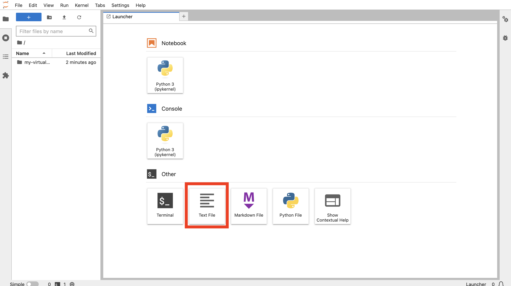
    
2.  ADB ADMINユーザー・パスワードを入力します。次に、「ファイル」メニューから**「テキストの保存」**を選択します。 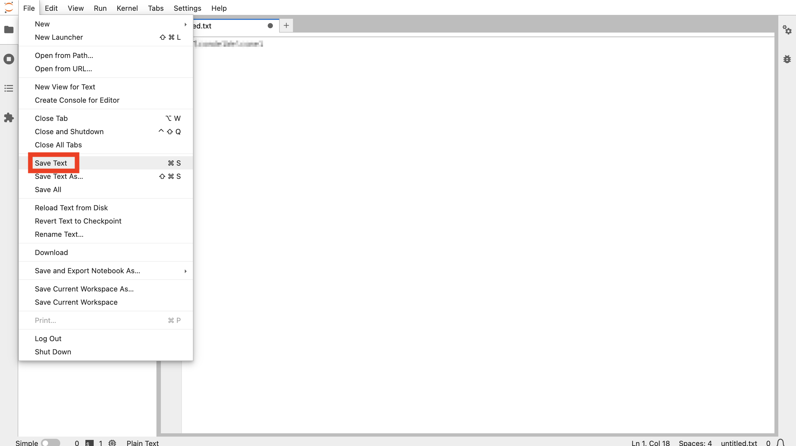
    
3.  プロンプトが表示されたら、ファイル名として**my-pwd.txt**と入力し、**「名前変更」**をクリックします。 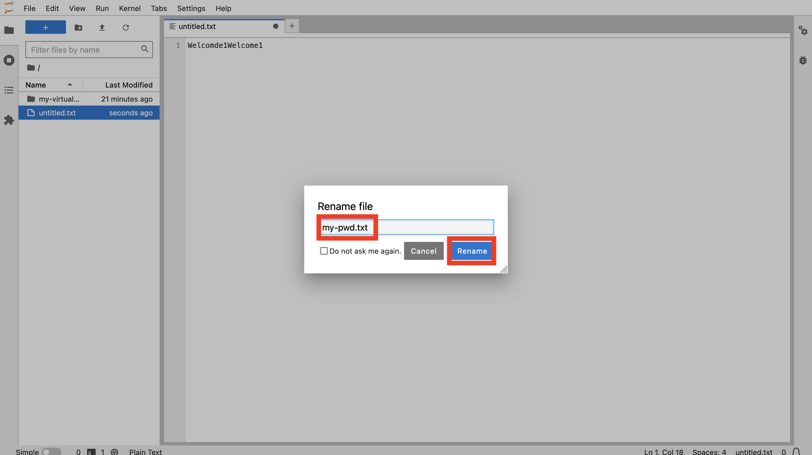
    
4.  テキスト・ファイル・タブを閉じて、「ランチャ」ページに戻ります。 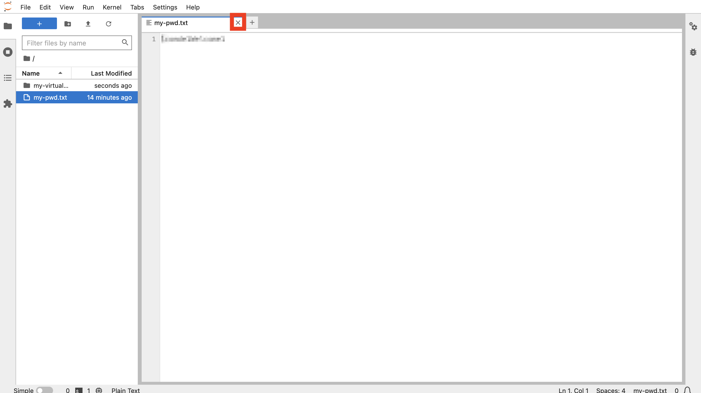
    
5.  Oracle Cloudブラウザ・タブに戻り、Cloud Shellを最小化します。 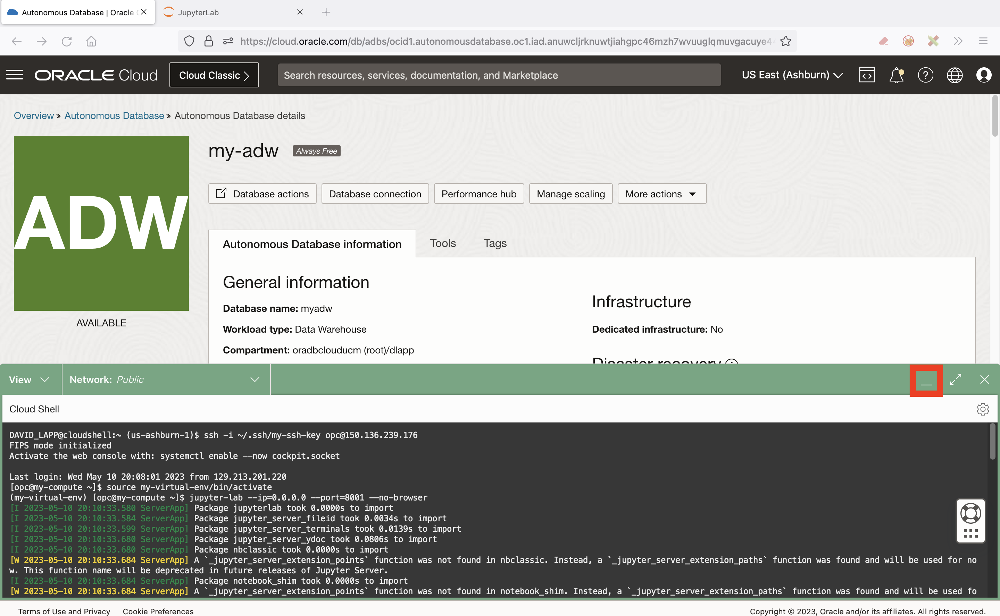
    
6.  「**データベース接続**」をクリックします。 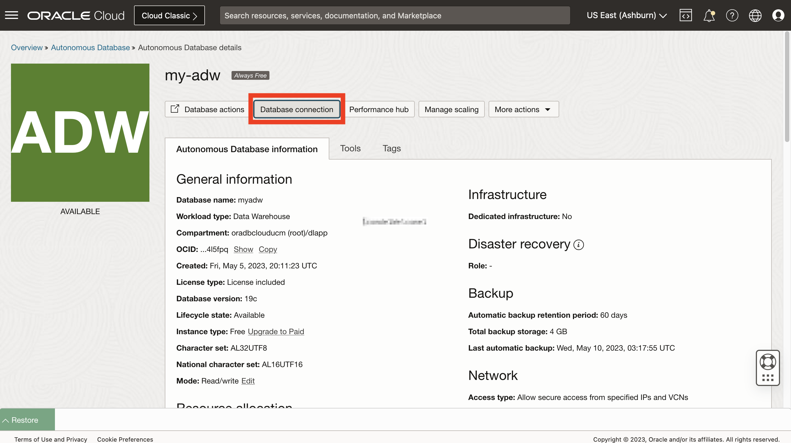
    
7.  「接続文字列」セクションまで下にスクロールします。TLS認証の場合は、**「TLS」**を選択します。これは、シンモード接続を許可するために必要です。次に、「接続文字列」で、\_lowで終わるTNS名の**「コピー」**をクリックします。 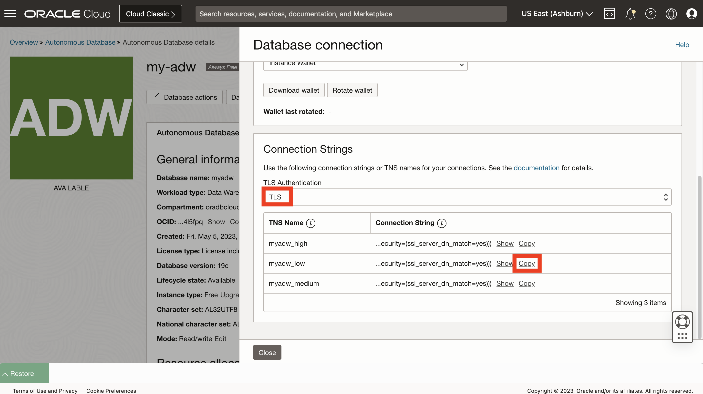
    
8.  JupyterLabブラウザ・タブに戻ります。前述のとおり、「テキスト・ファイル」タイルをクリックして、別の新しいテキスト・ファイルを作成します。Autonomous Databaseからコピーした接続文字列を貼り付けます。次に、ファイルを保存し、名前を **my-dsn.txt**に変更します。 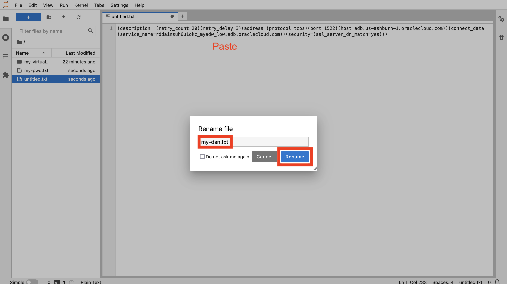
    

前述のとおり、テキスト・ファイル・タブを閉じてランチャ・ページに戻ります。

## タスク2: ノートブックの作成およびAutonomous Databaseへの接続

1.  「ランチャー」から、**「Python 3」**タイルをクリックして新しいノートブックを作成します。 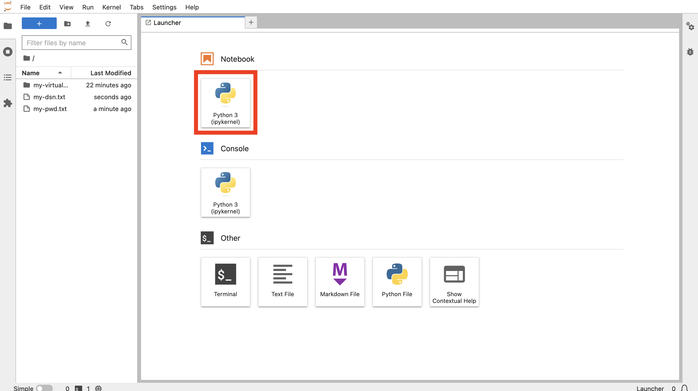
    
2.  最初のセルで、次の文を貼り付け、**「実行」**ボタンをクリックします。これにより、Oracle Databaseとの相互作用を処理するpython-oracedbモジュールがロードされます。
    
        <copy>
        import oracledb
        </copy>
        
    
    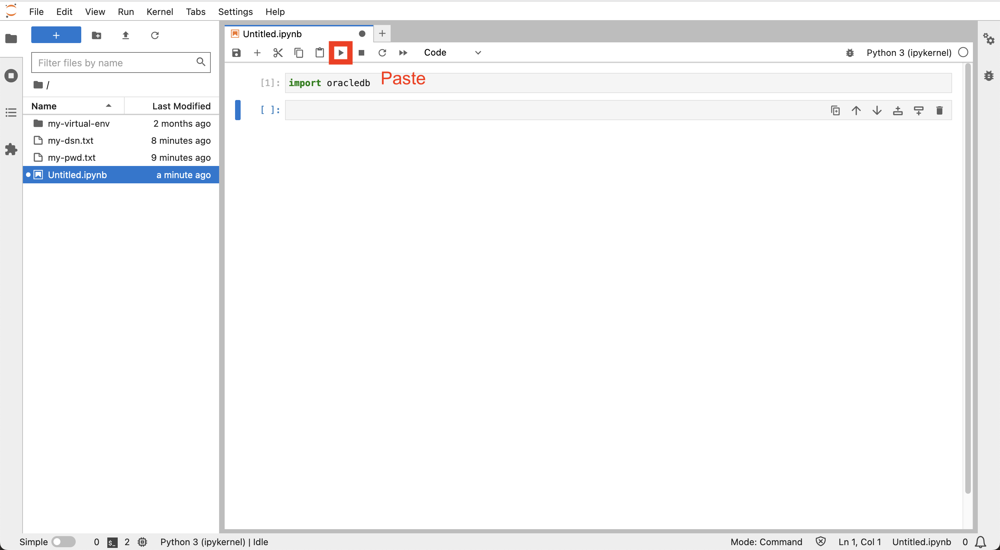
    
3.  次のセルで、次の文を貼り付け、**「実行」**ボタンをクリックします。これにより、ADBパスワードとDSNが変数にロードされます
    
        <copy>
        # Get ADB password and DSN from file
        my_pwd = open('./my-pwd.txt','r').readline().strip()
        my_dsn = open('./my-dsn.txt','r').readline().strip()
        </copy>
        
    
    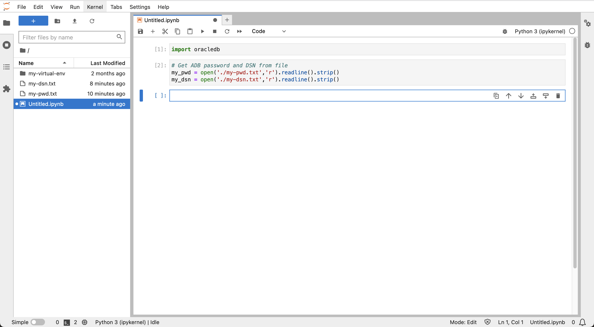
    
4.  次のセルで、次の文を貼り付け、**「実行」**ボタンをクリックします。これにより、ADBへの接続が作成されます。
    
        <copy>
        # Create database connection and cursor
        connection = oracledb.connect(user="admin", password=my_pwd, dsn=my_dsn)
        cursor = connection.cursor()
        </copy>
        
    
    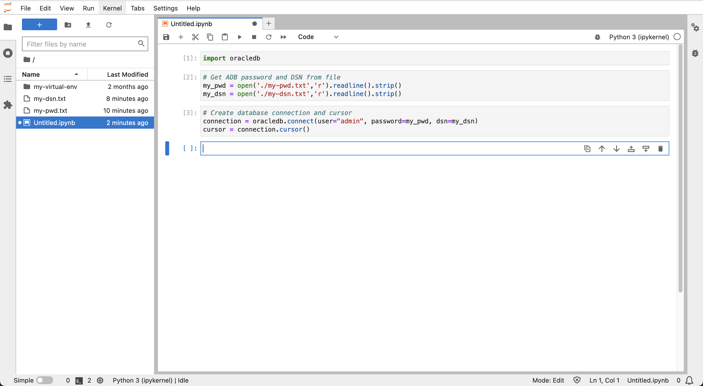
    
5.  次のセルで、次の文を貼り付け、**「実行」**ボタンをクリックします。これにより、テスト問合せが実行され、ADBへの接続が成功したことが検証されます。
    
        <copy>
        # Run a test query
        cursor.execute("select object_type, count(*) from all_objects group by object_type")
        for row in cursor.fetchmany(size=10):
          print(row)
        </copy>
        
    
    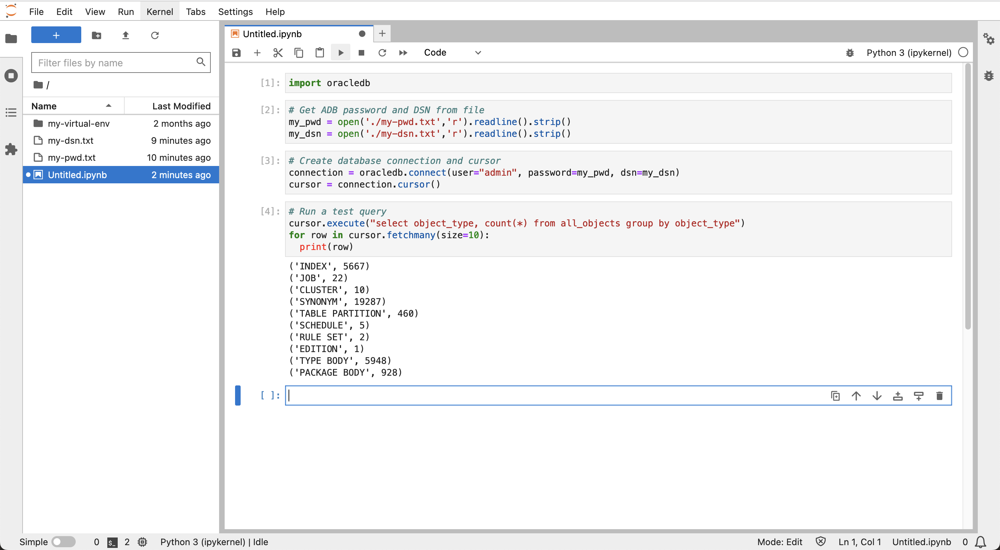
    
6.  左側のパネルでノートブック・ファイルUntitled.ipynbを右クリックし、**「名前変更」**を選択します。
    
    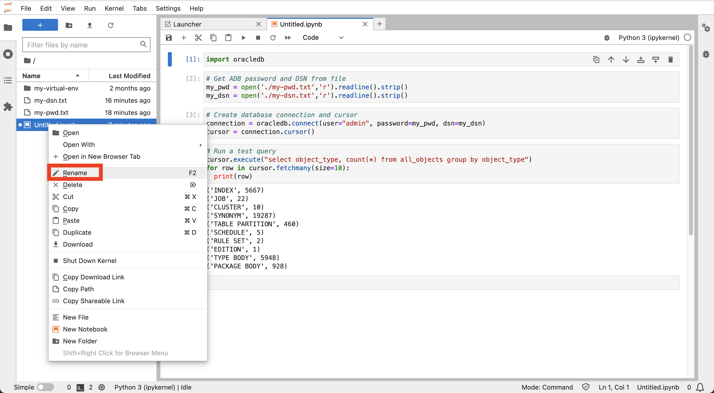
    
7.  **my-notebook** (または選択した名前)を入力します。ノートブック名が変更されていることを確認します。
    
    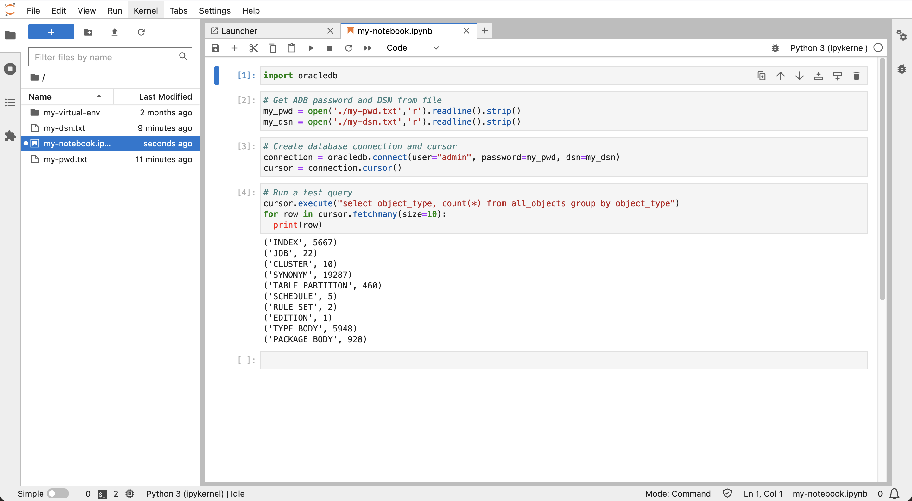
    

**次の演習に進む**ことができます。

## さらに学ぶ

*   Autonomous Databaseへのpython-oracledb接続の詳細は、[ドキュメンテーション](https://python-oracledb.readthedocs.io/en/latest/user_guide/connection_handling.html#connecting-to-oracle-cloud-autonomous-databases)を参照してください。

## 確認

*   **著者** - Oracle、データベース製品管理、David Lapp氏
*   **コントリビュータ** - Rahul Tasker、Denise Myrick、Ramu Gutierrez
*   **最終更新者/日付** - David Lapp、2023年8月