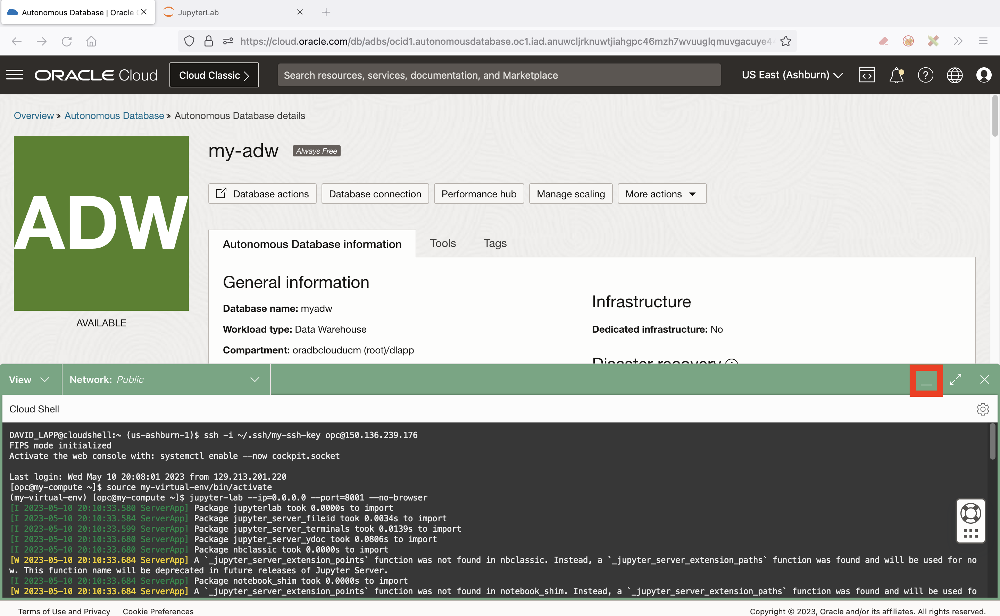

# Python에서 Autonomous Database에 연결

## 소개

데이터 로드 및 분석을 준비하려면 먼저 Python에서 Autonomous Database로의 연결을 설정합니다. python-oracledb 드라이버는 이 연결과 모든 후속 데이터베이스 상호 작용을 지원합니다. Oracle Database에 직접 연결되고 Oracle Client 라이브러리가 필요하지 않은 python-oracledb 드라이버의 'Thin' 모드를 사용합니다.

예상 실험 시간: 5분

### 목표

*   Python에서 Autonomous Database에 연결

### 필요 조건

*   실습 3 완료: JupyterLab 시작

## 작업 1: 연결 파라미터 파일 생성

1.  노트북에 데이터베이스 연결 정보를 직접 포함하지 않으려면 이 정보를 사용하여 노트북에서 참조할 수 있는 파일을 만듭니다. JupyterLab에서 텍스트 파일 타일을 눌러 새 텍스트 파일을 생성합니다. 
    
2.  ADB ADMIN 사용자 비밀번호를 입력합니다. 그런 다음 파일 메뉴에서 **텍스트 저장**을 선택합니다. 
    
3.  프롬프트가 표시되면 파일 이름으로 **my-pwd.txt**를 입력하고 **Rename**을 누릅니다. 
    
4.  텍스트 파일 탭을 닫아 Launcher 페이지로 돌아갑니다. 
    
5.  Oracle Cloud 브라우저 탭으로 돌아가서 Cloud Shell을 최소화합니다. 
    
6.  **데이터베이스 연결**을 누릅니다. 
    
7.  Connection Strings 섹션이 표시될 때까지 아래로 이동합니다. TLS 인증의 경우 **TLS**를 선택합니다. 이는 Thin 모드 연결을 허용하려면 필요합니다. 그런 다음 접속 문자열 아래에서 \_low로 끝나는 TNS 이름에 대해 **복사**를 누릅니다. 
    
8.  JupyterLab 브라우저 탭으로 돌아갑니다. 앞에서 설명한 것처럼 Text File 타일을 눌러 다른 새 텍스트 파일을 생성합니다. Autonomous Database에서 방금 복사한 접속 문자열을 붙여넣습니다. 그런 다음 파일을 저장하고 **my-dsn.txt**로 이름을 바꿉니다. 
    

앞에서 설명한 것처럼 텍스트 파일 탭을 닫고 Launcher 페이지로 돌아갑니다.

## 작업 2: 노트북 생성 및 Autonomous Database에 연결

1.  실행 프로그램에서 **Python 3** 타일을 눌러 새 노트북을 만듭니다. 
    
2.  첫번째 셀에 다음 명령문을 붙여넣고 **run** 버튼을 누릅니다. 그러면 Oracle Database와의 상호 작용을 처리하는 python-oracedb 모듈이 로드됩니다.
    
        <copy>
        import oracledb
        </copy>
        
    
    
    
3.  다음 셀에 다음 명령문을 붙여 넣은 다음 **run** 버튼을 누릅니다. 이렇게 하면 ADB 암호와 DSN이 변수로 로드됩니다.
    
        <copy>
        # Get ADB password and DSN from file
        my_pwd = open('./my-pwd.txt','r').readline().strip()
        my_dsn = open('./my-dsn.txt','r').readline().strip()
        </copy>
        
    
    
    
4.  다음 셀에 다음 명령문을 붙여 넣은 다음 **run** 버튼을 누릅니다. 그러면 ADB와 연결이 생성됩니다.
    
        <copy>
        # Create database connection and cursor
        connection = oracledb.connect(user="admin", password=my_pwd, dsn=my_dsn)
        cursor = connection.cursor()
        </copy>
        
    
    
    
5.  다음 셀에 다음 명령문을 붙여 넣은 다음 **run** 버튼을 누릅니다. 테스트 query를 실행하여 ADB에 성공적으로 연결되었는지 확인합니다.
    
        <copy>
        # Run a test query
        cursor.execute("select object_type, count(*) from all_objects group by object_type")
        for row in cursor.fetchmany(size=10):
          print(row)
        </copy>
        
    
    
    
6.  왼쪽 패널에서 노트북 파일 Untitled.ipynb을 마우스 오른쪽 버튼으로 누르고 **이름 바꾸기**를 선택합니다.
    
    
    
7.  **my-notebook**(또는 선택한 이름)을 입력합니다. 노트북 이름이 변경되었는지 확인합니다.
    
    
    

이제 **다음 실습을 진행하십시오**.

## 자세히 알아보기

*   Autonomous Database에 대한 python-oracledb 연결에 대한 자세한 내용은 [설명서](https://python-oracledb.readthedocs.io/en/latest/user_guide/connection_handling.html#connecting-to-oracle-cloud-autonomous-databases)를 참조하십시오.

## 확인

*   **작성자** - David Lapp, Oracle 데이터베이스 제품 관리
*   **제공자** - Rahul Tasker, Denise Myrick, Ramu Gutierrez
*   **최종 업데이트 수행자/날짜** - David Lapp, 2023년 8월