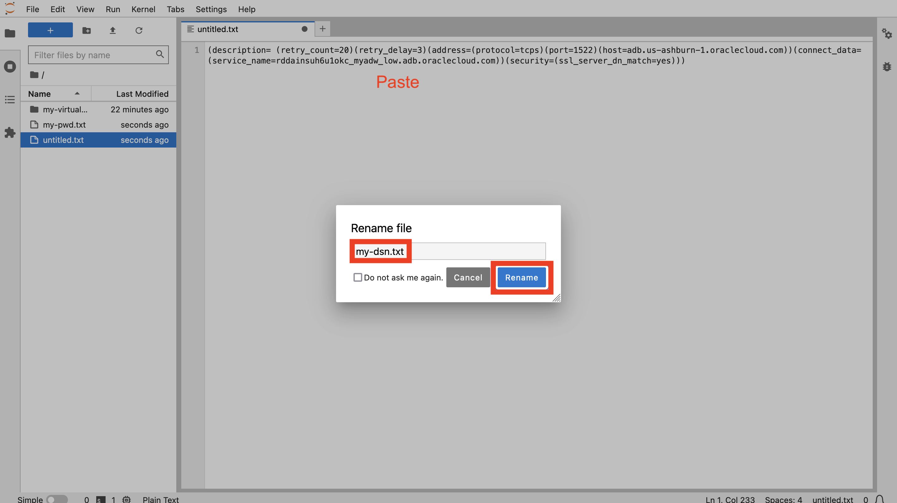
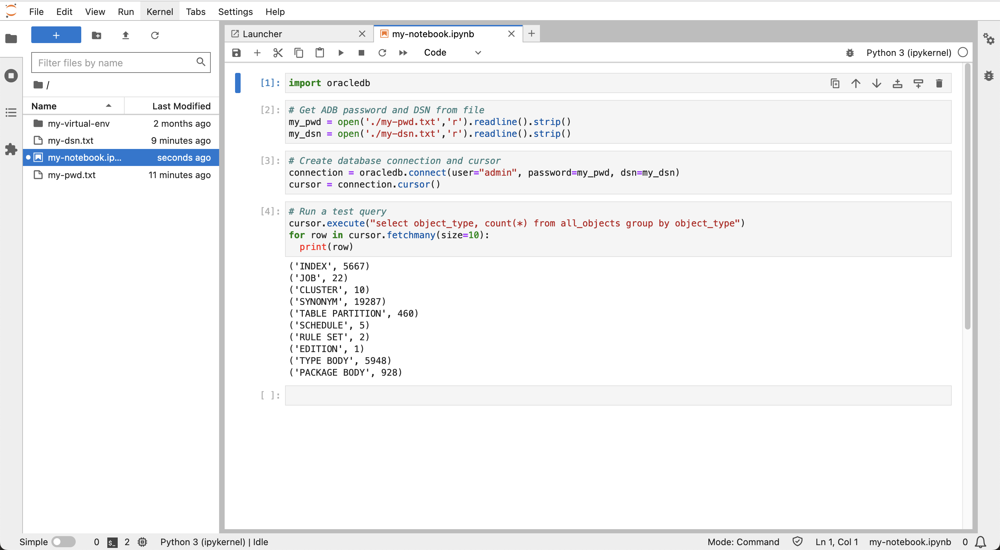

# Estabelecer Conexão com o Autonomous Database pelo Python

## Introdução

Para se preparar para o carregamento e a análise de dados, primeiro estabeleça uma conexão do Python com o seu Autonomous Database. O driver python-oracledb suporta essa conexão e todas as interações subsequentes do banco de dados. Você usará o modo 'Thin' do driver python-oracledb, que se conecta diretamente ao Oracle Database e não precisa de bibliotecas do Oracle Client.

Tempo de Laboratório Estimado: 5 minutos

### Objetivos

*   Estabelecer Conexão com o Autonomous Database pelo Python

### Pré-requisitos

*   Conclusão do Laboratório 3: Iniciar JupyterLab

## Tarefa 1: Criar arquivos de parâmetros de conexão

1.  Para evitar a inclusão de informações de conexão de banco de dados diretamente no notebook, você cria arquivos com essas informações às quais o notebook pode fazer referência. Em JupyterLab, clique no mosaico Arquivo de Texto para criar um novo arquivo de texto. 
    
2.  Informe sua senha de usuário ADMIN do ADB. Em seguida, no menu Arquivo, selecione **Salvar Texto**. 
    
3.  Quando solicitado, digite **my-pwd.txt** como seu nome de arquivo e clique em **Renomear**. 
    
4.  Feche a guia do arquivo de texto para retornar à página Iniciador. 
    
5.  Retorne à guia do browser do Oracle Cloud e minimize o Cloud Shell. 
    
6.  Clique em **Conexão de Banco de Dados**. 
    
7.  Role a tela até a seção Connection Strings. Para Autenticação TLS, selecione **TLS**. Isso é necessário para permitir conexões no modo Thin. Em seguida, em String de Conexão, clique em **Copiar** para o Nome do TNS que termina em \_baixo. 
    
8.  Retorne à guia do browser JupyterLab. Como feito anteriormente, clique no bloco Arquivo de Texto para criar outro novo arquivo de texto. Cole a string de conexão recém-copiada do Autonomous Database. Em seguida, salve o arquivo e renomeie-o para **my-dsn.txt**. 
    

Como feito anteriormente, feche a guia do arquivo de texto para retornar à página Iniciador.

## Tarefa 2: Criar notebook e estabelecer conexão com o Autonomous Database

1.  No Launcher, clique no mosaico **Python 3** para criar um novo notebook. 
    
2.  Na primeira célula, cole a instrução a seguir e clique no botão **executar**. Isso carrega o módulo python-oracedb que trata a interação com o Oracle Database.
    
        <copy>
        import oracledb
        </copy>
        
    
    
    
3.  Na próxima célula, cole as instruções a seguir e clique no botão **executar**. Isso carrega sua senha do ADB e DSN em variáveis
    
        <copy>
        # Get ADB password and DSN from file
        my_pwd = open('./my-pwd.txt','r').readline().strip()
        my_dsn = open('./my-dsn.txt','r').readline().strip()
        </copy>
        
    
    
    
4.  Na próxima célula, cole as instruções a seguir e clique no botão **executar**. Isso cria uma conexão com o ADB.
    
        <copy>
        # Create database connection and cursor
        connection = oracledb.connect(user="admin", password=my_pwd, dsn=my_dsn)
        cursor = connection.cursor()
        </copy>
        
    
    
    
5.  Na próxima célula, cole as instruções a seguir e clique no botão **executar**. Isso executa uma consulta de teste para verificar a conexão bem-sucedida com o ADB.
    
        <copy>
        # Run a test query
        cursor.execute("select object_type, count(*) from all_objects group by object_type")
        for row in cursor.fetchmany(size=10):
          print(row)
        </copy>
        
    
    
    
6.  Clique com o botão direito do mouse no arquivo de notebook Untitled.ipynb no painel esquerdo e selecione **Renomear**.
    
    
    
7.  Digite **my-notebook** (ou um nome de sua escolha). Observe que o nome do notebook foi alterado.
    
    
    

Agora você pode **prosseguir para o próximo laboratório**.

## Saiba Mais

*   Para obter mais informações sobre conexões python-oracledb com o Autonomous Database, consulte a [documentação](https://python-oracledb.readthedocs.io/en/latest/user_guide/connection_handling.html#connecting-to-oracle-cloud-autonomous-databases).

## Agradecimentos

*   **Autor** - David Lapp, Database Product Management, Oracle
*   **Colaboradores** - Rahul Tasker, Denise Myrick, Ramu Gutierrez
*   **Última Atualização em/Data** - David Lapp, agosto de 2023