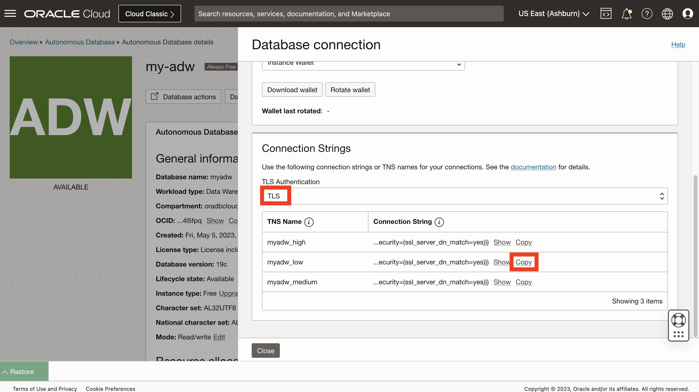

# 從 Python 連線至 Autonomous Database

## 簡介

為了準備資料載入和分析，您必須先建立 Python 與 Autonomous Database 的連線。python-oracledb 驅動程式支援此連線和所有後續的資料庫互動。您將使用 python-oracledb 驅動程式的「Thin」模式，直接連線至 Oracle Database，不需要連線到 Oracle 從屬端程式庫。

預估實驗室時間：5 分鐘

### 目標

*   從 Python 連線至 Autonomous Database

### 先決條件

*   完成實驗室 3：開始 JupyterLab

## 作業 1：建立連線參數檔

1.  為了避免在記事本中直接包含資料庫連線資訊，您可以使用記事本可以參考的此資訊建立檔案。在 JupyterLab 中，按一下「文字檔」磚塊以建立新的文字檔。 
    
2.  輸入您的 ADB ADMIN 使用者密碼。然後從「檔案」功能表選取**儲存文字**。 
    
3.  系統出現提示時，請輸入 **my-pwd.txt** 作為檔案名稱，然後按一下**重新命名**。 
    
4.  關閉文字檔分頁，回到 \[Launcher\] (啟動圖示) 頁面。 
    
5.  返回您的 Oracle Cloud 瀏覽器頁籤，將 Cloud Shell 降到最低。 
    
6.  按一下**資料庫連線**。 
    
7.  向下捲動至「連線字串」區段。若為 TLS 認證，請選取 **TLS** 。需要允許精簡模式連線。然後在「連線字串」底下，按一下以 \_low 結尾之 TNS 名稱的**複製**。 
    
8.  返回您的 JupyterLab 瀏覽器頁標。如前所述，按一下「文字檔」磚塊以建立另一個新文字檔。貼上剛從 Autonomous Database 複製的連線字串。然後儲存檔案，並重新命名為 **my-dsn.txt** 。 
    

如前所述，關閉文字檔標籤以返回啟動器頁面。

## 作業 2：建立筆記本並連線至 Autonomous Database

1.  從啟動圖示中，按一下 **Python 3** 磚塊以建立新的記事本。 
    
2.  在第一個儲存格中，貼上下列陳述式，然後按一下 \[ **執行** \] 按鈕。這會載入處理與 Oracle Database 互動的 python-oracedb 模組。
    
        <copy>
        import oracledb
        </copy>
        
    
    
    
3.  在下一個儲存格中，貼上下列陳述式，然後按一下 \[ **執行** \] 按鈕。這會將 ADB 密碼和 DSN 載入至變數
    
        <copy>
        # Get ADB password and DSN from file
        my_pwd = open('./my-pwd.txt','r').readline().strip()
        my_dsn = open('./my-dsn.txt','r').readline().strip()
        </copy>
        
    
    
    
4.  在下一個儲存格中，貼上下列陳述式，然後按一下 \[ **執行** \] 按鈕。這會建立與 ADB 的連線。
    
        <copy>
        # Create database connection and cursor
        connection = oracledb.connect(user="admin", password=my_pwd, dsn=my_dsn)
        cursor = connection.cursor()
        </copy>
        
    
    
    
5.  在下一個儲存格中，貼上下列陳述式，然後按一下 \[ **執行** \] 按鈕。這會執行測試查詢，以驗證與 ADB 的連線是否成功。
    
        <copy>
        # Run a test query
        cursor.execute("select object_type, count(*) from all_objects group by object_type")
        for row in cursor.fetchmany(size=10):
          print(row)
        </copy>
        
    
    
    
6.  在左側面板的記事本檔案 Untitled.ipynb 上按一下滑鼠右鍵，然後選取**重新命名**。
    
    
    
7.  輸入 **my-notebook** (或您選擇的名稱)。觀察記事本名稱已變更。
    
    
    

您現在可以**進入下一個實驗室**。

## 進一步瞭解

*   如需有關 Autonomous Database 之 python-oracledb 連線的詳細資訊，請參閱這份[文件](https://python-oracledb.readthedocs.io/en/latest/user_guide/connection_handling.html#connecting-to-oracle-cloud-autonomous-databases)。

## 確認

*   **作者** - Oracle 資料庫產品管理 David Lapp
*   **貢獻者** - Rahul Tasker，Denise Myrick，Ramu Gutierrez
*   **上次更新者 / 日期** - David Lapp，2023 年 8 月