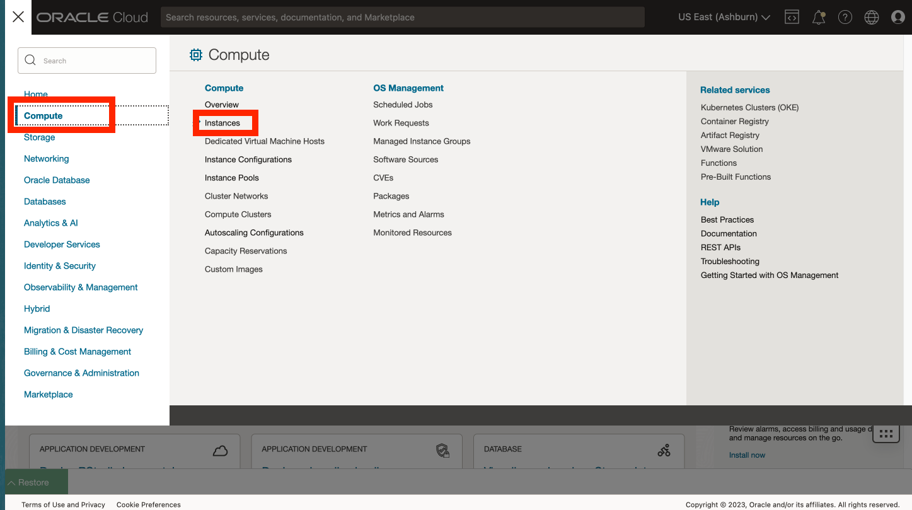

# Conéctese a Compute

## Introducción

Para acceder a los recursos informáticos del host de Python, necesita un par de claves SSH. Oracle Cloud Infrastructure (OCI) Cloud Shell es un terminal basado en explorador web al que se puede acceder desde la consola de Oracle Cloud que proporciona acceso a un shell de Linux. Recuperará un par de claves SSH y se conectará al host de Python en OCI Cloud Shell.

Tiempo de laboratorio estimado: 5 minutos

Vea el siguiente vídeo para una breve introducción al laboratorio. [Laboratorio 1](videohub:1_0tvxm2q0)

### Objetivos

*   Recuperación de la dirección IP de cálculo
*   Recuperar par de claves SSH
*   Crear conexión SSH para Compute

### Requisitos

*   Debe estar conectado a la consola de OCI

## Tarea 1: Recuperación de la dirección IP de la instancia informática

1.  En el menú principal, vaya a Compute > Instances



2.  En la página de instrucciones del taller, haga clic en **Ver información de conexión** en la parte superior izquierda y copie el nombre del compartimento.


1.  En la consola de OCI, pegue el nombre del compartimento y selecciónelo en la lista desplegable.


4.  Anote la IP pública de su instancia informática. Utilizará esto más adelante en esta y otras prácticas.


## Tarea 2: Recuperación de claves SSH

1.  Abra Cloud Shell.
    
    
    
2.  Si se le solicita que ejecute el tutorial, escriba N e introdúzcalo.
    
    
    
3.  En la línea de comandos, ejecute cada una de las siguientes acciones para crear y navegar a la carpeta SSH.
    
        <copy>
        mkdir ~/.ssh
        </copy>
        
    
          ```
        cd ~/.ssh \`\`


1.  En la línea de comandos, ejecute lo siguiente para recuperar y mostrar un archivo zip que contenga claves SSH.
    
        <copy>
        wget https://objectstorage.us-ashburn-1.oraclecloud.com/p/hfpJ4-8XrB5tWBDUWvgnCmGch_1WHhihBrRpHNIzj6JSq5O5hbwp2wsqRPYbg8Gm/n/c4u04/b/livelabsfiles/o/labfiles/ocw23-keys.zip
        </copy>
        
    
        <copy>
        ls
        </copy>
        
    
    
    
2.  En la línea de comandos, ejecute lo siguiente para descomprimir y mostrar el contenido del archivo zip.
    
        <copy>
        unzip ocw23-keys
        </copy>
        
    
        <copy>
        ls
        </copy>
        


## Tarea 3: Conexión a la instancia informática

2.  En la línea de comandos, ejecute lo siguiente para conectarse a la instancia informática de Python, donde IP Address es la dirección IP informática de la tarea 1.
    
        <copy>
         ssh -i ~/.ssh/ocw23-rsa opc@[IP address]
        </copy>
        
    
    Si se le solicita que agregue a la lista de hosts conocidos, responda con **yes**.
    
    
    
3.  Haga clic en el icono de reducción para minimizar Cloud Shell.
    
    
    
4.  Observe el botón Restore para volver a abrir Cloud Shell. Volverá a abrir Cloud Shell en un laboratorio posterior.
    
    
    

Ahora puede **proceder al siguiente laboratorio**.

## Reconocimientos

*   **Autor**: David Lapp, Database Product Management, Oracle
*   **Contribuyentes**: Rahul Tasker, Denise Myrick, Ramu Gutiérrez
*   **Última actualización por/fecha**: David Lapp, agosto de 2023