# 計算に接続

## 概要

Pythonホスト・コンピュートにアクセスするには、SSHキー・ペアが必要です。Oracle Cloud Infrastructure (OCI) Cloud Shellは、Linuxシェルへのアクセスを提供するOracle Cloudコンソールからアクセス可能なWebブラウザベースの端末です。SSHキー・ペアを取得し、OCI Cloud ShellでPythonホストに接続します。

推定ラボ時間: 5分

ラボのクイック・ウォークスルーについては、次のビデオをご覧ください。[ラボ1](videohub:1_0tvxm2q0)

### 目標

*   コンピュートIPアドレスの取得
*   SSHキー・ペアの取得
*   計算するSSH接続を作成します

### 前提条件

*   OCIコンソールにログインしている必要があります

## タスク1: コンピュート・インスタンスのIPアドレスの取得

1.  メイン・メニューから、「コンピュート」→「インスタンス」にナビゲートします。

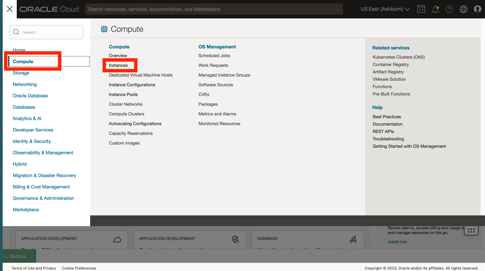

2.  ワークショップの手順ページで、左上の**「ログイン情報の表示」**をクリックし、コンパートメント名をコピーします。

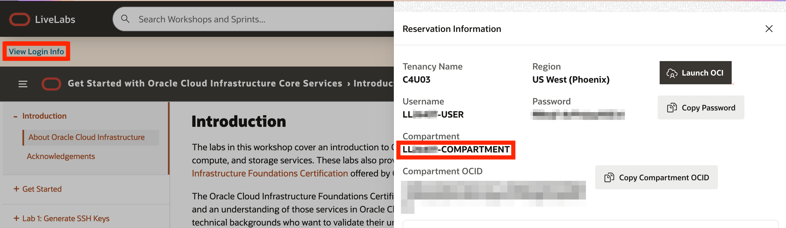

1.  OCIコンソールで、コンパートメント名を貼り付けて、プルダウンから選択します。

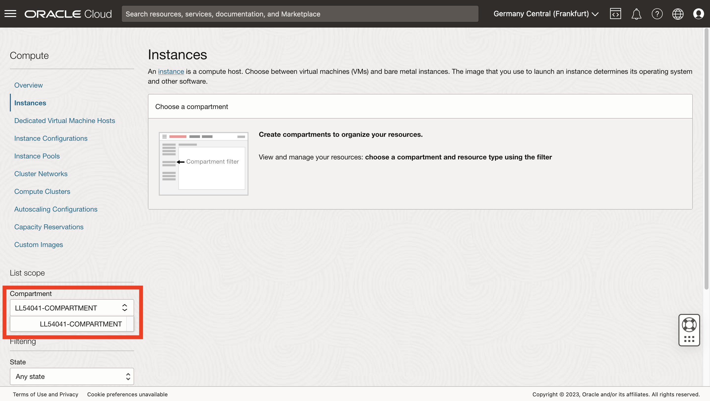

4.  コンピュート・インスタンスのパブリックIPを書き留めます。これを後ほど、この演習や他の演習で使用します。

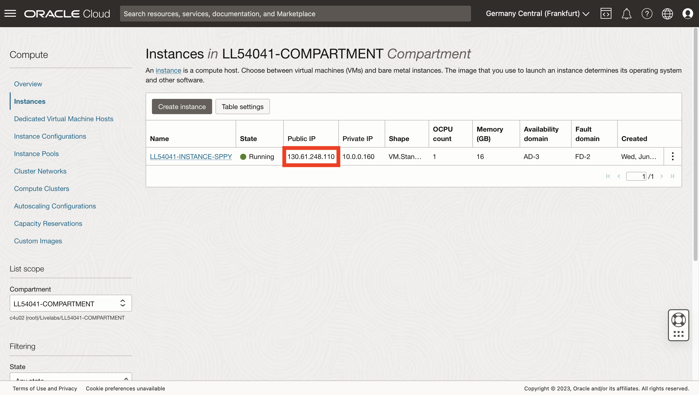

## タスク2: SSHキーの取得

1.  Cloudシェルを開きます。
    
    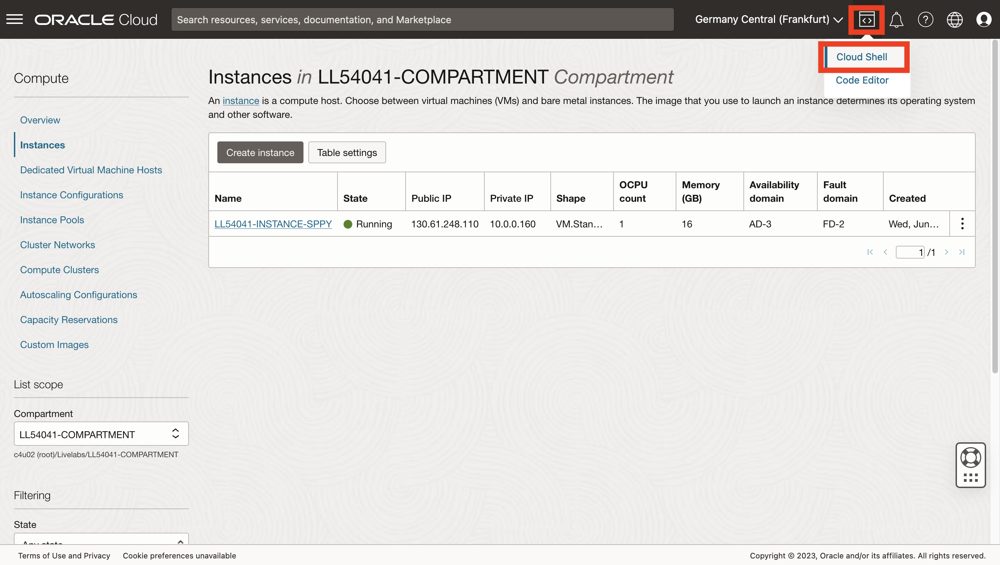
    
2.  tutorialを実行するように求められたら、Nと入力して入力します。
    
    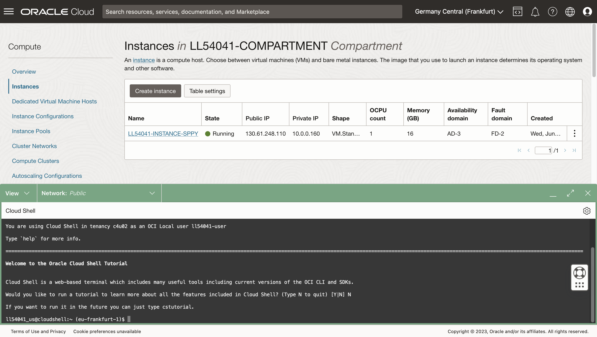
    
3.  コマンドラインで、次をそれぞれ実行し、SSHフォルダを作成してナビゲートします。
    
        <copy>
        mkdir ~/.ssh
        </copy>
        
    
          ```
        cd ~/.ssh \`\`\`

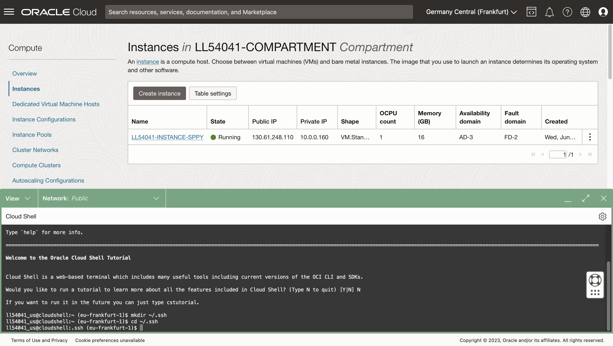

1.  コマンドラインで、次を実行してSSHキーを含むzipファイルを取得およびリストします。
    
        <copy>
        wget https://objectstorage.us-ashburn-1.oraclecloud.com/p/hfpJ4-8XrB5tWBDUWvgnCmGch_1WHhihBrRpHNIzj6JSq5O5hbwp2wsqRPYbg8Gm/n/c4u04/b/livelabsfiles/o/labfiles/ocw23-keys.zip
        </copy>
        
    
        <copy>
        ls
        </copy>
        
    
    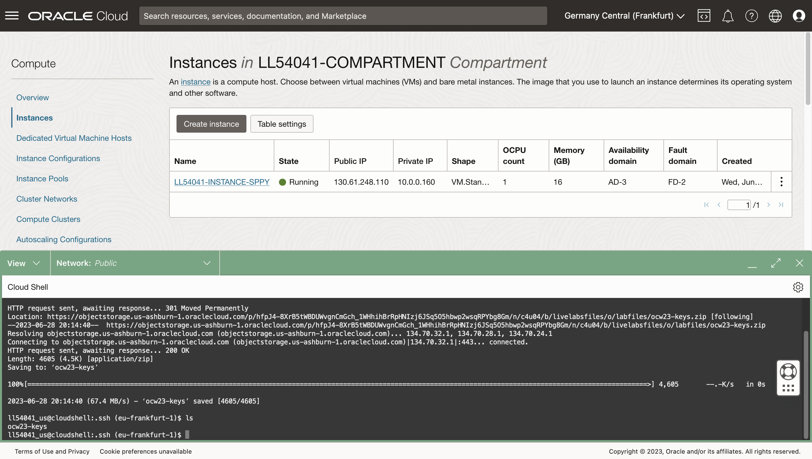
    
2.  コマンドラインで、次を実行してzipファイルを解凍し、zipファイルの内容をリストします。
    
        <copy>
        unzip ocw23-keys
        </copy>
        
    
        <copy>
        ls
        </copy>
        

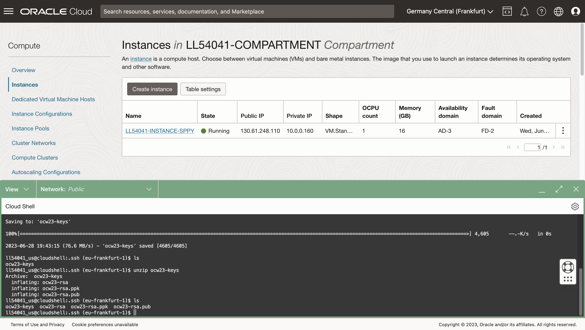

## タスク3: コンピュート・インスタンスへの接続

2.  コマンドラインで、次を実行してPythonコンピュート・インスタンスに接続します。ここで、IPアドレスはタスク1のコンピュートIPアドレスです。
    
        <copy>
         ssh -i ~/.ssh/ocw23-rsa opc@[IP address]
        </copy>
        
    
    既知のホストのリストに追加するように求められたら、**yes**で応答します。
    
    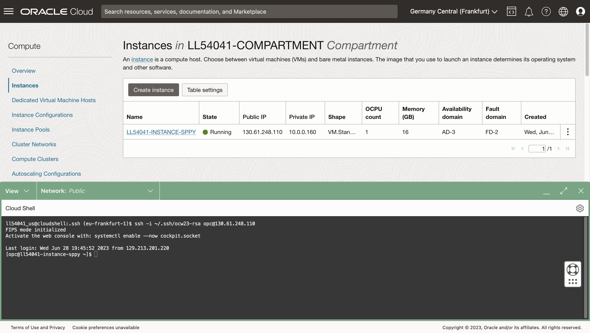
    
3.  クラウド・シェルを最小化するには、縮小アイコンをクリックします。
    
    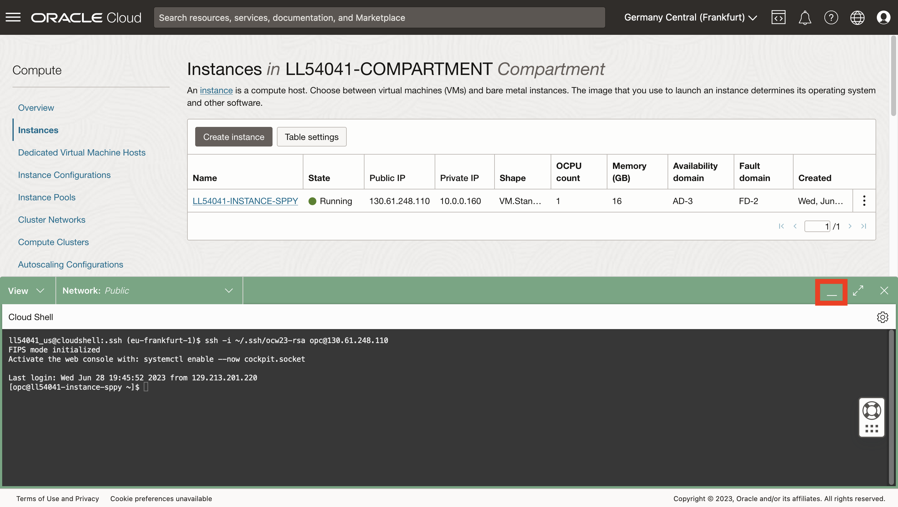
    
4.  Cloud Shellを再オープンするには、「リストア」ボタンを確認します。後続のラボでCloud Shellを再オープンします。
    
    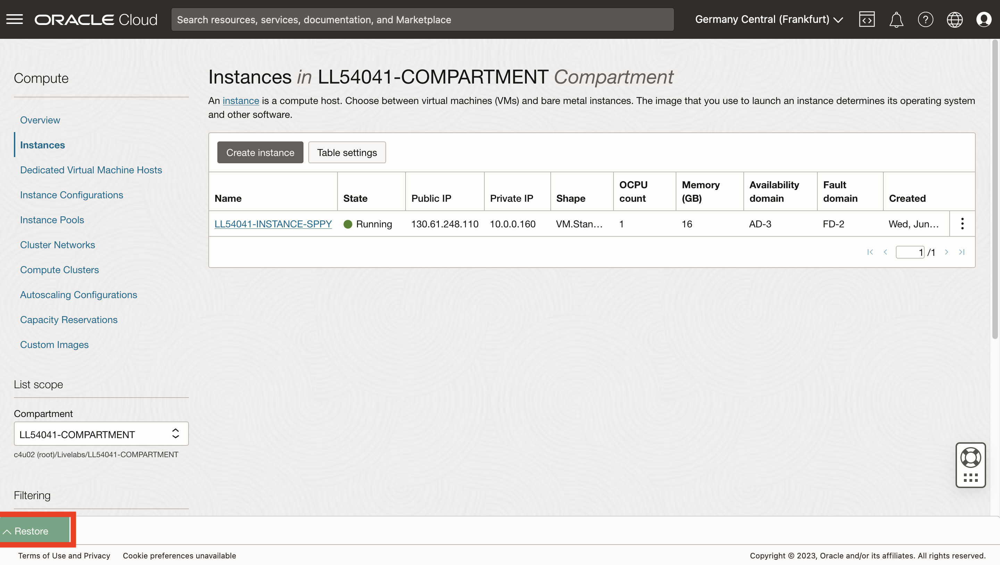
    

**次の演習に進む**ことができます。

## 謝辞

*   **著者** - Oracle、データベース製品管理、David Lapp氏
*   **コントリビュータ** - Rahul Tasker、Denise Myrick、Ramu Gutierrez
*   **最終更新者/日付** - David Lapp、2023年8月