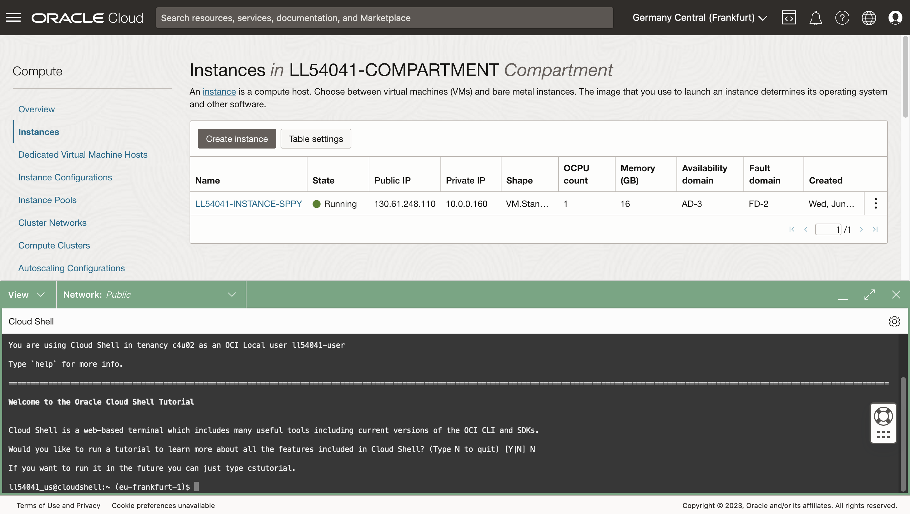
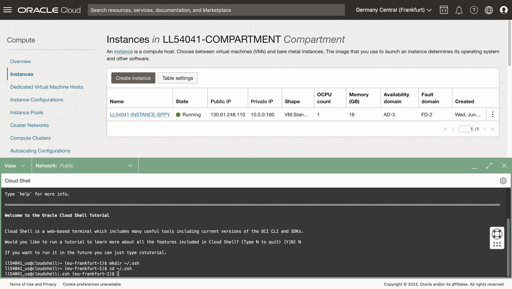
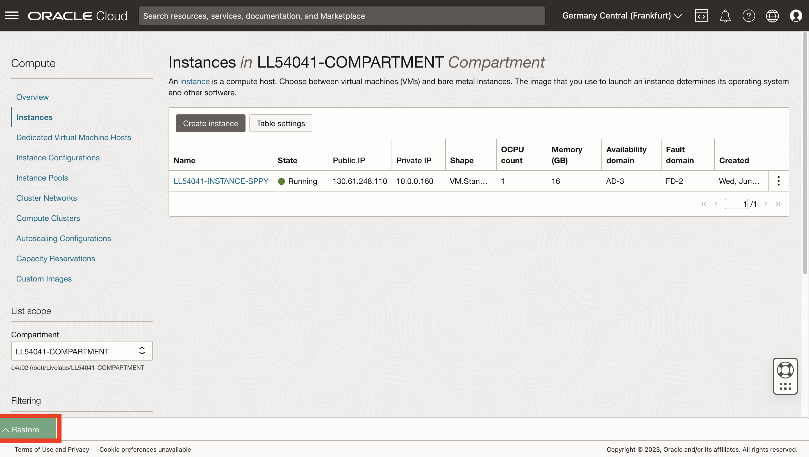

# 컴퓨트에 접속

## 소개

Python 호스트 컴퓨팅에 액세스하려면 SSH 키 쌍이 필요합니다. OCI(Oracle Cloud Infrastructure) Cloud Shell은 웹 브라우저 기반 터미널로, Linux 셸에 대한 액세스를 제공하는 Oracle Cloud 콘솔에서 액세스할 수 있습니다. SSH 키 쌍을 검색하고 OCI Cloud Shell에서 Python 호스트에 접속합니다.

예상 실험 시간: 5분

실습 과정을 간단히 살펴보려면 아래 비디오를 시청하십시오. [랩 1](videohub:1_0tvxm2q0)

### 목표

*   컴퓨트 IP 주소 검색
*   SSH 키 쌍 검색
*   컴퓨트할 SSH 접속 생성

### 필요 조건

*   OCI 콘솔에 로그인되어 있어야 합니다.

## 작업 1: 컴퓨트 인스턴스의 IP 주소 검색

1.  기본 메뉴에서 Compute > Instances로 이동합니다.


2.  워크샵 지침 페이지에서 왼쪽 위에 있는 **로그인 정보 보기**를 누르고 구획 이름을 복사합니다.


1.  OCI 콘솔에서 구획 이름을 붙여넣고 풀다운에서 선택합니다.


4.  컴퓨트 인스턴스의 공용 IP를 확인합니다. 나중에 이 실습과 다른 실습에서 사용할 수 있습니다.


## 작업 2: SSH 키 검색

1.  클라우드 셸을 엽니다.
    
    
    
2.  튜토리얼을 실행할지 묻는 프롬프트가 표시되면 N을 입력하고 Enter 키를 누릅니다.
    
    
    
3.  명령줄에서 다음 각각을 실행하여 SSH 폴더를 만들고 탐색합니다.
    
        <copy>
        mkdir ~/.ssh
        </copy>
        
    
          ```
        cd ~/.ssh \`\`



1.  명령줄에서 다음을 실행하여 SSH 키를 포함하는 zip 파일을 검색하고 나열합니다.
    
        <copy>
        wget https://objectstorage.us-ashburn-1.oraclecloud.com/p/hfpJ4-8XrB5tWBDUWvgnCmGch_1WHhihBrRpHNIzj6JSq5O5hbwp2wsqRPYbg8Gm/n/c4u04/b/livelabsfiles/o/labfiles/ocw23-keys.zip
        </copy>
        
    
        <copy>
        ls
        </copy>
        
    
    
    
2.  명령줄에서 다음을 실행하여 zip 파일의 내용을 압축 해제하고 나열합니다.
    
        <copy>
        unzip ocw23-keys
        </copy>
        
    
        <copy>
        ls
        </copy>
        


## 작업 3: 컴퓨트 인스턴스에 접속

2.  명령행에서 다음을 실행하여 Python 컴퓨트 인스턴스에 접속합니다. 여기서 IP 주소는 작업 1의 컴퓨트 IP 주소입니다.
    
        <copy>
         ssh -i ~/.ssh/ocw23-rsa opc@[IP address]
        </copy>
        
    
    알려진 호스트 목록에 추가할지 묻는 메시지가 표시되면 **yes**로 응답하십시오.
    
    
    
3.  축소 아이콘을 눌러 Cloud Shell을 최소화합니다.
    
    
    
4.  Restore 버튼을 관찰하여 Cloud Shell을 다시 엽니다. 후속 실습에서 Cloud Shell을 다시 엽니다.
    
    
    

이제 **다음 실습을 진행하십시오**.

## 확인

*   **작성자** - David Lapp, Oracle 데이터베이스 제품 관리
*   **제공자** - Rahul Tasker, Denise Myrick, Ramu Gutierrez
*   **최종 업데이트 수행자/날짜** - David Lapp, 2023년 8월