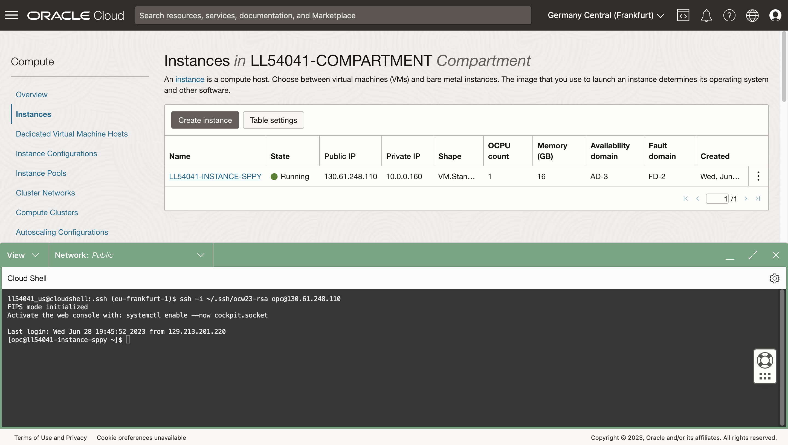

# 连接到计算

## 简介

要访问 Python 主机计算，您需要 SSH 密钥对。Oracle Cloud Infrastructure (OCI) Cloud Shell 是一个基于 Web 浏览器的终端，可通过 Oracle Cloud 控制台访问，从而访问 Linux shell。您将检索 SSH 密钥对并连接到 OCI Cloud Shell 中的 Python 主机。

估计的实验室时间：5 分钟

观看下面的视频，快速浏览实验室。[练习 1](videohub:1_0tvxm2q0)

### 目标

*   检索计算 IP 地址
*   检索 SSH 密钥对
*   创建要计算的 SSH 连接

### 先备条件

*   您必须登录到 OCI 控制台

## 任务 1：检索计算实例的 IP 地址

1.  从主菜单中，导航到“Compute（计算）”>“Instances（实例）”


2.  在研讨会说明页面中，单击左上角的**查看登录信息**，然后复制区间名称。


1.  在 OCI 控制台中，粘贴区间名称，然后从下拉列表中选择。


4.  请注意计算实例的公共 IP。您稍后将在此实验室和其他实验室中使用此功能。


## 任务 2：检索 SSH 密钥

1.  打开 cloud shell。
    
    
    
2.  如果提示运行教程，请键入 N 并输入。
    
    
    
3.  在命令行中，运行以下每个命令以创建并导航到 SSH 文件夹。
    
        <copy>
        mkdir ~/.ssh
        </copy>
        
    
          ```
        cd ~/.ssh \`\`\`


1.  在命令行中，运行以下命令检索并列出包含 SSH 密钥的 zip 文件。
    
        <copy>
        wget https://objectstorage.us-ashburn-1.oraclecloud.com/p/hfpJ4-8XrB5tWBDUWvgnCmGch_1WHhihBrRpHNIzj6JSq5O5hbwp2wsqRPYbg8Gm/n/c4u04/b/livelabsfiles/o/labfiles/ocw23-keys.zip
        </copy>
        
    
        <copy>
        ls
        </copy>
        
    
    
    
2.  在命令行中，运行以下命令解压缩并列出 zip 文件内容。
    
        <copy>
        unzip ocw23-keys
        </copy>
        
    
        <copy>
        ls
        </copy>
        


## 任务 3：连接到计算实例

2.  在命令行中，运行以下命令连接到 Python 计算实例，其中 IP 地址是任务 1 中的计算 IP 地址。
    
        <copy>
         ssh -i ~/.ssh/ocw23-rsa opc@[IP address]
        </copy>
        
    
    如果提示添加至已知主机列表，请回复 **yes** 。
    
    
    
3.  单击折叠图标可最小化 Cloud Shell。
    
    
    
4.  观察 "Restore" 按钮以重新打开 Cloud Shell。您将在随后的实验中重新打开 Cloud Shell。
    
    
    

现在，您可以**进入下一个练习**。

## 确认

*   **作者** - David Lapp，Oracle 数据库产品管理
*   **贡献者** - Rahul Tasker、Denise Myrick、Ramu Gutierrez
*   **上次更新者/日期** - David Lapp，2023 年 8 月