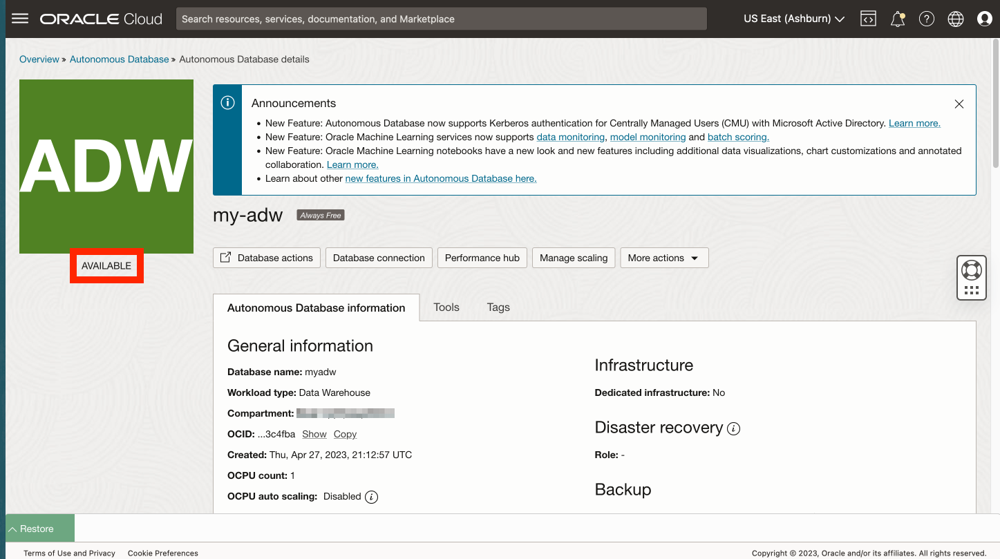

# Autonomous Database erstellen

## Einführung

Oracle Autonomous Database ist ein selbstverwaltender, selbstsichernder und selbstreparierender Datenbankservice, einschließlich Oracle Spatial, mit Angeboten für Data Warehousing- und Transaktionsverarbeitungs-Workloads. Sie müssen keine Hardware konfigurieren oder verwalten oder Software installieren. Oracle Cloud Infrastructure verwaltet das Erstellen der Datenbank sowie das Sichern, Patchen, Upgraden und Optimieren der Datenbank. Da sich dieser Workshop auf einen analytischen Anwendungsfall konzentriert, erstellen Sie ein Autonomous Date Warehouse (ADW).

Geschätzte Laborzeit: 5 Minuten

### Ziele

*   Autonomous Database-Instanz erstellen

### Voraussetzungen

*   Abschluss von Übung 1: Zugriff auf JupyterLab

## Aufgabe 1: Autonomous Database erstellen

1.  Wählen Sie im Hauptnavigationsbereich die Option **Oracle Database** und dann **Autonomous Database** aus. 
    
2.  Ihr Compartment sollte weiterhin ausgewählt werden. Wenn nicht, wählen Sie sie erneut aus. Klicken Sie dann auf **Autonomous Database erstellen**.
    

1.  Geben Sie als Anzeigenamen **my-adw** und als Datenbanknamen **myadw** ein. Übernehmen Sie den Workload-Typ "Data Warehouse".
    
    **Hinweis:** Sie müssen den Workload-Typ "Data Warehouse" auswählen. Die Auswahl der Transaktionsverarbeitung führt zu einem Quotenfehler.
    
    
    
2.  Übernehmen Sie für den Deployment-Typ den Standardwert **Serverlos**. Übernehmen Sie außerdem die Standardwerte für Version (19c), ECPU-Anzahl (2) und Speicher (1 TB). Scrollen Sie dann nach unten. 
    
3.  Geben Sie ein Kennwort für den Datenbank-ADMIN-Benutzer ein, und bestätigen Sie es. Scrollen Sie dann nach unten. 
    
4.  In der nächsten Übung erstellen Sie eine Verbindung von Python zu Autonomous Database mit einer einfachen Methode, die keine Oracle-Clientinstallation oder kein Cloud Wallet erfordert. Um diese Methode verwenden zu können, müssen Sie Autonomous Database vorkonfigurieren, um Zugriff von der Compute-Instanz zuzulassen, die Python hostet. Wählen Sie für den Netzwerkzugriff die Option **Sicherer Zugriff nur von zulässigen IPs und VCNs** aus. Geben Sie unter Werte die Compute-IP-Adresse aus Übung 1, Aufgabe 1 ein. 
    
5.  Wählen Sie im nächsten Abschnitt **Eigene Lizenz (BYOL)** und **Oracle Database Enterprise Edition (EE)** aus. Geben Sie für Kontakte Ihre E-Mail-Adresse ein. Klicken Sie dann auf **Autonomous Database erstellen**. 
    
6.  ADB-Provisioning wird gestartet. 
    
7.  Wenn das Provisioning abgeschlossen ist, ist Ihre ADB bereit. 
    

## Aufgabe 2: Wählen Sie die Option, um den Rest dieser praktischen Übung durchzuführen.

Der Rest dieser praktischen Übung kann mit einer der folgenden Optionen durchgeführt werden:

**Option 1:** Befolgen Sie die Anweisungen zum Kopieren/Einfügen/Ausführen jedes Schritts in Ihr Notizbuch.

1.  Fahren Sie mit **Übung 3** und den nachfolgenden Übungen fort.

**Option 2:** Laden Sie ein vordefiniertes Notizbuch mit allen Schritten, und führen Sie jede Zelle aus.

1.  **Übung 3 zu Aufgabe 1** ausführen
    
2.  Führen Sie **Übung 4 zu Aufgabe 1** aus.
    
3.  Klicken Sie auf den folgenden Link, um das vordefinierte Notizbuch auf Ihren Laptop herunterzuladen: \* [prebuit-notebook.ipynb](../access-jupyterlab/files/prebuilt-notebook.ipynb)
    
4.  Klicken Sie auf die Schaltfläche "Hochladen", und wählen Sie das vordefinierte Notizbuch aus.
    

     
    

5.  Doppelklicken Sie auf das vordefinierte Notizbuch, um es zu öffnen und jede Zelle auszuführen.

     
    

## Danksagungen

*   **Autor** - David Lapp, Database Product Management, Oracle
*   **Mitwirkende** - Rahul Tasker, Denise Myrick, Ramu Gutierrez
*   **Zuletzt aktualisiert am/um** - David Lapp, August 2023