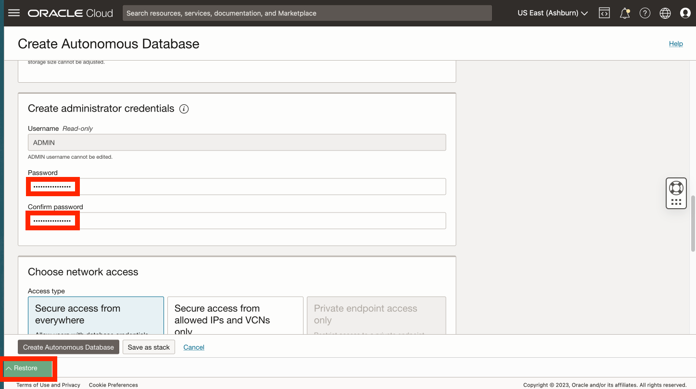
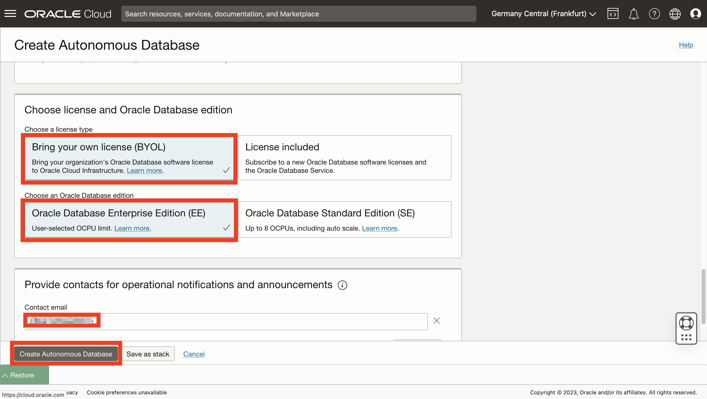

# Création d'Autonomous Database

## Présentation

Oracle Autonomous Database est un service de base de données doté de fonctions d'autopilotage, d'autosécurisation et d'autoréparation, y compris Oracle Spatial, avec des offres pour les charges de travail d'entreposage de données et de traitement des transactions. Vous n'avez pas besoin de configurer ou de gérer de matériel, ni d'installer de logiciel. Oracle Cloud Infrastructure gère la création de la base de données, ainsi que la sauvegarde, l'application de patches, la mise à niveau et le réglage de la base de données. Comme cet atelier se concentre sur un cas d'utilisation analytique, vous créez un entrepôt de date autonome (ADW).

Temps de laboratoire estimé : 5 minutes

### Objectifs

*   Création d'une instance Autonomous Database

### Prérequis

*   Achèvement du laboratoire 1 : Accès JupyterLab

## Tâche 1 : création d'Autonomous Database

1.  Dans le panneau de navigation principal, sélectionnez **Oracle Database**, puis **Autonomous Database**. 
    
2.  Votre compartiment doit toujours être sélectionné. Sinon, sélectionnez-le à nouveau. Cliquez ensuite sur **Create Autonomous Database**.
    

1.  Pour le nom d'affichage, entrez **my-adw** et pour le nom de base de données, entrez **myadw**. Conservez le type de charge globale Data Warehouse.
    
    **Remarque :** vous devez sélectionner le type de charge globale Data Warehouse. La sélection du traitement des transactions entraîne une erreur de quota.
    
    
    
2.  Pour le type de déploiement, conservez la valeur par défaut **Sans serveur**. Conservez également les valeurs par défaut pour la version (19c), le nombre d'ECPU (2) et le stockage (1 To). Ensuite, faites défiler vers le bas. 
    
3.  Entrez et confirmez le mot de passe de l'utilisateur ADMIN de la base de données. Ensuite, faites défiler vers le bas. 
    
4.  Dans l'exercice suivant, vous allez créer une connexion de Python à Autonomous Database à l'aide d'une méthode simple qui ne nécessite pas d'installation de client Oracle ou de portefeuille cloud. Pour utiliser cette méthode, vous devez préconfigurer votre instance Autonomous Database pour autoriser l'accès à partir de l'instance de calcul hébergeant Python. Pour l'accès réseau, sélectionnez **Accès sécurisé à partir des adresses IP et des réseaux cloud virtuels autorisés uniquement**. Sous Valeurs, entrez l'adresse IP de calcul de la tâche 1 de l'exercice 1. 
    
5.  Dans la section suivante, sélectionnez **Utiliser votre propre licence (BYOL)** et **Oracle Database Enterprise Edition (EE)**. Pour les contacts, saisissez votre adresse électronique. Cliquez ensuite sur **Create Autonomous Database**. 
    
6.  Le provisionnement ADB va commencer. 
    
7.  Une fois le provisionnement terminé, la base de données autonome est prête. 
    

## Tâche 2 : sélectionnez une option pour effectuer le reste de cet atelier pratique.

Le reste de cet atelier pratique peut être effectué à l'aide de l'une des options suivantes :

**Option 1 :** suivez les instructions permettant de copier/coller/exécuter chaque étape dans votre bloc-notes.

1.  Passez à l'**atelier 3**, puis aux exercices suivants.

**Option 2 :** chargez un bloc-notes prédéfini avec toutes les étapes et exécutez chaque cellule.

1.  Exécuter l'**atelier 3 - Tâche 1**
    
2.  Effectuez l'**exercice 4 - Tâche 1**.
    
3.  Cliquez sur le lien suivant pour télécharger le bloc-notes prédéfini sur votre ordinateur portable : \* [prebuit-notebook.ipynb](../access-jupyterlab/files/prebuilt-notebook.ipynb)
    
4.  Cliquez sur le bouton de téléchargement et sélectionnez le bloc-notes prédéfini.
    

     
    

5.  Double-cliquez sur le bloc-notes prédéfini pour l'ouvrir et exécuter chaque cellule.

     
    

## Accusés de réception

*   **Auteur** - David Lapp, Database Product Management, Oracle
*   **Contributeurs** - Rahul Tasker, Denise Myrick, Ramu Gutierrez
*   **Dernière mise à jour par/date** - David Lapp, août 2023