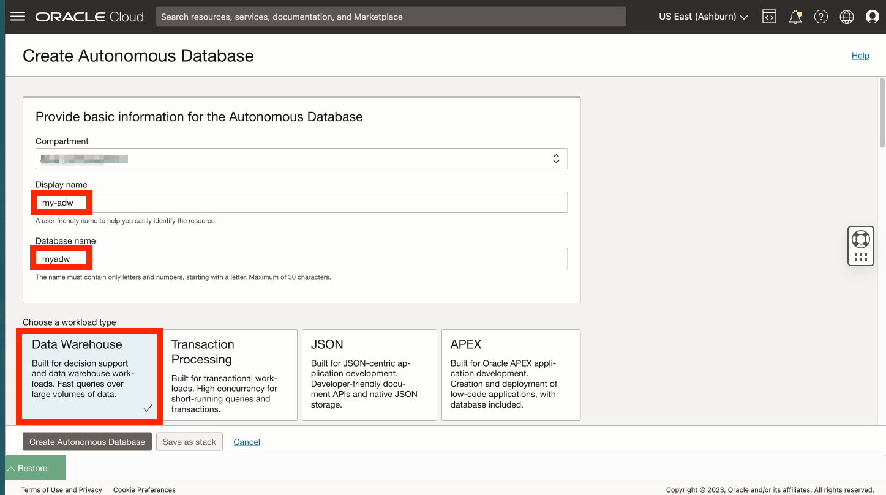

# Autonomous Databaseの作成

## 概要

Oracle Autonomous Databaseは、Oracle Spatialを含む自動運転、自己保護、自己修復のデータベース・サービスであり、データ・ウェアハウスおよびトランザクション処理のワークロードに対応しています。ハードウェアの構成や管理、ソフトウェアのインストールは不要です。Oracle Cloud Infrastructureは、データベースの作成、データベースのバックアップ、パッチ適用、アップグレードおよびチューニングを処理します。このワークショップでは、分析ユースケースに焦点を当てて、自律型日付ウェアハウス(ADW)を作成します。

推定ラボ時間: 5分

### 目標

*   Autonomous Databaseインスタンスの作成

### 前提条件

*   演習1の完了: アクセスJupyterLab

## タスク1: Autonomous Databaseの作成

1.  メイン・ナビゲーション・パネルから**「Oracle Database」**、**「Autonomous Database」**の順に選択します。 
    
2.  コンパートメントは引き続き選択する必要があります。そうでない場合は、再選択します。次に、**「Autonomous Databaseの作成」**をクリックします。
    

1.  表示名に**my-adw**と入力し、データベース名に**myadw**と入力します。ワークロード・タイプは「Data Warehouse」のままにします。
    
    **ノート:**ワークロード・タイプ「データ・ウェアハウス」を選択する必要があります。トランザクション処理を選択すると、割当エラーが発生します。
    
    
    
2.  デプロイメント・タイプの場合は、デフォルトの**「サーバーレス」**のままにします。バージョン(19c)、ECPU数(2)およびストレージ(1TB)のデフォルトも残します。次に下にスクロールします。 
    
3.  データベースADMINユーザーのパスワードを入力して確認します。次に下にスクロールします。 
    
4.  次の演習では、Oracle ClientインストールまたはCloud Walletを必要としない単純な方法を使用して、PythonからAutonomous Databaseへの接続を作成します。この方法を使用するには、Pythonをホストしているコンピュート・インスタンスからのアクセスを許可するようにAutonomous Databaseを事前構成する必要があります。ネットワーク・アクセスの場合は、**「許可されたIPおよびVCNからのセキュア・アクセスのみ」**を選択します。「値」に、演習1タスク1のコンピュートIPアドレスを入力します。 
    
5.  次のセクションで、**「ライセンス持込み(BYOL)」**および**「Oracle Database Enterprise Edition (EE)」**を選択します。担当者の場合は、電子メールアドレスを入力します。次に、**「Autonomous Databaseの作成」**をクリックします。 
    
6.  ADBプロビジョニングが開始されます。 
    
7.  プロビジョニングが完了すると、ADBの準備が整います。 
    

## タスク2: このハンズオン・ラボの残りの部分を実行するオプションの選択

このハンズオン・ラボの残りの部分は、次のいずれかのオプションを使用して実行できます。

**オプション1:**手順に従って、各ステップをノートブックにコピー/貼付け/実行します。

1.  **ラボ3**に進み、後続のラボに進みます。

**オプション2:**すべてのステップを含む事前作成済のノートブックをロードし、各セルを実行します。

1.  **ラボ3 - タスク1**の実行
    
2.  **ラボ4 - タスク1**を実行します。
    
3.  次のリンクをクリックして、事前に作成されたノートブックをラップトップにダウンロードします。\* [prebuit-notebook.ipynb](../access-jupyterlab/files/prebuilt-notebook.ipynb)
    
4.  アップロード・ボタンをクリックし、組込みノートブックを選択します。
    

     
    

5.  事前作成済のノートブックをダブルクリックして開き、各セルを実行します。

     
    

## 謝辞

*   **著者** - Oracle、データベース製品管理、David Lapp氏
*   **コントリビュータ** - Rahul Tasker、Denise Myrick、Ramu Gutierrez
*   **最終更新者/日付** - David Lapp、2023年8月