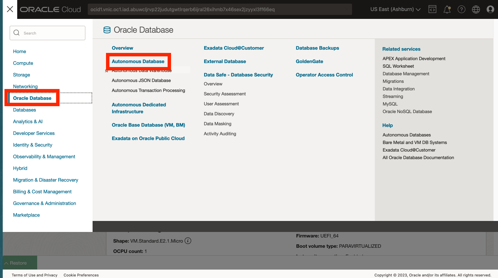
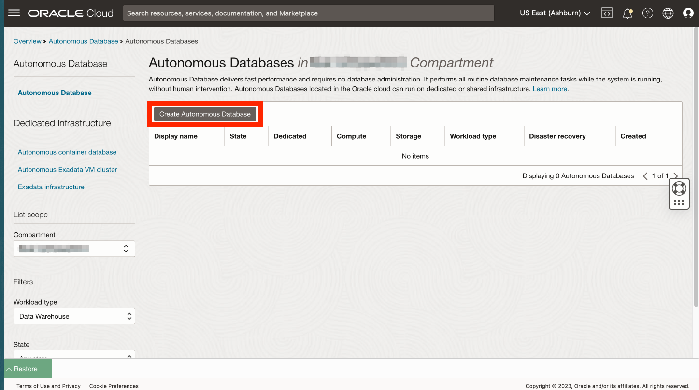
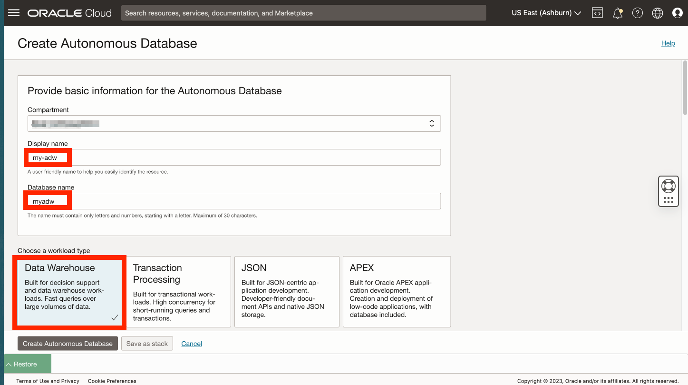
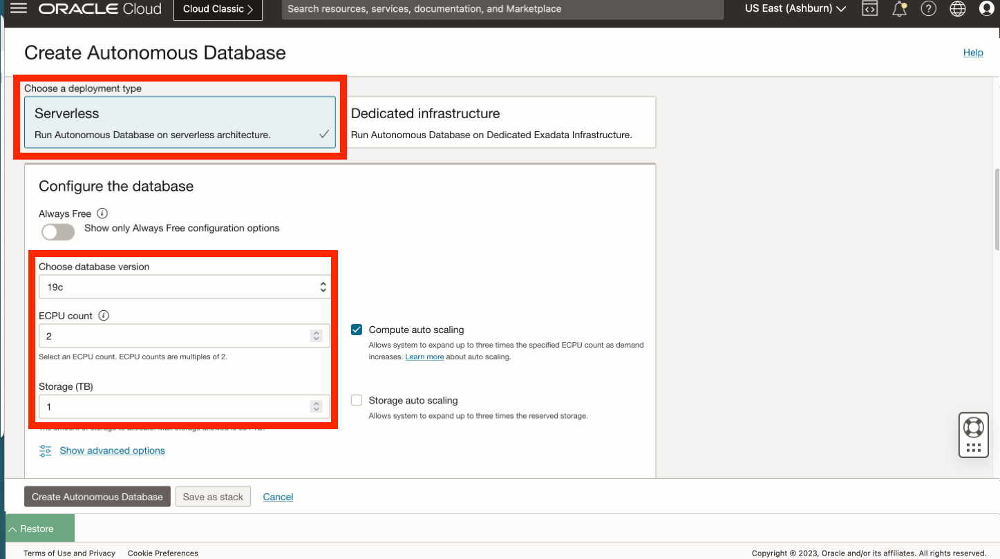
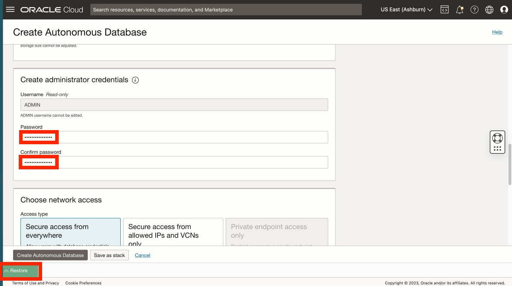
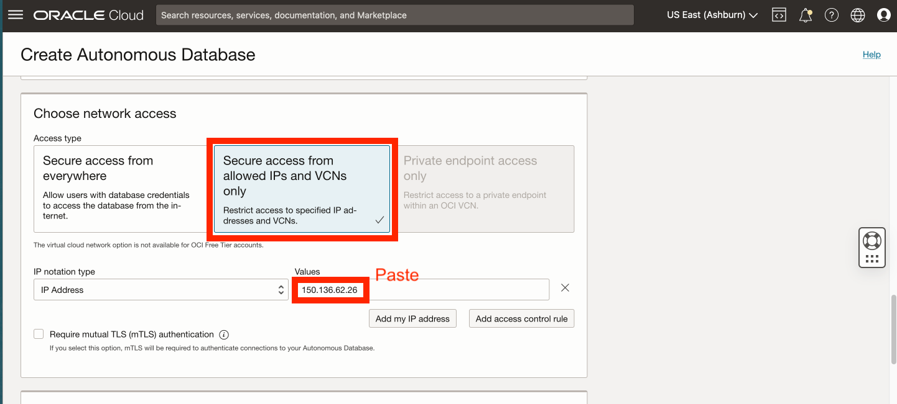
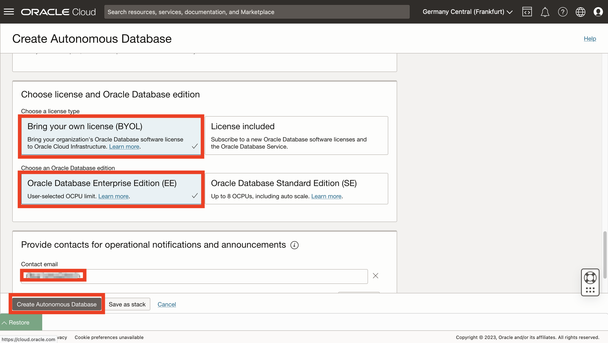
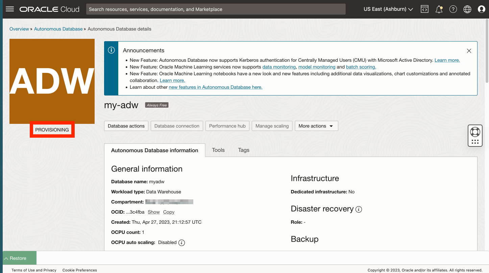
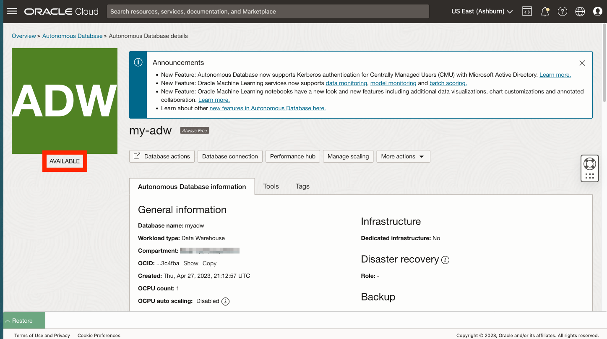

# Autonomous Database 생성

## 소개

Oracle Autonomous Database는 데이터 웨어하우징 및 트랜잭션 처리 워크로드를 위한 오퍼링을 갖춘 Oracle Spatial을 비롯한 자율 구동, 자가 보안, 자가 복구 데이터베이스 서비스입니다. 하드웨어를 구성 또는 관리하거나 소프트웨어를 설치할 필요가 없습니다. Oracle Cloud Infrastructure는 데이터베이스 생성은 물론 데이터베이스 백업, 패치, 업그레이드 및 튜닝을 처리합니다. 이 워크샵에서는 분석 사용 사례를 중점적으로 다루므로 ADW(자율 날짜 웨어하우스)를 생성합니다.

예상 실험 시간: 5분

### 목표

*   Autonomous Database 인스턴스 생성

### 필요 조건

*   실습 1 완료: 액세스 JupyterLab

## 작업 1: Autonomous Database 생성

1.  기본 탐색 패널에서 **Oracle Database**, **Autonomous Database** 순으로 선택합니다. 
    
2.  컴파트먼트를 선택해도 됩니다. 그렇지 않으면 다시 선택합니다. 그런 다음 **Autonomous Database 생성**을 누릅니다.
    

1.  표시 이름에 **my-adw**를 입력하고 데이터베이스 이름에 **myadw**를 입력합니다. 작업 로드 유형은 Data Warehouse로 둡니다.
    
    **주:** 작업 로드 유형 데이터 웨어하우스를 선택해야 합니다. 트랜잭션 처리를 선택하면 할당량 오류가 발생합니다.
    
    
    
2.  배포 유형의 경우 기본 **서버리스**를 그대로 사용합니다. 버전(19c), ECPU 수(2) 및 스토리지(1TB)의 기본값도 그대로 둡니다. 그런 다음 아래로 스크롤합니다. 
    
3.  데이터베이스 ADMIN 사용자에 대한 비밀번호를 입력하고 확인합니다. 그런 다음 아래로 스크롤합니다. 
    
4.  다음 실습에서는 Oracle Client 설치 또는 Cloud Wallet이 필요하지 않은 간단한 방법을 사용하여 Python에서 Autonomous Database로의 연결을 생성합니다. 이 방법을 사용하려면 Python을 호스팅하는 컴퓨트 인스턴스에서 액세스할 수 있도록 Autonomous Database를 미리 구성해야 합니다. 네트워크 액세스의 경우 **허용된 IP 및 VCN에서만 보안 액세스**를 선택합니다. Values에 Lab 1 Task 1의 compute IP 주소를 입력합니다. 
    
5.  다음 섹션에서 **BYOL(자체 라이센스 적용)** 및 **EE(Oracle Database Enterprise Edition)**를 선택합니다. 연락처의 경우 전자메일 주소를 입력합니다. 그런 다음 **Autonomous Database 생성**을 누릅니다. 
    
6.  ADB 프로비저닝이 시작됩니다. 
    
7.  프로비저닝이 완료되면 ADB가 준비됩니다. 
    

## 작업 2: 이 실습의 나머지 부분을 수행하기 위한 옵션 선택

이 실습의 나머지 부분에서는 다음 옵션 중 하나를 사용하여 수행할 수 있습니다.

**옵션 1:** 지침에 따라 각 단계를 노트북에 복사/붙여넣기/실행합니다.

1.  **Lab 3** 및 이후 실습으로 이동합니다.

**옵션 2:** 모든 단계로 사전 구축된 노트북을 로드하고 각 셀을 실행합니다.

1.  **랩 3 - 작업 1** 수행
    
2.  **Lab 4 - Task 1**을 수행합니다.
    
3.  다음 링크를 눌러 노트북에 미리 빌드된 노트북을 다운로드합니다. \* [prebuit-notebook.ipynb](../access-jupyterlab/files/prebuilt-notebook.ipynb)
    
4.  업로드 단추를 클릭하고 사전 제작 노트북을 선택합니다.
    

     
    

5.  기본 노트북을 두 번 클릭하여 열고 각 셀을 실행합니다.

     
    

## 확인

*   **작성자** - David Lapp, Oracle 데이터베이스 제품 관리
*   **제공자** - Rahul Tasker, Denise Myrick, Ramu Gutierrez
*   **최종 업데이트 수행자/날짜** - David Lapp, 2023년 8월