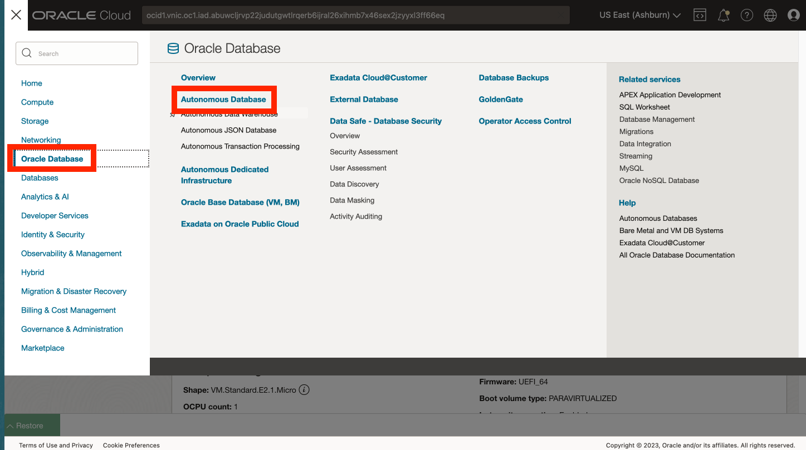

# Criar Autonomous Database

## Introdução

O Oracle Autonomous Database é um serviço de banco de dados independente, com autoproteção e autorreparo, incluindo o Oracle Spatial, com ofertas para data warehousing e cargas de trabalho de processamento de transações. Não é necessário configurar nem gerenciar nenhum hardware nem instalar nenhum software. O Oracle Cloud Infrastructure trata da criação do banco de dados, bem como do backup, da aplicação de patches, do upgrade e do ajuste do banco de dados. Como este workshop se concentra em um caso de uso analítico, você cria um ADW (Autonomous Date Warehouse).

Tempo de Laboratório Estimado: 5 minutos

### Objetivos

*   Criar uma instância do Autonomous Database

### Pré-requisitos

*   Conclusão do Laboratório 1: Acesse JupyterLab

## Tarefa 1: Criar Autonomous Database

1.  No painel de navegação principal, selecione **Oracle Database** e, em seguida, **Autonomous Database**. 
    
2.  Seu Compartimento ainda deve ser selecionado. Caso contrário, selecione-o novamente. Em seguida, clique em **Criar Autonomous Database**.
    

1.  Para o nome de exibição, digite **my-adw** e, para o nome do banco de dados, digite **myadw**. Deixe o tipo de carga de trabalho como Data Warehouse.
    
    **Observação:** selecione o tipo de carga de trabalho Data Warehouse. Selecionar Processamento de transação resultará em um erro de cota.
    
    
    
2.  Para o tipo de implantação, deixe o padrão **Sem Servidor**. Também deixe os padrões para versão (19c), contagem de ECPU (2) e armazenamento (1TB). Em seguida, role para baixo. 
    
3.  Informe e confirme uma senha para o usuário ADMIN do banco de dados. Em seguida, role para baixo. 
    
4.  No próximo laboratório, você criará uma conexão do Python para o Autonomous Database usando um método simples que não requer uma instalação do Oracle Client ou uma Cloud Wallet. Para usar esse método, pré-configure seu Autonomous Database para permitir o acesso da instância de computação que hospeda o Python. Para acesso à rede, selecione **Acesso seguro somente de IPs e VCNs permitidos**. Em Valores, insira o endereço IP de computação do Laboratório 1 Tarefa 1. 
    
5.  Na próxima seção, selecione **Traga sua própria licença (BYOL)** e **Oracle Database Enterprise Edition (EE)**. Para contatos, informe seu endereço de e-mail. Em seguida, clique em **Criar Autonomous Database**. 
    
6.  O provisionamento do ADB será iniciado. 
    
7.  Quando o provisionamento estiver concluído, seu ADB estará pronto. 
    

## Tarefa 2: Selecionar opção para executar o restante deste laboratório prático

O restante desse laboratório prático pode ser executado usando uma das seguintes opções:

**Opção 1:** Siga as instruções para copiar/colar/executar cada etapa no notebook.

1.  Prossiga para o **Laboratório 3** e, em seguida, para os laboratórios subsequentes.

**Opção 2:** Carregue um notebook pré-criado com todas as etapas e execute cada célula.

1.  Executar **Laboratório 3 - Tarefa 1**
    
2.  Execute **Laboratório 4 - Tarefa 1**.
    
3.  Clique no seguinte link para fazer download do notebook pré-criado para seu laptop: \* [prebuit-notebook.ipynb](../access-jupyterlab/files/prebuilt-notebook.ipynb)
    
4.  Clique no botão de upload e selecione o notebook pré-criado.
    

     
    

5.  Clique duas vezes no notebook pré-criado para abri-lo e executar cada célula.

     
    

## Agradecimentos

*   **Autor** - David Lapp, Database Product Management, Oracle
*   **Colaboradores** - Rahul Tasker, Denise Myrick, Ramu Gutierrez
*   **Última Atualização em/Data** - David Lapp, agosto de 2023