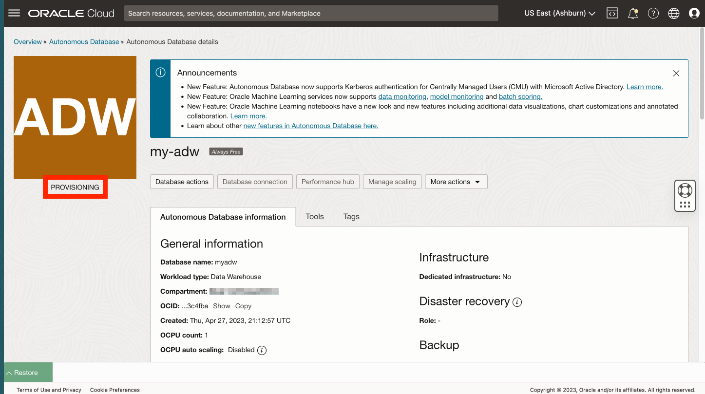

# 创建 Autonomous Database

## 简介

Oracle Autonomous Database 是一个自治驱动、自我保护和自我修复的数据库服务，包括 Oracle Spatial，提供数据仓库和事务处理工作负载产品。您无需配置或管理任何硬件，也不需要安装任何软件。Oracle Cloud Infrastructure 负责数据库创建以及数据库备份、打补丁、升级和调优。本研讨会将重点介绍分析用例，因此您将创建自治日期仓库 (Autonomous Date Warehouse，ADW)。

估计的实验室时间：5 分钟

### 目标

*   创建 Autonomous Database 实例

### 先备条件

*   完成实验室 1：访问 JupyterLab

## 任务 1：创建 Autonomous Database

1.  从主导航面板中，选择 **Oracle Database** ，然后选择 **Autonomous Database** 。 
    
2.  仍应选择您的区间。如果没有，则重新选择。然后单击**创建 Autonomous Database** 。
    

1.  对于显示名称，输入 **my-adw** ，对于数据库名称，输入 **myadw** 。将工作量类型保留为数据仓库。
    
    **注：**您必须选择工作量类型“数据仓库”。选择“事务处理”将导致配额错误。
    
    
    
2.  对于部署类型，保留默认的 **Serverless（无服务器）**。此外，还保留版本 (19c)、ECPU 计数 (2) 和存储 (1TB) 的默认值。然后向下滚动。 
    
3.  输入并确认数据库 ADMIN 用户的密码。然后向下滚动。 
    
4.  在下一个练习中，您将使用不需要安装 Oracle Client 或 Cloud Wallet 的简单方法创建从 Python 到 Autonomous Database 的连接。要使用此方法，您必须预配置 Autonomous Database，以允许从托管 Python 的计算实例进行访问。对于网络访问，请选择**仅从允许的 IP 和 VCN 进行安全访问**。在“Value（值）”下，输入实验 1 任务 1 中的计算 IP 地址。 
    
5.  在下一部分中，选择**自带许可证 (BYOL)** 和 **Oracle Database Enterprise Edition (EE)** 。对于联系人，请输入您的电子邮件地址。然后单击**创建 Autonomous Database** 。 
    
6.  ADB 预配将开始。 
    
7.  预配完成时，您的 ADB 已就绪。 
    

## 任务 2：选择用于执行此上机操作实验室剩余部分的选项

此上机操作实验室的其余部分可以使用以下任一选项执行：

**选项 1：**按照说明将每个步骤复制/粘贴/运行到记事本中。

1.  转至**实验室 3** ，然后转到后续实验室。

**选项 2：**加载包含所有步骤的预构建记事本并运行每个单元格。

1.  执行**练习 3 - 任务 1**
    
2.  执行**练习 4 - 任务 1** 。
    
3.  单击以下链接可将预构建的笔记本电脑下载到笔记本电脑：\* [prebuit-notebook.ipynb](../access-jupyterlab/files/prebuilt-notebook.ipynb)
    
4.  单击上载按钮并选择预构建的记事本。
    

     
    

5.  双击预制笔记本以打开它并运行每个单元。

     
    

## 确认

*   **作者** - David Lapp，Oracle 数据库产品管理
*   **贡献者** - Rahul Tasker、Denise Myrick、Ramu Gutierrez
*   **上次更新者/日期** - David Lapp，2023 年 8 月