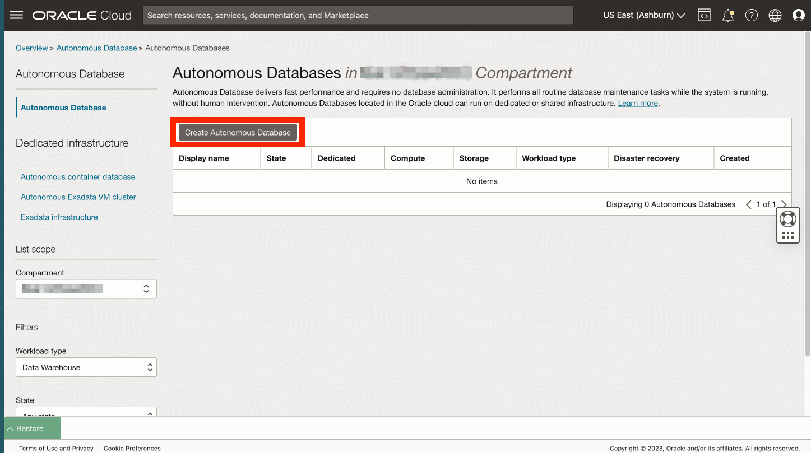

# 建立 Autonomous Database

## 簡介

Oracle Autonomous Database 是一種自我驅動、自我保護、自我修復的資料庫服務 (包括 Oracle Spatial)，提供資料倉儲和交易處理工作負載的方案。您不需要設定或管理任何硬體，或是安裝任何軟體。Oracle Cloud Infrastructure 可處理建立資料庫，以及備份、打補丁、升級及調整資料庫。由於此研討會著重在分析使用案例，因此您建立了自治式日期倉儲 (ADW)。

預估實驗室時間：5 分鐘

### 目標

*   建立 Autonomous Database 執行處理

### 先決條件

*   完成實驗室 1：存取 JupyterLab

## 作業 1：建立 Autonomous Database

1.  從主導覽面板中，選取 **Oracle Database** ，然後選取 **Autonomous Database** 。 
    
2.  您仍然應該選取區間。如果不是，請重新選取。然後按一下**建立 Autonomous Database** 。
    

1.  如需顯示名稱，請輸入 **my-adw** ，如果是資料庫名稱，請輸入 **myadw** 。將工作負載類型保留為資料倉儲。
    
    **注意：**您必須選取工作負載類型「資料倉儲」。選取「交易處理」會導致配額錯誤。
    
    
    
2.  對於部署類型，請保留預設**無伺服器**。此外，請保留版本 (19c)、ECPU 數目 (2) 以及儲存體 (1TB) 的預設值。然後向下捲動。 
    
3.  輸入並確認資料庫 ADMIN 使用者的密碼。然後向下捲動。 
    
4.  在下一個實驗室中，您將使用不需要 Oracle 用戶端安裝或雲端公事包的簡單方法，建立從 Python 到 Autonomous Database 的連線。若要使用此方法，您必須預先設定 Autonomous Database，以允許從代管 Python 的運算執行處理進行存取。若為網路存取，請選取**僅從允許的 IP 和 VCN 存取安全**。在「值」底下，輸入 Lab 1 Task 1 的運算 IP 位址。 
    
5.  在下一節中，選取**自備授權 (BYOL)** 與 **Oracle Database Enterprise Edition (EE)** 。若為聯絡人，請輸入您的電子郵件地址。然後按一下**建立 Autonomous Database** 。 
    
6.  將會開始佈建 ADB。 
    
7.  佈建完成後，您的 ADB 已就緒。 
    

## 任務 2：選取執行本實機操作實驗室的其餘部分選項

本實作實驗室的其餘部分可以使用下列其中一個選項執行：

**選項 1：**遵循指示，將每個步驟複製 / 貼上 / 執行到記事本中。

1.  繼續前往**實驗室 3** ，然後進行後續的實驗室。

**選項 2：**載入含有所有步驟的預先建置記事本，然後執行每個儲存格。

1.  執行**實驗室 3 - 作業 1**
    
2.  執行**實驗室 4 - 作業 1** 。
    
3.  按一下以下連結，將預先建置的筆記本下載至您的筆記型電腦：\* [prebuit-notebook.ipynb](../access-jupyterlab/files/prebuilt-notebook.ipynb)
    
4.  按一下「上傳」按鈕，然後選取預建的記事本。
    

     
    

5.  按兩下預建的筆記本以開啟並執行每個儲存格。

     
    

## 確認

*   **作者** - Oracle 資料庫產品管理 David Lapp
*   **貢獻者** - Rahul Tasker，Denise Myrick，Ramu Gutierrez
*   **上次更新者 / 日期** - David Lapp，2023 年 8 月