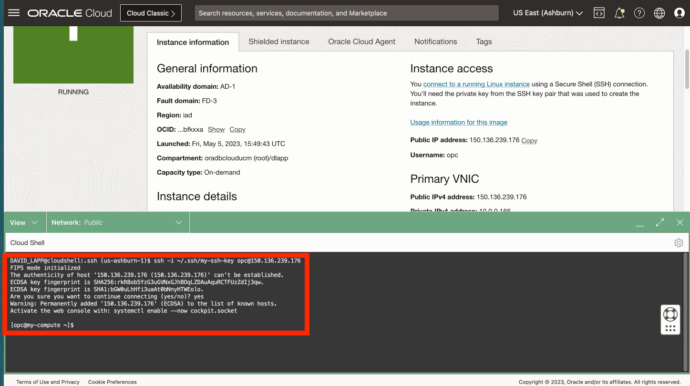
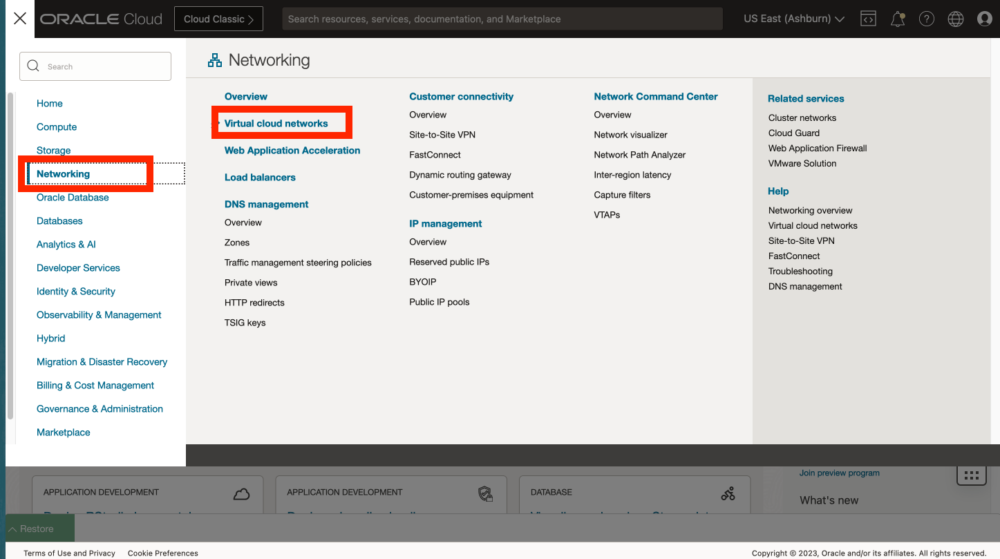
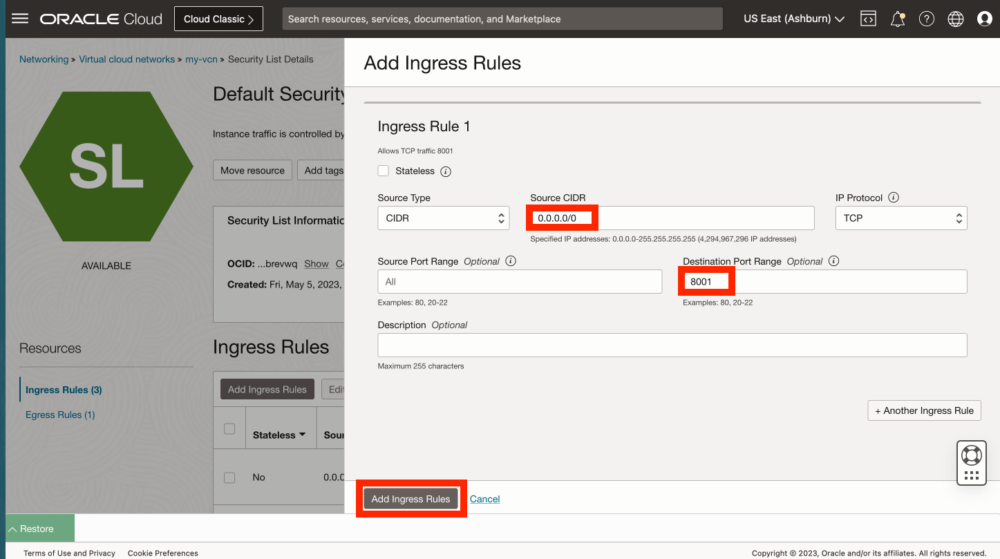

# Compute-Instanz aus benutzerdefiniertem Image erstellen

## Einführung

Ein Compute-Image wurde vorab mit konfiguriertem Python erstellt. In dieser Übung erstellen Sie eine Compute-Instanz aus diesem Image.

Geschätzte Laborzeit: xx Minuten

### Ziele

*   Erstellen Sie eine Compute-Instanz aus einem benutzerdefinierten Image mit vorkonfiguriertem Python.

### Voraussetzungen

*   Abschluss der vorherigen Übung (Erstellen von SSH-Schlüsseln in Cloud Shell)

## Aufgabe 1: Compute-Instanz erstellen

1.  Navigieren Sie zu Compute > Instances. 
    
2.  Klicken Sie auf **Instanz erstellen** 
    
3.  Geben Sie einen Namen wie **my-compute** ein, oder übernehmen Sie den Standardwert. Wählen Sie ein Compartment aus, wenn Sie eines erstellt haben, oder übernehmen Sie den Standardwert (Root). Klicken Sie dann im Platzierungsabschnitt auf **Bearbeiten**. 
    
4.  If you plan to use Always Free resources, then select the availability domain that offers the **VM.Standard.E2.1.Micro** shape. 
    
5.  Scrollen Sie nach unten zum Abschnitt **Image und Ausprägung**, und klicken Sie auf **Bearbeiten**. 
    
6.  Klicken Sie auf **Image ändern**. 
    
7.  Wählen Sie **Meine Images** und **Image-OCID** aus 
    
8.  Kopieren Sie die folgende OCID, fügen Sie sie in das Feld "Image-OCID" ein, und klicken Sie auf **Image auswählen**.
    
        <copy>
         ocid1.image.oc1..aaaaaaaan727cclmzfl2evanaacnganaeobmv6hvakjzqdsk4gncmcklcxha
        </copy>
        
    
    
    
9.  Scrollen Sie nach unten zum Abschnitt "Networking", und klicken Sie auf **Bearbeiten**. 
    
10.  Wenn Sie ein vorhandenes Netzwerk haben, können Sie es verwenden. Wählen Sie andernfalls **Neues virtuelles Cloud-Netzwerk erstellen** aus. Geben Sie für Namen **my-vcn** und **my-subnet** ein, oder übernehmen Sie die Standardwerte. Wählen Sie ein Compartment aus, wenn Sie eines erstellt haben, oder übernehmen Sie den Standardwert (Root). Bestätigen Sie unter der öffentlichen Adresse IPv4, dass **Öffentliche IPv4-Adresse zuweisen** ausgewählt ist. 
    
11.  Scrollen Sie nach unten zum Abschnitt **SSH-Schlüssel hinzufügen**, wählen Sie **Public Key einfügen** aus, und klicken Sie auf **Wiederherstellen**, um die Cloud Shell einzublenden. 
    
12.  Der letzte in Cloud Shell ausgeführte Befehl hat den Public Key gedruckt. Kopieren Sie den Public Key aus Cloud Shell, und fügen Sie ihn im Dialogfeld "Compute-Instanz erstellen" in das Feld "SSH-Schlüssel" ein. Blenden Sie dann die Cloud Shell aus. 
    
13.  Klicken Sie auf **Erstellen**. 
    
14.  Wenn das Provisioning abgeschlossen ist, kopieren Sie die öffentliche IP-Adresse der Compute-Instanz, und stellen Sie Cloud Shell wieder her. 
    
15.  Geben Sie den folgenden Befehl in Cloud Shell ein, um eine Verbindung zu Ihrer Compute-Instanz herzustellen. Dort können Sie "\[IP address\]" einfügen, das im vorherigen Schritt kopiert wurde.
    
        <copy>
         ssh -i ~/.ssh/my-ssh-key opc@[IP address]
        </copy>
        
    
    Wenn Sie aufgefordert werden, der Liste der bekannten Hosts hinzuzufügen, antworten Sie mit **yes**. 
    

Ihre Compute-Instanz wurde erstellt, und Sie haben den SSH-Zugriff geprüft.

## Aufgabe 2: Netzwerkport 8001 öffnen

1.  Wählen Sie im Hauptnavigationsbereich die Option **Networking**. Wählen Sie dann **Virtuelle Cloud-Netzwerke** aus. 
    
2.  Klicken Sie auf das in der vorherigen Aufgabe erstellte VCN. 
    
3.  Scrollen Sie nach unten, und klicken Sie links auf **Sicherheitslisten**. Klicken Sie dann auf **Standardsicherheitsliste für my-vcn**. 
    
4.  Klicken Sie auf **Ingress-Regeln hinzufügen**. 
    
5.  Geben Sie für das Quell-CIDR **0.0.0.0/0** ein. Geben Sie unter "Zielportbereich" **8001** ein. Klicken Sie dann auf **Ingress-Regel hinzufügen**. 
    
6.  Scrollen Sie nach unten, und beobachten Sie die neue Ingress-Regel, die eingehenden Zugriff auf Port 8001 ermöglicht. 
    

Sie können jetzt **mit der nächsten Übung fortfahren**.

## Danksagungen

*   **Autor** - David Lapp, Database Product Management, Oracle
*   **Zuletzt aktualisiert am/um** - David Lapp, Database Product Management, Juni 2023