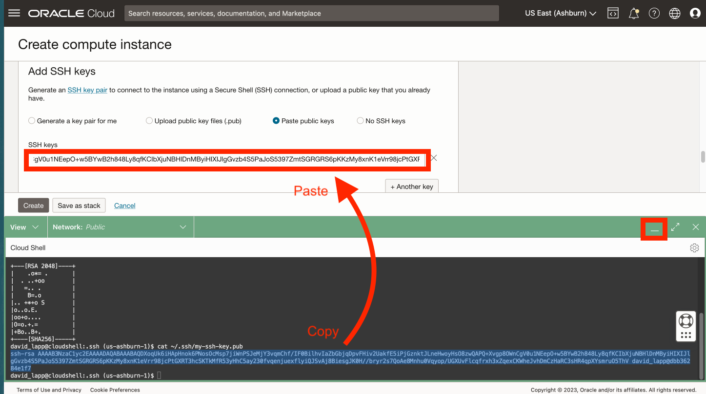

# Crear instancia informática a partir de una imagen personalizada

## Introducción

Se ha creado previamente una imagen informática con Python configurado. En este laboratorio, creará una instancia informática a partir de esa imagen.

Tiempo de laboratorio estimado: xx minutos

### Objetivos

*   Cree una instancia informática a partir de una imagen personalizada con Python preconfigurada.

### Requisitos

*   Finalización del laboratorio anterior (creación de claves SSH en Cloud Shell)

## Tarea 1: Crear una instancia informática

1.  Vaya a Compute > Instances. 
    
2.  Haga clic en **Crear Instancia**. 
    
3.  Introduzca un nombre como **my-compute** o puede dejar el nombre por defecto. Seleccione un compartimento si ha creado uno o deje el valor por defecto (raíz). A continuación, en la sección de colocación, haga clic en **Editar**. 
    
4.  Si planea utilizar recursos Siempre gratis, seleccione el dominio de disponibilidad que ofrece **VM.Standard.E2.1. Unidad de micro**. 
    
5.  Desplácese hacia abajo hasta la sección **Imagen y unidad** y haga clic en **Editar**. 
    
6.  Haga clic en **Cambiar imagen**. 
    
7.  Seleccione **Mis imágenes** y **OCID de imagen** 
    
8.  Copie el OCID siguiente, péguelo en el campo OCID de imagen y haga clic en **Seleccionar imagen**.
    
        <copy>
         ocid1.image.oc1..aaaaaaaan727cclmzfl2evanaacnganaeobmv6hvakjzqdsk4gncmcklcxha
        </copy>
        
    
    
    
9.  Desplácese hacia abajo hasta la sección Networking y haga clic en **Edit** (Editar). 
    
10.  Si tiene una red existente, puede utilizarla. De lo contrario, seleccione **Crear nueva red virtual en la nube**. Para los nombres, introduzca **my-vcn** y **my-subnet**, o puede dejar los valores predeterminados. Seleccione un compartimento si ha creado uno o deje el valor por defecto (raíz). En Public IPv4 address, confirme que **Assign a public IPv4 address** esté seleccionada. 
    
11.  Desplácese hacia abajo hasta la **sección Agregar claves SSH**, seleccione **Pegar clave pública** y, a continuación, haga clic en **Restaurar** para ampliar Cloud Shell. 
    
12.  El último comando que ejecutó en Cloud Shell imprimió su clave pública. Copie la clave pública de Cloud Shell y péguela en el campo Claves SSH del cuadro de diálogo Crear instancia informática. A continuación, reduzca Cloud Shell. 
    
13.  Haga clic en **Crear**. 
    
14.  Una vez completado el aprovisionamiento, copie la dirección IP pública de la instancia informática y restaure Cloud Shell. 
    
15.  Introduzca el siguiente comando en Cloud Shell para conectarse a su instancia informática, donde puede pegar "\[dirección IP\]" que se copió en el paso anterior.
    
        <copy>
         ssh -i ~/.ssh/my-ssh-key opc@[IP address]
        </copy>
        
    
    Cuando se le solicite que agregue a la lista de hosts conocidos, responda con **yes**. 
    

Se ha creado la instancia informática y ha verificado el acceso SSH.

## Tarea 2: Abrir puerto de red 8001

1.  En el panel de navegación principal, seleccione **Networking** (Redes). A continuación, seleccione **Redes virtuales en la nube**. 
    
2.  Haga clic en la VCN creada en la tarea anterior. 
    
3.  Desplácese hacia abajo y haga clic en **Listas de seguridad** a la izquierda y, a continuación, haga clic en **Lista de seguridad por defecto para my-vcn**. 
    
4.  Haga clic en **Agregar reglas de entrada**. 
    
5.  En Source CIDR, introduzca **0.0.0.0/0**. En Destination Port Range, introduzca **8001**. A continuación, haga clic en **Agregar regla de entrada**. 
    
6.  Desplácese hacia abajo y observe la nueva regla de entrada que permite el acceso entrante al puerto 8001. 
    

Ahora puede **proceder al siguiente laboratorio**.

## Reconocimientos

*   **Autor**: David Lapp, Database Product Management, Oracle
*   **Última actualización por/fecha**: David Lapp, Database Product Management, junio de 2023