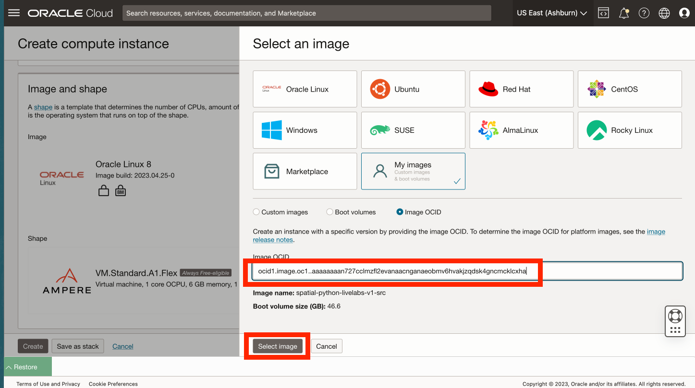
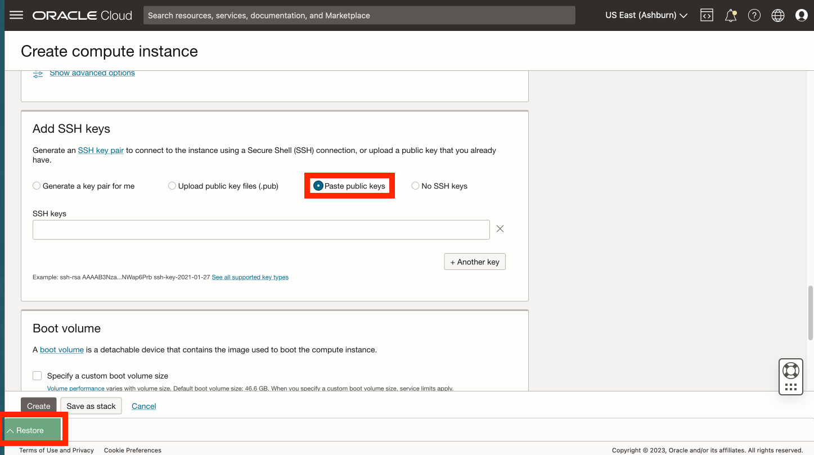
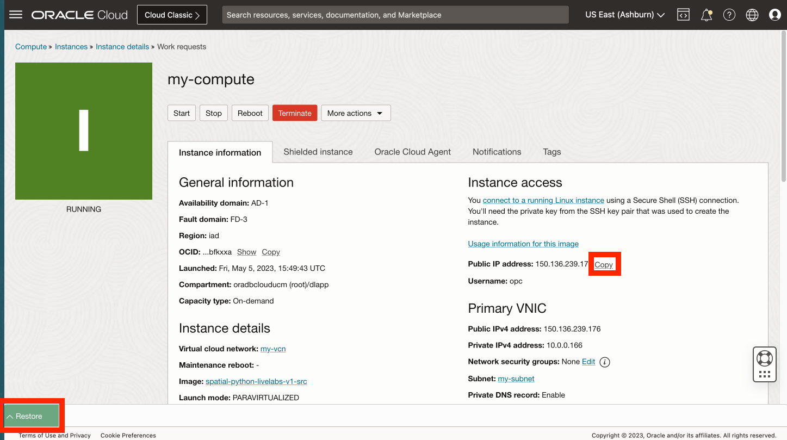
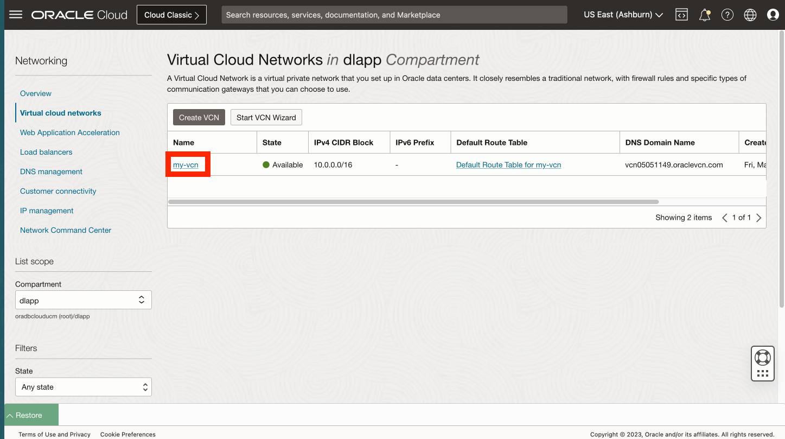

# Créer une instance de calcul à partir d'une image personnalisée

## Présentation

Une image de calcul a été créée au préalable avec Python configuré. Dans cet exercice, vous allez créer une instance de calcul à partir de cette image.

Durée estimée du laboratoire : xx minutes

### Objectifs

*   Créez une instance de calcul à partir d'une image personnalisée avec Python préconfiguré.

### Prérequis

*   Fin de l'exercice précédent (création de clés SSH dans Cloud Shell)

## Tâche 1 : créer une instance de calcul

1.  Accédez à Compute > Instances. 
    
2.  Cliquez sur **Créer une instance**. 
    
3.  Entrez un nom tel que **my-compute**, ou vous pouvez laisser la valeur par défaut. Sélectionnez un compartiment si vous en avez créé un ou conservez la valeur par défaut (racine). Ensuite, dans la section de placement, cliquez sur **Modifier**. 
    
4.  Si vous prévoyez d'utiliser des ressources Toujours gratuit, sélectionnez le domaine de disponibilité qui propose **VM.Standard.E2.1. Forme micro**. 
    
5.  Faites défiler la page jusqu'à la section **Image et forme**, puis cliquez sur **Modifier**. 
    
6.  Cliquez sur **Modifier l'image**. 
    
7.  Sélectionnez **Mes images** et **OCID d'image**. 
    
8.  Copiez l'OCID ci-dessous, collez-le dans le champ OCID d'image et cliquez sur **Sélectionner une image**.
    
        <copy>
         ocid1.image.oc1..aaaaaaaan727cclmzfl2evanaacnganaeobmv6hvakjzqdsk4gncmcklcxha
        </copy>
        
    
    
    
9.  Faites défiler la page jusqu'à la section Networking et cliquez sur **Edit**. 
    
10.  Si vous avez un réseau existant, vous pouvez l'utiliser. Sinon, sélectionnez **Créer un réseau cloud virtuel**. Pour les noms, saisissez **my-vcn** et **my-subnet**, ou vous pouvez laisser les valeurs par défaut. Sélectionnez un compartiment si vous en avez créé un ou conservez la valeur par défaut (racine). Sous Adresse IPv4 publique, vérifiez que l'option **Affecter une adresse IPv4 publique** est sélectionnée. 
    
11.  Faites défiler la page jusqu'à la **section Ajouter des clés SSH**, sélectionnez **Coller la clé publique**, puis cliquez sur **Restaurer** pour développer Cloud Shell. 
    
12.  La dernière commande exécutée dans Cloud Shell a imprimé votre clé publique. Copiez la clé publique à partir de Cloud Shell et collez-la dans le champ Clés SSH de la boîte de dialogue Créer une instance de calcul. Réduisez ensuite Cloud Shell. 
    
13.  Cliquez sur **Créer**. 
    
14.  Une fois le provisionnement terminé, copiez l'adresse IP publique de l'instance de calcul et restaurez Cloud Shell. 
    
15.  Entrez la commande suivante dans Cloud Shell pour vous connecter à votre instance de calcul, où vous pouvez coller "\[adresse IP\]" qui a été copiée à l'étape précédente.
    
        <copy>
         ssh -i ~/.ssh/my-ssh-key opc@[IP address]
        </copy>
        
    
    Lorsque vous êtes invité à ajouter des hôtes à la liste des hôtes connus, répondez **yes**. 
    

Votre instance de calcul est créée et vous avez vérifié l'accès SSH.

## Tâche 2 : port réseau ouvert 8001

1.  Dans le panneau de navigation principal, sélectionnez **Networking**. Sélectionnez ensuite **Réseaux cloud virtuels**. 
    
2.  Cliquez sur le VCN créé dans la tâche précédente. 
    
3.  Faites défiler la page vers le bas et cliquez sur **Listes de sécurité** à gauche, puis cliquez sur **Liste de sécurité par défaut pour my-vcn**. 
    
4.  Cliquez sur **Add Ingress Rules**. 
    
5.  Pour le CIDR source, entrez **0.0.0.0/0**. Pour Destination Port Range, entrez **8001**. Cliquez ensuite sur **Ajouter une règle entrante**. 
    
6.  Faites défiler l'affichage vers le bas et observez la nouvelle règle entrante autorisant l'accès entrant au port 8001. 
    

Vous pouvez maintenant **passer à l'exercice suivant**.

## Accusés de réception

*   **Auteur** - David Lapp, Database Product Management, Oracle
*   **Dernière mise à jour par/date** - David Lapp, Database Product Management, juin 2023