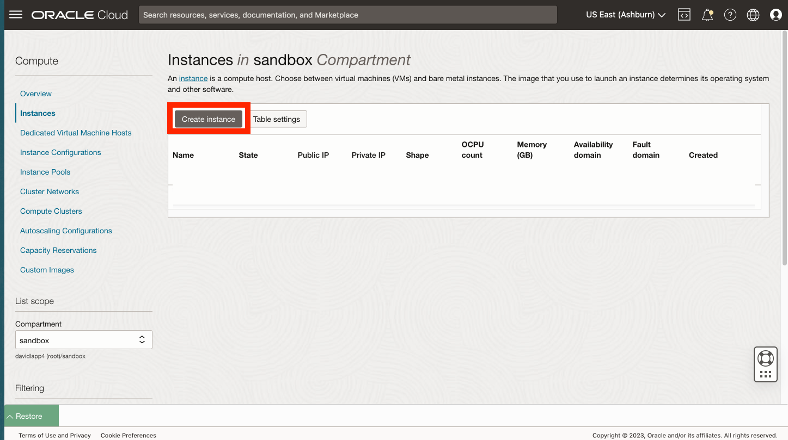
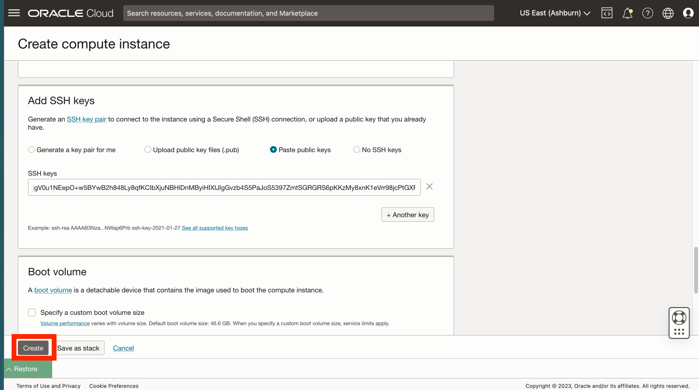
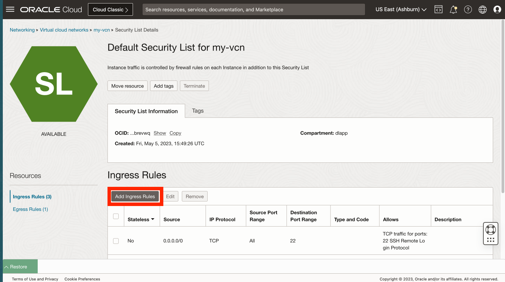
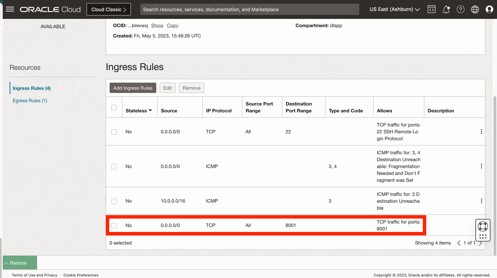

# カスタム・イメージからのコンピュート・インスタンスの作成

## 概要

コンピュート・イメージは、Pythonが構成された状態で事前に作成されています。この演習では、そのイメージからコンピュート・インスタンスを作成します。

推定ラボ時間: xx分

### 目標

*   事前構成済のPythonを使用して、カスタム・イメージからコンピュート・インスタンスを作成します。

### 前提条件

*   前の演習の完了(Cloud ShellでのSSHキーの作成)

## タスク1: コンピュート・インスタンスの作成

1.  「コンピュート」→「インスタンス」にナビゲートします。 
    
2.  **「インスタンスの作成」**をクリックします 
    
3.  **my-compute**などの名前を入力するか、デフォルトのままにすることもできます。コンパートメントを作成した場合はそれを選択するか、デフォルト(ルート)のままにします。次に、「配置」セクションで**「編集」**をクリックします。 
    
4.  Always Freeリソースを使用する場合は、**VMを提供する可用性ドメインを選択します。Standard.E2.1。マイクロ・シェイプ**。 
    
5.  **「イメージとシェイプ」**セクションまで下にスクロールし、**「編集」**をクリックします。 
    
6.  **「イメージの変更」**をクリックします。 
    
7.  **「マイ・イメージ」**および**「イメージOCID」**を選択します 
    
8.  次のOCIDをコピーして「イメージOCID」フィールドに貼り付け、**「イメージの選択」**をクリックします。
    
        <copy>
         ocid1.image.oc1..aaaaaaaan727cclmzfl2evanaacnganaeobmv6hvakjzqdsk4gncmcklcxha
        </copy>
        
    
    
    
9.  「ネットワーキング」セクションまで下にスクロールし、**「編集」**をクリックします。 
    
10.  既存のネットワークがある場合は、それを使用できます。それ以外の場合は、**「新規仮想クラウド・ネットワークの作成」**を選択します。名前には、**my-vcn**と **my-subnet**を入力するか、デフォルトのままにすることもできます。コンパートメントを作成した場合はそれを選択するか、デフォルト(ルート)のままにします。「パブリック」のIPv4アドレスで、**「パブリックIPv4アドレスの割当て」**が選択されていることを確認します。 
    
11.  **「SSHキーの追加」セクション**まで下にスクロールし、**「公開キーの貼付け」**を選択し、**「リストア」**をクリックしてクラウド・シェルを展開します。 
    
12.  クラウド・シェルで実行した最後のコマンドで、公開キーが出力されました。クラウド・シェルから公開キーをコピーし、「コンピュート・インスタンスの作成」ダイアログの「SSHキー」フィールドに貼り付けます。次に、Cloud Shellを縮小します。 
    
13.  **「作成」**をクリックします。 
    
14.  プロビジョニングが完了したら、コンピュート・インスタンスのパブリックIPアドレスをコピーし、クラウド・シェルをリストアします。 
    
15.  クラウド・シェルで次のコマンドを入力してコンピュート・インスタンスに接続します。ここでは、前のステップでコピーした\[IP address\]を貼り付けることができます。
    
        <copy>
         ssh -i ~/.ssh/my-ssh-key opc@[IP address]
        </copy>
        
    
    既知のホストのリストに追加するように求められたら、**yes**で応答します。 
    

コンピュート・インスタンスが作成され、SSHアクセスが確認されました。

## タスク2: ネットワーク・ポート8001を開く

1.  メイン・ナビゲーション・パネルから、**「ネットワーキング」**を選択します。次に、**「仮想クラウド・ネットワーク」**を選択します。 
    
2.  前のタスクで作成したVCNをクリックします。 
    
3.  下にスクロールして左側の**「セキュリティ・リスト」**をクリックし、**「my-vcnのデフォルト・セキュリティ・リスト」**をクリックします。 
    
4.  **「イングレス・ルールの追加」**をクリックします。 
    
5.  「ソースCIDR」に、**0.0.0.0/0**と入力します。「Destination Port Range」に **8001**と入力します。次に、**「イングレス・ルールの追加」**をクリックします。 
    
6.  下にスクロールして、ポート8001へのインバウンド・アクセスを許可する新しいイングレス・ルールを確認します。 
    

**次の演習に進む**ことができます。

## 確認

*   **著者** - Oracle、データベース製品管理、David Lapp氏
*   **最終更新者/日付** - David Lapp、Database Product Management、2023年6月