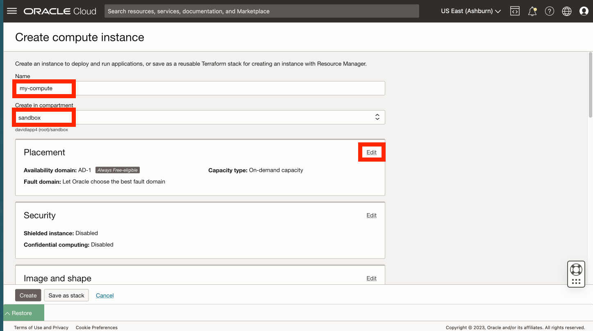

# 사용자정의 이미지에서 컴퓨트 인스턴스 생성

## 소개

Python이 구성된 컴퓨트 이미지가 사전 생성되었습니다. 이 실습에서는 해당 이미지에서 컴퓨트 인스턴스를 생성합니다.

예상 실험 시간: xx분

### 목표

*   Python이 사전 구성된 커스텀 이미지에서 컴퓨트 인스턴스를 생성합니다.

### 필요 조건

*   이전 실습 완료(Cloud Shell에서 SSH 키 생성)

## 작업 1: 컴퓨트 인스턴스 생성

1.  Compute > Instances로 이동합니다. 
    
2.  **인스턴스 생성**을 누릅니다. 
    
3.  **my-compute**와 같은 이름을 입력하거나 기본값을 그대로 사용할 수 있습니다. 컴파트먼트를 생성한 경우 선택하거나 기본값(루트)을 그대로 둡니다. 그런 다음 배치 섹션에서 **편집**을 누릅니다. 
    
4.  항상 무료 리소스를 사용하려는 경우 **VM.Standard.E2.1을 제공하는 가용성 도메인을 선택합니다. 마이크로** 구성입니다. 
    
5.  **이미지 및 모양** 섹션까지 아래로 스크롤하고 **편집**을 누릅니다. 
    
6.  **이미지 변경**을 누릅니다. 
    
7.  **내 이미지** 및 **이미지 OCID**를 선택합니다. 
    
8.  아래 OCID를 복사하여 이미지 OCID 필드에 붙여넣고 **이미지 선택**을 누릅니다.
    
        <copy>
         ocid1.image.oc1..aaaaaaaan727cclmzfl2evanaacnganaeobmv6hvakjzqdsk4gncmcklcxha
        </copy>
        
    
    
    
9.  Networking 섹션으로 이동하여 **Edit**를 누릅니다. 
    
10.  기존 네트워크가 있으면 사용할 수 있습니다. 그렇지 않은 경우 **새 가상 클라우드 네트워크 생성**을 선택합니다. 이름에 **my-vcn** 및 **my-subnet**을 입력하거나 기본값을 그대로 사용할 수 있습니다. 컴파트먼트를 생성한 경우 선택하거나 기본값(루트)을 그대로 둡니다. 공용 IPv4 주소에서 **공용 IPv4 주소 지정**이 선택되었는지 확인합니다. 
    
11.  **SSH 키 추가 섹션**으로 스크롤하고 **공개 키 붙여넣기**를 선택한 다음 **복원**을 눌러 Cloud Shell을 확장합니다. 
    
12.  Cloud Shell에서 마지막으로 실행한 명령이 공용 키를 인쇄했습니다. Cloud Shell에서 공용 키를 복사하여 컴퓨트 인스턴스 생성 대화상자의 SSH 키 필드에 붙여넣습니다. 그런 다음 Cloud Shell을 축소합니다. 
    
13.  **생성**을 누릅니다. 
    
14.  프로비저닝이 완료되면 컴퓨트 인스턴스의 공용 IP 주소를 복사하고 Cloud Shell을 복원합니다. 
    
15.  Cloud Shell에서 다음 명령을 입력하여 컴퓨트 인스턴스에 접속합니다. 여기서 이전 단계에서 복사된 "\[IP 주소\]"를 붙여넣을 수 있습니다.
    
        <copy>
         ssh -i ~/.ssh/my-ssh-key opc@[IP address]
        </copy>
        
    
    알려진 호스트 목록에 추가할지 묻는 메시지가 표시되면 **yes**로 응답하십시오. 
    

컴퓨트 인스턴스가 생성되고 SSH 액세스를 확인했습니다.

## 작업 2: 열린 네트워크 포트 8001

1.  기본 탐색 패널에서 **네트워킹**을 선택합니다. 그런 다음 **가상 클라우드 네트워크**를 선택합니다. 
    
2.  이전 작업에서 생성한 VCN을 누릅니다. 
    
3.  아래로 스크롤하여 왼쪽에 있는 **보안 목록**을 누른 다음 **my-vcn에 대한 기본 보안 목록**을 누릅니다. 
    
4.  **수신 규칙 추가**를 누릅니다. 
    
5.  소스 CIDR에 **0.0.0.0/0**을 입력합니다. 대상 포트 범위에 **8001**을 입력합니다. 그런 다음 **수신 규칙 추가**를 누릅니다. 
    
6.  아래로 스크롤하여 포트 8001에 대한 인바운드 액세스를 허용하는 새 수신 규칙을 확인합니다. 
    

이제 **다음 실습을 진행하십시오**.

## 확인

*   **작성자** - David Lapp, Oracle 데이터베이스 제품 관리
*   **최종 업데이트 기한/일자** - David Lapp, 데이터베이스 제품 관리, 2023년 6월