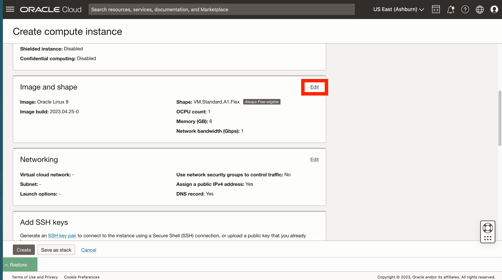
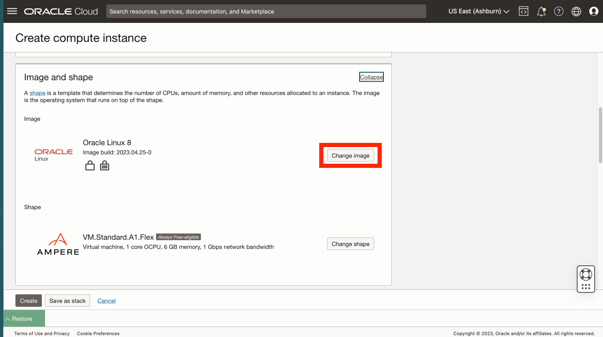

# 从定制映像创建计算实例

## 简介

计算映像是在配置了 Python 的情况下预创建的。在此实验室中，您将基于该映像创建计算实例。

估计的实验室时间：xx 分钟

### 目标

*   使用预配置的 Python 从定制映像创建计算实例。

### 先备条件

*   完成上一个实验室（在 Cloud Shell 中创建 SSH 密钥）

## 任务 1：创建计算实例

1.  导航到“计算”>“实例” 
    
2.  单击**创建实例** 
    
3.  输入 **my-compute** 等名称，也可以保留默认值。如果已创建区间，请选择区间，或者保留默认值（根）。然后在放置部分中单击**编辑**。 
    
4.  如果您计划使用“始终免费”资源，请选择提供 **VM.Standard.E2.1 的可用性域。微型**配置。 
    
5.  向下滚动到**图像和配置**部分，然后单击**编辑**。 
    
6.  单击**更改图像**。 
    
7.  选择**我的映像**和**映像 OCID** 
    
8.  复制下面的 OCID 并粘贴到“映像 OCID”字段中，然后单击**选择映像**。
    
        <copy>
         ocid1.image.oc1..aaaaaaaan727cclmzfl2evanaacnganaeobmv6hvakjzqdsk4gncmcklcxha
        </copy>
        
    
    
    
9.  向下滚动到“网络”部分，然后单击**编辑**。 
    
10.  如果您有现有网络，则可以使用它。否则，请选择**创建新的虚拟云网络**。对于名称，请输入 **my-vcn** 和 **my-subnet** ，也可以保留默认值。如果已创建区间，请选择区间，或者保留默认值（根）。在公共 IPv4 地址下，确认已选择**分配公共 IPv4 地址**。 
    
11.  向下滚动到**“添加 SSH 密钥”部分**，选择**粘贴公共密钥**，然后单击**还原**以展开 Cloud Shell。 
    
12.  在 Cloud Shell 中运行的最后一个命令将打印您的公钥。从 Cloud Shell 复制公钥，然后粘贴到“Create compute instance（创建计算实例）”对话框的“SSH 密钥”字段中。然后折叠 Cloud Shell。 
    
13.  单击**创建**。 
    
14.  预配完成后，复制计算实例的公共 IP 地址并还原 Cloud Shell。 
    
15.  在 Cloud Shell 中输入以下命令以连接到计算实例，您可以在上一步中复制的“［IP 地址］”中粘贴。
    
        <copy>
         ssh -i ~/.ssh/my-ssh-key opc@[IP address]
        </copy>
        
    
    当提示添加至已知主机列表时，请回复 **yes** 。 
    

已创建计算实例，并且您已验证 SSH 访问权限。

## 任务 2：开放网络端口 8001

1.  在主导航面板中，选择 **Networking（网络）**。然后选择**虚拟云网络**。 
    
2.  单击在上一个任务中创建的 VCN。 
    
3.  向下滚动并单击左侧的**安全列表**，然后单击 **my-vcn 的默认安全列表**。 
    
4.  单击**添加入站规则**。 
    
5.  对于源 CIDR，输入 **0.0.0.0/0** 。对于目标端口范围，请输入 **8001** 。然后单击**添加入站规则**。 
    
6.  向下滚动并观察允许入站访问端口 8001 的新入站规则。 
    

现在，您可以**进入下一个练习**。

## 确认

*   **作者** - David Lapp，Oracle 数据库产品管理
*   **上次更新者/日期** - David Lapp，数据库产品管理，2023 年 6 月