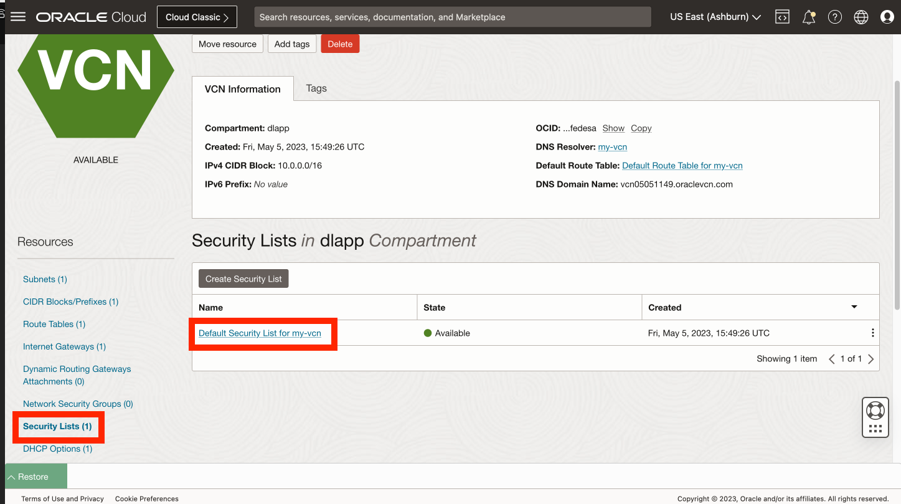

# 從自訂映像檔建立運算執行處理

## 簡介

已經預先建立配置了 Python 的運算映像檔。在此實驗室中，您將從該映像檔建立運算執行處理。

預估實驗室時間：x 分鐘

### 目標

*   從預先設定的 Python 自訂映像檔建立運算執行處理。

### 先決條件

*   完成先前實驗室 (在 Cloud Shell 中建立 SSH 金鑰)

## 作業 1：建立運算執行處理

1.  瀏覽至「Compute (運算) > 執行處理」 
    
2.  按一下**建立執行處理** 
    
3.  輸入名稱 (例如 **my-compute**)，或者您可以保留預設值。如果您已建立區間，請選取一個區間，或是保留預設值 (根目錄) . 然後在「位置」區段中，按一下**編輯**。 
    
4.  如果您計畫使用永遠免費資源，請選取提供 **VM.Standard.E2.1 的可用性網域。微型**形狀。 
    
5.  向下捲動至**影像與形狀**區段，然後按一下**編輯**。 
    
6.  按一下**變更影像**。 
    
7.  選取**我的映像檔**和**映像檔 OCID** 
    
8.  將下方的 OCID 複製到「映像檔 OCID」欄位中，然後按一下**選取映像檔**。
    
        <copy>
         ocid1.image.oc1..aaaaaaaan727cclmzfl2evanaacnganaeobmv6hvakjzqdsk4gncmcklcxha
        </copy>
        
    
    
    
9.  向下捲動至「網路 (Networking)」區段，然後按一下**編輯 (Edit)** 。 
    
10.  如果您已經有網路，可以使用它。否則請選取**建立新的虛擬雲端網路**。如需名稱，請輸入 **my-vcn** 與 **my-subnet** ，或者您可以保留預設值。如果您已建立區間，請選取一個區間，或是保留預設值 (根目錄) . 在公用 IPv4 位址下，確認已選取**指派公用 IPv4 位址**。 
    
11.  向下捲動至 **Add SSH key section** ，選取**貼上公開金鑰**，然後按一下**回復**以展開您的 Cloud Shell。 
    
12.  您在 Cloud Shell 執行的最後一個命令會列印您的公開金鑰。從 Cloud Shell 複製您的公用金鑰，然後貼到「建立運算執行處理」對話方塊的 SSH 金鑰欄位。然後收合 Cloud Shell。 
    
13.  按一下**建立**。 
    
14.  佈建完成後，請複製運算執行處理的公用 IP 位址並回復 Cloud Shell。 
    
15.  在 Cloud Shell 輸入下列命令以連線至您的運算執行處理，您可以在此處貼上前一個步驟複製的 "\[IP address\]"。
    
        <copy>
         ssh -i ~/.ssh/my-ssh-key opc@[IP address]
        </copy>
        
    
    出現提示加入已知主機清單時，請回答 **yes** 。 
    

您的運算執行處理已建立，而且您已驗證 SSH 存取。

## 作業 2：開啟網路連接埠 8001

1.  從主導覽面板選取 \[ **網路** \]。然後選取**虛擬雲端網路**。 
    
2.  按一下上一個作業中建立的 VCN。 
    
3.  向下捲動並按一下左邊的**安全清單**，然後按一下 **my-vcn 的預設安全清單**。 
    
4.  按一下**新增輸入規則**。 
    
5.  若為來源 CIDR，請輸入 **0.0.0.0/0** 。若為目的地連接埠範圍，請輸入 **8001** 。然後按一下**新增傳入規則**。 
    
6.  向下捲動並觀察新的傳入規則，允許對連接埠 8001 進行入埠存取。 
    

您現在可以**進入下一個實驗室**。

## 確認

*   **作者** - Oracle 資料庫產品管理 David Lapp
*   **上次更新者 / 日期** - 資料庫產品管理 David Lapp - 2023 年 6 月