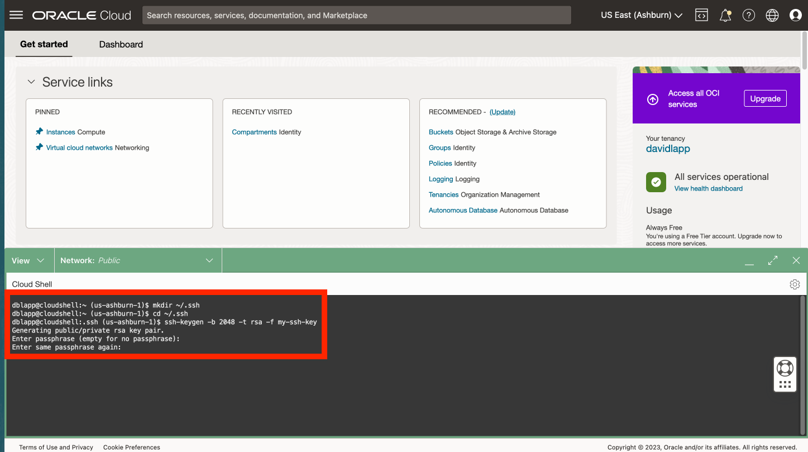
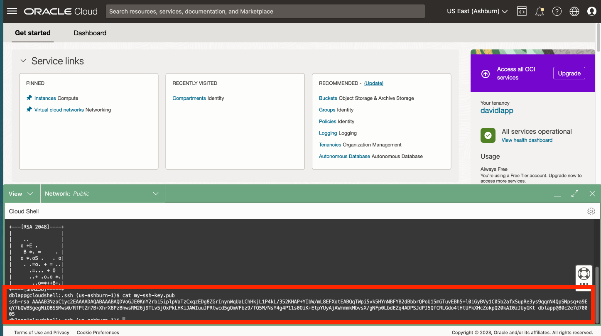
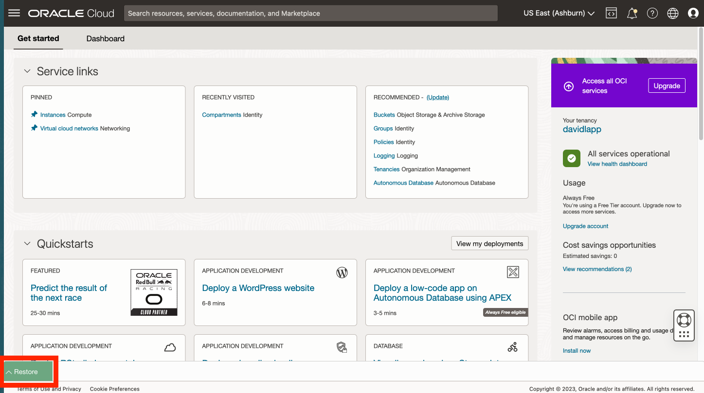

# SSH-Schlüssel in Cloud Shell erstellen

## Einführung

Für den Zugriff auf Ihre Python-Host-Compute benötigen Sie ein SSH-Schlüsselpaar. Oracle Cloud Infrastructure (OCI) Cloud Shell ist ein webbrowserbasiertes Terminal, auf das über die Oracle Cloud-Konsole zugegriffen werden kann und das Zugriff auf eine Linux-Shell bietet. Sie erstellen Ihr SSH-Schlüsselpaar in OCI Cloud Shell.

Geschätzte Laborzeit: xx Minuten

### Ziele

*   Erstellen Sie ein SSH-Schlüsselpaar mit OCI Cloud Shell.

### Voraussetzungen

*   Bei der OCI-Konsole angemeldet.

## Aufgabe 1: SSH-Schlüsselpaar erstellen

1.  cloud shell öffnen 
    
2.  Wenn Sie zur Ausführung des Tutorials aufgefordert werden, geben Sie N ein, und drücken Sie die Eingabetaste. 
    
3.  Führen Sie in der Befehlszeile jeden der folgenden Schritte aus, um Ihre SSK-Schlüssel zu erstellen.
    
        <copy>
        mkdir ~/.ssh
        </copy>
        
    
          ```
        cd ~/.ssh "\`
    
        <copy>
        ssh-keygen -b 2048 -t rsa -f my-ssh-key
        </copy>
        
    
    Wenn Sie zur Eingabe von Passphrase aufgefordert werden, können Sie bei der Eingabe keine Passphrase eingeben und zur Bestätigung wiederholen.  
    
    
4.  Führen Sie in der Befehlszeile den folgenden Befehl aus, um den Public Key anzuzeigen. Sie verwenden dies in einem nachfolgenden Schritt.
    
        <copy>
        cat ~/.ssh/my-ssh-key.pub
        </copy>
        
    
    
    
5.  Klicken Sie auf das Symbol "Ausblenden", um Cloud Shell zu minimieren.
    
    
    
6.  Beobachten Sie die Schaltfläche "Wiederherstellen", um Cloud Shell erneut zu öffnen. Sie öffnen Cloud Shell in einem nachfolgenden Schritt erneut.
    
    
    

Sie können jetzt **mit der nächsten Übung fortfahren**.

## Danksagungen

*   **Autor** - David Lapp, Database Product Management, Oracle
*   **Zuletzt aktualisiert am/um** - David Lapp, Database Product Management, Juni 2023