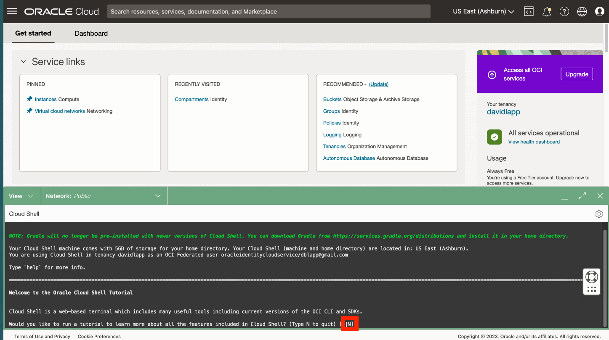

# Créer des clés SSH dans Cloud Shell

## Présentation

Pour accéder à votre calcul d'hôte Python, vous aurez besoin d'une paire de clés SSH. Oracle Cloud Infrastructure (OCI) Cloud Shell est un terminal basé sur un navigateur Web accessible à partir de la console Oracle Cloud permettant d'accéder à un shell Linux. Vous allez créer votre paire de clés SSH dans OCI Cloud Shell.

Durée estimée du laboratoire : xx minutes

### Objectifs

*   Créez une paire de clés SSH à l'aide d'OCI Cloud Shell.

### Prérequis

*   Connexion à la console OCI.

## Tâche 1 : créer une paire de clés SSH

1.  Ouvrir cloud shell 
    
2.  Lorsque vous êtes invité à exécuter le tutoriel, tapez N et entrez. 
    
3.  Sur la ligne de commande, exécutez chacun des éléments suivants pour créer vos clés SSK.
    
        <copy>
        mkdir ~/.ssh
        </copy>
        
    
          ```
        cd ~/.ssh \`\`
    
        <copy>
        ssh-keygen -b 2048 -t rsa -f my-ssh-key
        </copy>
        
    
    Lorsque vous êtes invité à saisir une phrase de passe, vous pouvez cliquer sur Entrée pour ne saisir aucune phrase de passe et la répéter pour confirmer.  
    
    
4.  Sur la ligne de commande, exécutez la commande suivante pour afficher votre clé publique. Vous l'utiliserez dans une étape ultérieure.
    
        <copy>
        cat ~/.ssh/my-ssh-key.pub
        </copy>
        
    
    
    
5.  Cliquez sur l'icône Réduire pour réduire Cloud Shell.
    
    
    
6.  Observez le bouton Restore pour rouvrir Cloud Shell. Vous rouvrirez Cloud Shell à l'étape suivante.
    
    
    

Vous pouvez maintenant **passer à l'exercice suivant**.

## Accusés de réception

*   **Auteur** - David Lapp, Database Product Management, Oracle
*   **Dernière mise à jour par/date** - David Lapp, Database Product Management, juin 2023