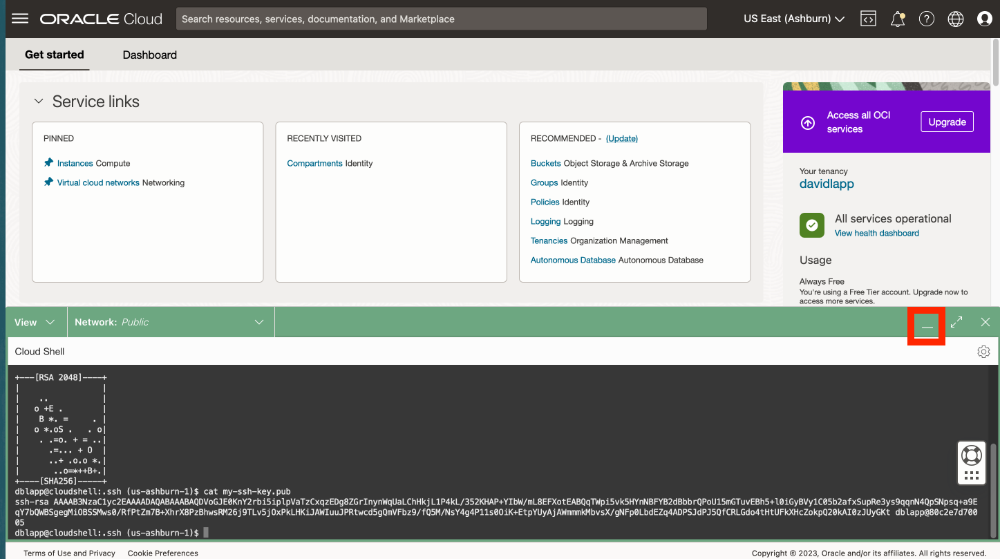

# Cloud Shell에서 SSH 키 생성

## 소개

Python 호스트 컴퓨팅에 액세스하려면 SSH 키 쌍이 필요합니다. OCI(Oracle Cloud Infrastructure) Cloud Shell은 웹 브라우저 기반 터미널로, Linux 셸에 대한 액세스를 제공하는 Oracle Cloud 콘솔에서 액세스할 수 있습니다. OCI Cloud Shell에서 SSH 키 쌍을 생성하게 됩니다.

예상 실험 시간: xx분

### 목표

*   OCI Cloud Shell을 사용하여 SSH 키 쌍을 생성합니다.

### 필요 조건

*   OCI 콘솔에 로그인했습니다.

## 작업 1: SSH 키 쌍 생성

1.  클라우드 셸 열기 
    
2.  튜토리얼을 실행할지 묻는 메시지가 표시되면 N을 입력하고 Enter 키를 누릅니다. 
    
3.  명령줄에서 다음 각각을 실행하여 SSK 키를 만듭니다.
    
        <copy>
        mkdir ~/.ssh
        </copy>
        
    
          ```
        cd ~/.ssh \`\`
    
        <copy>
        ssh-keygen -b 2048 -t rsa -f my-ssh-key
        </copy>
        
    
    문장암호를 묻는 프롬프트가 표시되면 Enter 키를 눌러 문장암호를 지정하지 않고 확인을 반복할 수 있습니다.  
    
    
4.  명령줄에서 다음을 실행하여 공개 키를 확인합니다. 이후 단계에서 이 함수를 사용합니다.
    
        <copy>
        cat ~/.ssh/my-ssh-key.pub
        </copy>
        
    
    
    
5.  축소 아이콘을 눌러 Cloud Shell을 최소화합니다.
    
    
    
6.  Restore 버튼을 관찰하여 Cloud Shell을 다시 엽니다. 후속 단계에서 Cloud Shell을 다시 엽니다.
    
    
    

이제 **다음 실습을 진행하십시오**.

## 확인

*   **작성자** - David Lapp, Oracle 데이터베이스 제품 관리
*   **최종 업데이트 기한/일자** - David Lapp, 데이터베이스 제품 관리, 2023년 6월