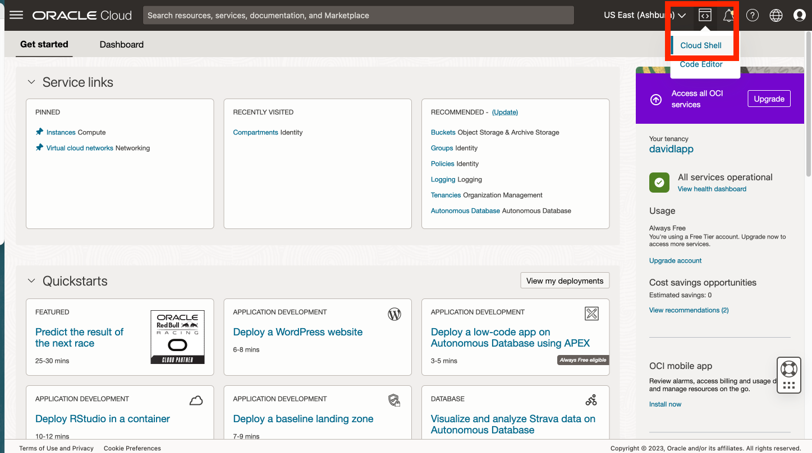

# Criar chaves SSH no Cloud Shell

## Introdução

Para acessar sua computação de host Python, você precisará de um par de chaves SSH. O Oracle Cloud Infrastructure (OCI) Cloud Shell é um terminal baseado em web browser acessível na Console do Oracle Cloud que fornece acesso a um shell do Linux. Você criará seu par de chaves SSH no OCI Cloud Shell.

Tempo de Laboratório Estimado: xx minutos

### Objetivos

*   Crie o par de chaves SSH usando o OCI Cloud Shell.

### Pré-requisitos

*   Conectado à console do OCI.

## Tarefa 1: Criar par de chaves SSH

1.  Abrir cloud shell 
    
2.  Quando solicitado a executar o tutorial, digite N e digite Enter. 
    
3.  Na linha de comando, execute cada um dos itens a seguir para criar suas chaves SSK.
    
        <copy>
        mkdir ~/.ssh
        </copy>
        
    
          ```
        cd ~/.ssh \`\`\`
    
        <copy>
        ssh-keygen -b 2048 -t rsa -f my-ssh-key
        </copy>
        
    
    Quando for solicitada a frase-senha, você poderá clicar em Enter para nenhuma frase-senha e repetir para confirmar.  
    
    
4.  Na linha de comando, execute o seguinte para exibir sua chave pública. Você o usará em uma etapa subsequente.
    
        <copy>
        cat ~/.ssh/my-ssh-key.pub
        </copy>
        
    
    
    
5.  Clique no ícone de recolhimento para minimizar o Cloud Shell.
    
    
    
6.  Observe o botão Restaurar para reabrir o Cloud Shell. Você reabrirá o Cloud Shell em uma etapa subsequente.
    
    
    

Agora você pode **prosseguir para o próximo laboratório**.

## Agradecimentos

*   **Autor** - David Lapp, Database Product Management, Oracle
*   **Última Atualização em/Data** - David Lapp, Database Product Management, junho de 2023