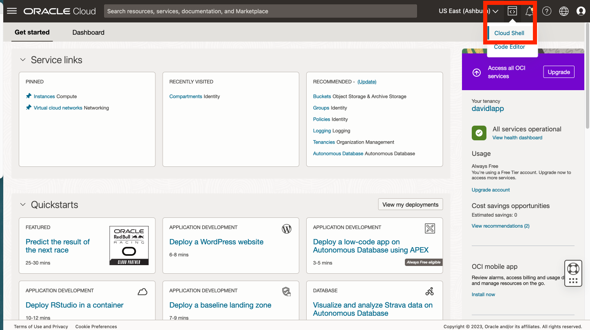
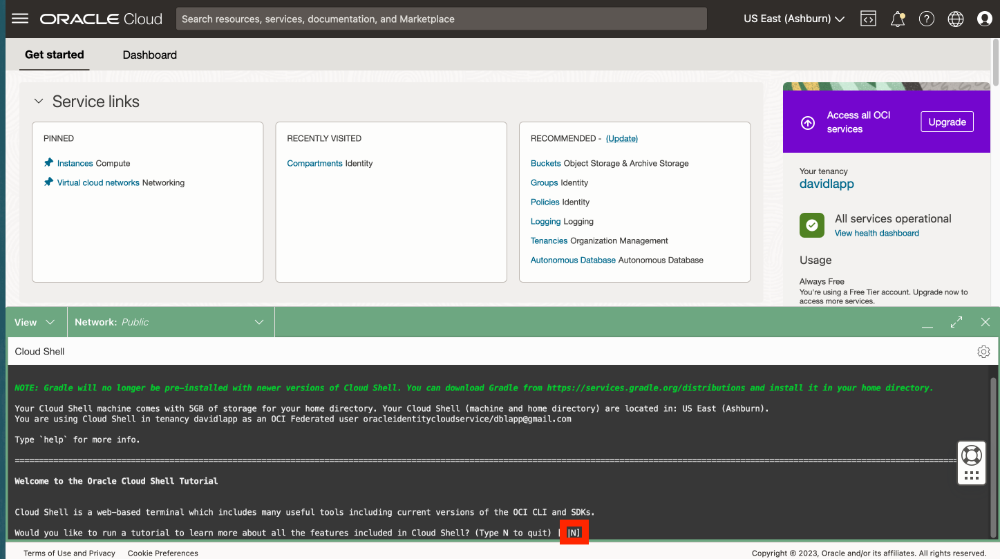
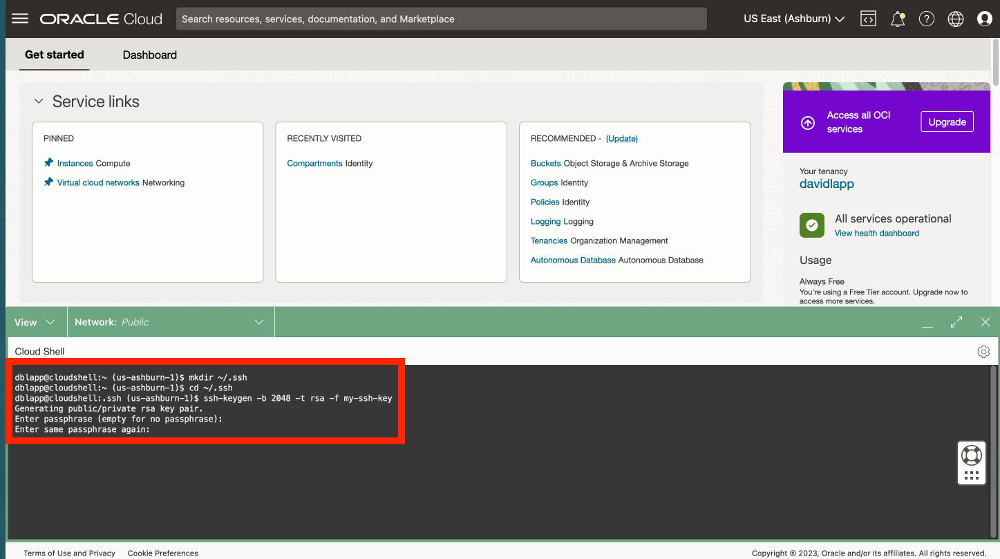
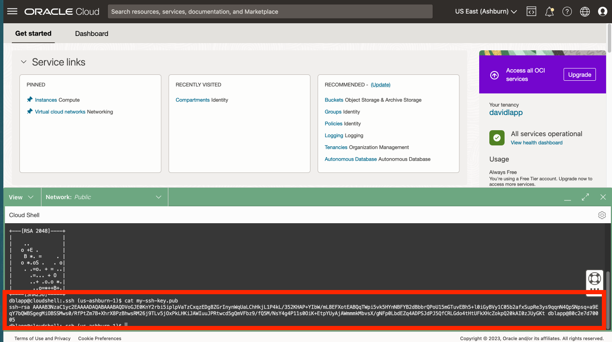
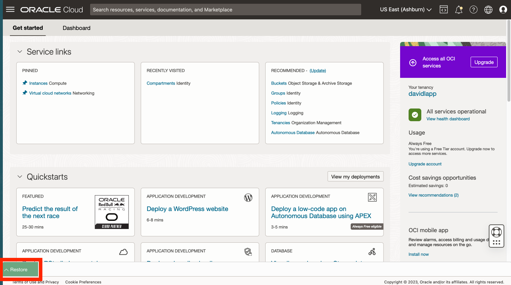

# 在 Cloud Shell 中建立 SSH 金鑰

## 簡介

若要存取 Python 主機運算，您需要有 SSH 金鑰組。Oracle Cloud Infrastructure (OCI) Cloud Shell 是一個可從 Oracle Cloud 主控台存取的 Web 瀏覽器終端機，提供對 Linux Shell 的存取。您將在 OCI Cloud Shell 中建立您的 SSH 金鑰組。

預估實驗室時間：x 分鐘

### 目標

*   使用 OCI Cloud Shell 建立 SSH 金鑰組。

### 先決條件

*   已登入 OCI 主控台。

## 作業 1：建立 SSH 金鑰組

1.  開啟雲端 Shell 
    
2.  提示執行教學課程時，請輸入 N 並輸入。 
    
3.  在命令行中，執行下列每一個動作以建立您的 SSK 金鑰。
    
        <copy>
        mkdir ~/.ssh
        </copy>
        
    
          ```
        cd ~/.ssh \`\`\`
    
        <copy>
        ssh-keygen -b 2048 -t rsa -f my-ssh-key
        </copy>
        
    
    在提示輸入密碼詞組時，您可以按一下輸入以不使用密碼詞組，然後重複進行確認。  
    
    
4.  在指令行執行下列動作以檢視您的公開金鑰。您會在接下來的步驟中使用此選項。
    
        <copy>
        cat ~/.ssh/my-ssh-key.pub
        </copy>
        
    
    
    
5.  按一下收合圖示即可將 Cloud Shell 降到最低。
    
    
    
6.  請觀察「回復」按鈕以重新開啟 Cloud Shell. 您將在接下來的步驟中重新開啟 Cloud Shell。
    
    
    

您現在可以**進入下一個實驗室**。

## 確認

*   **作者** - Oracle 資料庫產品管理 David Lapp
*   **上次更新者 / 日期** - 資料庫產品管理 David Lapp - 2023 年 6 月