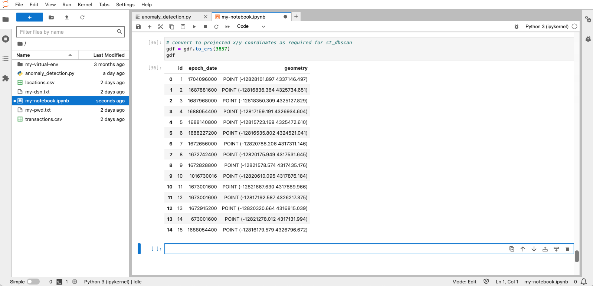
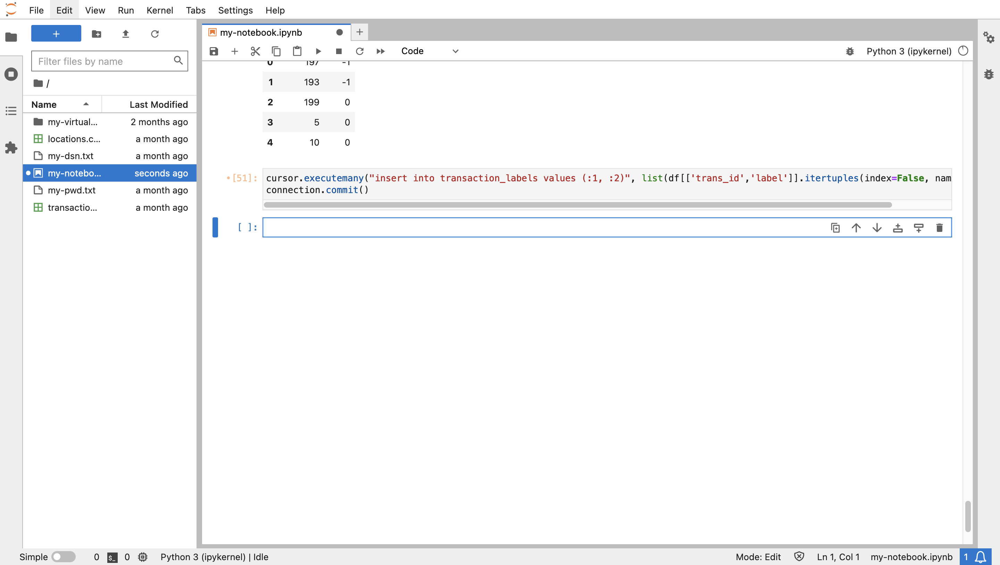
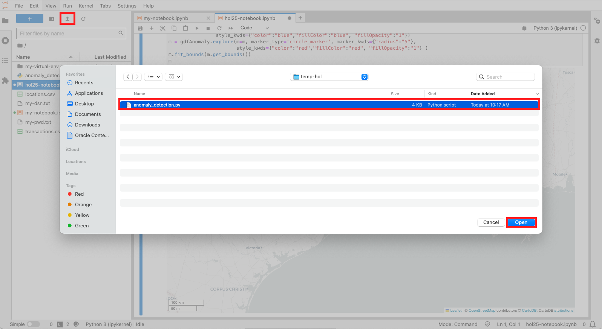
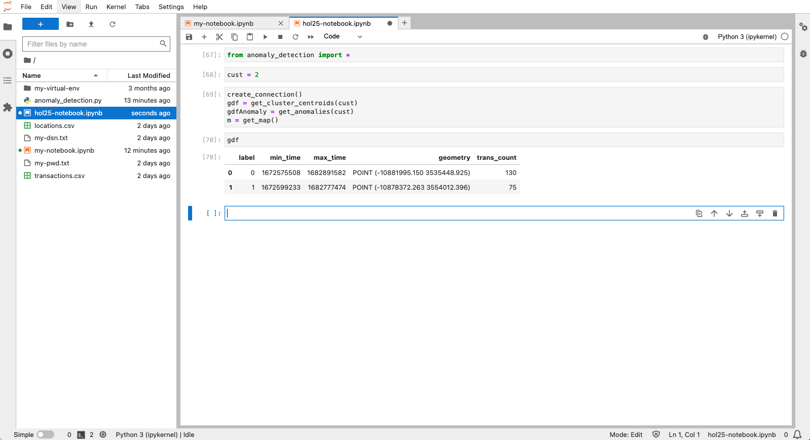
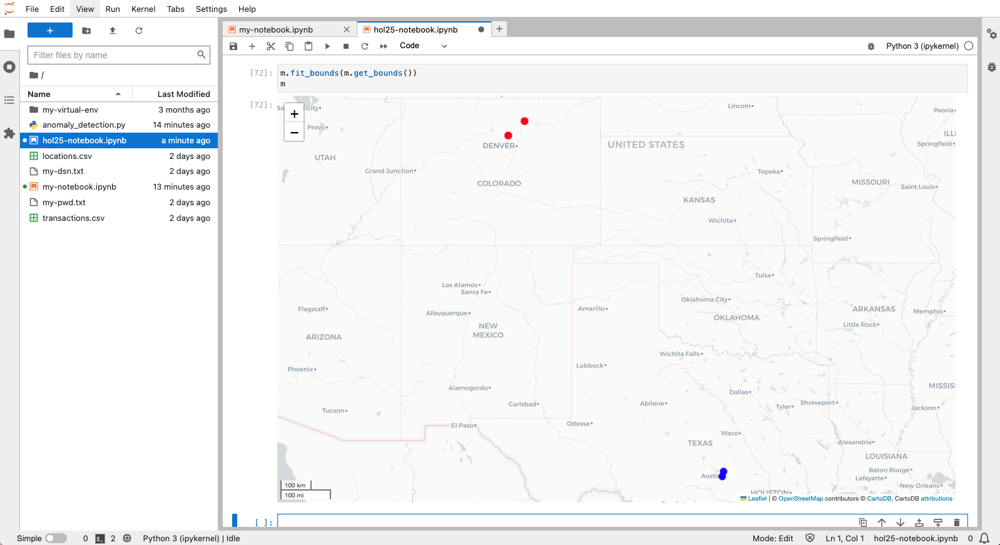

# Verdächtige Transaktionen erkennen

## Einführung

Die räumlichen Features von Oracle Database bieten skalierbare und sichere Verwaltung, Verarbeitung und Analyse räumlicher Daten. Ein wesentlicher Vorteil der Arbeit in Python ist die Verfügbarkeit von Open-Source-Librarys, um die nativen Analysefunktionen von Oracle Database zu erweitern. In dieser Übung verwenden Sie eine Library, die Cluster sowohl auf der Basis von Raum und Zeit oder also auf räumlich-zeitlichen Clustern identifiziert. Eine Gruppe von Transaktionen, die in einem konzentrierten Bereich und Zeitfenster aufgetreten sind, gehören zu einem räumlich-zeitlichen Cluster. Eine Transaktion, die innerhalb des Zeitfensters eines raumzeitlichen Clusters stattfand, aber weit vom Konzentrationsbereich entfernt ist, wird als verdächtig betrachtet. Beispiel: Wenn die Transaktionen eines Kunden während einer bestimmten Woche im Gebiet von New York City konzentriert waren, wäre eine Transaktion Mitte dieser Woche in Kalifornien verdächtig. In dieser Übung identifizieren Sie solche Vorkommen.

Geschätzte Laborzeit: 15 Minuten

### Ziele

*   Transaktionsdaten aus Oracle Spatial in Python laden
*   Erkennen Sie räumlich-zeitliche Cluster, die das erwartete Verhalten darstellen
*   Identifizieren Sie Ausreißer, die verdächtiges Verhalten darstellen

### Voraussetzungen

*   Abschluss von Übung 6: Daten untersuchen

## Aufgabe 1: Experimentieren mit räumlicher Aggregation

Um die Entfernung von Transaktionen von einem räumlich-zeitlichen Cluster zu berechnen, ist es praktisch, den Cluster als einzelne Geometrie darzustellen. Dies ist ein Anwendungsfall für die räumliche Aggregation, bei der eine Gruppe von Geometrien durch ein einzelnes Aggregat dargestellt wird. Oracle Spatial stellt ein Paket räumlicher Aggregatfunktionen für genau diesen Zweck bereit. Diese Aufgabe soll Sie mit der räumlichen Aggregation vertraut machen.

1.  Erstellen Sie zunächst eine GeoDataFrame von Elementen aus den Positionen der Tabelle **LOCATIONS** innerhalb von 10 Meilen einer Längen-/Breitengradkoordinate in Austin, TX (-97.7431,30.2672).
    
        <copy>
        cursor = connection.cursor()
        cursor.execute("""
         SELECT (lonlat_to_proj_geom(lon,lat)).get_wkt() as geometry
         FROM locations
         WHERE sdo_within_distance(
                   lonlat_to_proj_geom(lon,lat),
                   lonlat_to_proj_geom(-97.7431,30.2672),
                   'distance=10 unit=MILE') = 'TRUE'
               """)
        gdfPoints = gpd.GeoDataFrame(cursor.fetchall(), columns = ['geometry'])
        gdfPoints['geometry'] = shapely.from_wkt(gdfPoints['geometry'])
        gdfPoints.crs = "EPSG:3857"
        gdfPoints.head()
        </copy>
        
    
    
    
2.  Erstellen Sie als Nächstes eine GeoDataFrame mit dem Speicherort in der Mitte der zuvor ausgewählten Speicherorte. Dieser Standort wird als "Aggregat-Centroid" bezeichnet, daher heißt GeoDataFrame gdfAggCent.
    
        <copy>
        cursor.execute("""
         SELECT SDO_AGGR_CENTROID(
                  SDOAGGRTYPE(lonlat_to_proj_geom(lon,lat), 0.005)).get_wkt() as geometry
         FROM locations
         WHERE sdo_within_distance(
                   lonlat_to_proj_geom(lon,lat),
                   lonlat_to_proj_geom(-97.7431,30.2672),
                   'distance=10 unit=MILE') = 'TRUE'
               """)
        gdfAggCent = gpd.GeoDataFrame(cursor.fetchall(), columns = ['geometry'])
        gdfAggCent['geometry'] = shapely.from_wkt(gdfAggCent['geometry'])
        gdfAggCent.crs = "EPSG:3857"
        gdfAggCent
        </copy>
        
    
    
    
3.  Erstellen Sie als Nächstes eine GeoDataFrame mit der Form, die die Positionen in der Nähe der Koordinate in Austin, TX begrenzt. Dies wird als "Aggregatkonvexer Rumpf" bezeichnet, daher heißt GeoDataFrame gdfAggHull.
    
        <copy>
        cursor.execute("""
         SELECT SDO_AGGR_CONVEXHULL(
                  SDOAGGRTYPE(lonlat_to_proj_geom(lon,lat), 0.005)).get_wkt() as geometry
         FROM locations
         WHERE sdo_within_distance(
                   lonlat_to_proj_geom(lon,lat),
                   lonlat_to_proj_geom(-97.7431,30.2672),
                   'distance=10 unit=MILE') = 'TRUE'
               """)
        gdfAggHull = gpd.GeoDataFrame(cursor.fetchall(), columns = ['geometry'])
        gdfAggHull['geometry'] = shapely.from_wkt(gdfAggHull['geometry'])
        gdfAggHull.crs = "EPSG:3857"
        gdfAggHull
        </copy>
        
    
    
    
    Es gibt mehrere andere räumliche Aggregatfunktionen, die demselben Muster folgen.
    
4.  Jetzt können Sie die Punkte und die beiden von Ihnen erstellten räumlichen Aggregate visualisieren. Die ursprünglichen Positionen sind blau dargestellt, und der aggregierte Zentroid- und Aggregatkonvexrumpf sind rot dargestellt.
    
        <copy>
        m = gdfPoints.explore(tiles="CartoDB positron",
                               style_kwds={"color":"blue","fillColor":"blue"})
        m = gdfAggHull.explore(m=m,
                               style_kwds={"color":"red","fillOpacity":"0"} )
        m = gdfAggCent.explore(m=m,
                               marker_kwds={"radius":"8"},
                              style_kwds={"color":"red","fillColor":"red","fillOpacity":".7"} )
        m
        </copy>
        
    
    
    

Als Nächstes identifizieren Sie verdächtige Transaktionen, die während des Zeitraums eines raumzeitlichen Clusters auftreten, jedoch in einer Entfernung, die größer als ein Schwellenwert ist. Da die Fläche, die von einem raumzeitlichen Cluster abgedeckt wird, im Vergleich zur Entfernungsschwelle für eine verdächtige Transaktion unbedeutend ist, verwenden Sie den aggregierten Zentroid, um den Standort eines raumzeitlichen Clusters darzustellen.

## Aufgabe 2: Clustererkennung vorbereiten

1.  Importieren Sie zunächst Bibliotheken, die für die Erkennung von räumlich-zeitlichen Clustern erforderlich sind. Die Hauptbibliothek ist st\_dbscan. Außerdem sind die Pandas- und Numpy-Librarys für die Konfiguration der Eingabe in st\_dbscan erforderlich.
    
        <copy>
        import pandas as pd
        import numpy as np
        from st_dbscan import ST_DBSCAN
        </copy>
        
    
    
    
2.  Lassen Sie uns nun ein Beispiel für die Erkennung von raumzeitlichen Clustern durchlaufen. Führen Sie den folgenden Befehl aus, um eine GeoDataFrame mit einigen Speicherorten mit Epochenzeit und ID zu erstellen.
    
        <copy>
        gdf = gpd.GeoDataFrame({
            "id": [1, 2, 3, 4, 5, 6, 7, 8, 9, 10, 11, 12, 13, 14, 15],
            "epoch_date": [1704096000, 1687881600, 1687968000, 1688054400, 1688140800, \
                           1688227200, 1672656000, 1672742400, 1672828800,  1016730016, \
                           1673001600, 1673001600, 1672915200, 673001600, 1688054400],
            "geometry": ["POINT(-115.2368 36.2650)",
                        "POINT(-115.1356 36.1823)",
                        "POINT(-115.1492 36.1779)",
                        "POINT(-115.1385 36.1910)",
                        "POINT(-115.1256 36.1804)",
                        "POINT(-115.1329 36.1735)",
                        "POINT(-115.1711 36.1212)",
                        "POINT(-115.1656 36.1228)",
                        "POINT(-115.1782 36.1221)",
                        "POINT(-115.1695 36.1253)",
                        "POINT(-115.1790 36.1254)",
                        "POINT(-115.1388 36.1858)",
                        "POINT(-115.1669 36.1176)",
                        "POINT(-115.1755 36.1199)",
                        "POINT(-115.1297 36.1900)",
            ],})
        # convert to Shapely geometries
        gdf['geometry'] = shapely.from_wkt(gdf['geometry'])
        # assign longitude/latitude coordinate system
        gdf = gdf.set_crs(4326)
        gdf
        </copy>
        
    
    
    

3\. Für die ST\_DBSCAN-Bibliothek müssen sich die Koordinaten in derselben Einheit wie die Entfernungsmessung befinden. Führen Sie daher den folgenden Befehl aus, um das Koordinatensystem von Längen-/Breitengrad in projizierte x/y-Koordinaten basierend auf Metern zu konvertieren. `<copy> # convert to projected x/y coordinates as required for ST_DBSCAN gdf = gdf.to_crs(3857) gdf </copy>`

    
    

4\. Eingabe in ST\_DBSCAN ist ein Numpy-Array. Führen Sie daher den folgenden Befehl aus, um GeoDataFrame in ein Numpy-Array zu konvertieren. `<copy> # Convert to pandas dataframe df = pd.DataFrame(data={'time': gdf.epoch_date, 'x': gdf.geometry.x, 'y': gdf.geometry.y, 'id': gdf.id}) data = df.values # Convert to numpy array data = np.int_(data) data </copy>`

     
    

5.  Hier können Sie ST\_DBSCAN in unseren Beispieldaten ausführen. ST\_DBSCAN ist eine Variante des DBSCAN-(Density-Based Spatial Clustering of Applications with Noise-)Algorithmus, der auf räumliche Daten erweitert wird. Die Parameter sind die Schwellenwerte für Cluster. eps1 ist der Abstandsschwellenwert in den Einheiten des Koordinatensystems (Meter), eps2 ist der Zeitschwellenwert in Sekunden und min-samples ist der Schwellenwert für die Mindestanzahl von Elementen. Führen Sie den folgenden Befehl aus, um Cluster zu ermitteln, bei denen die Schwellenwerte 5 oder mehr Elemente innerhalb von 5KM und ungefähr 1 Monat betragen.
    
        <copy>
        st_cluster = ST_DBSCAN(eps1 = 5000, eps2 = 3000000, min_samples = 5)
        st_cluster.fit(data)
        </copy>
        
    
    
    

6\. Das Ergebnis ist ein ganzzahliges Label für jedes Eingabeelement. Jedes Label >=0 stellt ein Cluster dar. Das Label -1 gibt an, dass das Element nicht Teil eines Clusters ist. Prüfen Sie die einzelnen Ergebnislabels. Beachten Sie, dass zwei Cluster erkannt wurden. `<copy> np.unique(st_cluster.labels) </copy>`

    
    

7\. Fügen Sie der GeoDataFrame das Ganzzahllabel hinzu. `<copy> df = pd.DataFrame(data={'id': df.id, 'label': st_cluster.labels}) label_mapping_dict = dict(zip(df["id"], df["label"])) gdf["label"] = gdf["id"].map(label_mapping_dict) gdf </copy>`

    
    

8.  Führen Sie die folgenden Schritte aus, um die Cluster zu visualisieren. Beachten Sie, dass einige Elemente innerhalb des Entfernungsschwellenwerts, jedoch nicht innerhalb des zeitlichen Schwellenwerts liegen.  
    
        <copy>
        gdf.explore(column="label", categorical="True", tiles="CartoDB positron", \
                    cmap=['sienna','blue','limegreen'], marker_kwds={"radius":4}, \
                    style_kwds={"fillOpacity":1})
        </copy>
        
    
    
    

In den nächsten Schritten verwenden Sie diesen Ansatz, um verdächtige Finanztransaktionen zu erkennen.

9.  Das Ergebnis der Clustererkennung ist ein "Label" für jedes Datenelement, das angibt, ob das Element Teil eines Clusters ist, und wenn ja, welches Cluster. Sie führen eine Clusteranalyse durch und speichern die Ergebnisse zur weiteren Analyse in der Datenbank. Führen Sie den folgenden Befehl aus, um eine Datenbanktabelle zu erstellen, in der Clusterlabels gespeichert werden.
    
        <copy>
        cursor.execute("CREATE TABLE transaction_labels (trans_id integer, label integer)")
        </copy>
        
    
    
    

## Aufgabe 3: Spatiotemporale Cluster erkennen

1.  In diesem Workshop analysieren Sie Transaktionen für jeweils einen Kunden. Führen Sie den folgenden Befehl aus, um eine Variable für die Kunden-ID für die Analyse festzulegen. Sie können zu dieser Zelle zurückkehren, um zur Analyse zu einem anderen Kunden zu wechseln.
    
        <copy>
        cust=1
        </copy>
        
    
    
    
2.  Erstellen Sie eine GeoDataframe der Kundentransaktionen. Beachten Sie die Binding-Syntax in der WHERE-Klausel (cust\_id=:cust), die vom python-oracledb-Treiber unterstützt wird.
    
        <copy>
        cursor.execute("""
         SELECT a.cust_id,  a.trans_id, a.trans_epoch_date,
               (lonlat_to_proj_geom(b.lon,b.lat)).get_wkt()
         FROM transactions a, locations b
         WHERE a.location_id=b.location_id
         AND cust_id=:cust""", cust=cust)
        gdf = gpd.GeoDataFrame(cursor.fetchall(), columns = ['cust_id', 'trans_id', 'epoch_date', 'geometry'])
        gdf['geometry'] = shapely.from_wkt(gdf['geometry'])
        gdf.head()
        </copy>
        
    
    
    
3.  Die st\_dbscan-Bibliothek erfordert Eingabe im Numpy-Format, wobei Numpy eine Bibliothek zur Verarbeitung von Arrays ist. Führen Sie die folgenden beiden Schritte aus, um GeoDataFrame in ein Numpy-Array zu konvertieren.
    
        <copy>
        # first convert to pandas dataframe
        df = pd.DataFrame(data={'time': gdf.epoch_date, 'x': gdf.geometry.x, 'y': gdf.geometry.y, 'trans_id':  gdf.trans_id, 'cust_id':gdf.cust_id})
        df.head()
        </copy>
        
    
        <copy>
        # then convert to numpy array
        data = df.values
        data = np.int_(data)
        data[1:10]
        </copy>
        
    
    
    
4.  Jetzt können Sie räumlich-zeitliche Cluster für die Transaktionen des aktuellen Kunden ermitteln. Der Vorgang akzeptiert drei Schwellenwertparameter: Entfernung, Zeit und Mindestanzahl von Elementen. Elemente mit Nachbarn innerhalb der Entfernungs- und Zeitschwellenwerte werden als Teil eines Clusters betrachtet, und es gibt in den meisten Fällen mindestens die Mindestanzahl von Elementen, die als Cluster qualifiziert werden sollen. Der Abstand liegt in den Einheiten des Koordinatensystems, das in diesem Fall Meter ist. Die Zeit liegt in Sekunden. Führen Sie den folgenden Befehl aus, um Cluster zu ermitteln, bei denen die Schwellenwerte 5 oder mehr Elemente innerhalb von 5KM und ungefähr 1 Monat betragen.
    
        <copy>
        st_cluster = ST_DBSCAN(eps1 = 5000, eps2 = 3000000, min_samples = 5)
        st_cluster.fit(data)
        </copy>
        
    
    
    
5.  Das Ergebnis ist ein ganzzahliges Label für jedes Eingabeelement. Jedes Label >=0 stellt ein Cluster dar. Das Label -1 gibt an, dass das Element nicht Teil eines Clusters ist. Prüfen Sie die einzelnen Ergebnislabels. Beachten Sie, dass ein Cluster erkannt wurde.
    
        <copy>
        np.unique(st_cluster.labels)
        </copy>
        
    
    
    
6.  Führen Sie die folgenden Schritte aus, um die Clusterlabels zu Transaktionen hinzuzufügen und die ersten Zeilen zu drucken. Jede Transaktion wird mit -1 (d.h. nicht Teil eines Clusters) oder einer Ganzzahl >=0 (d.h. dem Cluster, zu dem das Element gehört) beschriftet.
    
        <copy>
        df = pd.DataFrame(data={'trans_id': df.trans_id, 'label': st_cluster.labels})
        df.head()
        </copy>
        
    
    
    
7.  Das Erkennen von Anomalien erfordert Datenbankabfragen mit den Clusterlabels. Führen Sie daher den folgenden Befehl aus, um die markierten Transaktionen des aktuellen Kunden in die Tabelle TRANSACTION\_LABELS einzufügen, die in der vorherigen Aufgabe erstellt wurde.
    
        <copy>
        cursor.executemany("""
         INSERT INTO transaction_labels
         VALUES (:1, :2)""",
         list(df[['trans_id','label']].itertuples(index=False, name=None)))
        connection.commit()
        </copy>
        
    
    
    
8.  Führen Sie den folgenden Befehl aus, um die Transaktionen des aktuellen Kunden mit den zugehörigen Clusterlabels abzurufen.
    
        <copy>
        # labelled transactions for customer
        cursor.execute("""
         SELECT a.cust_id, a.location_id, a.trans_id, a.trans_epoch_date,
                (lonlat_to_proj_geom(b.lon,b.lat)).get_wkt(), c.label
         FROM transactions a, locations b, transaction_labels c
         WHERE a.location_id=b.location_id
         AND a.trans_id=c.trans_id
         """)
        gdf = gpd.GeoDataFrame(cursor.fetchall(), columns = ['cust_id', 'location_id', 'trans_id', 'trans_epoch_date', 'geometry','label'])
        gdf['geometry'] = shapely.from_wkt(gdf['geometry'])
        gdf = gdf.set_crs(3857)
        gdf.head()
        </copy>
        
    
    
    
9.  Führen Sie die folgenden Schritte aus, um die markierten Transaktionen des aktuellen Kunden zu visualisieren. In diesem Fall fügen Sie den Parameter für die Farbcodierung der Elemente basierend auf dem Clusterlabel ein. Sie können auch mit der Maus auf ein Element zeigen, um dessen Attribute einschließlich des Clusterlabels anzuzeigen.
    
        <copy>
        gdf.explore(column="label", categorical="True", tiles="CartoDB positron", \
                    marker_kwds={"radius":4}, style_kwds={"fillOpacity":1})
        </copy>
        
    
    
    
10.  Wenn Sie in den Bereich von Austin, TX, zoomen, wo die Transaktionsstandorte des aktuellen Kunden konzentriert sind, beobachten Sie die Farbcodierung, die angibt, welche Teil des raumzeitlichen Clusters sind.
    
    
    

## Aufgabe 4: Anomalien erkennen

1.  Führen Sie den folgenden Befehl aus, um Aggregat-Centroids für die spatiotemporalen Cluster des aktuellen Kunden mit Attributen für Cluster-Label, Zeitraum und Anzahl der Transaktionen im Cluster zu erstellen. Beachten Sie, dass der erste Kunde nur 1 Cluster hat (Label = 0).
    
        <copy>
        # st cluster centroids for customer
        cursor = connection.cursor()
        cursor.execute("""
         SELECT label, min(trans_epoch_date) as min_time, max(trans_epoch_date) as max_time,
                 SDO_AGGR_CENTROID(
                  SDOAGGRTYPE(lonlat_to_proj_geom(b.lon,b.lat), 0.005)).get_wkt() as geometry,
                 count(*) as trans_count
         FROM transactions a, locations b, transaction_labels c
         WHERE a.location_id=b.location_id
         AND a.trans_id=c.trans_id
         AND c.label != -1
         GROUP BY label
               """)
        gdf = gpd.GeoDataFrame(cursor.fetchall(), columns = ['label','min_time','max_time','geometry','trans_count'])
        gdf['geometry'] = shapely.from_wkt(gdf['geometry'])
        gdf = gdf.set_crs(3857)
        gdf.head()
        </copy>
        
    
    
    
2.  Führen Sie die folgenden Schritte aus, um das räumlich-zeitliche Cluster-Centroid zu visualisieren.
    
        <copy>
        gdf.explore(tiles="CartoDB positron", marker_kwds={"radius":4})
        </copy>
        
    
    
    
3.  Um aktuelle Kundentransaktionen innerhalb des Zeitraums von Clustern zu identifizieren, die sich in einer Entfernung befinden, die größer als ein Schwellenwert ist, führen Sie eine Abfrage mit dem WITH-Befehl aus. Wie ... AUSWÄHLEN .. WHERE... Syntax wie folgt.
    
        WITH
            x as ( [transactions] ),
            y as ( [spatiotemporal cluster aggregate centroids] )
        SELECT [transaction, cluster label, distance from cluster aggregate centroid, ...]
        FROM x, y
        WHERE [transaction time within cluster time frame]
        AND [distance from cluster > threshold]
        
    
    Führen Sie die folgende Abfrage aus, um verdächtige Transaktionen zusammen mit dem zugehörigen Clusterlabel und der Entfernung zum Cluster zurückzugeben.
    
        <copy>
        cursor = connection.cursor()
        cursor.execute("""
        WITH
           x as (
               SELECT a.cust_id, a.location_id, a.trans_id, a.trans_epoch_date,
                      lonlat_to_proj_geom(b.lon,b.lat) as proj_geom, c.label
               FROM transactions a, locations b, transaction_labels c
               WHERE a.location_id=b.location_id
               AND a.trans_id=c.trans_id ),
           y as (
               SELECT label, min(trans_epoch_date) as min_time, max(trans_epoch_date) as max_time,
                      SDO_AGGR_CENTROID(
                          SDOAGGRTYPE(lonlat_to_proj_geom(b.lon,b.lat), 0.005)) as proj_geom,
                      count(*) as trans_count
               FROM transactions a, locations b, transaction_labels c
               WHERE a.location_id=b.location_id
               AND a.trans_id=c.trans_id
               AND c.label != -1
               GROUP BY label)
         SELECT x.cust_id, x.trans_epoch_date, (x.proj_geom).get_wkt(), x.trans_id, x.label, y.label,
                round(sdo_geom.sdo_distance(x.proj_geom, y.proj_geom, 0.05, 'unit=KM'))
         FROM x, y
         WHERE x.trans_epoch_date between y.min_time and y.max_time
         AND x.label!=y.label
         AND x.label=-1
         AND sdo_within_distance(x.proj_geom, y.proj_geom, 'distance=500 unit=KM') = 'FALSE'
               """)
        gdfAnomaly = gpd.GeoDataFrame(cursor.fetchall(), columns = ['cust_id','trans_epoch_date','geometry', 'trans_id','label','outlier_to_label','distance'])
        gdfAnomaly['geometry'] = shapely.from_wkt(gdfAnomaly['geometry'])
        gdfAnomaly = gdfAnomaly.set_crs(3857)
        gdfAnomaly.head()
        </copy>
        
    
    
    
4.  Führen Sie die folgenden Schritte aus, um die räumlich-zeitlichen Cluster als blaue Marker und zugehörige verdächtige Ausreißer als rote Marker zu visualisieren. Bewegen Sie den Mauszeiger über die verdächtigen Transaktionen, um deren Attribute anzuzeigen.
    
        <copy>
        m = gdf.explore(tiles="CartoDB positron", marker_type='circle_marker',marker_kwds={"radius":"5"},
                        style_kwds={"color":"blue","fillColor":"blue", "fillOpacity":"1"})
        m = gdfAnomaly.explore(m=m, marker_type='circle_marker', marker_kwds={"radius":"5"},
                               style_kwds={"color":"red","fillColor":"red", "fillOpacity":"1"} )
        m.fit_bounds(m.get_bounds())
        m
        </copy>
        
    
    
    
    Um den Prozess für die Transaktionen des anderen Kunden zu wiederholen, können Sie nach oben zur Zelle scrollen, in der die Kunden-ID festgelegt ist, eine andere Kunden-ID aktualisieren und die nachfolgenden Zellen erneut ausführen. Es ist jedoch bequemer, ein Skript zu verwenden, das alle Schritte ausführt.
    
5.  Über den folgenden Link können Sie ein Skript herunterladen, das alle Schritte zur Anomalieerkennung enthält:
    
    *   [anomaly\_detection.py](./files/anomaly_detection.py)
    
    
    
6.  Klicken Sie auf die Schaltfläche "Hochladen", navigieren Sie zum heruntergeladenen Skript, und laden Sie die Skriptdatei hoch.
    
    
    
7.  Führen Sie den folgenden Befehl aus, um das Skript zu importieren.
    
        <copy>
        from anomaly_detection import *
        </copy>
        
    
    
    
    Sie können jetzt die Transaktionen anderer Kunden mit Funktionen im Skript analysieren. Dadurch werden die vorherigen Schritte ab Aufgabe 3 wiedergegeben, nachdem die Tabelle TRANSACTION\_LABELS als neue Gruppe von Labels geleert wurde.
    
    *   create\_connection() stellt eine Datenbankverbindung her
    *   get\_cluster\_centroids( ) erkennt räumlich-zeitliche Transaktionscluster für einen Kunden
    *   get\_anomalies( ) identifiziert verdächtige Transaktionen basierend auf sich überschneidender Zeit und Entfernung über dem Schwellenwert von Clustern
    *   get\_map( ) gibt eine Zuordnung von Clustern und zugehörigen verdächtigen Transaktionen zurück
8.  Führen Sie den folgenden Befehl aus, um verdächtige Transaktionen für die Kunden-ID = 2 zu ermitteln.
    
        <copy>
        cust = 2
        </copy>
        
    
        <copy>
        create_connection()
        gdf = get_cluster_centroids(cust)
        gdfAnomaly = get_anomalies(cust)
        m = get_map()
        </copy>
        
    
    
    
9.  Führen Sie den folgenden Befehl aus, um die räumlich-zeitlichen Cluster aufzulisten.
    
        <copy>
        gdf
        </copy>
        
    
    
    
10.  Führen Sie den folgenden Befehl aus, um die zugehörigen Anomalien aufzulisten.
    
        <copy>
        gdfAnomaly
        </copy>
        
    
    
    
11.  Führen Sie den folgenden Befehl aus, um die Cluster und die zugehörigen Anomalien zu visualisieren.
    
        <copy>
        m.fit_bounds(m.get_bounds())
        m
        </copy>
        

      
    
    To detect suspicious for other customers, scroll up to step 8, set a different customer id, and re-run the the subsequent cells to call the functions in the script.
    

Wir hoffen, dass dieser Workshop informativ war und Sie die räumlichen Features von Oracle Database und ihre Verwendung in Machine Learning und KI-Workflows weiter untersuchen.

## Weitere Informationen

*   Details zu räumlichen Aggregatfunktionen finden Sie unter [https://docs.oracle.com/en/database/oracle/oracle-database/19/spatl/spatial-aggregate-functions.html](https://docs.oracle.com/en/database/oracle/oracle-database/19/spatl/spatial-aggregate-functions.html)
*   Einzelheiten zu st\_dbscan finden Sie unter [ST-DBSCAN: Ein Algorithmus zum Clustering räumlich-zeitlicher Daten](https://www.sciencedirect.com/science/article/pii/S0169023X06000218) und [https://github.com/eren-ck/st\_dbscan](https://github.com/eren-ck/st_dbscan)

## Danksagungen

*   **Autor** - David Lapp, Database Product Management, Oracle
*   **Mitwirkende** - Rahul Tasker, Denise Myrick, Ramu Gutierrez
*   **Zuletzt aktualisiert am/um** - David Lapp, August 2023