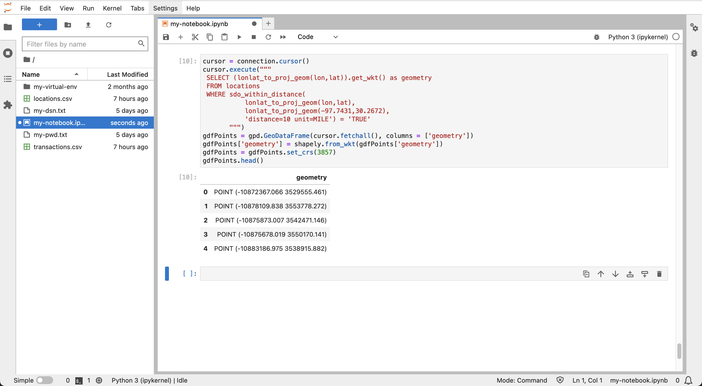
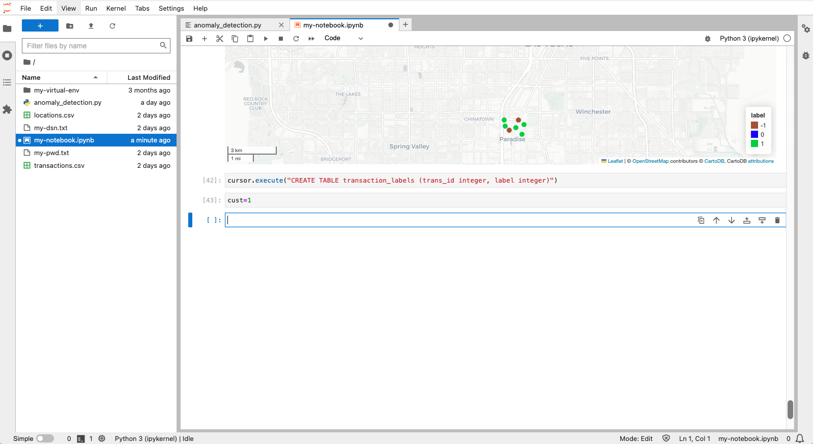
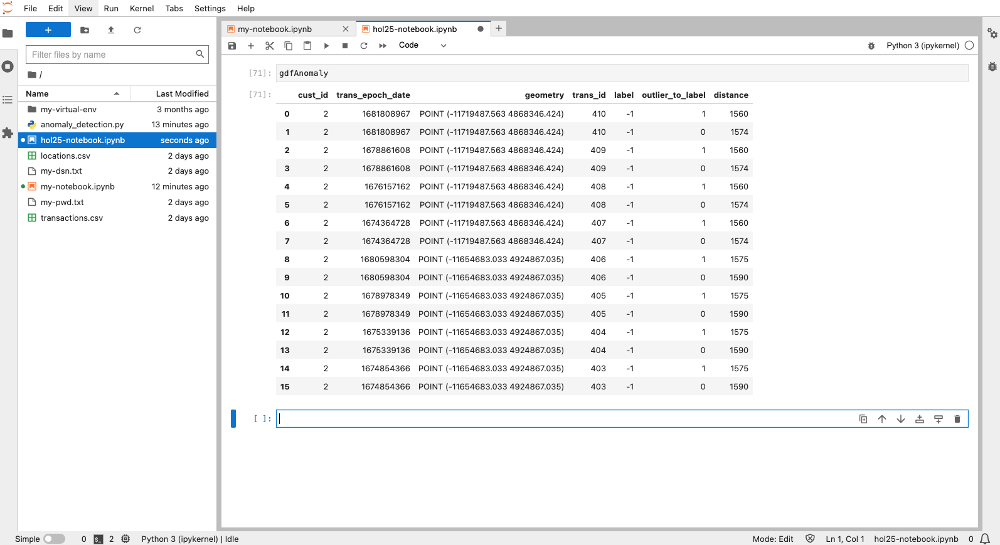

# Detectar transacciones sospechosas

## Introducción

Las funciones espaciales de Oracle Database proporcionan gestión, procesamiento y análisis de datos espaciales escalables y seguros. Una de las principales ventajas de trabajar en Python es la disponibilidad de bibliotecas de código abierto para aumentar las capacidades de análisis nativas de Oracle Database. En este laboratorio, aprovechará una biblioteca que identifica clusters en función del espacio y el tiempo, o en otras palabras, clusters espaciotemporales. Un conjunto de transacciones que se han producido dentro de un área concentrada y una ventana de tiempo pertenecen a un cluster espacio-temporal. Una transacción que ocurrió dentro de la ventana de tiempo de un cluster espacio-temporal pero lejos del área de concentración se considera sospechosa. Por ejemplo, si durante una semana determinada las transacciones de un cliente se concentraron en el área de la ciudad de Nueva York, una transacción a mediados de esa semana en California sería sospechosa. Identificará dichas incidencias en esta práctica de laboratorio.

Tiempo de laboratorio estimado: 15 minutos

### Objetivos

*   Cargar datos de transacciones de Oracle Spatial a Python
*   Detectar clusters espacio-temporales que representen el comportamiento esperado
*   Identificar valores atípicos que representen comportamientos sospechosos

### Requisitos

*   Finalización del laboratorio 6: exploración de datos

## Tarea 1: Experimentar con la agregación espacial

Para calcular la distancia de las transacciones de un cluster espacio-temporal, es conveniente representar el cluster como una sola geometría. Este es un caso de uso para la agregación espacial, donde un conjunto de geometrías está representado por un único agregado. Oracle Spatial proporciona un paquete de funciones de agregación espacial con este fin. Esta tarea está destinada a familiarizarse con la agregación espacial.

1.  Comience por crear un GeoDataFrame de elementos a partir de las ubicaciones de la tabla **LOCATIONS** a 10 millas de una coordenada de longitud/latitud en Austin, TX (-97.7431,30.2672).
    
        <copy>
        cursor = connection.cursor()
        cursor.execute("""
         SELECT (lonlat_to_proj_geom(lon,lat)).get_wkt() as geometry
         FROM locations
         WHERE sdo_within_distance(
                   lonlat_to_proj_geom(lon,lat),
                   lonlat_to_proj_geom(-97.7431,30.2672),
                   'distance=10 unit=MILE') = 'TRUE'
               """)
        gdfPoints = gpd.GeoDataFrame(cursor.fetchall(), columns = ['geometry'])
        gdfPoints['geometry'] = shapely.from_wkt(gdfPoints['geometry'])
        gdfPoints.crs = "EPSG:3857"
        gdfPoints.head()
        </copy>
        
    
    
    
2.  A continuación, cree un GeoDataFrame que contenga la ubicación en el centro de las ubicaciones seleccionadas anteriormente. Esta ubicación se denomina "centroide agregado", por lo que GeoDataFrame se denomina gdfAggCent.
    
        <copy>
        cursor.execute("""
         SELECT SDO_AGGR_CENTROID(
                  SDOAGGRTYPE(lonlat_to_proj_geom(lon,lat), 0.005)).get_wkt() as geometry
         FROM locations
         WHERE sdo_within_distance(
                   lonlat_to_proj_geom(lon,lat),
                   lonlat_to_proj_geom(-97.7431,30.2672),
                   'distance=10 unit=MILE') = 'TRUE'
               """)
        gdfAggCent = gpd.GeoDataFrame(cursor.fetchall(), columns = ['geometry'])
        gdfAggCent['geometry'] = shapely.from_wkt(gdfAggCent['geometry'])
        gdfAggCent.crs = "EPSG:3857"
        gdfAggCent
        </copy>
        
    
    
    
3.  A continuación, cree un GeoDataFrame que contenga la forma que limita las ubicaciones cercanas a la coordenada en Austin, TX. Esto se denomina "casco convexo agregado", por lo que GeoDataFrame se denomina gdfAggHull.
    
        <copy>
        cursor.execute("""
         SELECT SDO_AGGR_CONVEXHULL(
                  SDOAGGRTYPE(lonlat_to_proj_geom(lon,lat), 0.005)).get_wkt() as geometry
         FROM locations
         WHERE sdo_within_distance(
                   lonlat_to_proj_geom(lon,lat),
                   lonlat_to_proj_geom(-97.7431,30.2672),
                   'distance=10 unit=MILE') = 'TRUE'
               """)
        gdfAggHull = gpd.GeoDataFrame(cursor.fetchall(), columns = ['geometry'])
        gdfAggHull['geometry'] = shapely.from_wkt(gdfAggHull['geometry'])
        gdfAggHull.crs = "EPSG:3857"
        gdfAggHull
        </copy>
        
    
    
    
    Hay varias otras funciones de agregación espacial que siguen el mismo patrón.
    
4.  Ahora puedes visualizar los puntos y los dos agregados espaciales que has creado. Las ubicaciones originales se muestran en azul, y el centroide agregado y el casco convexo agregado se muestran en rojo.
    
        <copy>
        m = gdfPoints.explore(tiles="CartoDB positron",
                               style_kwds={"color":"blue","fillColor":"blue"})
        m = gdfAggHull.explore(m=m,
                               style_kwds={"color":"red","fillOpacity":"0"} )
        m = gdfAggCent.explore(m=m,
                               marker_kwds={"radius":"8"},
                              style_kwds={"color":"red","fillColor":"red","fillOpacity":".7"} )
        m
        </copy>
        
    
    
    

A continuación, identificará las transacciones sospechosas que se producen durante el intervalo de tiempo de un cluster espacio-temporal, pero a una distancia superior a un umbral. Dado que el área cubierta por un cluster espacio-temporal es insignificante en comparación con el umbral de distancia para una transacción sospechosa, utilizará el centroide agregado para representar la ubicación de un cluster espacio-temporal.

## Tarea 2: Preparación para la detección de cluster

1.  Comience importando las bibliotecas necesarias para detectar clusters espacio-temporales. La biblioteca principal es st\_dbscan. Además, las bibliotecas pandas y numpy son necesarias para la configuración de la entrada a st\_dbscan.
    
        <copy>
        import pandas as pd
        import numpy as np
        from st_dbscan import ST_DBSCAN
        </copy>
        
    
    
    
2.  Ahora veamos un ejemplo de detección de clusters espaciotemporales. Ejecute lo siguiente para crear un GeoDataFrame con algunas ubicaciones cada una con un ID y una hora de época.
    
        <copy>
        gdf = gpd.GeoDataFrame({
            "id": [1, 2, 3, 4, 5, 6, 7, 8, 9, 10, 11, 12, 13, 14, 15],
            "epoch_date": [1704096000, 1687881600, 1687968000, 1688054400, 1688140800, \
                           1688227200, 1672656000, 1672742400, 1672828800,  1016730016, \
                           1673001600, 1673001600, 1672915200, 673001600, 1688054400],
            "geometry": ["POINT(-115.2368 36.2650)",
                        "POINT(-115.1356 36.1823)",
                        "POINT(-115.1492 36.1779)",
                        "POINT(-115.1385 36.1910)",
                        "POINT(-115.1256 36.1804)",
                        "POINT(-115.1329 36.1735)",
                        "POINT(-115.1711 36.1212)",
                        "POINT(-115.1656 36.1228)",
                        "POINT(-115.1782 36.1221)",
                        "POINT(-115.1695 36.1253)",
                        "POINT(-115.1790 36.1254)",
                        "POINT(-115.1388 36.1858)",
                        "POINT(-115.1669 36.1176)",
                        "POINT(-115.1755 36.1199)",
                        "POINT(-115.1297 36.1900)",
            ],})
        # convert to Shapely geometries
        gdf['geometry'] = shapely.from_wkt(gdf['geometry'])
        # assign longitude/latitude coordinate system
        gdf = gdf.set_crs(4326)
        gdf
        </copy>
        
    
    
    

3\. La biblioteca ST\_DBSCAN requiere que las coordenadas estén en la misma unidad que la medición de distancia. Por lo tanto, ejecute lo siguiente para convertir el sistema de coordenadas de longitud/latitud a coordenadas x/y proyectadas en función de los metros. `<copy> # convert to projected x/y coordinates as required for st_dbscan gdf = gdf.to_crs(3857) gdf </copy>`

    
    

4\. La entrada a ST\_DBSCAN es una matriz Numpy. Por lo tanto, ejecute lo siguiente para convertir GeoDataFrame en una matriz Numpy. `<copy> # Convert to pandas dataframe df = pd.DataFrame(data={'time': gdf.epoch_date, 'x': gdf.geometry.x, 'y': gdf.geometry.y, 'id': gdf.id}) data = df.values # Convert to numpy array data = np.int_(data) data </copy>`

     
    

5.  Desde aquí, podemos ejecutar ST\_DBSCAN en nuestros datos de ejemplo. ST\_DBSCAN es una variación del algoritmo de agrupación espacial basada en densidad de aplicaciones con ruido (DBSCAN) que se amplía para trabajar con datos espaciales. Los parámetros son los umbrales para los clusters; eps1 es el umbral de distancia en las unidades del sistema de coordenadas (metros), eps2 es el umbral de tiempo en segundos y min-samples es el umbral para el mínimo de elementos. Ejecute lo siguiente para detectar clusters en los que los umbrales sean de 5 o más elementos en un radio de 5 km y aproximadamente 1 mes.
    
        <copy>
        st_cluster = ST_DBSCAN(eps1 = 5000, eps2 = 3000000, min_samples = 5)
        st_cluster.fit(data)
        </copy>
        
    
    
    

6\. El resultado es una etiqueta de entero para cada elemento de entrada. Cada etiqueta >=0 representa un cluster. La etiqueta -1 indica que el elemento no forma parte de un cluster. Revise el conjunto distinto de etiquetas resultantes. Observe que se han detectado dos clusters. `<copy> np.unique(st_cluster.labels) </copy>`

    
    

7\. Agregue la etiqueta de entero a GeoDataFrame. `<copy> df = pd.DataFrame(data={'id': df.id, 'label': st_cluster.labels}) label_mapping_dict = dict(zip(df["id"], df["label"])) gdf["label"] = gdf["id"].map(label_mapping_dict) gdf </copy>`

    
    

8.  Ejecute lo siguiente para visualizar los clusters. Observe que algunos elementos están dentro del umbral de distancia, pero no del umbral temporal.  
    
        <copy>
        gdf.explore(column="label", categorical="True", tiles="CartoDB positron", \
                    cmap=['sienna','blue','limegreen'], marker_kwds={"radius":4}, \
                    style_kwds={"fillOpacity":1})
        </copy>
        
    
    
    

En los siguientes pasos, utiliza este enfoque para detectar transacciones financieras sospechosas.

9.  El resultado de la detección de cluster es una "etiqueta" para cada elemento de datos que indica si el elemento forma parte de un cluster y, si es así, qué cluster. Realizará un análisis de cluster y guardará los resultados en la base de datos para realizar un análisis más detallado. Ejecute lo siguiente para crear una tabla de base de datos que almacene etiquetas de cluster.
    
        <copy>
        cursor.execute("CREATE TABLE transaction_labels (trans_id integer, label integer)")
        </copy>
        
    
    
    

## Tarea 3: Detección de clusters espacio-temporales

1.  En este taller, analizará las transacciones de un cliente a la vez. Ejecute lo siguiente para definir una variable para el ID de cliente para el análisis. Puede volver a esta celda para cambiar a un cliente diferente para su análisis.
    
        <copy>
        cust=1
        </copy>
        
    
    
    
2.  Cree un GeoDataframe de las transacciones del cliente. Observe la sintaxis de enlace de la cláusula WHERE (cust\_id=:cust) admitida por el controlador python-oracledb.
    
        <copy>
        cursor.execute("""
         SELECT a.cust_id,  a.trans_id, a.trans_epoch_date,
               (lonlat_to_proj_geom(b.lon,b.lat)).get_wkt()
         FROM transactions a, locations b
         WHERE a.location_id=b.location_id
         AND cust_id=:cust""", cust=cust)
        gdf = gpd.GeoDataFrame(cursor.fetchall(), columns = ['cust_id', 'trans_id', 'epoch_date', 'geometry'])
        gdf['geometry'] = shapely.from_wkt(gdf['geometry'])
        gdf.head()
        </copy>
        
    
    
    
3.  La biblioteca st\_dbscan requiere entrada en formato numpy, donde numpy es una biblioteca para manejar matrices. Ejecute los dos pasos siguientes para convertir GeoDataFrame en una matriz numpy.
    
        <copy>
        # first convert to pandas dataframe
        df = pd.DataFrame(data={'time': gdf.epoch_date, 'x': gdf.geometry.x, 'y': gdf.geometry.y, 'trans_id':  gdf.trans_id, 'cust_id':gdf.cust_id})
        df.head()
        </copy>
        
    
        <copy>
        # then convert to numpy array
        data = df.values
        data = np.int_(data)
        data[1:10]
        </copy>
        
    
    
    
4.  Ahora está listo para detectar clusters espacio-temporales para las transacciones del cliente actual. La operación acepta tres parámetros de umbral: distancia, tiempo y número mínimo de elementos. Los elementos con vecinos dentro de los umbrales de distancia y tiempo se consideran parte de un cluster, y la mayoría de ellos tienen al menos el número mínimo de elementos para calificar como cluster. La distancia está en las unidades del sistema de coordenadas, que en este caso son metros. El tiempo es en segundos. Ejecute lo siguiente para detectar clusters en los que los umbrales sean de 5 o más elementos en un radio de 5 km y aproximadamente 1 mes.
    
        <copy>
        st_cluster = ST_DBSCAN(eps1 = 5000, eps2 = 3000000, min_samples = 5)
        st_cluster.fit(data)
        </copy>
        
    
    
    
5.  El resultado es una etiqueta de entero para cada elemento de entrada. Cada etiqueta >=0 representa un cluster. La etiqueta -1 indica que el elemento no forma parte de un cluster. Revise el conjunto distinto de etiquetas resultantes. Observe que se ha detectado un cluster.
    
        <copy>
        np.unique(st_cluster.labels)
        </copy>
        
    
    
    
6.  Ejecute lo siguiente para agregar las etiquetas de cluster a las transacciones e imprimir las primeras filas. Cada transacción se etiqueta con -1 (es decir, no forma parte de un cluster) o un entero >=0 (es decir, el cluster al que pertenece el artículo).
    
        <copy>
        df = pd.DataFrame(data={'trans_id': df.trans_id, 'label': st_cluster.labels})
        df.head()
        </copy>
        
    
    
    
7.  La detección de anomalías requerirá consultas de base de datos que impliquen las etiquetas de cluster. Por lo tanto, ejecute lo siguiente para insertar las transacciones etiquetadas del cliente actual en la tabla TRANSACTION\_LABELS creada en la tarea anterior.
    
        <copy>
        cursor.executemany("""
         INSERT INTO transaction_labels
         VALUES (:1, :2)""",
         list(df[['trans_id','label']].itertuples(index=False, name=None)))
        connection.commit()
        </copy>
        
    
    
    
8.  Ejecute lo siguiente para recuperar las transacciones del cliente actual con sus etiquetas de cluster.
    
        <copy>
        # labelled transactions for customer
        cursor.execute("""
         SELECT a.cust_id, a.location_id, a.trans_id, a.trans_epoch_date,
                (lonlat_to_proj_geom(b.lon,b.lat)).get_wkt(), c.label
         FROM transactions a, locations b, transaction_labels c
         WHERE a.location_id=b.location_id
         AND a.trans_id=c.trans_id
         """)
        gdf = gpd.GeoDataFrame(cursor.fetchall(), columns = ['cust_id', 'location_id', 'trans_id', 'trans_epoch_date', 'geometry','label'])
        gdf['geometry'] = shapely.from_wkt(gdf['geometry'])
        gdf = gdf.set_crs(3857)
        gdf.head()
        </copy>
        
    
    
    
9.  Ejecute lo siguiente para visualizar las transacciones etiquetadas del cliente actual. En este caso, se incluye el parámetro para codificar los elementos en función de la etiqueta del cluster. También puede deslizar el puntero del mouse sobre un elemento para ver sus atributos, incluida la etiqueta del cluster.
    
        <copy>
        gdf.explore(column="label", categorical="True", tiles="CartoDB positron", \
                    marker_kwds={"radius":4}, style_kwds={"fillOpacity":1})
        </copy>
        
    
    
    
10.  Acercándose al área de Austin, TX donde se concentran las ubicaciones de transacción del cliente actual, observe la codificación de color que indica cuáles son parte del cluster espacio-temporal.
    
    
    

## Tarea 4: Detección de anomalías

1.  Ejecute lo siguiente para crear centroides agregados para los clusters espaciotemporales del cliente actual con atributos para la etiqueta del cluster, el rango temporal y el número de transacciones en el cluster. Observe que el primer cliente solo tiene 1 cluster (etiqueta = 0).
    
        <copy>
        # st cluster centroids for customer
        cursor = connection.cursor()
        cursor.execute("""
         SELECT label, min(trans_epoch_date) as min_time, max(trans_epoch_date) as max_time,
                 SDO_AGGR_CENTROID(
                  SDOAGGRTYPE(lonlat_to_proj_geom(b.lon,b.lat), 0.005)).get_wkt() as geometry,
                 count(*) as trans_count
         FROM transactions a, locations b, transaction_labels c
         WHERE a.location_id=b.location_id
         AND a.trans_id=c.trans_id
         AND c.label != -1
         GROUP BY label
               """)
        gdf = gpd.GeoDataFrame(cursor.fetchall(), columns = ['label','min_time','max_time','geometry','trans_count'])
        gdf['geometry'] = shapely.from_wkt(gdf['geometry'])
        gdf = gdf.set_crs(3857)
        gdf.head()
        </copy>
        
    
    
    
2.  Ejecute lo siguiente para visualizar el centroide del cluster espaciotemporal.
    
        <copy>
        gdf.explore(tiles="CartoDB positron", marker_kwds={"radius":4})
        </copy>
        
    
    
    
3.  Para identificar las transacciones de cliente actuales dentro del rango temporal de clusters y ubicadas a una distancia superior a un umbral, ejecutará una consulta mediante el comando WITH ... AS... Seleccionar .. WHERE... sintaxis como la siguiente.
    
        WITH
            x as ( [transactions] ),
            y as ( [spatiotemporal cluster aggregate centroids] )
        SELECT [transaction, cluster label, distance from cluster aggregate centroid, ...]
        FROM x, y
        WHERE [transaction time within cluster time frame]
        AND [distance from cluster > threshold]
        
    
    Ejecute la siguiente consulta para devolver transacciones sospechosas junto con la etiqueta de cluster asociada y la distancia desde el cluster.
    
        <copy>
        cursor = connection.cursor()
        cursor.execute("""
        WITH
           x as (
               SELECT a.cust_id, a.location_id, a.trans_id, a.trans_epoch_date,
                      lonlat_to_proj_geom(b.lon,b.lat) as proj_geom, c.label
               FROM transactions a, locations b, transaction_labels c
               WHERE a.location_id=b.location_id
               AND a.trans_id=c.trans_id ),
           y as (
               SELECT label, min(trans_epoch_date) as min_time, max(trans_epoch_date) as max_time,
                      SDO_AGGR_CENTROID(
                          SDOAGGRTYPE(lonlat_to_proj_geom(b.lon,b.lat), 0.005)) as proj_geom,
                      count(*) as trans_count
               FROM transactions a, locations b, transaction_labels c
               WHERE a.location_id=b.location_id
               AND a.trans_id=c.trans_id
               AND c.label != -1
               GROUP BY label)
         SELECT x.cust_id, x.trans_epoch_date, (x.proj_geom).get_wkt(), x.trans_id, x.label, y.label,
                round(sdo_geom.sdo_distance(x.proj_geom, y.proj_geom, 0.05, 'unit=KM'))
         FROM x, y
         WHERE x.trans_epoch_date between y.min_time and y.max_time
         AND x.label!=y.label
         AND x.label=-1
         AND sdo_within_distance(x.proj_geom, y.proj_geom, 'distance=500 unit=KM') = 'FALSE'
               """)
        gdfAnomaly = gpd.GeoDataFrame(cursor.fetchall(), columns = ['cust_id','trans_epoch_date','geometry', 'trans_id','label','outlier_to_label','distance'])
        gdfAnomaly['geometry'] = shapely.from_wkt(gdfAnomaly['geometry'])
        gdfAnomaly = gdfAnomaly.set_crs(3857)
        gdfAnomaly.head()
        </copy>
        
    
    
    
4.  Ejecute lo siguiente para visualizar los clusters espaciotemporales como marcadores azules y valores atípicos sospechosos asociados como marcadores rojos. Pase el mouse sobre las transacciones sospechosas para ver sus atributos.
    
        <copy>
        m = gdf.explore(tiles="CartoDB positron", marker_type='circle_marker',marker_kwds={"radius":"5"},
                        style_kwds={"color":"blue","fillColor":"blue", "fillOpacity":"1"})
        m = gdfAnomaly.explore(m=m, marker_type='circle_marker', marker_kwds={"radius":"5"},
                               style_kwds={"color":"red","fillColor":"red", "fillOpacity":"1"} )
        m.fit_bounds(m.get_bounds())
        m
        </copy>
        
    
    
    
    Para repetir el proceso de las transacciones del otro cliente, puede desplazarse hasta la celda en la que está definido el ID de cliente, actualizar a otro ID de cliente y volver a ejecutar las celdas siguientes. Sin embargo, es más conveniente utilizar un script que ejecute todos los pasos.
    
5.  Utilice el siguiente enlace para descargar un script que incluya todos los pasos para la detección de anomalías:
    
    *   [anomaly\_detection.py](./files/anomaly_detection.py)
    
    
    
6.  Haga clic en el botón Upload (Cargar), navegue hasta el script que descargó y cargue el archivo de script.
    
    
    
7.  Ejecute lo siguiente para importar el script.
    
        <copy>
        from anomaly_detection import *
        </copy>
        
    
    
    
    Ahora puede analizar las transacciones de otros clientes mediante las funciones del script. Estos reproducirán los pasos anteriores a partir de la tarea 3 después de vaciar la tabla TRANSACTION\_LABELS como un nuevo juego de etiquetas.
    
    *   create\_connection() establece una conexión a la base de datos
    *   get\_cluster\_centroids( ) detecta clusters de transacciones espacio-temporales para un cliente
    *   get\_anomalies( ) identifica las transacciones sospechosas en función del tiempo de superposición y la distancia más allá del umbral de los clusters
    *   get\_map( ) devuelve un mapa de clusters y transacciones sospechosas asociadas
8.  Ejecute lo siguiente para detectar transacciones sospechosas para el ID de cliente = 2.
    
        <copy>
        cust = 2
        </copy>
        
    
        <copy>
        create_connection()
        gdf = get_cluster_centroids(cust)
        gdfAnomaly = get_anomalies(cust)
        m = get_map()
        </copy>
        
    
    
    
9.  Ejecute lo siguiente para mostrar los clusters espaciotemporales.
    
        <copy>
        gdf
        </copy>
        
    
    
    
10.  Ejecute lo siguiente para mostrar las anomalías asociadas.
    
        <copy>
        gdfAnomaly
        </copy>
        
    
    
    
11.  Ejecute lo siguiente para visualizar los clusters y las anomalías asociadas.
    
        <copy>
        m.fit_bounds(m.get_bounds())
        m
        </copy>
        

      
    
    To detect suspicious for other customers, scroll up to step 8, set a different customer id, and re-run the the subsequent cells to call the functions in the script.
    

Esperamos que este taller haya sido informativo y que explore más a fondo las funciones espaciales de Oracle Database y su uso en flujos de trabajo de aprendizaje automático e IA.

## Más información

*   Para obtener más información sobre las funciones de agregación espacial, consulte [https://docs.oracle.com/en/database/oracle/oracle-database/19/spatl/spatial-aggregate-functions.html](https://docs.oracle.com/en/database/oracle/oracle-database/19/spatl/spatial-aggregate-functions.html).
*   Para obtener más información sobre st\_dbscan, consulte [ST-DBSCAN: Un algoritmo para la agrupación en clusters de datos espacio-temporales](https://www.sciencedirect.com/science/article/pii/S0169023X06000218) y [https://github.com/eren-ck/st\_dbscan](https://github.com/eren-ck/st_dbscan)

## Reconocimientos

*   **Autor**: David Lapp, Database Product Management, Oracle
*   **Contribuyentes**: Rahul Tasker, Denise Myrick, Ramu Gutiérrez
*   **Última actualización por/fecha**: David Lapp, agosto de 2023