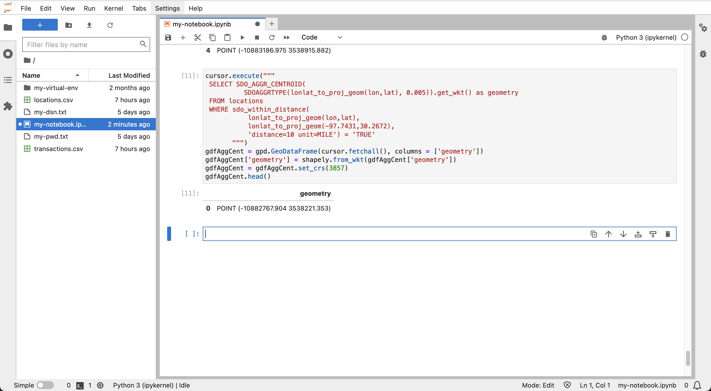
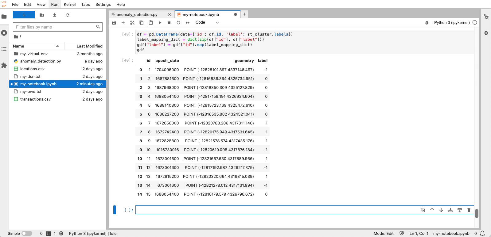
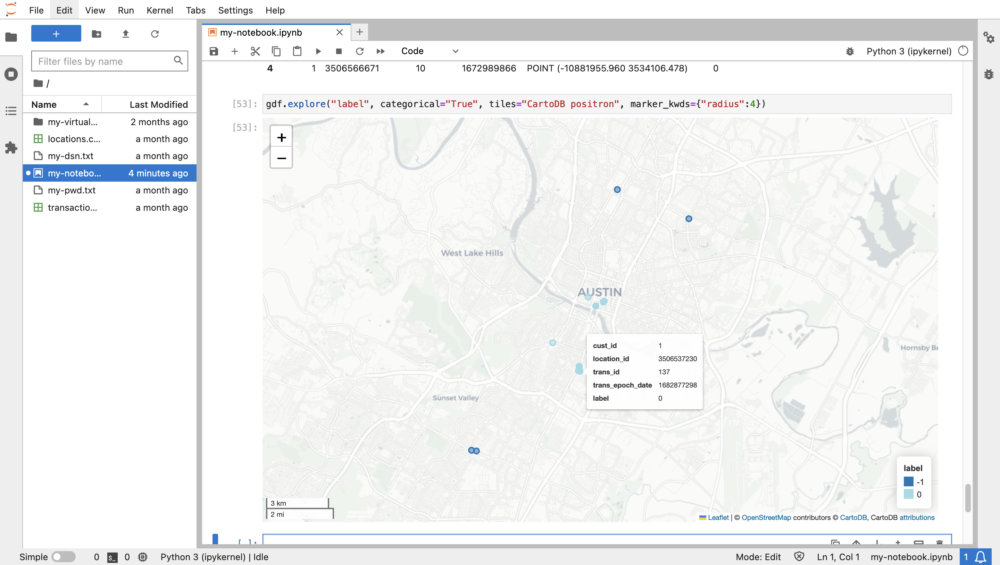
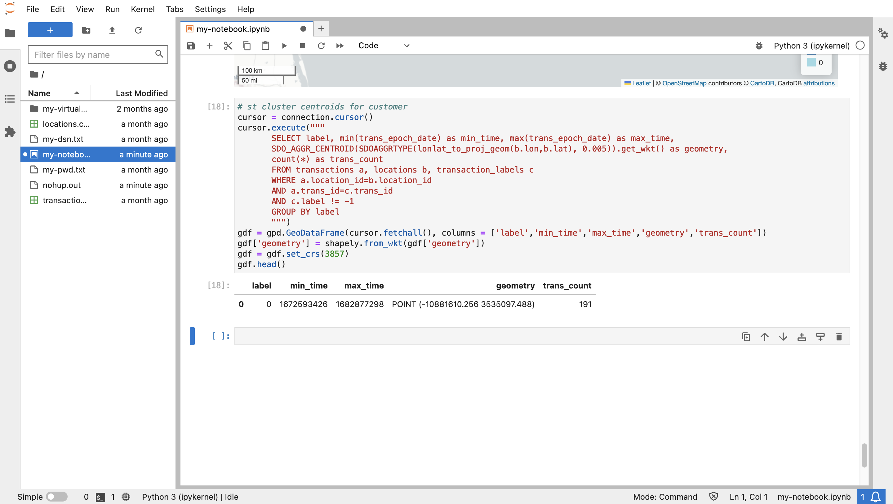
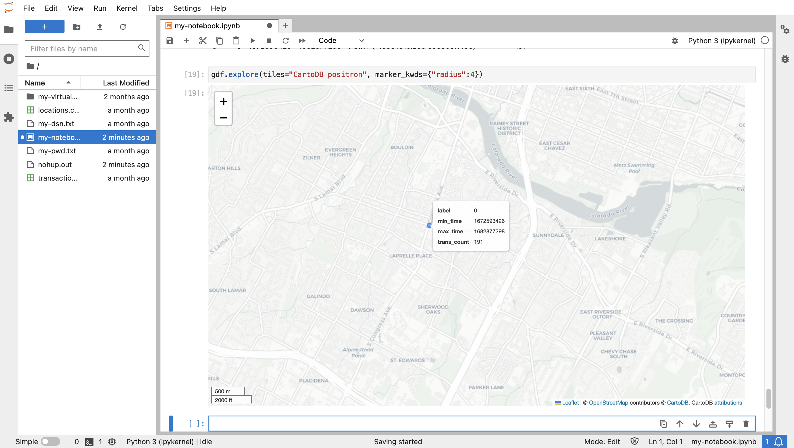

# Détecter les transactions suspectes

## Présentation

Les fonctionnalités spatiales d'Oracle Database fournissent une gestion, un traitement et une analyse des données spatiales évolutives et sécurisées. L'un des principaux avantages de l'utilisation de Python est la disponibilité de bibliothèques open source pour augmenter les capacités d'analyse native d'Oracle Database. Dans cet exercice, vous allez utiliser une bibliothèque qui identifie les clusters en fonction de l'espace et du temps, c'est-à-dire les clusters spatiotemporels. Un ensemble de transactions survenues au sein d'une zone et d'une fenêtre temporelles concentrées appartient à un cluster spatio-temporel. Une transaction qui s'est produite dans la fenêtre de temps d'un amas spatio-temporel mais loin de la zone de concentration est considérée comme suspecte. Par exemple, si, au cours d'une semaine donnée, les transactions d'un client étaient concentrées dans la région de New York, une transaction au milieu de cette semaine en Californie serait suspecte. Vous allez identifier ces occurrences dans cet exercice.

Temps de laboratoire estimé : 15 minutes

### Objectifs

*   Charger des données de transactions d'Oracle Spatial vers Python
*   Détecter les clusters spatio-temporels représentant le comportement attendu
*   Identifier les valeurs aberrantes qui représentent un comportement suspect

### Prérequis

*   Achèvement de l'atelier 6 : Explorer les données

## Tâche 1 : expérimenter l'agrégation spatiale

Pour calculer la distance des transactions à partir d'un cluster spatio-temporel, il est pratique de représenter le cluster sous la forme d'une géométrie unique. Il s'agit d'un cas d'utilisation pour l'agrégation spatiale, où un ensemble de géométries est représenté par un agrégat unique. Oracle Spatial fournit un ensemble de fonctions d'agrégation spatiale à cette fin. Cette tâche est destinée à vous familiariser avec l'agrégation spatiale.

1.  Commencez par créer un GeoDataFrame d'éléments à partir des emplacements de table **LOCATIONS** à moins de 10 miles d'une coordonnée longitude/latitude à Austin, TX (-97.7431,30.2672).
    
        <copy>
        cursor = connection.cursor()
        cursor.execute("""
         SELECT (lonlat_to_proj_geom(lon,lat)).get_wkt() as geometry
         FROM locations
         WHERE sdo_within_distance(
                   lonlat_to_proj_geom(lon,lat),
                   lonlat_to_proj_geom(-97.7431,30.2672),
                   'distance=10 unit=MILE') = 'TRUE'
               """)
        gdfPoints = gpd.GeoDataFrame(cursor.fetchall(), columns = ['geometry'])
        gdfPoints['geometry'] = shapely.from_wkt(gdfPoints['geometry'])
        gdfPoints.crs = "EPSG:3857"
        gdfPoints.head()
        </copy>
        
    
    
    
2.  Créez ensuite une GeoDataFrame contenant l'emplacement au centre des emplacements précédemment sélectionnés. Cet emplacement est appelé "centroïde agrégé", de sorte que GeoDataFrame est nommé gdfAggCent.
    
        <copy>
        cursor.execute("""
         SELECT SDO_AGGR_CENTROID(
                  SDOAGGRTYPE(lonlat_to_proj_geom(lon,lat), 0.005)).get_wkt() as geometry
         FROM locations
         WHERE sdo_within_distance(
                   lonlat_to_proj_geom(lon,lat),
                   lonlat_to_proj_geom(-97.7431,30.2672),
                   'distance=10 unit=MILE') = 'TRUE'
               """)
        gdfAggCent = gpd.GeoDataFrame(cursor.fetchall(), columns = ['geometry'])
        gdfAggCent['geometry'] = shapely.from_wkt(gdfAggCent['geometry'])
        gdfAggCent.crs = "EPSG:3857"
        gdfAggCent
        </copy>
        
    
    
    
3.  Créez ensuite un GeoDataFrame contenant la forme qui délimite les emplacements à proximité de la coordonnée à Austin, TX. Il s'agit d'une "coque convexe agrégée". Par conséquent, GeoDataFrame est nommé gdfAggHull.
    
        <copy>
        cursor.execute("""
         SELECT SDO_AGGR_CONVEXHULL(
                  SDOAGGRTYPE(lonlat_to_proj_geom(lon,lat), 0.005)).get_wkt() as geometry
         FROM locations
         WHERE sdo_within_distance(
                   lonlat_to_proj_geom(lon,lat),
                   lonlat_to_proj_geom(-97.7431,30.2672),
                   'distance=10 unit=MILE') = 'TRUE'
               """)
        gdfAggHull = gpd.GeoDataFrame(cursor.fetchall(), columns = ['geometry'])
        gdfAggHull['geometry'] = shapely.from_wkt(gdfAggHull['geometry'])
        gdfAggHull.crs = "EPSG:3857"
        gdfAggHull
        </copy>
        
    
    
    
    Il existe plusieurs autres fonctions d'agrégation spatiale qui suivent le même modèle.
    
4.  Vous pouvez maintenant visualiser les points et les deux agrégats spatiaux que vous avez créés. Les emplacements d'origine sont affichés en bleu et la coque convexe agrégée et centroïde sont affichés en rouge.
    
        <copy>
        m = gdfPoints.explore(tiles="CartoDB positron",
                               style_kwds={"color":"blue","fillColor":"blue"})
        m = gdfAggHull.explore(m=m,
                               style_kwds={"color":"red","fillOpacity":"0"} )
        m = gdfAggCent.explore(m=m,
                               marker_kwds={"radius":"8"},
                              style_kwds={"color":"red","fillColor":"red","fillOpacity":".7"} )
        m
        </copy>
        
    
    
    

Vous allez ensuite identifier les transactions suspectes qui se produisent pendant la période d'un cluster spatio-temporel mais à une distance supérieure à un seuil. Étant donné que la zone couverte par un amas spatio-temporel est insignifiante par rapport au seuil de distance pour une transaction suspecte, vous utiliserez le centroïde agrégé pour représenter l'emplacement d'un amas spatio-temporel.

## Tâche 2 : préparation à la détection de cluster

1.  Commencez par importer les bibliothèques nécessaires à la détection des clusters spatio-temporels. La bibliothèque principale est st\_dbscan. En outre, les bibliothèques pandas et numpy sont requises pour la configuration de l'entrée dans st\_dbscan.
    
        <copy>
        import pandas as pd
        import numpy as np
        from st_dbscan import ST_DBSCAN
        </copy>
        
    
    
    
2.  Passons maintenant à un exemple de détection des grappes spatio-temporelles. Exécutez la commande suivante pour créer un fichier GeoDataFrame avec des emplacements présentant chacun une période et un ID.
    
        <copy>
        gdf = gpd.GeoDataFrame({
            "id": [1, 2, 3, 4, 5, 6, 7, 8, 9, 10, 11, 12, 13, 14, 15],
            "epoch_date": [1704096000, 1687881600, 1687968000, 1688054400, 1688140800, \
                           1688227200, 1672656000, 1672742400, 1672828800,  1016730016, \
                           1673001600, 1673001600, 1672915200, 673001600, 1688054400],
            "geometry": ["POINT(-115.2368 36.2650)",
                        "POINT(-115.1356 36.1823)",
                        "POINT(-115.1492 36.1779)",
                        "POINT(-115.1385 36.1910)",
                        "POINT(-115.1256 36.1804)",
                        "POINT(-115.1329 36.1735)",
                        "POINT(-115.1711 36.1212)",
                        "POINT(-115.1656 36.1228)",
                        "POINT(-115.1782 36.1221)",
                        "POINT(-115.1695 36.1253)",
                        "POINT(-115.1790 36.1254)",
                        "POINT(-115.1388 36.1858)",
                        "POINT(-115.1669 36.1176)",
                        "POINT(-115.1755 36.1199)",
                        "POINT(-115.1297 36.1900)",
            ],})
        # convert to Shapely geometries
        gdf['geometry'] = shapely.from_wkt(gdf['geometry'])
        # assign longitude/latitude coordinate system
        gdf = gdf.set_crs(4326)
        gdf
        </copy>
        
    
    
    

3\. La bibliothèque ST\_DBSCAN exige que les coordonnées soient dans la même unité que la mesure de distance. Par conséquent, exécutez la commande suivante pour convertir le système de coordonnées de longitude/latitude en coordonnées x/y projetées en fonction des compteurs. `<copy> # convert to projected x/y coordinates as required for st_dbscan gdf = gdf.to_crs(3857) gdf </copy>`

    
    

4\. L'entrée dans ST\_DBSCAN est un tableau de type Numpy. Par conséquent, exécutez la commande suivante pour convertir GeoDataFrame en tableau Numpy. `<copy> # Convert to pandas dataframe df = pd.DataFrame(data={'time': gdf.epoch_date, 'x': gdf.geometry.x, 'y': gdf.geometry.y, 'id': gdf.id}) data = df.values # Convert to numpy array data = np.int_(data) data </copy>`

     
    

5.  A partir de là, nous pouvons exécuter ST\_DBSCAN sur nos données échantillon. ST\_DBSCAN est une variante de l'algorithme DBSCAN (Density-Based Spatial Clustering of Applications with Noise) qui est étendu pour fonctionner avec des données spatiales. Les paramètres sont les seuils des clusters ; eps1 est le seuil de distance dans les unités du système de coordonnées (mètres), eps2 est le seuil de temps en secondes et min-samples est le seuil de minimum d'éléments. Exécutez la commande suivante pour détecter les clusters dont les seuils sont de 5 éléments ou plus dans un rayon de 5 kms et d'environ 1 mois.
    
        <copy>
        st_cluster = ST_DBSCAN(eps1 = 5000, eps2 = 3000000, min_samples = 5)
        st_cluster.fit(data)
        </copy>
        
    
    
    

6\. Le résultat est un libellé entier pour chaque élément d'entrée. Chaque étiquette >=0 représente un cluster. Le libellé -1 indique que l'élément ne fait pas partie d'un cluster. Vérifiez l'ensemble distinct de libellés obtenus. Notez que deux clusters ont été détectés. `<copy> np.unique(st_cluster.labels) </copy>`

    
    

7\. Ajoutez le libellé entier à GeoDataFrame. `<copy> df = pd.DataFrame(data={'id': df.id, 'label': st_cluster.labels}) label_mapping_dict = dict(zip(df["id"], df["label"])) gdf["label"] = gdf["id"].map(label_mapping_dict) gdf </copy>`

    
    

8.  Exécutez la commande suivante pour visualiser les clusters. Certains éléments sont compris dans le seuil de distance, mais pas dans le seuil temporel.  
    
        <copy>
        gdf.explore(column="label", categorical="True", tiles="CartoDB positron", \
                    cmap=['sienna','blue','limegreen'], marker_kwds={"radius":4}, \
                    style_kwds={"fillOpacity":1})
        </copy>
        
    
    
    

Dans les étapes suivantes, vous allez utiliser cette approche pour détecter les transactions financières suspectes.

9.  Le résultat de la détection de cluster est une "étiquette" pour chaque élément de données indiquant si l'élément fait partie d'un cluster et, le cas échéant, quel cluster. Vous allez effectuer une analyse de cluster et enregistrer les résultats dans la base de données pour une analyse plus approfondie. Exécutez la commande suivante pour créer une table de base de données qui stockera les libellés de cluster.
    
        <copy>
        cursor.execute("CREATE TABLE transaction_labels (trans_id integer, label integer)")
        </copy>
        
    
    
    

## Tâche 3 : Détecter les grappes spatio-temporelles

1.  Dans cet atelier, vous allez analyser les transactions pour un client à la fois. Exécutez la commande suivante pour définir une variable pour l'ID client à analyser. Vous pouvez revenir à cette cellule pour passer à un autre client pour analyse.
    
        <copy>
        cust=1
        </copy>
        
    
    
    
2.  Créez une GeoDataframe des transactions du client. Notez la syntaxe de liaison dans la clause WHERE (cust\_id= :cust) prise en charge par le pilote python-oracledb.
    
        <copy>
        cursor.execute("""
         SELECT a.cust_id,  a.trans_id, a.trans_epoch_date,
               (lonlat_to_proj_geom(b.lon,b.lat)).get_wkt()
         FROM transactions a, locations b
         WHERE a.location_id=b.location_id
         AND cust_id=:cust""", cust=cust)
        gdf = gpd.GeoDataFrame(cursor.fetchall(), columns = ['cust_id', 'trans_id', 'epoch_date', 'geometry'])
        gdf['geometry'] = shapely.from_wkt(gdf['geometry'])
        gdf.head()
        </copy>
        
    
    
    
3.  La bibliothèque st\_dbscan requiert une entrée au format numpy, où numpy est une bibliothèque pour la gestion des tableaux. Exécutez les deux étapes suivantes pour convertir votre fichier GeoDataFrame en tableau numpy.
    
        <copy>
        # first convert to pandas dataframe
        df = pd.DataFrame(data={'time': gdf.epoch_date, 'x': gdf.geometry.x, 'y': gdf.geometry.y, 'trans_id':  gdf.trans_id, 'cust_id':gdf.cust_id})
        df.head()
        </copy>
        
    
        <copy>
        # then convert to numpy array
        data = df.values
        data = np.int_(data)
        data[1:10]
        </copy>
        
    
    
    
4.  Vous êtes maintenant prêt à détecter des clusters spatiotemporels pour les transactions du client actuel. L'opération accepte trois paramètres de seuil : distance, temps et nombre minimal d'éléments. Les éléments avec des voisins dans les seuils de distance et de temps sont considérés comme faisant partie d'un cluster, et il y a au moins le nombre minimal d'éléments à qualifier en tant que cluster. La distance est dans les unités du système de coordonnées, qui dans ce cas sont des mètres. Le temps est en secondes. Exécutez la commande suivante pour détecter les clusters dont les seuils sont de 5 éléments ou plus dans un rayon de 5 kms et d'environ 1 mois.
    
        <copy>
        st_cluster = ST_DBSCAN(eps1 = 5000, eps2 = 3000000, min_samples = 5)
        st_cluster.fit(data)
        </copy>
        
    
    
    
5.  Le résultat est un libellé entier pour chaque élément d'entrée. Chaque étiquette >=0 représente un cluster. Le libellé -1 indique que l'élément ne fait pas partie d'un cluster. Vérifiez l'ensemble distinct de libellés obtenus. Notez qu'un cluster a été détecté.
    
        <copy>
        np.unique(st_cluster.labels)
        </copy>
        
    
    
    
6.  Exécutez la commande suivante pour ajouter les étiquettes de cluster aux transactions et imprimer les premières lignes. Chaque transaction est étiquetée avec -1 (c'est-à-dire ne faisant pas partie d'un cluster) ou un entier >=0 (c'est-à-dire le cluster auquel l'élément appartient).
    
        <copy>
        df = pd.DataFrame(data={'trans_id': df.trans_id, 'label': st_cluster.labels})
        df.head()
        </copy>
        
    
    
    
7.  La détection des anomalies nécessite des requêtes de base de données impliquant les libellés de cluster. Exécutez la commande suivante pour insérer les transactions étiquetées du client en cours dans la table TRANSACTION\_LABELS créée dans la tâche précédente.
    
        <copy>
        cursor.executemany("""
         INSERT INTO transaction_labels
         VALUES (:1, :2)""",
         list(df[['trans_id','label']].itertuples(index=False, name=None)))
        connection.commit()
        </copy>
        
    
    
    
8.  Exécutez la commande suivante pour extraire les transactions du client actuel avec ses étiquettes de cluster.
    
        <copy>
        # labelled transactions for customer
        cursor.execute("""
         SELECT a.cust_id, a.location_id, a.trans_id, a.trans_epoch_date,
                (lonlat_to_proj_geom(b.lon,b.lat)).get_wkt(), c.label
         FROM transactions a, locations b, transaction_labels c
         WHERE a.location_id=b.location_id
         AND a.trans_id=c.trans_id
         """)
        gdf = gpd.GeoDataFrame(cursor.fetchall(), columns = ['cust_id', 'location_id', 'trans_id', 'trans_epoch_date', 'geometry','label'])
        gdf['geometry'] = shapely.from_wkt(gdf['geometry'])
        gdf = gdf.set_crs(3857)
        gdf.head()
        </copy>
        
    
    
    
9.  Exécutez la commande suivante pour visualiser les transactions étiquetées du client actuel. Dans ce cas, vous incluez le paramètre de codage couleur des éléments en fonction du libellé de cluster. Vous pouvez également passer le curseur de la souris sur un élément pour voir ses attributs, y compris le libellé de cluster.
    
        <copy>
        gdf.explore(column="label", categorical="True", tiles="CartoDB positron", \
                    marker_kwds={"radius":4}, style_kwds={"fillOpacity":1})
        </copy>
        
    
    
    
10.  En zoomant dans la zone d'Austin, TX où les emplacements de transaction du client actuel sont concentrés, observez le codage couleur indiquant qui font partie du cluster spatio-temporel.
    
    
    

## Tâche 4 : détecter les anomalies

1.  Exécutez la commande suivante pour créer des centroïdes agrégés pour les clusters spatio-temporels du client actuel avec des attributs d'étiquette de cluster, de période et de nombre de transactions dans le cluster. Notez que le premier client n'a que 1 cluster (étiquette = 0).
    
        <copy>
        # st cluster centroids for customer
        cursor = connection.cursor()
        cursor.execute("""
         SELECT label, min(trans_epoch_date) as min_time, max(trans_epoch_date) as max_time,
                 SDO_AGGR_CENTROID(
                  SDOAGGRTYPE(lonlat_to_proj_geom(b.lon,b.lat), 0.005)).get_wkt() as geometry,
                 count(*) as trans_count
         FROM transactions a, locations b, transaction_labels c
         WHERE a.location_id=b.location_id
         AND a.trans_id=c.trans_id
         AND c.label != -1
         GROUP BY label
               """)
        gdf = gpd.GeoDataFrame(cursor.fetchall(), columns = ['label','min_time','max_time','geometry','trans_count'])
        gdf['geometry'] = shapely.from_wkt(gdf['geometry'])
        gdf = gdf.set_crs(3857)
        gdf.head()
        </copy>
        
    
    
    
2.  Exécutez ce qui suit pour visualiser le centroïde de l'amas spatio-temporel.
    
        <copy>
        gdf.explore(tiles="CartoDB positron", marker_kwds={"radius":4})
        </copy>
        
    
    
    
3.  Pour identifier les transactions client en cours dans la période des clusters et situées à une distance supérieure à un seuil, vous allez exécuter une requête à l'aide de la commande WITH... AS... SELECT .. WHERE... syntaxe comme suit.
    
        WITH
            x as ( [transactions] ),
            y as ( [spatiotemporal cluster aggregate centroids] )
        SELECT [transaction, cluster label, distance from cluster aggregate centroid, ...]
        FROM x, y
        WHERE [transaction time within cluster time frame]
        AND [distance from cluster > threshold]
        
    
    Exécutez la requête suivante pour renvoyer les transactions suspectes avec le libellé de cluster associé et la distance par rapport au cluster.
    
        <copy>
        cursor = connection.cursor()
        cursor.execute("""
        WITH
           x as (
               SELECT a.cust_id, a.location_id, a.trans_id, a.trans_epoch_date,
                      lonlat_to_proj_geom(b.lon,b.lat) as proj_geom, c.label
               FROM transactions a, locations b, transaction_labels c
               WHERE a.location_id=b.location_id
               AND a.trans_id=c.trans_id ),
           y as (
               SELECT label, min(trans_epoch_date) as min_time, max(trans_epoch_date) as max_time,
                      SDO_AGGR_CENTROID(
                          SDOAGGRTYPE(lonlat_to_proj_geom(b.lon,b.lat), 0.005)) as proj_geom,
                      count(*) as trans_count
               FROM transactions a, locations b, transaction_labels c
               WHERE a.location_id=b.location_id
               AND a.trans_id=c.trans_id
               AND c.label != -1
               GROUP BY label)
         SELECT x.cust_id, x.trans_epoch_date, (x.proj_geom).get_wkt(), x.trans_id, x.label, y.label,
                round(sdo_geom.sdo_distance(x.proj_geom, y.proj_geom, 0.05, 'unit=KM'))
         FROM x, y
         WHERE x.trans_epoch_date between y.min_time and y.max_time
         AND x.label!=y.label
         AND x.label=-1
         AND sdo_within_distance(x.proj_geom, y.proj_geom, 'distance=500 unit=KM') = 'FALSE'
               """)
        gdfAnomaly = gpd.GeoDataFrame(cursor.fetchall(), columns = ['cust_id','trans_epoch_date','geometry', 'trans_id','label','outlier_to_label','distance'])
        gdfAnomaly['geometry'] = shapely.from_wkt(gdfAnomaly['geometry'])
        gdfAnomaly = gdfAnomaly.set_crs(3857)
        gdfAnomaly.head()
        </copy>
        
    
    
    
4.  Exécutez la commande suivante pour visualiser les grappes spatio-temporelles en tant que marqueurs bleus et les valeurs aberrantes suspectes associées en tant que marqueurs rouges. Positionnez le pointeur de la souris sur la ou les transactions suspectes pour voir leurs attributs.
    
        <copy>
        m = gdf.explore(tiles="CartoDB positron", marker_type='circle_marker',marker_kwds={"radius":"5"},
                        style_kwds={"color":"blue","fillColor":"blue", "fillOpacity":"1"})
        m = gdfAnomaly.explore(m=m, marker_type='circle_marker', marker_kwds={"radius":"5"},
                               style_kwds={"color":"red","fillColor":"red", "fillOpacity":"1"} )
        m.fit_bounds(m.get_bounds())
        m
        </copy>
        
    
    
    
    Pour répéter le processus pour les transactions de l'autre client, vous pouvez faire défiler la page jusqu'à la cellule où l'ID client est défini, mettre à jour vers un autre ID client et réexécuter les cellules suivantes. Toutefois, il est plus pratique d'utiliser un script qui exécute toutes les étapes.
    
5.  Utilisez le lien suivant pour télécharger un script qui inclut toutes les étapes de détection d'anomalies :
    
    *   [anomaly\_detection.py](./files/anomaly_detection.py)
    
    
    
6.  Cliquez sur le bouton de téléchargement, accédez au script que vous avez téléchargé et téléchargez le fichier de script.
    
    
    
7.  Exécutez la commande suivante pour importer le script.
    
        <copy>
        from anomaly_detection import *
        </copy>
        
    
    
    
    Vous pouvez désormais analyser les transactions d'autres clients à l'aide des fonctions du script. Elles reproduiront les étapes précédentes à partir de la tâche 3 après avoir vidé la table TRANSACTION\_LABELS en tant que nouvel ensemble d'étiquettes.
    
    *   create\_connection() établit une connexion de base de données
    *   get\_cluster\_centroids( ) détecte les clusters de transactions spatio-temporels pour un client
    *   get\_anomalies( ) identifie les transactions suspectes en fonction du chevauchement de la durée et de la distance au-delà du seuil des clusters
    *   get\_map( ) renvoie une carte des clusters et des transactions suspectes associées
8.  Exécutez la commande suivante pour détecter les transactions suspectes pour l'ID client = 2.
    
        <copy>
        cust = 2
        </copy>
        
    
        <copy>
        create_connection()
        gdf = get_cluster_centroids(cust)
        gdfAnomaly = get_anomalies(cust)
        m = get_map()
        </copy>
        
    
    
    
9.  Exécutez la commande suivante pour répertorier les clusters spatio-temporels.
    
        <copy>
        gdf
        </copy>
        
    
    
    
10.  Exécutez la commande suivante pour répertorier les anomalies associées.
    
        <copy>
        gdfAnomaly
        </copy>
        
    
    
    
11.  Exécutez la commande suivante pour visualiser les clusters et les anomalies associées.
    
        <copy>
        m.fit_bounds(m.get_bounds())
        m
        </copy>
        

      
    
    To detect suspicious for other customers, scroll up to step 8, set a different customer id, and re-run the the subsequent cells to call the functions in the script.
    

Nous espérons que cet atelier a été instructif et que vous explorerez plus avant les fonctionnalités spatiales d'Oracle Database et leur utilisation dans le machine learning et les workflows d'IA.

## En savoir plus

*   Pour plus d'informations sur les fonctions d'agrégation Spatial, reportez-vous à [https://docs.oracle.com/en/database/oracle/oracle-database/19/spatl/spatial-aggregate-functions.html](https://docs.oracle.com/en/database/oracle/oracle-database/19/spatl/spatial-aggregate-functions.html)
*   Pour plus d'informations sur st\_dbscan, reportez-vous à [ST-DBSCAN : algorithme de clustering de données spatio-temporelles](https://www.sciencedirect.com/science/article/pii/S0169023X06000218) et à [https://github.com/eren-ck/st\_dbscan](https://github.com/eren-ck/st_dbscan)

## Accusés de réception

*   **Auteur** - David Lapp, Database Product Management, Oracle
*   **Contributeurs** - Rahul Tasker, Denise Myrick, Ramu Gutierrez
*   **Dernière mise à jour par/date** - David Lapp, août 2023