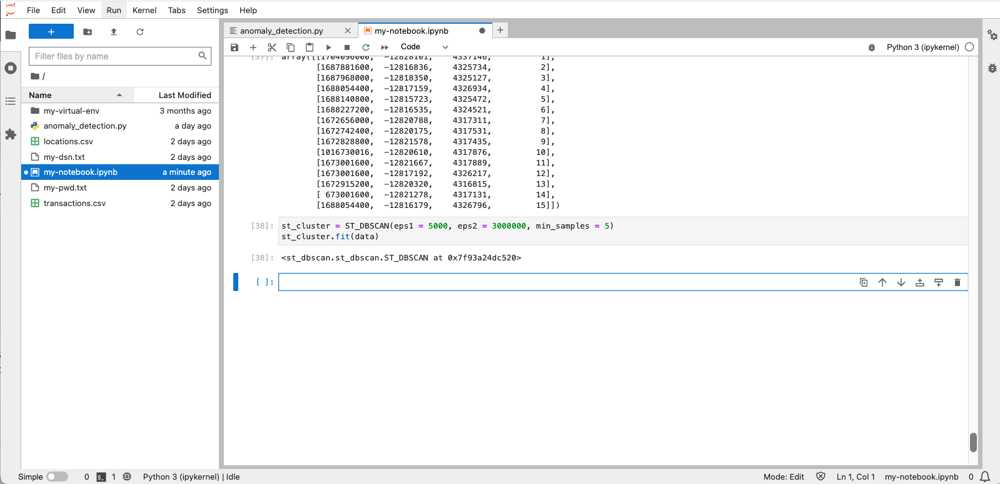
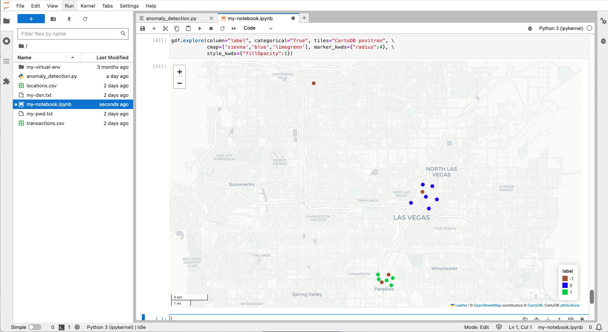
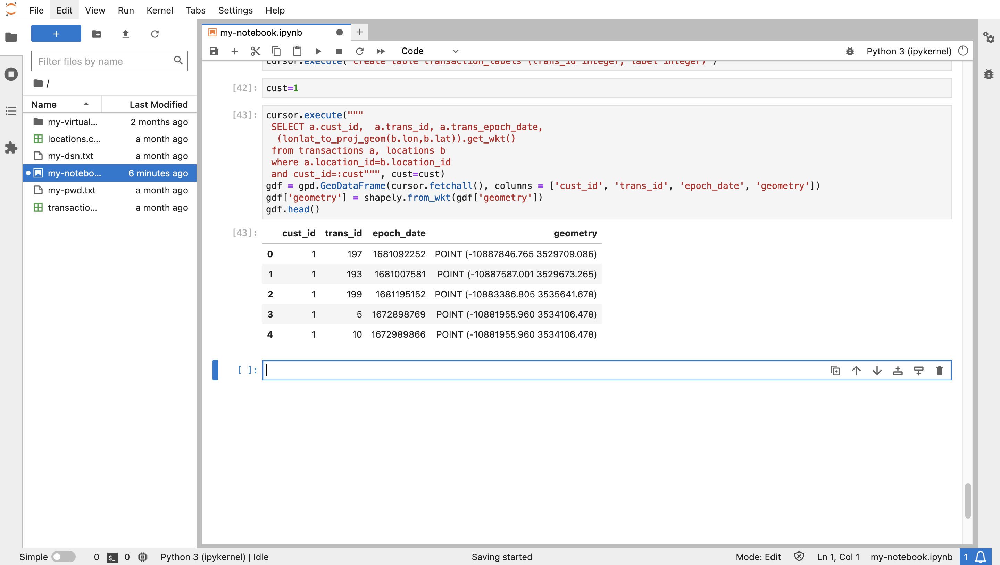
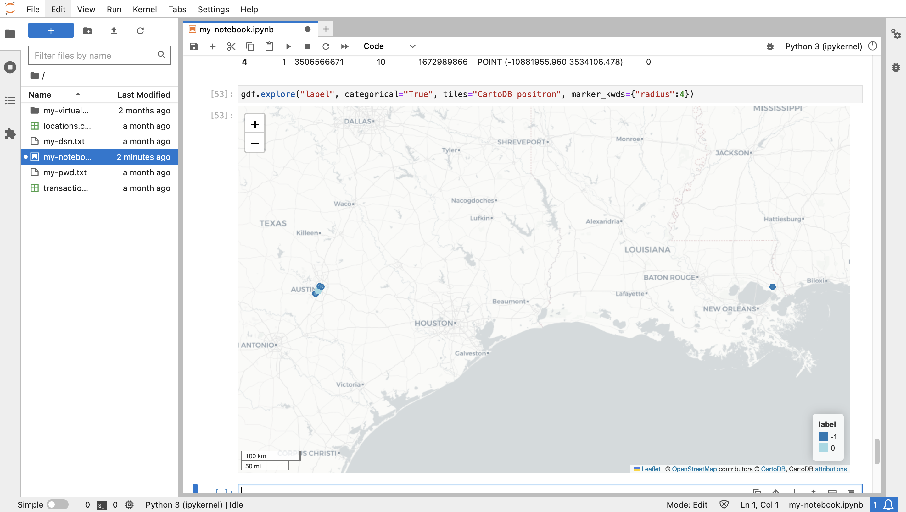

# 疑わしいトランザクションの検出

## 概要

Oracle Databaseの空間機能は、スケーラブルで安全な空間データ管理、処理、分析を提供します。Pythonでの作業の主な利点は、Oracle Databaseのネイティブ分析機能を拡張するためのオープン・ソース・ライブラリの可用性です。このラボでは、スペースと時間の両方、つまり空間クラスタに基づいてクラスタを識別するライブラリを活用します。集中領域および時間枠内で発生した一連のトランザクションは、一時クラスタに属します。時空クラスタの時間帯内に発生したが、集中領域から遠く離れたトランザクションは疑わしいと考えられます。たとえば、特定の週に顧客のトランザクションがニューヨーク市エリアに集中した場合、その週の半ばのカリフォルニアでのトランザクションは疑わしいものになります。この演習では、このような状況を確認します。

推定ラボ時間: 15分

### 目標

*   Oracle SpatialからPythonへのトランザクション・データのロード
*   予想される動作を表すspatiotemporalクラスタを検出します
*   疑わしい動作を表す外れ値の識別

### 前提条件

*   演習6の完了: データの確認

## タスク1: 空間集計の実験

時空クラスタからのトランザクションの距離を計算するには、クラスタを単一のジオメトリとして表現すると便利です。これは空間集計のユースケースで、一連のジオメトリは単一の集計で表されます。Oracle Spatialには、この目的のために空間集計関数のパッケージが用意されています。このタスクは、空間集計の理解を目的としています。

1.  まず、テキサス州オースティン(-97.7431,30.2672)の経度/緯度座標から10マイル以内の**LOCATIONS**表の場所からアイテムのGeoDataFrameを作成します。
    
        <copy>
        cursor = connection.cursor()
        cursor.execute("""
         SELECT (lonlat_to_proj_geom(lon,lat)).get_wkt() as geometry
         FROM locations
         WHERE sdo_within_distance(
                   lonlat_to_proj_geom(lon,lat),
                   lonlat_to_proj_geom(-97.7431,30.2672),
                   'distance=10 unit=MILE') = 'TRUE'
               """)
        gdfPoints = gpd.GeoDataFrame(cursor.fetchall(), columns = ['geometry'])
        gdfPoints['geometry'] = shapely.from_wkt(gdfPoints['geometry'])
        gdfPoints.crs = "EPSG:3857"
        gdfPoints.head()
        </copy>
        
    
    
    
2.  次に、以前に選択した場所の中央にある場所を含むGeoDataFrameを作成します。この場所は集計重心と呼ばれるため、GeoDataFrameの名前はgdfAggCentです。
    
        <copy>
        cursor.execute("""
         SELECT SDO_AGGR_CENTROID(
                  SDOAGGRTYPE(lonlat_to_proj_geom(lon,lat), 0.005)).get_wkt() as geometry
         FROM locations
         WHERE sdo_within_distance(
                   lonlat_to_proj_geom(lon,lat),
                   lonlat_to_proj_geom(-97.7431,30.2672),
                   'distance=10 unit=MILE') = 'TRUE'
               """)
        gdfAggCent = gpd.GeoDataFrame(cursor.fetchall(), columns = ['geometry'])
        gdfAggCent['geometry'] = shapely.from_wkt(gdfAggCent['geometry'])
        gdfAggCent.crs = "EPSG:3857"
        gdfAggCent
        </copy>
        
    
    
    
3.  次に、テキサス州オースティンの座標に近い位置を境界とするシェイプを含むGeoDataFrameを作成します。これは集計凸ハルと呼ばれるため、GeoDataFrameの名前はgdfAggHullです。
    
        <copy>
        cursor.execute("""
         SELECT SDO_AGGR_CONVEXHULL(
                  SDOAGGRTYPE(lonlat_to_proj_geom(lon,lat), 0.005)).get_wkt() as geometry
         FROM locations
         WHERE sdo_within_distance(
                   lonlat_to_proj_geom(lon,lat),
                   lonlat_to_proj_geom(-97.7431,30.2672),
                   'distance=10 unit=MILE') = 'TRUE'
               """)
        gdfAggHull = gpd.GeoDataFrame(cursor.fetchall(), columns = ['geometry'])
        gdfAggHull['geometry'] = shapely.from_wkt(gdfAggHull['geometry'])
        gdfAggHull.crs = "EPSG:3857"
        gdfAggHull
        </copy>
        
    
    
    
    同じパターンに従う他の複数の空間集計関数があります。
    
4.  これで、作成した点と2つの空間集計を視覚化できます。元の位置は青で表示され、重心と集約凸のハルは赤で表示されます。
    
        <copy>
        m = gdfPoints.explore(tiles="CartoDB positron",
                               style_kwds={"color":"blue","fillColor":"blue"})
        m = gdfAggHull.explore(m=m,
                               style_kwds={"color":"red","fillOpacity":"0"} )
        m = gdfAggCent.explore(m=m,
                               marker_kwds={"radius":"8"},
                              style_kwds={"color":"red","fillColor":"red","fillOpacity":".7"} )
        m
        </copy>
        
    
    
    

次に、spatiotemporalクラスタの時間範囲中に、しきい値より大きい距離で発生した疑わしいトランザクションを特定します。時空クラスタでカバーされる領域は、疑わしいトランザクションの距離しきい値と比較して重要ではないため、集計重心を使用して、時空クラスタの場所を表します。

## タスク2: クラスタ検出の準備

1.  まず、spatiotemporalクラスタを検出するために必要なライブラリをインポートします。メイン・ライブラリはst\_dbscanです。また、st\_dbscanへの入力を構成するには、パンダ・ライブラリおよびnumpyライブラリが必要です。
    
        <copy>
        import pandas as pd
        import numpy as np
        from st_dbscan import ST_DBSCAN
        </copy>
        
    
    
    
2.  次に、spatiotemporalクラスタを検出する例を示します。次を実行して、エポック時間およびIDを持つ場所があるGeoDataFrameを作成します。
    
        <copy>
        gdf = gpd.GeoDataFrame({
            "id": [1, 2, 3, 4, 5, 6, 7, 8, 9, 10, 11, 12, 13, 14, 15],
            "epoch_date": [1704096000, 1687881600, 1687968000, 1688054400, 1688140800, \
                           1688227200, 1672656000, 1672742400, 1672828800,  1016730016, \
                           1673001600, 1673001600, 1672915200, 673001600, 1688054400],
            "geometry": ["POINT(-115.2368 36.2650)",
                        "POINT(-115.1356 36.1823)",
                        "POINT(-115.1492 36.1779)",
                        "POINT(-115.1385 36.1910)",
                        "POINT(-115.1256 36.1804)",
                        "POINT(-115.1329 36.1735)",
                        "POINT(-115.1711 36.1212)",
                        "POINT(-115.1656 36.1228)",
                        "POINT(-115.1782 36.1221)",
                        "POINT(-115.1695 36.1253)",
                        "POINT(-115.1790 36.1254)",
                        "POINT(-115.1388 36.1858)",
                        "POINT(-115.1669 36.1176)",
                        "POINT(-115.1755 36.1199)",
                        "POINT(-115.1297 36.1900)",
            ],})
        # convert to Shapely geometries
        gdf['geometry'] = shapely.from_wkt(gdf['geometry'])
        # assign longitude/latitude coordinate system
        gdf = gdf.set_crs(4326)
        gdf
        </copy>
        
    
    
    

3.ST\_DBSCANライブラリでは、座標が距離測定と同じ単位である必要があります。したがって、次を実行して、座標系を経度/緯度から、メートルに基づいて投影されたx/y座標に変換します。`<copy> # convert to projected x/y coordinates as required for ST_DBSCAN gdf = gdf.to_crs(3857) gdf </copy>`

    
    

4.ST\_DBSCANへの入力はNumpy配列です。したがって、次を実行して、GeoDataFrameをNumpy配列に変換します。`<copy> # Convert to pandas dataframe df = pd.DataFrame(data={'time': gdf.epoch_date, 'x': gdf.geometry.x, 'y': gdf.geometry.y, 'id': gdf.id}) data = df.values # Convert to numpy array data = np.int_(data) data </copy>`

     
    

5.  ここから、サンプル・データに対してST\_DBSCANを実行できます。ST\_DBSCANは、空間データを操作するために拡張される、ノイズの多いアプリケーションの密度ベースの空間クラスタリング(DBSCAN)アルゴリズムのバリエーションです。パラメータはクラスタのしきい値です。eps1は座標系の単位の距離しきい値(メートル)、eps2は秒単位の時間しきい値、min-samplesは最小アイテムのしきい値です。次を実行して、しきい値が5KMおよび約1か月以内の5つ以上のアイテムであるクラスタを検出します。
    
        <copy>
        st_cluster = ST_DBSCAN(eps1 = 5000, eps2 = 3000000, min_samples = 5)
        st_cluster.fit(data)
        </copy>
        
    
    
    

6.結果は、各入力項目の整数ラベルです。各ラベル>=0はクラスタを表します。ラベル-1は、アイテムがクラスタの一部ではないことを示します。結果ラベルの個別のセットを確認します。2つのクラスタが検出されたことを確認します。 `<copy> np.unique(st_cluster.labels) </copy>`

    
    

7.整数ラベルをGeoDataFrameに追加します。`<copy> df = pd.DataFrame(data={'id': df.id, 'label': st_cluster.labels}) label_mapping_dict = dict(zip(df["id"], df["label"])) gdf["label"] = gdf["id"].map(label_mapping_dict) gdf </copy>`

    
    

8.  次を実行して、クラスタをビジュアル化します。一部のアイテムは距離しきい値内ですが、時間しきい値内ではないことに注意してください。  
    
        <copy>
        gdf.explore(column="label", categorical="True", tiles="CartoDB positron", \
                    cmap=['sienna','blue','limegreen'], marker_kwds={"radius":4}, \
                    style_kwds={"fillOpacity":1})
        </copy>
        
    
    
    

次のステップでは、このアプローチを使用して、疑わしい財務取引を検出します。

9.  クラスタ検出の結果は、アイテムがクラスタの一部であるかどうか、およびその場合はどのクラスタであるかを示すすべてのデータ項目のラベルです。クラスタ分析を実行し、結果をデータベースに保存してさらに分析します。次を実行して、クラスタ・ラベルを格納するデータベース表を作成します。
    
        <copy>
        cursor.execute("CREATE TABLE transaction_labels (trans_id integer, label integer)")
        </copy>
        
    
    
    

## タスク3: 時空クラスタの検出

1.  このワークショップでは、一度に1人の顧客のトランザクションを分析します。次を実行して、分析の顧客IDの変数を設定します。このセルに戻り、分析用に別の顧客に切り替えることができます。
    
        <copy>
        cust=1
        </copy>
        
    
    
    
2.  顧客のトランザクションのGeoDataframeを作成します。python-oracledbドライバでサポートされているWHERE句(cust\_id=:cust)のバインディング構文に注意してください。
    
        <copy>
        cursor.execute("""
         SELECT a.cust_id,  a.trans_id, a.trans_epoch_date,
               (lonlat_to_proj_geom(b.lon,b.lat)).get_wkt()
         FROM transactions a, locations b
         WHERE a.location_id=b.location_id
         AND cust_id=:cust""", cust=cust)
        gdf = gpd.GeoDataFrame(cursor.fetchall(), columns = ['cust_id', 'trans_id', 'epoch_date', 'geometry'])
        gdf['geometry'] = shapely.from_wkt(gdf['geometry'])
        gdf.head()
        </copy>
        
    
    
    
3.  st\_dbscanライブラリには、numpy形式の入力が必要です。numpyは配列を処理するためのライブラリです。次の2つのステップを実行して、GeoDataFrameをnumpy配列に変換します。
    
        <copy>
        # first convert to pandas dataframe
        df = pd.DataFrame(data={'time': gdf.epoch_date, 'x': gdf.geometry.x, 'y': gdf.geometry.y, 'trans_id':  gdf.trans_id, 'cust_id':gdf.cust_id})
        df.head()
        </copy>
        
    
        <copy>
        # then convert to numpy array
        data = df.values
        data = np.int_(data)
        data[1:10]
        </copy>
        
    
    
    
4.  これで、現在の顧客のトランザクションに対してspatiotemporalクラスタを検出する準備ができました。この操作では、距離、時間および最小アイテム数の3つのしきい値パラメータを使用できます。距離および時間しきい値内に隣接するアイテムはクラスタの一部とみなされ、クラスタとして修飾するアイテムの最小数がほとんどです。距離は座標系の単位で、この場合はメートルです。時間は秒単位です。次を実行して、しきい値が5KMおよび約1か月以内の5つ以上のアイテムであるクラスタを検出します。
    
        <copy>
        st_cluster = ST_DBSCAN(eps1 = 5000, eps2 = 3000000, min_samples = 5)
        st_cluster.fit(data)
        </copy>
        
    
    
    
5.  結果は、各入力項目の整数ラベルです。各ラベル>=0はクラスタを表します。ラベル-1は、アイテムがクラスタの一部ではないことを示します。結果ラベルの個別のセットを確認します。1つのクラスタが検出されたことを確認します。
    
        <copy>
        np.unique(st_cluster.labels)
        </copy>
        
    
    
    
6.  次を実行して、クラスタ・ラベルをトランザクションに追加し、最初の数行を出力します。各トランザクションには、-1 (クラスタの一部ではない)または0 (アイテムが属するクラスタ)以上の整数でラベル付けされます。
    
        <copy>
        df = pd.DataFrame(data={'trans_id': df.trans_id, 'label': st_cluster.labels})
        df.head()
        </copy>
        
    
    
    
7.  異常の検出には、クラスタ・ラベルを含むデータベース問合せが必要です。したがって、次を実行して、現在の顧客のラベル付きトランザクションを、前のタスクで作成したTRANSACTION\_LABELS表に挿入します。
    
        <copy>
        cursor.executemany("""
         INSERT INTO transaction_labels
         VALUES (:1, :2)""",
         list(df[['trans_id','label']].itertuples(index=False, name=None)))
        connection.commit()
        </copy>
        
    
    
    
8.  次を実行して、現在の顧客のトランザクションとそのクラスタ・ラベルを取得します。
    
        <copy>
        # labelled transactions for customer
        cursor.execute("""
         SELECT a.cust_id, a.location_id, a.trans_id, a.trans_epoch_date,
                (lonlat_to_proj_geom(b.lon,b.lat)).get_wkt(), c.label
         FROM transactions a, locations b, transaction_labels c
         WHERE a.location_id=b.location_id
         AND a.trans_id=c.trans_id
         """)
        gdf = gpd.GeoDataFrame(cursor.fetchall(), columns = ['cust_id', 'location_id', 'trans_id', 'trans_epoch_date', 'geometry','label'])
        gdf['geometry'] = shapely.from_wkt(gdf['geometry'])
        gdf = gdf.set_crs(3857)
        gdf.head()
        </copy>
        
    
    
    
9.  次のように実行して、現在の顧客のラベル付きトランザクションを視覚化します。この場合、クラスタ・ラベルに基づいてアイテムを色分けするためのパラメータを含めます。また、アイテムの上にマウスを置くと、クラスタ・ラベルなどの属性を表示できます。
    
        <copy>
        gdf.explore(column="label", categorical="True", tiles="CartoDB positron", \
                    marker_kwds={"radius":4}, style_kwds={"fillOpacity":1})
        </copy>
        
    
    
    
10.  現在の顧客のトランザクションの場所が集中しているテキサス州オースティンのエリアにズームし、スパティオテモラル・クラスタの一部であることを示す色分けを確認します。
    
    
    

## タスク4: 異常の検出

1.  クラスタ・ラベル、時間範囲およびクラスタ内のトランザクション数の属性を使用して、現在の顧客のスパチオテモラル・クラスタの集約セントロイドを作成するには、次を実行します。最初の顧客にクラスタが1つのみあることを確認します(ラベルは0)。
    
        <copy>
        # st cluster centroids for customer
        cursor = connection.cursor()
        cursor.execute("""
         SELECT label, min(trans_epoch_date) as min_time, max(trans_epoch_date) as max_time,
                 SDO_AGGR_CENTROID(
                  SDOAGGRTYPE(lonlat_to_proj_geom(b.lon,b.lat), 0.005)).get_wkt() as geometry,
                 count(*) as trans_count
         FROM transactions a, locations b, transaction_labels c
         WHERE a.location_id=b.location_id
         AND a.trans_id=c.trans_id
         AND c.label != -1
         GROUP BY label
               """)
        gdf = gpd.GeoDataFrame(cursor.fetchall(), columns = ['label','min_time','max_time','geometry','trans_count'])
        gdf['geometry'] = shapely.from_wkt(gdf['geometry'])
        gdf = gdf.set_crs(3857)
        gdf.head()
        </copy>
        
    
    
    
2.  次を実行して、spatiotemporalクラスタ重心を視覚化します。
    
        <copy>
        gdf.explore(tiles="CartoDB positron", marker_kwds={"radius":4})
        </copy>
        
    
    
    
3.  クラスタの時間範囲内でしきい値より大きい距離にある現在の顧客トランザクションを識別するには、WITH ...を使用して問合せを実行します。AS ...選択..WHERE...構文は次のとおりです。
    
        WITH
            x as ( [transactions] ),
            y as ( [spatiotemporal cluster aggregate centroids] )
        SELECT [transaction, cluster label, distance from cluster aggregate centroid, ...]
        FROM x, y
        WHERE [transaction time within cluster time frame]
        AND [distance from cluster > threshold]
        
    
    次の問合せを実行して、疑わしいトランザクションを、関連するクラスタ・ラベルおよびクラスタからの距離とともに返します。
    
        <copy>
        cursor = connection.cursor()
        cursor.execute("""
        WITH
           x as (
               SELECT a.cust_id, a.location_id, a.trans_id, a.trans_epoch_date,
                      lonlat_to_proj_geom(b.lon,b.lat) as proj_geom, c.label
               FROM transactions a, locations b, transaction_labels c
               WHERE a.location_id=b.location_id
               AND a.trans_id=c.trans_id ),
           y as (
               SELECT label, min(trans_epoch_date) as min_time, max(trans_epoch_date) as max_time,
                      SDO_AGGR_CENTROID(
                          SDOAGGRTYPE(lonlat_to_proj_geom(b.lon,b.lat), 0.005)) as proj_geom,
                      count(*) as trans_count
               FROM transactions a, locations b, transaction_labels c
               WHERE a.location_id=b.location_id
               AND a.trans_id=c.trans_id
               AND c.label != -1
               GROUP BY label)
         SELECT x.cust_id, x.trans_epoch_date, (x.proj_geom).get_wkt(), x.trans_id, x.label, y.label,
                round(sdo_geom.sdo_distance(x.proj_geom, y.proj_geom, 0.05, 'unit=KM'))
         FROM x, y
         WHERE x.trans_epoch_date between y.min_time and y.max_time
         AND x.label!=y.label
         AND x.label=-1
         AND sdo_within_distance(x.proj_geom, y.proj_geom, 'distance=500 unit=KM') = 'FALSE'
               """)
        gdfAnomaly = gpd.GeoDataFrame(cursor.fetchall(), columns = ['cust_id','trans_epoch_date','geometry', 'trans_id','label','outlier_to_label','distance'])
        gdfAnomaly['geometry'] = shapely.from_wkt(gdfAnomaly['geometry'])
        gdfAnomaly = gdfAnomaly.set_crs(3857)
        gdfAnomaly.head()
        </copy>
        
    
    
    
4.  次を実行して、spatiotemporalクラスタを青色のマーカーとして、関連する疑わしい外れ値を赤色のマーカーとして視覚化します。疑わしいトランザクションの上にカーソルを置くと、その属性が表示されます。
    
        <copy>
        m = gdf.explore(tiles="CartoDB positron", marker_type='circle_marker',marker_kwds={"radius":"5"},
                        style_kwds={"color":"blue","fillColor":"blue", "fillOpacity":"1"})
        m = gdfAnomaly.explore(m=m, marker_type='circle_marker', marker_kwds={"radius":"5"},
                               style_kwds={"color":"red","fillColor":"red", "fillOpacity":"1"} )
        m.fit_bounds(m.get_bounds())
        m
        </copy>
        
    
    
    
    他の顧客のトランザクションの処理を繰り返すには、顧客IDが設定されているセルまでスクロールし、別の顧客IDに更新して、後続のセルを再実行します。ただし、すべてのステップを実行するスクリプトを使用すると便利です。
    
5.  異常検出のすべてのステップを含むスクリプトをダウンロードするには、次のリンクを使用します。
    
    *   [anomaly\_detection.py](./files/anomaly_detection.py)
    
    
    
6.  アップロード・ボタンをクリックし、ダウンロードしたスクリプトに移動して、スクリプト・ファイルをアップロードします。
    
    
    
7.  次を実行して、スクリプトをインポートします。
    
        <copy>
        from anomaly_detection import *
        </copy>
        
    
    
    
    スクリプトの機能を使用して、他の顧客のトランザクションを分析できるようになりました。これらは、TRANSACTION\_LABELS表を新しいラベルのセットとして空にした後、タスク3から始まる前のステップを再現します。
    
    *   create\_connection()は、データベース接続を確立します。
    *   get\_cluster\_centroids( )は、顧客のspatiotemporalトランザクション・クラスタを検出します
    *   get\_anomalies( )は、重複する時間およびクラスタからのしきい値を超える距離に基づいて疑わしいトランザクションを識別します
    *   get\_map( )は、クラスタおよび関連する疑わしいトランザクションのマップを返します
8.  次を実行して、顧客ID = 2の疑わしいトランザクションを検出します。
    
        <copy>
        cust = 2
        </copy>
        
    
        <copy>
        create_connection()
        gdf = get_cluster_centroids(cust)
        gdfAnomaly = get_anomalies(cust)
        m = get_map()
        </copy>
        
    
    
    
9.  次を実行して、spatiotemporalクラスタをリストします。
    
        <copy>
        gdf
        </copy>
        
    
    
    
10.  次を実行して、関連する異常をリストします。
    
        <copy>
        gdfAnomaly
        </copy>
        
    
    
    
11.  次を実行して、クラスタおよび関連する異常を視覚化します。
    
        <copy>
        m.fit_bounds(m.get_bounds())
        m
        </copy>
        

      
    
    To detect suspicious for other customers, scroll up to step 8, set a different customer id, and re-run the the subsequent cells to call the functions in the script.
    

このワークショップが有益であり、Oracle Databaseの空間的機能や機械学習やAIワークフローでの使用についてさらに詳しく知りたいと考えています。

## さらに学ぶ

*   空間集計関数の詳細は、[https://docs.oracle.com/en/database/oracle/oracle-database/19/spatl/spatial-aggregate-functions.html](https://docs.oracle.com/en/database/oracle/oracle-database/19/spatl/spatial-aggregate-functions.html)を参照してください
*   st\_dbscanの詳細は、[「ST-DBSCAN: 空間一時データをクラスタリングするためのアルゴリズム」](https://www.sciencedirect.com/science/article/pii/S0169023X06000218)および[「https://github.com/eren-ck/st\_dbscan」](https://github.com/eren-ck/st_dbscan)を参照してください。

## 確認

*   **著者** - Oracle、データベース製品管理、David Lapp氏
*   **コントリビュータ** - Rahul Tasker、Denise Myrick、Ramu Gutierrez
*   **最終更新者/日付** - David Lapp、2023年8月