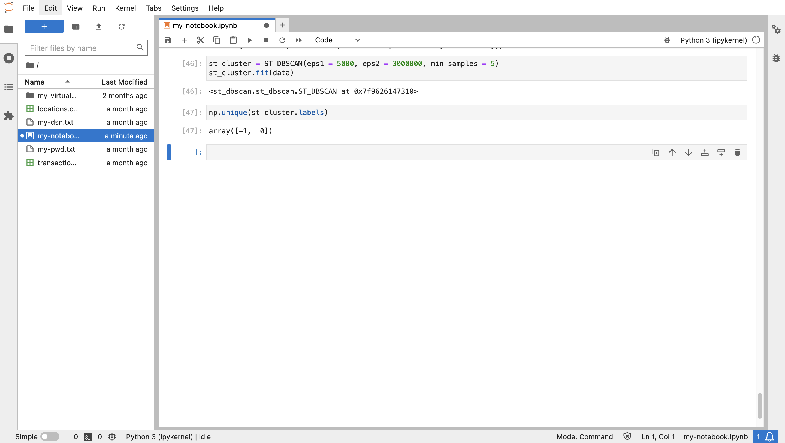

# 의심스러운 트랜잭션 감지

## 소개

Oracle Database의 공간 기능은 확장 가능하고 안전한 공간 데이터 관리, 처리 및 분석을 제공합니다. Python에서 작업하는 주요 이점은 Oracle Database의 기본 분석 기능을 보강하기 위한 오픈 소스 라이브러리의 가용성입니다. 이 연습에서는 공간과 시간 또는 시간 기준 클러스터를 기반으로 클러스터를 식별하는 라이브러리를 활용합니다. 집중 영역 및 시간 윈도우 내에서 발생한 트랜잭션 집합은 시간 기준 클러스터에 속합니다. spatiotemporal 클러스터의 시간 창 내에서 발생했지만 집중 영역과는 거리가 먼 트랜잭션은 의심스러운 것으로 간주됩니다. 예를 들어, 특정 주 동안 고객의 거래가 뉴욕시 지역에 집중된 경우 캘리포니아에서 해당 주의 중간에 거래가 의심스러울 수 있습니다. 이 연습에서 이러한 경우를 식별하게 됩니다.

예상 실험실 시간: 15분

### 목표

*   Oracle Spatial에서 Python으로 트랜잭션 데이터 로드
*   예상 동작을 나타내는 시간 기준 클러스터 감지
*   의심스러운 동작을 나타내는 이상치 식별

### 필요 조건

*   실습 6 완료: 데이터 탐색

## 작업 1: 공간 집계 테스트

spatiotemporal 클러스터에서 트랜잭션의 거리를 계산하려면 클러스터를 단일 형상으로 나타내는 것이 편리합니다. 공간 집계의 사용 사례로, 일련의 형상이 단일 집계로 표현됩니다. Oracle Spatial은 이러한 목적으로만 공간 집계 함수 패키지를 제공합니다. 이 작업은 공간 집계를 익히기 위한 것입니다.

1.  먼저 오스틴, TX(-97.7431,30.2672)의 경도/위도 좌표에서 10마일 이내에 **LOCATIONS** 테이블 위치에서 GeoDataFrame 항목을 만듭니다.
    
        <copy>
        cursor = connection.cursor()
        cursor.execute("""
         SELECT (lonlat_to_proj_geom(lon,lat)).get_wkt() as geometry
         FROM locations
         WHERE sdo_within_distance(
                   lonlat_to_proj_geom(lon,lat),
                   lonlat_to_proj_geom(-97.7431,30.2672),
                   'distance=10 unit=MILE') = 'TRUE'
               """)
        gdfPoints = gpd.GeoDataFrame(cursor.fetchall(), columns = ['geometry'])
        gdfPoints['geometry'] = shapely.from_wkt(gdfPoints['geometry'])
        gdfPoints.crs = "EPSG:3857"
        gdfPoints.head()
        </copy>
        
    
    
    
2.  그런 다음 이전에 선택한 위치의 가운데에 위치가 포함된 GeoDataFrame를 만듭니다. 이 위치를 "집계 중심"이라고 하므로 GeoDataFrame의 이름은 gdfAggCent입니다.
    
        <copy>
        cursor.execute("""
         SELECT SDO_AGGR_CENTROID(
                  SDOAGGRTYPE(lonlat_to_proj_geom(lon,lat), 0.005)).get_wkt() as geometry
         FROM locations
         WHERE sdo_within_distance(
                   lonlat_to_proj_geom(lon,lat),
                   lonlat_to_proj_geom(-97.7431,30.2672),
                   'distance=10 unit=MILE') = 'TRUE'
               """)
        gdfAggCent = gpd.GeoDataFrame(cursor.fetchall(), columns = ['geometry'])
        gdfAggCent['geometry'] = shapely.from_wkt(gdfAggCent['geometry'])
        gdfAggCent.crs = "EPSG:3857"
        gdfAggCent
        </copy>
        
    
    
    
3.  그런 다음 Austin, TX에서 좌표 근처의 위치를 경계하는 쉐이프가 포함된 GeoDataFrame를 만듭니다. 이를 "집계 볼록 선체"라고 하므로 GeoDataFrame의 이름은 gdfAggHull입니다.
    
        <copy>
        cursor.execute("""
         SELECT SDO_AGGR_CONVEXHULL(
                  SDOAGGRTYPE(lonlat_to_proj_geom(lon,lat), 0.005)).get_wkt() as geometry
         FROM locations
         WHERE sdo_within_distance(
                   lonlat_to_proj_geom(lon,lat),
                   lonlat_to_proj_geom(-97.7431,30.2672),
                   'distance=10 unit=MILE') = 'TRUE'
               """)
        gdfAggHull = gpd.GeoDataFrame(cursor.fetchall(), columns = ['geometry'])
        gdfAggHull['geometry'] = shapely.from_wkt(gdfAggHull['geometry'])
        gdfAggHull.crs = "EPSG:3857"
        gdfAggHull
        </copy>
        
    
    
    
    동일한 패턴을 따르는 다른 여러 공간 집계 함수가 있습니다.
    
4.  이제 작성한 점과 두 개의 공간 집계를 시각화할 수 있습니다. 원래 위치는 파란색으로 표시되고 집계 중심선 및 집계 볼록 선체는 빨간색으로 표시됩니다.
    
        <copy>
        m = gdfPoints.explore(tiles="CartoDB positron",
                               style_kwds={"color":"blue","fillColor":"blue"})
        m = gdfAggHull.explore(m=m,
                               style_kwds={"color":"red","fillOpacity":"0"} )
        m = gdfAggCent.explore(m=m,
                               marker_kwds={"radius":"8"},
                              style_kwds={"color":"red","fillColor":"red","fillOpacity":".7"} )
        m
        </copy>
        
    
    
    

다음에 spatiotemporal 클러스터의 시간 범위 동안 발생하지만 임계값보다 큰 거리에서 발생하는 의심스러운 트랜잭션을 식별합니다. spatiotemporal 클러스터로 덮인 영역은 의심스러운 트랜잭션의 거리 임계값에 비해 중요하지 않으므로 집계 중심을 사용하여 spatiotemporal 클러스터의 위치를 나타냅니다.

## 작업 2: 클러스터 감지 준비

1.  먼저 spatiotemporal 클러스터를 감지하는 데 필요한 라이브러리를 가져옵니다. 기본 라이브러리는 st\_dbscan입니다. 또한 pandas 및 numpy 라이브러리는 st\_dbscan에 대한 입력 구성을 위해 필요합니다.
    
        <copy>
        import pandas as pd
        import numpy as np
        from st_dbscan import ST_DBSCAN
        </copy>
        
    
    
    
2.  이제 spatiotemporal 클러스터를 감지하는 예를 살펴보겠습니다. 다음을 실행하여 각각 epoch 시간과 ID가 있는 일부 위치가 있는 GeoDataFrame을 만듭니다.
    
        <copy>
        gdf = gpd.GeoDataFrame({
            "id": [1, 2, 3, 4, 5, 6, 7, 8, 9, 10, 11, 12, 13, 14, 15],
            "epoch_date": [1704096000, 1687881600, 1687968000, 1688054400, 1688140800, \
                           1688227200, 1672656000, 1672742400, 1672828800,  1016730016, \
                           1673001600, 1673001600, 1672915200, 673001600, 1688054400],
            "geometry": ["POINT(-115.2368 36.2650)",
                        "POINT(-115.1356 36.1823)",
                        "POINT(-115.1492 36.1779)",
                        "POINT(-115.1385 36.1910)",
                        "POINT(-115.1256 36.1804)",
                        "POINT(-115.1329 36.1735)",
                        "POINT(-115.1711 36.1212)",
                        "POINT(-115.1656 36.1228)",
                        "POINT(-115.1782 36.1221)",
                        "POINT(-115.1695 36.1253)",
                        "POINT(-115.1790 36.1254)",
                        "POINT(-115.1388 36.1858)",
                        "POINT(-115.1669 36.1176)",
                        "POINT(-115.1755 36.1199)",
                        "POINT(-115.1297 36.1900)",
            ],})
        # convert to Shapely geometries
        gdf['geometry'] = shapely.from_wkt(gdf['geometry'])
        # assign longitude/latitude coordinate system
        gdf = gdf.set_crs(4326)
        gdf
        </copy>
        
    
    
    

3\. ST\_DBSCAN 라이브러리를 사용하려면 좌표가 거리 측정과 동일한 단위여야 합니다. 따라서 계량기를 기준으로 좌표계를 경도/위도에서 예상 x/y 좌표로 변환하려면 다음을 실행합니다. `<copy> # convert to projected x/y coordinates as required for st_dbscan gdf = gdf.to_crs(3857) gdf </copy>`

    
    

4\. ST\_DBSCAN에 대한 입력은 Numpy 배열입니다. 따라서 다음을 실행하여 GeoDataFrame을 Numpy 배열로 변환합니다. `<copy> # Convert to pandas dataframe df = pd.DataFrame(data={'time': gdf.epoch_date, 'x': gdf.geometry.x, 'y': gdf.geometry.y, 'id': gdf.id}) data = df.values # Convert to numpy array data = np.int_(data) data </copy>`

     
    

5.  여기에서 샘플 데이터에 대해 ST\_DBSCAN를 실행할 수 있습니다. ST\_DBSCAN는 공간 데이터로 작동하도록 확장된 DBSCAN(Density-Based Spatial Clustering of Applications with Noise) 알고리즘의 변형입니다. 매개변수는 클러스터에 대한 임계값이고, eps1는 좌표계 단위(미터)의 거리 임계값이고, eps2는 시간 임계값(초)이고, 최소 샘플은 최소 항목에 대한 임계값입니다. 다음을 실행하여 임계값이 5KM 내 5개 이상의 항목이고 약 1개월인 클러스터를 감지합니다.
    
        <copy>
        st_cluster = ST_DBSCAN(eps1 = 5000, eps2 = 3000000, min_samples = 5)
        st_cluster.fit(data)
        </copy>
        
    
    
    

6\. 결과는 각 입력 항목에 대한 정수 레이블입니다. 각 레이블 >=0은 클러스터를 나타냅니다. 레이블 -1은 항목이 클러스터의 일부가 아님을 나타냅니다. 결과 레이블의 고유 세트를 검토합니다. 두 개의 클러스터가 감지되었는지 확인합니다. `<copy> np.unique(st_cluster.labels) </copy>`

    
    

7\. GeoDataFrame에 정수 레이블을 추가합니다. `<copy> df = pd.DataFrame(data={'id': df.id, 'label': st_cluster.labels}) label_mapping_dict = dict(zip(df["id"], df["label"])) gdf["label"] = gdf["id"].map(label_mapping_dict) gdf </copy>`

    
    

8.  다음을 실행하여 클러스터를 시각화합니다. 일부 항목은 거리 임계값 내에 있지만 시간 기준 임계값에는 없습니다.  
    
        <copy>
        gdf.explore(column="label", categorical="True", tiles="CartoDB positron", \
                    cmap=['sienna','blue','limegreen'], marker_kwds={"radius":4}, \
                    style_kwds={"fillOpacity":1})
        </copy>
        
    
    
    

다음 단계에서는 이 접근 방식을 사용하여 의심스러운 금융 거래를 감지합니다.

9.  클러스터 감지 결과는 모든 데이터 항목에 대한 "레이블"로, 항목이 클러스터의 일부인지 여부 및 해당 클러스터인지 여부를 나타냅니다. 클러스터 분석을 수행하고 추가 분석을 위해 데이터베이스에 결과를 저장합니다. 다음을 실행하여 클러스터 레이블을 저장할 데이터베이스 테이블을 생성합니다.
    
        <copy>
        cursor.execute("CREATE TABLE transaction_labels (trans_id integer, label integer)")
        </copy>
        
    
    
    

## 작업 3: spatiotemporal 클러스터 감지

1.  이 워크샵에서는 한 번에 한 고객에 대한 트랜잭션을 분석합니다. 다음을 실행하여 분석을 위한 고객 ID 변수를 설정합니다. 분석을 위해 이 셀로 돌아가서 다른 고객으로 전환할 수 있습니다.
    
        <copy>
        cust=1
        </copy>
        
    
    
    
2.  고객의 트랜잭션 GeoDataframe을 생성합니다. python-oracledb 드라이버에서 지원되는 WHERE 절(cust\_id=:cust)의 바인딩 구문을 확인합니다.
    
        <copy>
        cursor.execute("""
         SELECT a.cust_id,  a.trans_id, a.trans_epoch_date,
               (lonlat_to_proj_geom(b.lon,b.lat)).get_wkt()
         FROM transactions a, locations b
         WHERE a.location_id=b.location_id
         AND cust_id=:cust""", cust=cust)
        gdf = gpd.GeoDataFrame(cursor.fetchall(), columns = ['cust_id', 'trans_id', 'epoch_date', 'geometry'])
        gdf['geometry'] = shapely.from_wkt(gdf['geometry'])
        gdf.head()
        </copy>
        
    
    
    
3.  st\_dbscan 라이브러리를 사용하려면 numpy 형식의 입력이 필요합니다. 여기서 numpy는 배열 처리를 위한 라이브러리입니다. 다음 두 단계를 실행하여 GeoDataFrame을 numpy 배열로 변환합니다.
    
        <copy>
        # first convert to pandas dataframe
        df = pd.DataFrame(data={'time': gdf.epoch_date, 'x': gdf.geometry.x, 'y': gdf.geometry.y, 'trans_id':  gdf.trans_id, 'cust_id':gdf.cust_id})
        df.head()
        </copy>
        
    
        <copy>
        # then convert to numpy array
        data = df.values
        data = np.int_(data)
        data[1:10]
        </copy>
        
    
    
    
4.  이제 현재 고객의 트랜잭션에 대한 spatiotemporal 클러스터를 감지할 준비가 되었습니다. 이 작업은 거리, 시간 및 최소 항목 수의 세 가지 임계값 매개변수를 허용합니다. 거리 및 시간 임계값 내에 이웃 항목이 있는 항목은 클러스터의 일부로 간주되며, 클러스터로 한정할 최소 항목 수가 가장 많습니다. 거리는 좌표계 단위로, 이 경우 미터 단위입니다. 시간은 초 단위입니다. 다음을 실행하여 임계값이 5KM 내 5개 이상의 항목이고 약 1개월인 클러스터를 감지합니다.
    
        <copy>
        st_cluster = ST_DBSCAN(eps1 = 5000, eps2 = 3000000, min_samples = 5)
        st_cluster.fit(data)
        </copy>
        
    
    
    
5.  결과는 각 입력 항목에 대한 정수 레이블입니다. 각 레이블 >=0은 클러스터를 나타냅니다. 레이블 -1은 항목이 클러스터의 일부가 아님을 나타냅니다. 결과 레이블의 고유 세트를 검토합니다. 감지된 클러스터가 하나 있는지 확인합니다.
    
        <copy>
        np.unique(st_cluster.labels)
        </copy>
        
    
    
    
6.  다음을 실행하여 트랜잭션에 클러스터 레이블을 추가하고 처음 여러 행을 인쇄합니다. 각 트랜잭션에는 -1(클러스터의 일부가 아님) 또는 >=0(항목이 속한 클러스터를 의미함)으로 레이블이 지정됩니다.
    
        <copy>
        df = pd.DataFrame(data={'trans_id': df.trans_id, 'label': st_cluster.labels})
        df.head()
        </copy>
        
    
    
    
7.  변형을 감지하려면 클러스터 레이블과 관련된 데이터베이스 질의가 필요합니다. 따라서 다음 명령을 실행하여 현재 고객의 레이블이 지정된 트랜잭션을 이전 작업에서 생성한 TRANSACTION\_LABELS 테이블에 삽입합니다.
    
        <copy>
        cursor.executemany("""
         INSERT INTO transaction_labels
         VALUES (:1, :2)""",
         list(df[['trans_id','label']].itertuples(index=False, name=None)))
        connection.commit()
        </copy>
        
    
    
    
8.  다음을 실행하여 클러스터 레이블이 있는 현재 고객의 트랜잭션을 검색합니다.
    
        <copy>
        # labelled transactions for customer
        cursor.execute("""
         SELECT a.cust_id, a.location_id, a.trans_id, a.trans_epoch_date,
                (lonlat_to_proj_geom(b.lon,b.lat)).get_wkt(), c.label
         FROM transactions a, locations b, transaction_labels c
         WHERE a.location_id=b.location_id
         AND a.trans_id=c.trans_id
         """)
        gdf = gpd.GeoDataFrame(cursor.fetchall(), columns = ['cust_id', 'location_id', 'trans_id', 'trans_epoch_date', 'geometry','label'])
        gdf['geometry'] = shapely.from_wkt(gdf['geometry'])
        gdf = gdf.set_crs(3857)
        gdf.head()
        </copy>
        
    
    
    
9.  다음을 실행하여 현재 고객의 레이블이 지정된 트랜잭션을 시각화합니다. 이 경우 클러스터 레이블을 기준으로 항목의 색상 코딩 매개변수를 포함합니다. 항목을 마우스로 가리켜 클러스터 레이블을 포함한 속성을 볼 수도 있습니다.
    
        <copy>
        gdf.explore(column="label", categorical="True", tiles="CartoDB positron", \
                    marker_kwds={"radius":4}, style_kwds={"fillOpacity":1})
        </copy>
        
    
    
    
10.  현재 고객의 트랜잭션 위치가 집중되어 있는 TX 오스틴 지역을 확대하여 spatiotemporal 클러스터의 일부인 색상 코딩을 관찰합니다.
    
    
    

## 작업 4: 변형 감지

1.  클러스터 레이블, 시간 범위 및 클러스터의 트랜잭션 수에 대한 속성을 사용하여 현재 고객의 spatiotemporal 클러스터에 대한 집계 센트로이드를 생성하려면 다음을 실행합니다. 첫번째 고객이 한 개의 클러스터만 있는지 확인합니다(레이블 = 0).
    
        <copy>
        # st cluster centroids for customer
        cursor = connection.cursor()
        cursor.execute("""
         SELECT label, min(trans_epoch_date) as min_time, max(trans_epoch_date) as max_time,
                 SDO_AGGR_CENTROID(
                  SDOAGGRTYPE(lonlat_to_proj_geom(b.lon,b.lat), 0.005)).get_wkt() as geometry,
                 count(*) as trans_count
         FROM transactions a, locations b, transaction_labels c
         WHERE a.location_id=b.location_id
         AND a.trans_id=c.trans_id
         AND c.label != -1
         GROUP BY label
               """)
        gdf = gpd.GeoDataFrame(cursor.fetchall(), columns = ['label','min_time','max_time','geometry','trans_count'])
        gdf['geometry'] = shapely.from_wkt(gdf['geometry'])
        gdf = gdf.set_crs(3857)
        gdf.head()
        </copy>
        
    
    
    
2.  다음을 실행하여 spatiotemporal cluster centroid를 시각화합니다.
    
        <copy>
        gdf.explore(tiles="CartoDB positron", marker_kwds={"radius":4})
        </copy>
        
    
    
    
3.  클러스터의 시간 범위 내에 있고 임계값보다 큰 거리에 있는 현재 고객 트랜잭션을 식별하려면 WITH ... AS... 선택 .. WHERE... 구문은 다음과 같습니다.
    
        WITH
            x as ( [transactions] ),
            y as ( [spatiotemporal cluster aggregate centroids] )
        SELECT [transaction, cluster label, distance from cluster aggregate centroid, ...]
        FROM x, y
        WHERE [transaction time within cluster time frame]
        AND [distance from cluster > threshold]
        
    
    다음 질의를 실행하여 연관된 클러스터 레이블 및 클러스터와의 거리와 함께 의심스러운 트랜잭션을 반환합니다.
    
        <copy>
        cursor = connection.cursor()
        cursor.execute("""
        WITH
           x as (
               SELECT a.cust_id, a.location_id, a.trans_id, a.trans_epoch_date,
                      lonlat_to_proj_geom(b.lon,b.lat) as proj_geom, c.label
               FROM transactions a, locations b, transaction_labels c
               WHERE a.location_id=b.location_id
               AND a.trans_id=c.trans_id ),
           y as (
               SELECT label, min(trans_epoch_date) as min_time, max(trans_epoch_date) as max_time,
                      SDO_AGGR_CENTROID(
                          SDOAGGRTYPE(lonlat_to_proj_geom(b.lon,b.lat), 0.005)) as proj_geom,
                      count(*) as trans_count
               FROM transactions a, locations b, transaction_labels c
               WHERE a.location_id=b.location_id
               AND a.trans_id=c.trans_id
               AND c.label != -1
               GROUP BY label)
         SELECT x.cust_id, x.trans_epoch_date, (x.proj_geom).get_wkt(), x.trans_id, x.label, y.label,
                round(sdo_geom.sdo_distance(x.proj_geom, y.proj_geom, 0.05, 'unit=KM'))
         FROM x, y
         WHERE x.trans_epoch_date between y.min_time and y.max_time
         AND x.label!=y.label
         AND x.label=-1
         AND sdo_within_distance(x.proj_geom, y.proj_geom, 'distance=500 unit=KM') = 'FALSE'
               """)
        gdfAnomaly = gpd.GeoDataFrame(cursor.fetchall(), columns = ['cust_id','trans_epoch_date','geometry', 'trans_id','label','outlier_to_label','distance'])
        gdfAnomaly['geometry'] = shapely.from_wkt(gdfAnomaly['geometry'])
        gdfAnomaly = gdfAnomaly.set_crs(3857)
        gdfAnomaly.head()
        </copy>
        
    
    
    
4.  다음을 실행하여 spatiotemporal 클러스터를 파란색 표시자로 표시하고 연관된 의심스러운 이상치를 빨간색 표시자로 표시합니다. 의심스러운 트랜잭션에 마우스를 갖다 대면 해당 속성이 표시됩니다.
    
        <copy>
        m = gdf.explore(tiles="CartoDB positron", marker_type='circle_marker',marker_kwds={"radius":"5"},
                        style_kwds={"color":"blue","fillColor":"blue", "fillOpacity":"1"})
        m = gdfAnomaly.explore(m=m, marker_type='circle_marker', marker_kwds={"radius":"5"},
                               style_kwds={"color":"red","fillColor":"red", "fillOpacity":"1"} )
        m.fit_bounds(m.get_bounds())
        m
        </copy>
        
    
    
    
    다른 고객의 트랜잭션에 대해 프로세스를 반복하려면 고객 ID가 설정된 셀까지 스크롤하고 다른 고객 ID로 업데이트한 다음 후속 셀을 다시 실행할 수 있습니다. 그러나 모든 단계를 실행하는 스크립트를 사용하는 것이 더 편리합니다.
    
5.  다음 링크를 사용하여 변형 감지에 대한 모든 단계를 포함하는 스크립트를 다운로드합니다.
    
    *   [anomaly\_detection.py](./files/anomaly_detection.py)
    
    
    
6.  업로드 단추를 클릭하고 다운로드한 스크립트로 이동한 다음 스크립트 파일을 업로드합니다.
    
    
    
7.  다음을 실행하여 스크립트를 가져옵니다.
    
        <copy>
        from anomaly_detection import *
        </copy>
        
    
    
    
    이제 스크립트의 함수를 사용하여 다른 고객의 트랜잭션을 분석할 수 있습니다. TRANSACTION\_LABELS 테이블을 새 레이블 세트로 비운 후 작업 3부터 시작되는 이전 단계를 재현합니다.
    
    *   create\_connection()는 데이터베이스 연결을 설정합니다.
    *   get\_cluster\_centroids( )는 고객에 대한 spatiotemporal 트랜잭션 클러스터를 감지합니다.
    *   get\_anomalies( )는 클러스터에서 임계값을 초과하는 겹치는 시간 및 거리를 기준으로 의심스러운 트랜잭션을 식별합니다.
    *   get\_map( )는 클러스터 및 연관된 의심스러운 트랜잭션의 맵을 반환합니다.
8.  다음을 실행하여 고객 ID = 2에 대한 의심스러운 트랜잭션을 감지합니다.
    
        <copy>
        cust = 2
        </copy>
        
    
        <copy>
        create_connection()
        gdf = get_cluster_centroids(cust)
        gdfAnomaly = get_anomalies(cust)
        m = get_map()
        </copy>
        
    
    
    
9.  다음을 실행하여 spatiotemporal 클러스터를 나열합니다.
    
        <copy>
        gdf
        </copy>
        
    
    
    
10.  연관된 변형을 나열하려면 다음을 실행합니다.
    
        <copy>
        gdfAnomaly
        </copy>
        
    
    
    
11.  다음을 실행하여 클러스터 및 연관된 변형을 시각화합니다.
    
        <copy>
        m.fit_bounds(m.get_bounds())
        m
        </copy>
        

      
    
    To detect suspicious for other customers, scroll up to step 8, set a different customer id, and re-run the the subsequent cells to call the functions in the script.
    

이 워크샵이 유익하고 Oracle Database의 공간 기능과 머신 러닝 및 AI 워크플로우에서의 사용에 대해 자세히 살펴보시기 바랍니다.

## 자세히 알아보기

*   공간 집계 함수에 대한 자세한 내용은 [https://docs.oracle.com/en/database/oracle/oracle-database/19/spatl/spatial-aggregate-functions.html](https://docs.oracle.com/en/database/oracle/oracle-database/19/spatl/spatial-aggregate-functions.html)을 참조하십시오.
*   st\_dbscan에 대한 자세한 내용은 [ST-DBSCAN: 공간-시간별 데이터를 클러스터화하는 알고리즘](https://www.sciencedirect.com/science/article/pii/S0169023X06000218) 및 [https://github.com/eren-ck/st\_dbscan](https://github.com/eren-ck/st_dbscan)을 참조하십시오.

## 확인

*   **작성자** - David Lapp, Oracle 데이터베이스 제품 관리
*   **제공자** - Rahul Tasker, Denise Myrick, Ramu Gutierrez
*   **최종 업데이트 수행자/날짜** - David Lapp, 2023년 8월