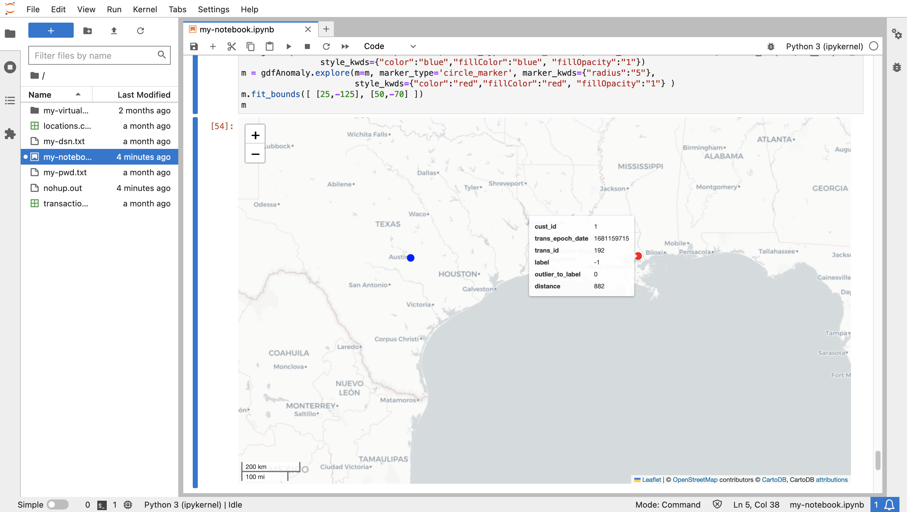
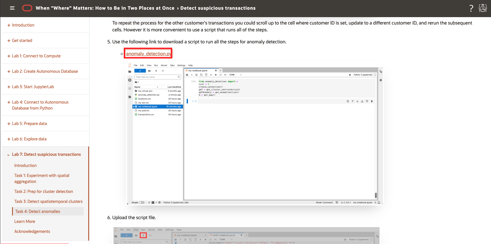

# Detecte transações suspeitas

## Introdução

Os recursos espaciais do Oracle Database fornecem gerenciamento, processamento e análise de dados espaciais escaláveis e seguros. Um dos principais benefícios de trabalhar em Python é a disponibilidade de bibliotecas de código-fonte aberto para aumentar os recursos de análise nativos do Oracle Database. Neste laboratório, você aproveita uma biblioteca que identifica clusters com base no espaço e no tempo ou, em outras palavras, clusters espaço-temporais. Um conjunto de transações que ocorreram dentro de uma área concentrada e um intervalo de tempo pertencem a um cluster espaço-temporal. Uma transação que ocorreu dentro da janela de tempo de um cluster espaço-temporal, mas longe da área de concentração é considerada suspeita. Por exemplo, se durante uma determinada semana as transações de um cliente estivessem concentradas na área de Nova York, uma transação no meio dessa semana na Califórnia seria suspeita. Você identificará essas ocorrências neste laboratório.

Tempo de Laboratório Estimado: 15 minutos

### Objetivos

*   Carregar dados de transações do Oracle Spatial para o Python
*   Detectar clusters espaço-temporais que representam o comportamento esperado
*   Identifique discrepâncias que representam um comportamento suspeito

### Pré-requisitos

*   Conclusão do Laboratório 6: Explorar dados

## Tarefa 1: Experimentar a agregação espacial

Para calcular a distância das transações de um cluster espaço-temporal, é conveniente representar o cluster como uma única geometria. Este é um caso de uso para agregação espacial, em que um conjunto de geometrias é representado por um único agregado. O Oracle Spatial fornece um pacote de funções agregadas espaciais apenas para essa finalidade. Esta tarefa tem como objetivo familiarizá-lo com a agregação espacial.

1.  Comece criando um GeoDataFrame de itens dos locais da tabela **LOCATIONS** dentro de 10 milhas de uma coordenada de longitude/latitude em Austin, TX (-97.7431,30.2672).
    
        <copy>
        cursor = connection.cursor()
        cursor.execute("""
         SELECT (lonlat_to_proj_geom(lon,lat)).get_wkt() as geometry
         FROM locations
         WHERE sdo_within_distance(
                   lonlat_to_proj_geom(lon,lat),
                   lonlat_to_proj_geom(-97.7431,30.2672),
                   'distance=10 unit=MILE') = 'TRUE'
               """)
        gdfPoints = gpd.GeoDataFrame(cursor.fetchall(), columns = ['geometry'])
        gdfPoints['geometry'] = shapely.from_wkt(gdfPoints['geometry'])
        gdfPoints.crs = "EPSG:3857"
        gdfPoints.head()
        </copy>
        
    
    
    
2.  Em seguida, crie um GeoDataFrame contendo o local no centro dos locais selecionados anteriormente. Esse local é chamado de "centroide agregado", portanto, o GeoDataFrame é chamado de gdfAggCent.
    
        <copy>
        cursor.execute("""
         SELECT SDO_AGGR_CENTROID(
                  SDOAGGRTYPE(lonlat_to_proj_geom(lon,lat), 0.005)).get_wkt() as geometry
         FROM locations
         WHERE sdo_within_distance(
                   lonlat_to_proj_geom(lon,lat),
                   lonlat_to_proj_geom(-97.7431,30.2672),
                   'distance=10 unit=MILE') = 'TRUE'
               """)
        gdfAggCent = gpd.GeoDataFrame(cursor.fetchall(), columns = ['geometry'])
        gdfAggCent['geometry'] = shapely.from_wkt(gdfAggCent['geometry'])
        gdfAggCent.crs = "EPSG:3857"
        gdfAggCent
        </copy>
        
    
    
    
3.  Em seguida, crie um GeoDataFrame contendo a forma que limita os locais próximos à coordenada em Austin, TX. Isso é chamado de "casco convexo agregado", portanto, o GeoDataFrame é chamado de gdfAggHull.
    
        <copy>
        cursor.execute("""
         SELECT SDO_AGGR_CONVEXHULL(
                  SDOAGGRTYPE(lonlat_to_proj_geom(lon,lat), 0.005)).get_wkt() as geometry
         FROM locations
         WHERE sdo_within_distance(
                   lonlat_to_proj_geom(lon,lat),
                   lonlat_to_proj_geom(-97.7431,30.2672),
                   'distance=10 unit=MILE') = 'TRUE'
               """)
        gdfAggHull = gpd.GeoDataFrame(cursor.fetchall(), columns = ['geometry'])
        gdfAggHull['geometry'] = shapely.from_wkt(gdfAggHull['geometry'])
        gdfAggHull.crs = "EPSG:3857"
        gdfAggHull
        </copy>
        
    
    
    
    Existem várias outras funções agregadas espaciais que seguem o mesmo padrão.
    
4.  Agora você pode visualizar os pontos e os dois agregados espaciais que você criou. Os locais originais são mostrados em azul, e o centroide agregado e o casco convexo agregado são mostrados em vermelho.
    
        <copy>
        m = gdfPoints.explore(tiles="CartoDB positron",
                               style_kwds={"color":"blue","fillColor":"blue"})
        m = gdfAggHull.explore(m=m,
                               style_kwds={"color":"red","fillOpacity":"0"} )
        m = gdfAggCent.explore(m=m,
                               marker_kwds={"radius":"8"},
                              style_kwds={"color":"red","fillColor":"red","fillOpacity":".7"} )
        m
        </copy>
        
    
    
    

Em seguida, você identificará transações suspeitas que ocorrem durante o intervalo de tempo de um cluster espaço-temporal, mas a uma distância maior que um limite. Como a área coberta por um cluster espaço-temporal é insignificante em comparação com o limite de distância para uma transação suspeita, você usará o centroide agregado para representar a localização de um cluster espaço-temporal.

## Tarefa 2: Preparar para detecção de cluster

1.  Comece importando as bibliotecas necessárias para detectar clusters espaço-temporais. A biblioteca principal é st\_dbscan. Além disso, os pandas e as bibliotecas numpy são necessários para a configuração da entrada para st\_dbscan.
    
        <copy>
        import pandas as pd
        import numpy as np
        from st_dbscan import ST_DBSCAN
        </copy>
        
    
    
    
2.  Agora vamos passar por um exemplo de detecção de clusters espaço-temporais. Execute o seguinte para criar um GeoDataFrame com alguns locais, cada um com horário de época e um ID.
    
        <copy>
        gdf = gpd.GeoDataFrame({
            "id": [1, 2, 3, 4, 5, 6, 7, 8, 9, 10, 11, 12, 13, 14, 15],
            "epoch_date": [1704096000, 1687881600, 1687968000, 1688054400, 1688140800, \
                           1688227200, 1672656000, 1672742400, 1672828800,  1016730016, \
                           1673001600, 1673001600, 1672915200, 673001600, 1688054400],
            "geometry": ["POINT(-115.2368 36.2650)",
                        "POINT(-115.1356 36.1823)",
                        "POINT(-115.1492 36.1779)",
                        "POINT(-115.1385 36.1910)",
                        "POINT(-115.1256 36.1804)",
                        "POINT(-115.1329 36.1735)",
                        "POINT(-115.1711 36.1212)",
                        "POINT(-115.1656 36.1228)",
                        "POINT(-115.1782 36.1221)",
                        "POINT(-115.1695 36.1253)",
                        "POINT(-115.1790 36.1254)",
                        "POINT(-115.1388 36.1858)",
                        "POINT(-115.1669 36.1176)",
                        "POINT(-115.1755 36.1199)",
                        "POINT(-115.1297 36.1900)",
            ],})
        # convert to Shapely geometries
        gdf['geometry'] = shapely.from_wkt(gdf['geometry'])
        # assign longitude/latitude coordinate system
        gdf = gdf.set_crs(4326)
        gdf
        </copy>
        
    
    
    

3\. A biblioteca ST\_DBSCAN exige que as coordenadas estejam na mesma unidade da medição de distância. Portanto, execute o seguinte para converter o sistema de coordenadas de longitude/latitude em coordenadas x/y projetadas com base em medidores. `<copy> # convert to projected x/y coordinates as required for st_dbscan gdf = gdf.to_crs(3857) gdf </copy>`

    
    

4\. A entrada para ST\_DBSCAN é um array Numpy. Portanto, execute o seguinte para converter o GeoDataFrame em um array Numpy. `<copy> # Convert to pandas dataframe df = pd.DataFrame(data={'time': gdf.epoch_date, 'x': gdf.geometry.x, 'y': gdf.geometry.y, 'id': gdf.id}) data = df.values # Convert to numpy array data = np.int_(data) data </copy>`

     
    

5.  A partir daqui, podemos executar ST\_DBSCAN em nossos dados de amostra. ST\_DBSCAN é uma variação do algoritmo DBSCAN (Density-Based Spatial Clustering of Applications with Noise) que é estendido para trabalhar com dados espaciais. Os parâmetros são os limites para clusters; eps1 é o limite de distância nas unidades do sistema de coordenadas (metros), eps2 é o limite de tempo em segundos e min-amostras é o limite para o mínimo de itens. Execute o seguinte para detectar clusters em que os limites são 5 ou mais itens dentro de 5KM e aproximadamente 1 mês.
    
        <copy>
        st_cluster = ST_DBSCAN(eps1 = 5000, eps2 = 3000000, min_samples = 5)
        st_cluster.fit(data)
        </copy>
        
    
    
    

6\. O resultado é um rótulo inteiro para cada item de entrada. Cada rótulo >=0 representa um cluster. O rótulo -1 indica que o item não faz parte de um cluster. Revise o conjunto distinto de rótulos resultantes. Observe que dois clusters foram detectados. `<copy> np.unique(st_cluster.labels) </copy>`

    
    

7\. Adicione o label de número inteiro ao GeoDataFrame. `<copy> df = pd.DataFrame(data={'id': df.id, 'label': st_cluster.labels}) label_mapping_dict = dict(zip(df["id"], df["label"])) gdf["label"] = gdf["id"].map(label_mapping_dict) gdf </copy>`

    
    

8.  Execute o seguinte para visualizar os clusters. Observe que alguns itens estão dentro do limite de distância, mas não do limite temporal.  
    
        <copy>
        gdf.explore(column="label", categorical="True", tiles="CartoDB positron", \
                    cmap=['sienna','blue','limegreen'], marker_kwds={"radius":4}, \
                    style_kwds={"fillOpacity":1})
        </copy>
        
    
    
    

Nas próximas etapas, você usa essa abordagem para detectar transações financeiras suspeitas.

9.  O resultado da detecção de cluster é um "rótulo" para cada item de dados indicando se o item faz parte de um cluster e, em caso afirmativo, qual cluster. Você executará a análise de cluster e salvará os resultados no banco de dados para análise posterior. Execute o seguinte para criar uma tabela de banco de dados que armazenará labels de cluster.
    
        <copy>
        cursor.execute("CREATE TABLE transaction_labels (trans_id integer, label integer)")
        </copy>
        
    
    
    

## Tarefa 3: Detectar clusters espaço-temporais

1.  Neste workshop, você analisará as transações de um cliente por vez. Execute o seguinte para definir uma variável para o id do cliente para análise. Você pode retornar a esta célula para alternar para um cliente diferente para análise.
    
        <copy>
        cust=1
        </copy>
        
    
    
    
2.  Crie um GeoDataframe das transações do cliente. Observe a sintaxe de binding na cláusula WHERE (cust\_id=:cust) suportada pelo driver python-oracledb.
    
        <copy>
        cursor.execute("""
         SELECT a.cust_id,  a.trans_id, a.trans_epoch_date,
               (lonlat_to_proj_geom(b.lon,b.lat)).get_wkt()
         FROM transactions a, locations b
         WHERE a.location_id=b.location_id
         AND cust_id=:cust""", cust=cust)
        gdf = gpd.GeoDataFrame(cursor.fetchall(), columns = ['cust_id', 'trans_id', 'epoch_date', 'geometry'])
        gdf['geometry'] = shapely.from_wkt(gdf['geometry'])
        gdf.head()
        </copy>
        
    
    
    
3.  A biblioteca st\_dbscan requer entrada em formato numpy, em que numpy é uma biblioteca para tratar matrizes. Execute as duas etapas a seguir para converter seu GeoDataFrame em um array de numpy.
    
        <copy>
        # first convert to pandas dataframe
        df = pd.DataFrame(data={'time': gdf.epoch_date, 'x': gdf.geometry.x, 'y': gdf.geometry.y, 'trans_id':  gdf.trans_id, 'cust_id':gdf.cust_id})
        df.head()
        </copy>
        
    
        <copy>
        # then convert to numpy array
        data = df.values
        data = np.int_(data)
        data[1:10]
        </copy>
        
    
    
    
4.  Agora você está pronto para detectar clusters espaço-temporais para as transações do cliente atual. A operação aceita três parâmetros de limite: distância, tempo e número mínimo de itens. Itens com vizinhos dentro dos limites de distância e tempo são considerados parte de um cluster, e a maioria tem pelo menos o número mínimo de itens para se qualificar como um cluster. A distância está nas unidades do sistema de coordenadas, que neste caso são metros. O tempo é em segundos. Execute o seguinte para detectar clusters em que os limites são 5 ou mais itens dentro de 5KM e aproximadamente 1 mês.
    
        <copy>
        st_cluster = ST_DBSCAN(eps1 = 5000, eps2 = 3000000, min_samples = 5)
        st_cluster.fit(data)
        </copy>
        
    
    
    
5.  O resultado é um rótulo inteiro para cada item de entrada. Cada rótulo >=0 representa um cluster. O rótulo -1 indica que o item não faz parte de um cluster. Revise o conjunto distinto de rótulos resultantes. Observe que um cluster foi detectado.
    
        <copy>
        np.unique(st_cluster.labels)
        </copy>
        
    
    
    
6.  Execute o seguinte para adicionar os rótulos de cluster às transações e imprimir as primeiras linhas. Cada transação é rotulada com -1 (o que significa que não faz parte de um cluster) ou um número inteiro >=0 (o que significa que o cluster ao qual o item pertence).
    
        <copy>
        df = pd.DataFrame(data={'trans_id': df.trans_id, 'label': st_cluster.labels})
        df.head()
        </copy>
        
    
    
    
7.  A detecção de anomalias exigirá consultas de banco de dados envolvendo os labels do cluster. Portanto, execute o seguinte para inserir as transações rotuladas do cliente atual na tabela TRANSACTION\_LABELS criada na tarefa anterior.
    
        <copy>
        cursor.executemany("""
         INSERT INTO transaction_labels
         VALUES (:1, :2)""",
         list(df[['trans_id','label']].itertuples(index=False, name=None)))
        connection.commit()
        </copy>
        
    
    
    
8.  Execute o seguinte para recuperar as transações do cliente atual com seus rótulos de cluster.
    
        <copy>
        # labelled transactions for customer
        cursor.execute("""
         SELECT a.cust_id, a.location_id, a.trans_id, a.trans_epoch_date,
                (lonlat_to_proj_geom(b.lon,b.lat)).get_wkt(), c.label
         FROM transactions a, locations b, transaction_labels c
         WHERE a.location_id=b.location_id
         AND a.trans_id=c.trans_id
         """)
        gdf = gpd.GeoDataFrame(cursor.fetchall(), columns = ['cust_id', 'location_id', 'trans_id', 'trans_epoch_date', 'geometry','label'])
        gdf['geometry'] = shapely.from_wkt(gdf['geometry'])
        gdf = gdf.set_crs(3857)
        gdf.head()
        </copy>
        
    
    
    
9.  Execute o seguinte para visualizar as transações rotuladas do cliente atual. Nesse caso, você inclui o parâmetro para codificação por cores dos itens com base no rótulo do cluster. Você também pode passar o mouse sobre um item para ver seus atributos, incluindo o rótulo do cluster.
    
        <copy>
        gdf.explore(column="label", categorical="True", tiles="CartoDB positron", \
                    marker_kwds={"radius":4}, style_kwds={"fillOpacity":1})
        </copy>
        
    
    
    
10.  Zoom na área de Austin, TX, onde os locais de transação do cliente atual estão concentrados, observe a codificação de cores indicando quais fazem parte do cluster espaço-temporal.
    
    
    

## Tarefa 4: Detectar anomalias

1.  Execute o seguinte para criar centroides agregados para os clusters espaço-temporais do cliente atual com atributos para rótulo do cluster, intervalo de tempo e número de transações no cluster. Observe que o primeiro cliente tem apenas 1 cluster (rótulo = 0).
    
        <copy>
        # st cluster centroids for customer
        cursor = connection.cursor()
        cursor.execute("""
         SELECT label, min(trans_epoch_date) as min_time, max(trans_epoch_date) as max_time,
                 SDO_AGGR_CENTROID(
                  SDOAGGRTYPE(lonlat_to_proj_geom(b.lon,b.lat), 0.005)).get_wkt() as geometry,
                 count(*) as trans_count
         FROM transactions a, locations b, transaction_labels c
         WHERE a.location_id=b.location_id
         AND a.trans_id=c.trans_id
         AND c.label != -1
         GROUP BY label
               """)
        gdf = gpd.GeoDataFrame(cursor.fetchall(), columns = ['label','min_time','max_time','geometry','trans_count'])
        gdf['geometry'] = shapely.from_wkt(gdf['geometry'])
        gdf = gdf.set_crs(3857)
        gdf.head()
        </copy>
        
    
    
    
2.  Execute o seguinte para visualizar o centroide de cluster espaço-temporal.
    
        <copy>
        gdf.explore(tiles="CartoDB positron", marker_kwds={"radius":4})
        </copy>
        
    
    
    
3.  Para identificar transações atuais do cliente dentro do intervalo de tempo do(s) cluster(s) e localizadas a uma distância maior que um limite, você executará uma consulta usando o comando WITH ... AS ... SELECT .. A sintaxe WHERE... é a seguinte.
    
        WITH
            x as ( [transactions] ),
            y as ( [spatiotemporal cluster aggregate centroids] )
        SELECT [transaction, cluster label, distance from cluster aggregate centroid, ...]
        FROM x, y
        WHERE [transaction time within cluster time frame]
        AND [distance from cluster > threshold]
        
    
    Execute a consulta a seguir para retornar transações suspeitas junto com o label do cluster associado e a distância do cluster.
    
        <copy>
        cursor = connection.cursor()
        cursor.execute("""
        WITH
           x as (
               SELECT a.cust_id, a.location_id, a.trans_id, a.trans_epoch_date,
                      lonlat_to_proj_geom(b.lon,b.lat) as proj_geom, c.label
               FROM transactions a, locations b, transaction_labels c
               WHERE a.location_id=b.location_id
               AND a.trans_id=c.trans_id ),
           y as (
               SELECT label, min(trans_epoch_date) as min_time, max(trans_epoch_date) as max_time,
                      SDO_AGGR_CENTROID(
                          SDOAGGRTYPE(lonlat_to_proj_geom(b.lon,b.lat), 0.005)) as proj_geom,
                      count(*) as trans_count
               FROM transactions a, locations b, transaction_labels c
               WHERE a.location_id=b.location_id
               AND a.trans_id=c.trans_id
               AND c.label != -1
               GROUP BY label)
         SELECT x.cust_id, x.trans_epoch_date, (x.proj_geom).get_wkt(), x.trans_id, x.label, y.label,
                round(sdo_geom.sdo_distance(x.proj_geom, y.proj_geom, 0.05, 'unit=KM'))
         FROM x, y
         WHERE x.trans_epoch_date between y.min_time and y.max_time
         AND x.label!=y.label
         AND x.label=-1
         AND sdo_within_distance(x.proj_geom, y.proj_geom, 'distance=500 unit=KM') = 'FALSE'
               """)
        gdfAnomaly = gpd.GeoDataFrame(cursor.fetchall(), columns = ['cust_id','trans_epoch_date','geometry', 'trans_id','label','outlier_to_label','distance'])
        gdfAnomaly['geometry'] = shapely.from_wkt(gdfAnomaly['geometry'])
        gdfAnomaly = gdfAnomaly.set_crs(3857)
        gdfAnomaly.head()
        </copy>
        
    
    
    
4.  Execute o seguinte para visualizar o(s) cluster(s) espaço-temporal(is) como marcadores azuis e atípicos suspeitos associados como marcadores vermelhos. Passe o mouse sobre as transações suspeitas para ver seus atributos.
    
        <copy>
        m = gdf.explore(tiles="CartoDB positron", marker_type='circle_marker',marker_kwds={"radius":"5"},
                        style_kwds={"color":"blue","fillColor":"blue", "fillOpacity":"1"})
        m = gdfAnomaly.explore(m=m, marker_type='circle_marker', marker_kwds={"radius":"5"},
                               style_kwds={"color":"red","fillColor":"red", "fillOpacity":"1"} )
        m.fit_bounds(m.get_bounds())
        m
        </copy>
        
    
    
    
    Para repetir o processo das transações do outro cliente, você pode rolar até a célula em que o ID do cliente está definido, atualizar para um ID de cliente diferente e executar novamente as células subsequentes. No entanto, é mais conveniente usar um script que execute todas as etapas.
    
5.  Use o seguinte link para fazer download de um script que inclua todas as etapas para detecção de anomalias:
    
    *   [anomaly\_detection.py](./files/anomaly_detection.py)
    
    
    
6.  Clique no botão de upload, navegue até o script que você baixou e faça upload do arquivo de script.
    
    
    
7.  Execute o seguinte para importar o script.
    
        <copy>
        from anomaly_detection import *
        </copy>
        
    
    
    
    Agora você pode analisar as transações de outros clientes usando funções no script. Eles reproduzirão as etapas anteriores a partir da Tarefa 3 após esvaziar a tabela TRANSACTION\_LABELS como um novo conjunto de labels.
    
    *   create\_connection() estabelece uma conexão de banco de dados
    *   get\_cluster\_centroids( ) detecta clusters de transações espaço-temporais para um cliente
    *   get\_anomalies( ) identifica transações suspeitas com base na sobreposição de tempo e distância além do limite dos clusters
    *   get\_map( ) retorna um mapa de clusters e transações suspeitas associadas
8.  Execute o seguinte para detectar transações suspeitas para o id do cliente = 2.
    
        <copy>
        cust = 2
        </copy>
        
    
        <copy>
        create_connection()
        gdf = get_cluster_centroids(cust)
        gdfAnomaly = get_anomalies(cust)
        m = get_map()
        </copy>
        
    
    
    
9.  Execute o seguinte para listar os clusters espaço-temporais.
    
        <copy>
        gdf
        </copy>
        
    
    
    
10.  Execute o seguinte para listar as anomalias associadas.
    
        <copy>
        gdfAnomaly
        </copy>
        
    
    
    
11.  Execute o seguinte para visualizar os clusters e anomalias associadas.
    
        <copy>
        m.fit_bounds(m.get_bounds())
        m
        </copy>
        

      
    
    To detect suspicious for other customers, scroll up to step 8, set a different customer id, and re-run the the subsequent cells to call the functions in the script.
    

Esperamos que este workshop tenha sido informativo e que você explore ainda mais os recursos espaciais do Oracle Database e seu uso em machine learning e fluxos de trabalho de IA.

## Saiba Mais

*   Para obter detalhes sobre funções de agregação Espacial, consulte [https://docs.oracle.com/en/database/oracle/oracle-database/19/spatl/spatial-aggregate-functions.html](https://docs.oracle.com/en/database/oracle/oracle-database/19/spatl/spatial-aggregate-functions.html)
*   Para obter detalhes sobre st\_dbscan, consulte [ST-DBSCAN: Um algoritmo para clusterizar dados espaço-temporais](https://www.sciencedirect.com/science/article/pii/S0169023X06000218) e [https://github.com/eren-ck/st\_dbscan](https://github.com/eren-ck/st_dbscan)

## Agradecimentos

*   **Autor** - David Lapp, Database Product Management, Oracle
*   **Colaboradores** - Rahul Tasker, Denise Myrick, Ramu Gutierrez
*   **Última Atualização em/Data** - David Lapp, agosto de 2023