# 检测可疑交易

## 简介

Oracle Database 的空间功能可提供可扩展、安全的空间数据管理、处理和分析。在 Python 中工作的一个主要好处是开源库的可用性，以增强 Oracle Database 的原生分析功能。在此实验室中，您可以利用一个库来基于空间和时间来标识群集，或者换句话说，即时空群集。集中区域和时段内发生的一组事务处理属于时空集群。在时空集群的时间窗口内发生但远离集中区域的交易被认为是可疑的。例如，如果在给定的一周内，客户的交易集中在纽约市地区，则该周中在加利福尼亚州的交易将是可疑的。您将在此实验室中找出此类事件。

估计的实验室时间：15 分钟

### 目标

*   将事务数据从 Oracle Spatial 加载到 Python
*   检测表示预期行为的时空集簇
*   识别表示可疑行为的异常值

### 先备条件

*   实验室 6 的完成：探索数据

## 任务 1：空间聚合实验

要计算交易与时空集簇的距离，可以方便地将集簇表示为单个几何。这是空间聚合的用例，其中一组几何图形用单个聚合表示。Oracle Spatial 提供了一套用于此目的的空间聚合函数。此任务旨在帮助您熟悉空间聚合。

1.  首先，在 TX 奥斯汀 (Austin，TX) 的经度/纬度坐标 10 英里以内的 **LOCATIONS** 表位置创建项目 GeoDataFrame(-97.7431,30.2672)。
    
        <copy>
        cursor = connection.cursor()
        cursor.execute("""
         SELECT (lonlat_to_proj_geom(lon,lat)).get_wkt() as geometry
         FROM locations
         WHERE sdo_within_distance(
                   lonlat_to_proj_geom(lon,lat),
                   lonlat_to_proj_geom(-97.7431,30.2672),
                   'distance=10 unit=MILE') = 'TRUE'
               """)
        gdfPoints = gpd.GeoDataFrame(cursor.fetchall(), columns = ['geometry'])
        gdfPoints['geometry'] = shapely.from_wkt(gdfPoints['geometry'])
        gdfPoints.crs = "EPSG:3857"
        gdfPoints.head()
        </copy>
        
    
    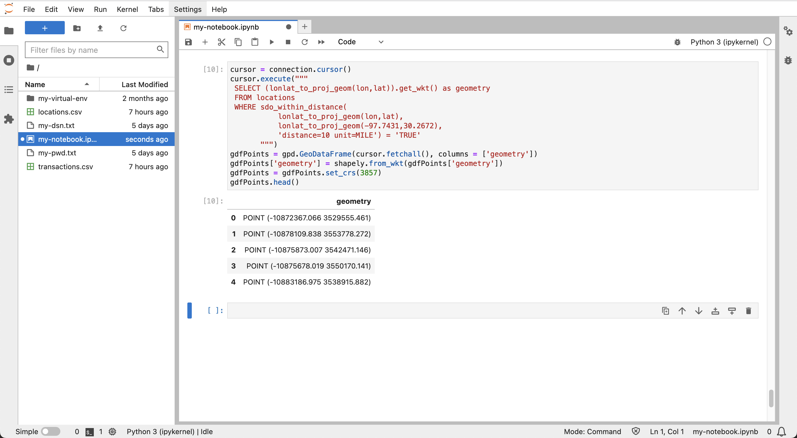
    
2.  接下来创建一个 GeoDataFrame，其中包含位于先前所选位置中心的位置。此位置称为“聚集中心”，因此 GeoDataFrame 命名为 gdfAggCent。
    
        <copy>
        cursor.execute("""
         SELECT SDO_AGGR_CENTROID(
                  SDOAGGRTYPE(lonlat_to_proj_geom(lon,lat), 0.005)).get_wkt() as geometry
         FROM locations
         WHERE sdo_within_distance(
                   lonlat_to_proj_geom(lon,lat),
                   lonlat_to_proj_geom(-97.7431,30.2672),
                   'distance=10 unit=MILE') = 'TRUE'
               """)
        gdfAggCent = gpd.GeoDataFrame(cursor.fetchall(), columns = ['geometry'])
        gdfAggCent['geometry'] = shapely.from_wkt(gdfAggCent['geometry'])
        gdfAggCent.crs = "EPSG:3857"
        gdfAggCent
        </copy>
        
    
    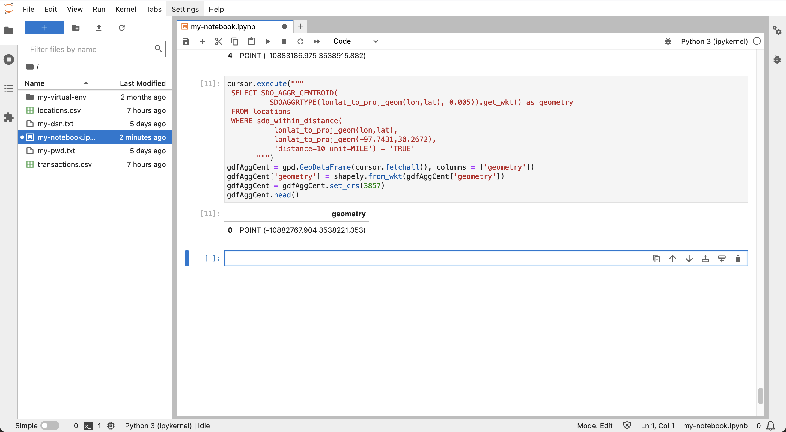
    
3.  接下来创建一个 GeoDataFrame，其中包含绑定坐标附近位置的形状，位于 TX Austin。这称为“聚合凸体船体”，因此 GeoDataFrame 命名为 gdfAggHull。
    
        <copy>
        cursor.execute("""
         SELECT SDO_AGGR_CONVEXHULL(
                  SDOAGGRTYPE(lonlat_to_proj_geom(lon,lat), 0.005)).get_wkt() as geometry
         FROM locations
         WHERE sdo_within_distance(
                   lonlat_to_proj_geom(lon,lat),
                   lonlat_to_proj_geom(-97.7431,30.2672),
                   'distance=10 unit=MILE') = 'TRUE'
               """)
        gdfAggHull = gpd.GeoDataFrame(cursor.fetchall(), columns = ['geometry'])
        gdfAggHull['geometry'] = shapely.from_wkt(gdfAggHull['geometry'])
        gdfAggHull.crs = "EPSG:3857"
        gdfAggHull
        </copy>
        
    
    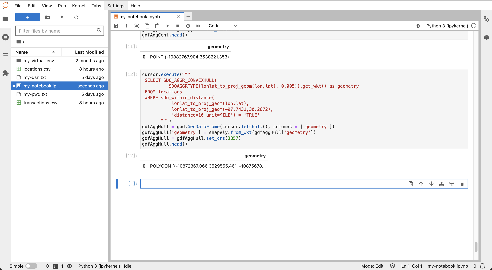
    
    还有其他几个遵循相同模式的空间聚集函数。
    
4.  现在，您可以可视化已经创建的点和两个空间聚合。原始位置以蓝色显示，聚合的中间体和聚合凸体壳体以红色显示。
    
        <copy>
        m = gdfPoints.explore(tiles="CartoDB positron",
                               style_kwds={"color":"blue","fillColor":"blue"})
        m = gdfAggHull.explore(m=m,
                               style_kwds={"color":"red","fillOpacity":"0"} )
        m = gdfAggCent.explore(m=m,
                               marker_kwds={"radius":"8"},
                              style_kwds={"color":"red","fillColor":"red","fillOpacity":".7"} )
        m
        </copy>
        
    
    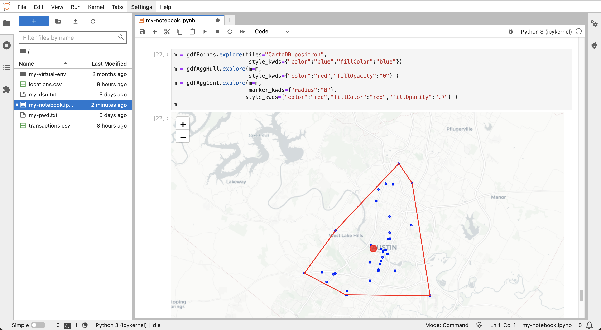
    

接下来，您将确定在时空群集的时间范围内发生但距离大于阈值的可疑交易。由于与可疑交易的距离阈值相比，时空集簇所覆盖的区域微不足道，因此您将使用聚集中心来表示时空集簇的位置。

## 任务 2：准备群集检测

1.  首先导入检测时空群集所需的库。主库为 st\_dbscan。此外，还需要使用 pandas 和 numpy 库来配置 st\_dbscan 的输入。
    
        <copy>
        import pandas as pd
        import numpy as np
        from st_dbscan import ST_DBSCAN
        </copy>
        
    
    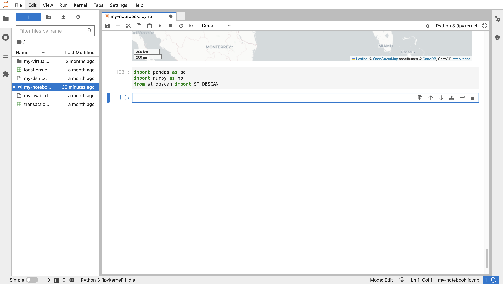
    
2.  现在让我们来看看一个检测时空集群的例子。运行以下命令以创建一个 GeoDataFrame，其中每个位置都有纪元时间和 ID。
    
        <copy>
        gdf = gpd.GeoDataFrame({
            "id": [1, 2, 3, 4, 5, 6, 7, 8, 9, 10, 11, 12, 13, 14, 15],
            "epoch_date": [1704096000, 1687881600, 1687968000, 1688054400, 1688140800, \
                           1688227200, 1672656000, 1672742400, 1672828800,  1016730016, \
                           1673001600, 1673001600, 1672915200, 673001600, 1688054400],
            "geometry": ["POINT(-115.2368 36.2650)",
                        "POINT(-115.1356 36.1823)",
                        "POINT(-115.1492 36.1779)",
                        "POINT(-115.1385 36.1910)",
                        "POINT(-115.1256 36.1804)",
                        "POINT(-115.1329 36.1735)",
                        "POINT(-115.1711 36.1212)",
                        "POINT(-115.1656 36.1228)",
                        "POINT(-115.1782 36.1221)",
                        "POINT(-115.1695 36.1253)",
                        "POINT(-115.1790 36.1254)",
                        "POINT(-115.1388 36.1858)",
                        "POINT(-115.1669 36.1176)",
                        "POINT(-115.1755 36.1199)",
                        "POINT(-115.1297 36.1900)",
            ],})
        # convert to Shapely geometries
        gdf['geometry'] = shapely.from_wkt(gdf['geometry'])
        # assign longitude/latitude coordinate system
        gdf = gdf.set_crs(4326)
        gdf
        </copy>
        
    
    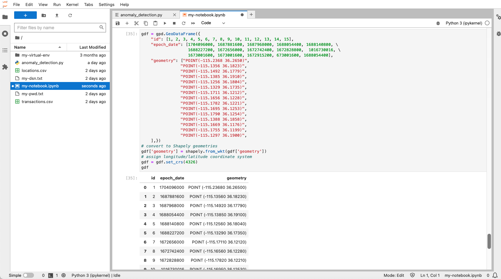
    

3.ST\_DBSCAN 库要求坐标与距离测量单位相同。因此，运行以下命令可将坐标系统从经度/纬度转换为基于米的预计 x/y 坐标。`<copy> # convert to projected x/y coordinates as required for st_dbscan gdf = gdf.to_crs(3857) gdf </copy>`

    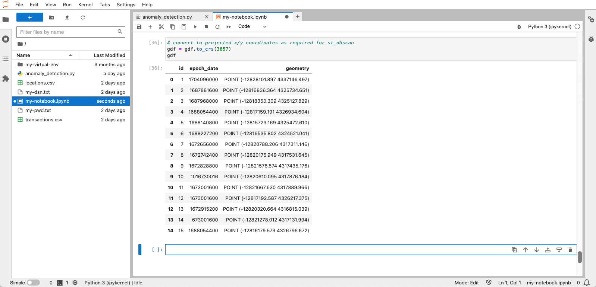
    

4.ST\_DBSCAN 的输入是一个 Numpy 数组。因此，运行以下命令将 GeoDataFrame 转换为 Numpy 数组。`<copy> # Convert to pandas dataframe df = pd.DataFrame(data={'time': gdf.epoch_date, 'x': gdf.geometry.x, 'y': gdf.geometry.y, 'id': gdf.id}) data = df.values # Convert to numpy array data = np.int_(data) data </copy>`

     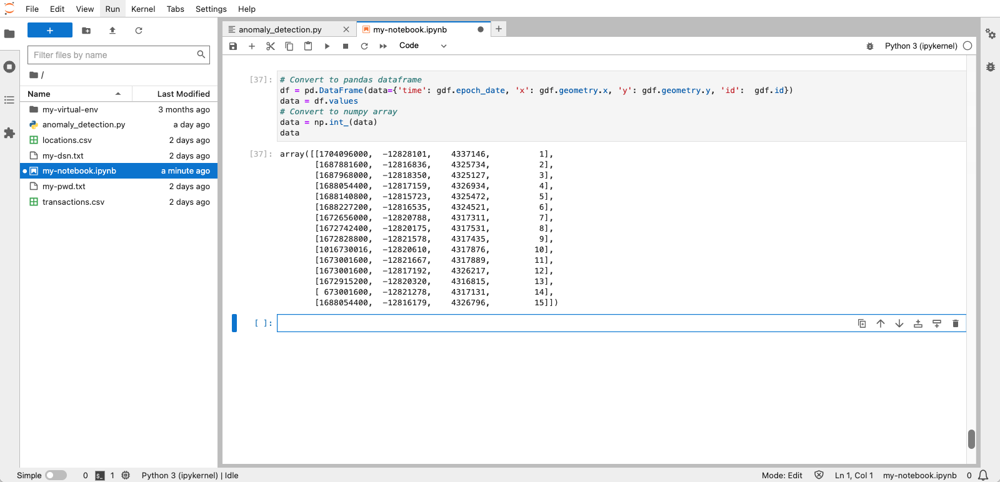
    

5.  在此处，我们可以对示例数据运行 ST\_DBSCAN。ST\_DBSCAN 是基于密度的噪声应用空间聚类 (Density-Based Spatial Clustering of Applications with Noise，DBSCAN) 算法的一个变体，扩展为处理空间数据。参数是集群的阈值；eps1 是以坐标系（米）单位表示的距离阈值，eps2 是时间阈值（秒），min-samples 是最小项的阈值。运行以下命令可检测阈值为 5 KM 及大约 1 个月内 5 个或更多项目的群集。
    
        <copy>
        st_cluster = ST_DBSCAN(eps1 = 5000, eps2 = 3000000, min_samples = 5)
        st_cluster.fit(data)
        </copy>
        
    
    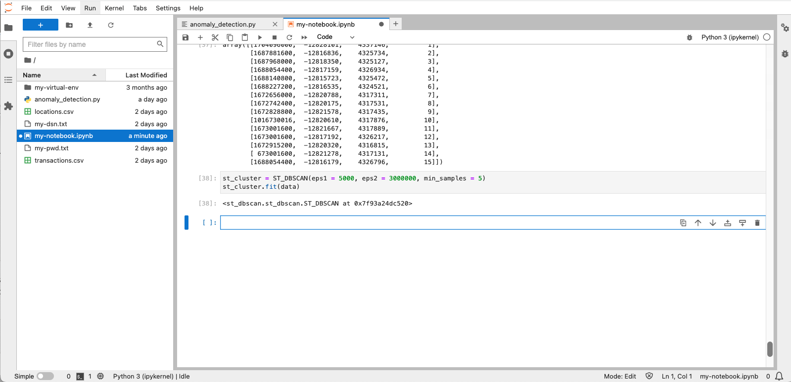
    

6\. 结果是每个输入项的整数标签。每个标签 >=0 表示一个群集。标签 -1 表示项目不属于群集。查看生成的标签的不同集合。请注意，检测到两个集群。 `<copy> np.unique(st_cluster.labels) </copy>`

    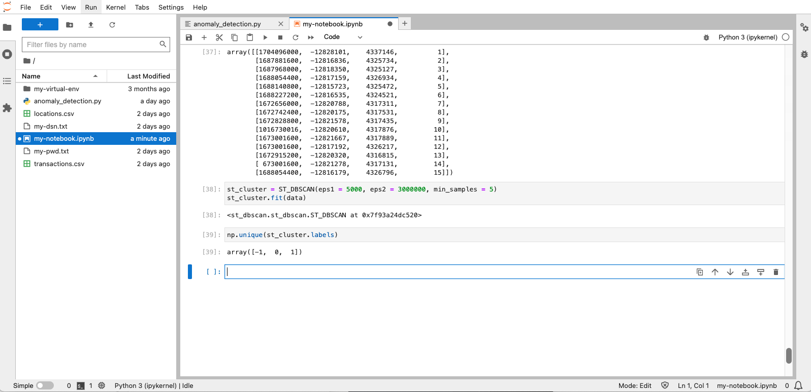
    

7\. 将整数标签添加到 GeoDataFrame。 `<copy> df = pd.DataFrame(data={'id': df.id, 'label': st_cluster.labels}) label_mapping_dict = dict(zip(df["id"], df["label"])) gdf["label"] = gdf["id"].map(label_mapping_dict) gdf </copy>`

    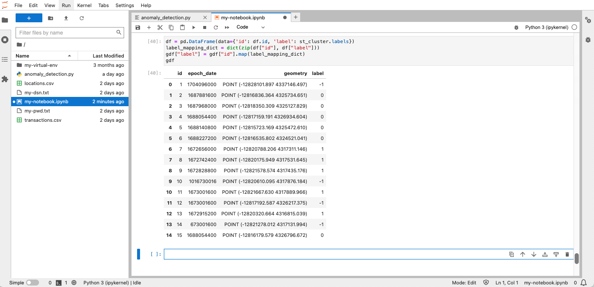
    

8.  运行以下命令以可视化集群。请注意，某些项在距离阈值范围内，但不是时间阈值。  
    
        <copy>
        gdf.explore(column="label", categorical="True", tiles="CartoDB positron", \
                    cmap=['sienna','blue','limegreen'], marker_kwds={"radius":4}, \
                    style_kwds={"fillOpacity":1})
        </copy>
        
    
    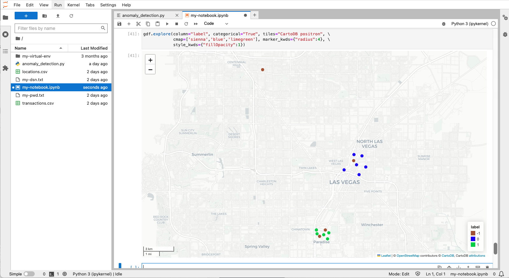
    

在接下来的步骤中，您将使用此方法来检测可疑的财务交易。

9.  集群检测的结果是每个数据项的“标签”，指示该项是否是集群的一部分，如果是，则指示哪个集群。您将执行集群分析并将结果保存到数据库中以供进一步分析。运行以下命令创建将存储集群标签的数据库表。
    
        <copy>
        cursor.execute("CREATE TABLE transaction_labels (trans_id integer, label integer)")
        </copy>
        
    
    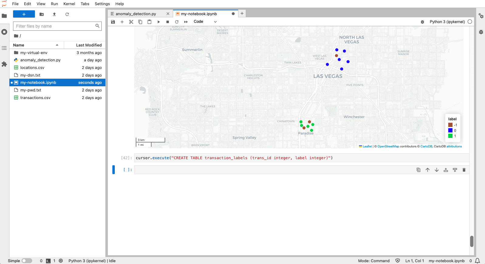
    

## 任务 3：检测时空集簇

1.  在本研讨会中，您将一次分析一个客户的事务处理。运行以下命令为客户 ID 设置变量以进行分析。您可以返回此单元格以切换到其他客户进行分析。
    
        <copy>
        cust=1
        </copy>
        
    
    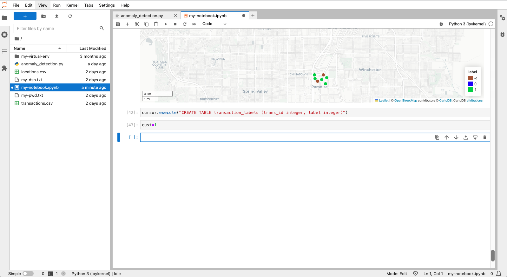
    
2.  创建客户事务处理的 GeoDataframe。请注意 python-oracledb 驱动程序支持的 WHERE 子句 (cust\_id=：cust) 中的绑定语法。
    
        <copy>
        cursor.execute("""
         SELECT a.cust_id,  a.trans_id, a.trans_epoch_date,
               (lonlat_to_proj_geom(b.lon,b.lat)).get_wkt()
         FROM transactions a, locations b
         WHERE a.location_id=b.location_id
         AND cust_id=:cust""", cust=cust)
        gdf = gpd.GeoDataFrame(cursor.fetchall(), columns = ['cust_id', 'trans_id', 'epoch_date', 'geometry'])
        gdf['geometry'] = shapely.from_wkt(gdf['geometry'])
        gdf.head()
        </copy>
        
    
    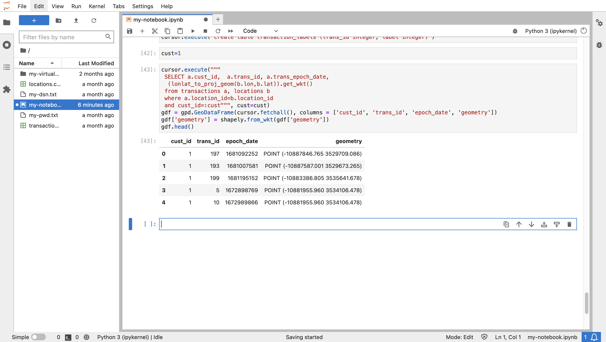
    
3.  st\_dbscan 库需要以 numpy 格式输入，其中 numpy 是用于处理数组的库。运行以下两个步骤将 GeoDataFrame 转换为 numpy 数组。
    
        <copy>
        # first convert to pandas dataframe
        df = pd.DataFrame(data={'time': gdf.epoch_date, 'x': gdf.geometry.x, 'y': gdf.geometry.y, 'trans_id':  gdf.trans_id, 'cust_id':gdf.cust_id})
        df.head()
        </copy>
        
    
        <copy>
        # then convert to numpy array
        data = df.values
        data = np.int_(data)
        data[1:10]
        </copy>
        
    
    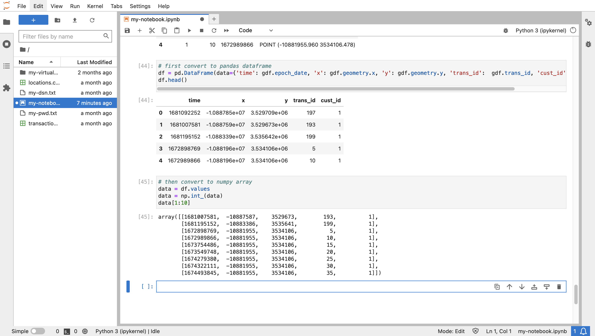
    
4.  您现在可以检测当前客户事务处理的时空集群。操作接受三个阈值参数：距离、时间和最小项数。在距离和时间阈值内具有相邻项的项被视为群集的一部分，并且最多至少有最少数量的项可限定为群集。距离以坐标系的单位表示，在本例中为米。时间以秒为单位。运行以下命令可检测阈值为 5 KM 及大约 1 个月内 5 个或更多项目的群集。
    
        <copy>
        st_cluster = ST_DBSCAN(eps1 = 5000, eps2 = 3000000, min_samples = 5)
        st_cluster.fit(data)
        </copy>
        
    
    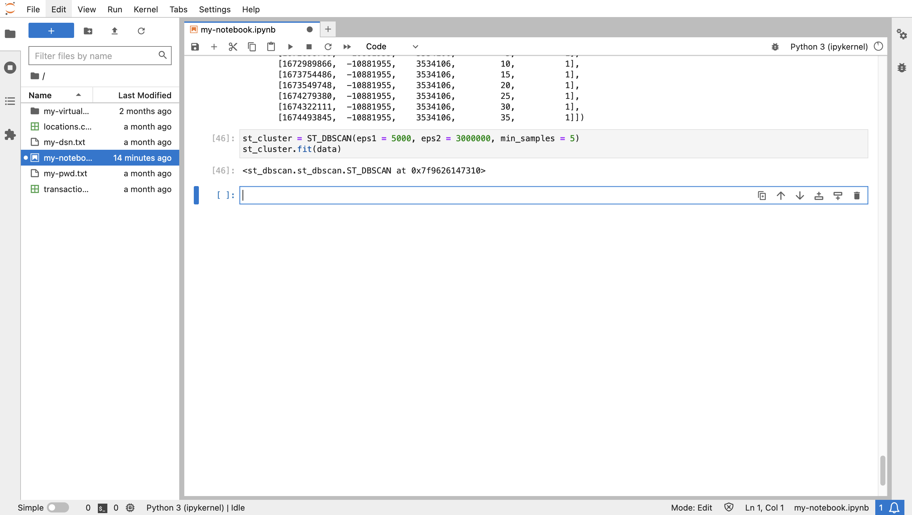
    
5.  结果是每个输入项的整数标签。每个标签 >=0 表示一个群集。标签 -1 表示项目不属于群集。查看生成的标签的不同集合。请注意，检测到一个集群。
    
        <copy>
        np.unique(st_cluster.labels)
        </copy>
        
    
    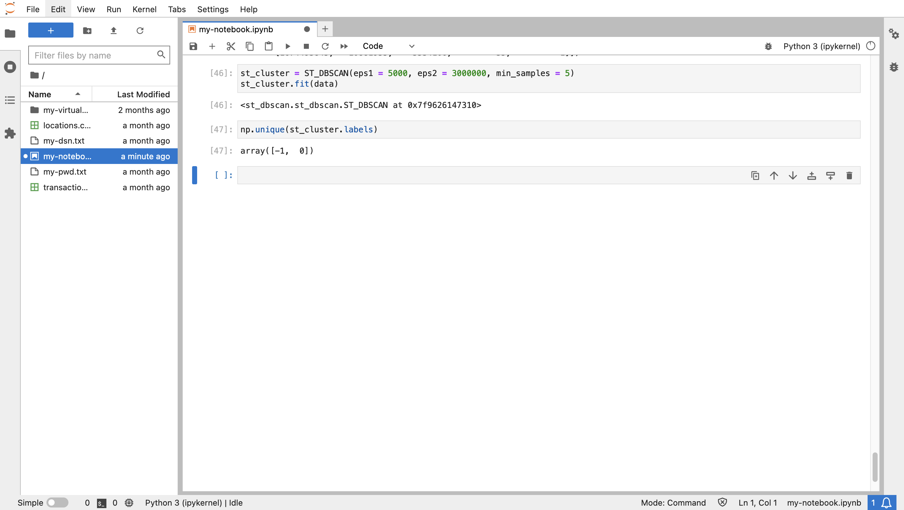
    
6.  运行以下命令可将群集标签添加到事务并打印前几行。每个事务处理都标有 -1（表示不是集群的一部分）或 >=0 的整数（表示项所属的集群）。
    
        <copy>
        df = pd.DataFrame(data={'trans_id': df.trans_id, 'label': st_cluster.labels})
        df.head()
        </copy>
        
    
    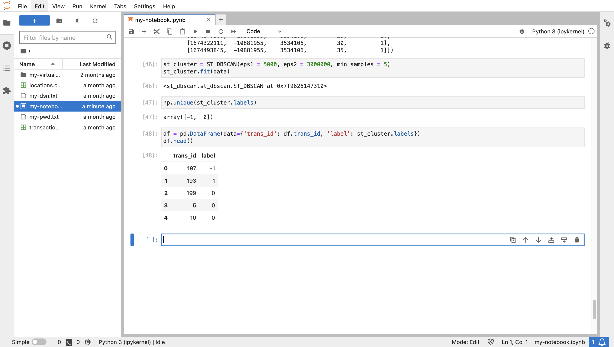
    
7.  检测异常将需要涉及集群标签的数据库查询。因此，运行以下命令将当前客户的标记事务处理插入到在上一个任务中创建的 TRANSACTION\_LABELS 表中。
    
        <copy>
        cursor.executemany("""
         INSERT INTO transaction_labels
         VALUES (:1, :2)""",
         list(df[['trans_id','label']].itertuples(index=False, name=None)))
        connection.commit()
        </copy>
        
    
    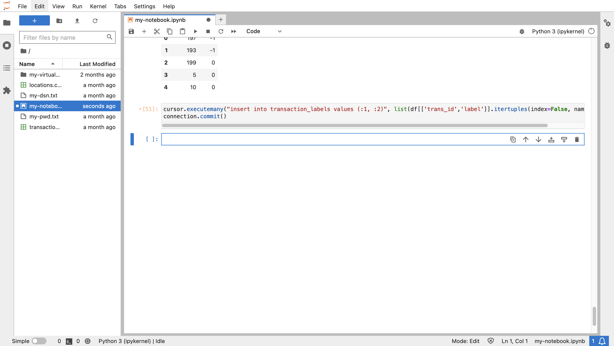
    
8.  运行以下命令以检索当前客户的事务处理及其群集标签。
    
        <copy>
        # labelled transactions for customer
        cursor.execute("""
         SELECT a.cust_id, a.location_id, a.trans_id, a.trans_epoch_date,
                (lonlat_to_proj_geom(b.lon,b.lat)).get_wkt(), c.label
         FROM transactions a, locations b, transaction_labels c
         WHERE a.location_id=b.location_id
         AND a.trans_id=c.trans_id
         """)
        gdf = gpd.GeoDataFrame(cursor.fetchall(), columns = ['cust_id', 'location_id', 'trans_id', 'trans_epoch_date', 'geometry','label'])
        gdf['geometry'] = shapely.from_wkt(gdf['geometry'])
        gdf = gdf.set_crs(3857)
        gdf.head()
        </copy>
        
    
    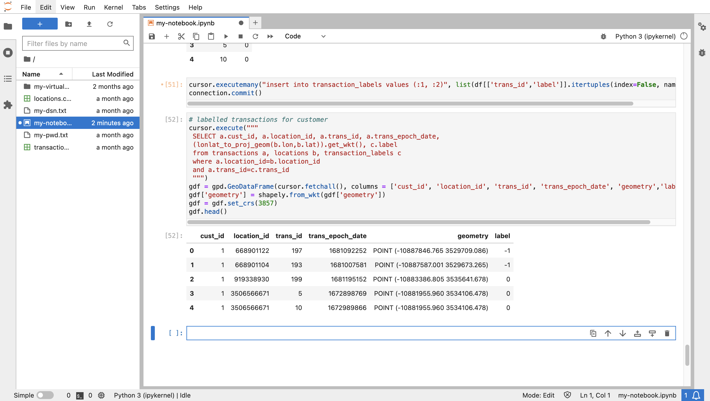
    
9.  运行以下命令以可视化当前客户的标记事务处理。在这种情况下，您可以包括用于根据群集标签对项进行颜色编码的参数。您还可以将鼠标移到某个项上以查看其属性，包括群集标签。
    
        <copy>
        gdf.explore(column="label", categorical="True", tiles="CartoDB positron", \
                    marker_kwds={"radius":4}, style_kwds={"fillOpacity":1})
        </copy>
        
    
    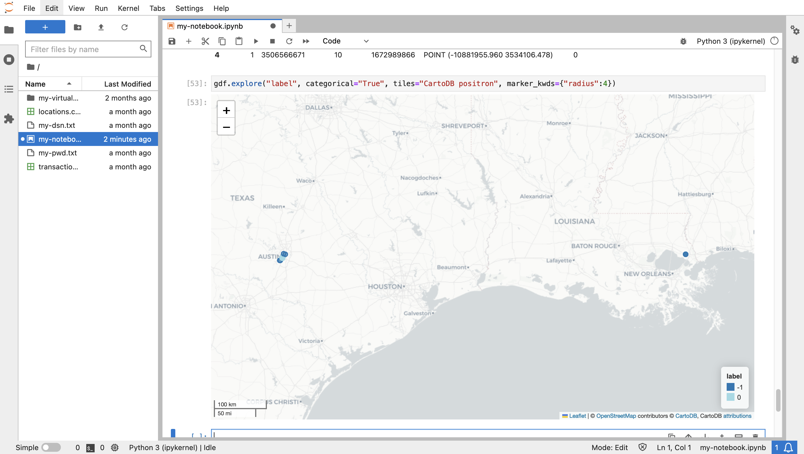
    
10.  放大到当前客户交易地点集中的德克萨斯州奥斯汀地区，观察颜色编码，指示哪个是时空集群的一部分。
    
    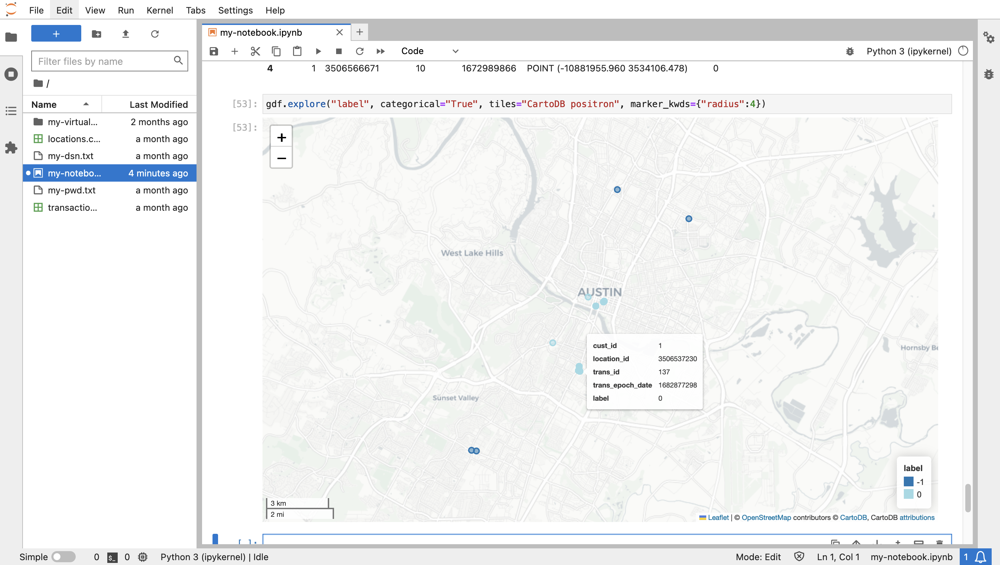
    

## 任务 4：检测异常

1.  运行以下命令，为当前客户的时空集群创建聚合中心，其中包含集群标签、时间范围和集群中事务处理数的属性。观察第一个客户只有 1 个集群（标签 = 0）。
    
        <copy>
        # st cluster centroids for customer
        cursor = connection.cursor()
        cursor.execute("""
         SELECT label, min(trans_epoch_date) as min_time, max(trans_epoch_date) as max_time,
                 SDO_AGGR_CENTROID(
                  SDOAGGRTYPE(lonlat_to_proj_geom(b.lon,b.lat), 0.005)).get_wkt() as geometry,
                 count(*) as trans_count
         FROM transactions a, locations b, transaction_labels c
         WHERE a.location_id=b.location_id
         AND a.trans_id=c.trans_id
         AND c.label != -1
         GROUP BY label
               """)
        gdf = gpd.GeoDataFrame(cursor.fetchall(), columns = ['label','min_time','max_time','geometry','trans_count'])
        gdf['geometry'] = shapely.from_wkt(gdf['geometry'])
        gdf = gdf.set_crs(3857)
        gdf.head()
        </copy>
        
    
    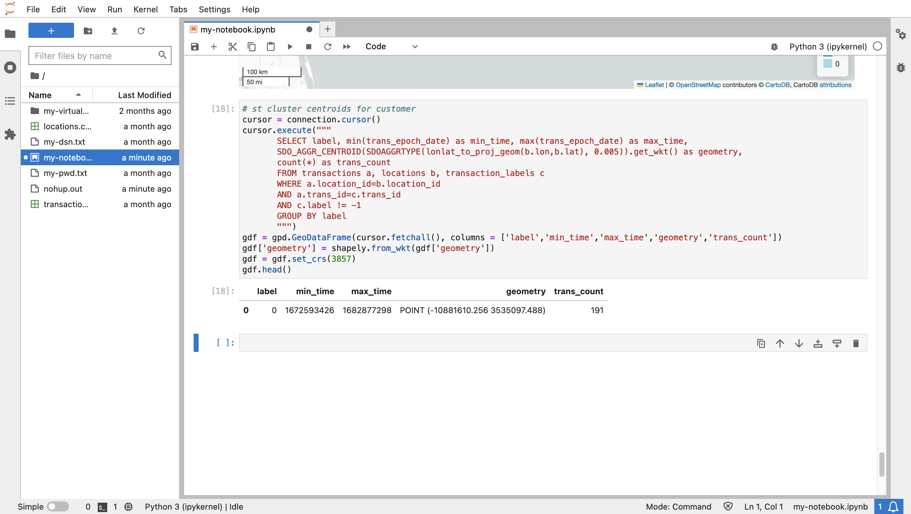
    
2.  运行以下操作以可视化时空集簇中心。
    
        <copy>
        gdf.explore(tiles="CartoDB positron", marker_kwds={"radius":4})
        </copy>
        
    
    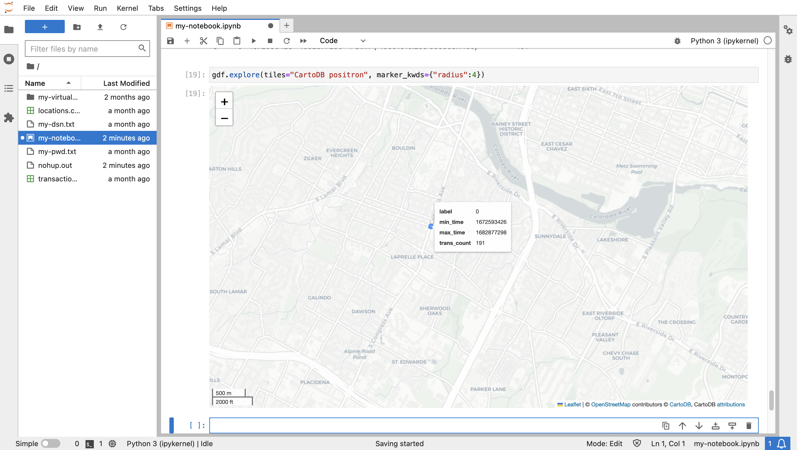
    
3.  要标识集群时间范围内且位于大于阈值的距离的当前客户事务处理，将使用 WITH ... 运行查询。AS...SELECT ..WHERE... 语法如下：
    
        WITH
            x as ( [transactions] ),
            y as ( [spatiotemporal cluster aggregate centroids] )
        SELECT [transaction, cluster label, distance from cluster aggregate centroid, ...]
        FROM x, y
        WHERE [transaction time within cluster time frame]
        AND [distance from cluster > threshold]
        
    
    运行以下查询以返回可疑事务处理以及关联的集群标签和与集群的距离。
    
        <copy>
        cursor = connection.cursor()
        cursor.execute("""
        WITH
           x as (
               SELECT a.cust_id, a.location_id, a.trans_id, a.trans_epoch_date,
                      lonlat_to_proj_geom(b.lon,b.lat) as proj_geom, c.label
               FROM transactions a, locations b, transaction_labels c
               WHERE a.location_id=b.location_id
               AND a.trans_id=c.trans_id ),
           y as (
               SELECT label, min(trans_epoch_date) as min_time, max(trans_epoch_date) as max_time,
                      SDO_AGGR_CENTROID(
                          SDOAGGRTYPE(lonlat_to_proj_geom(b.lon,b.lat), 0.005)) as proj_geom,
                      count(*) as trans_count
               FROM transactions a, locations b, transaction_labels c
               WHERE a.location_id=b.location_id
               AND a.trans_id=c.trans_id
               AND c.label != -1
               GROUP BY label)
         SELECT x.cust_id, x.trans_epoch_date, (x.proj_geom).get_wkt(), x.trans_id, x.label, y.label,
                round(sdo_geom.sdo_distance(x.proj_geom, y.proj_geom, 0.05, 'unit=KM'))
         FROM x, y
         WHERE x.trans_epoch_date between y.min_time and y.max_time
         AND x.label!=y.label
         AND x.label=-1
         AND sdo_within_distance(x.proj_geom, y.proj_geom, 'distance=500 unit=KM') = 'FALSE'
               """)
        gdfAnomaly = gpd.GeoDataFrame(cursor.fetchall(), columns = ['cust_id','trans_epoch_date','geometry', 'trans_id','label','outlier_to_label','distance'])
        gdfAnomaly['geometry'] = shapely.from_wkt(gdfAnomaly['geometry'])
        gdfAnomaly = gdfAnomaly.set_crs(3857)
        gdfAnomaly.head()
        </copy>
        
    
    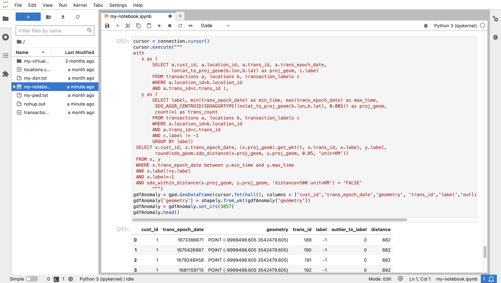
    
4.  运行以下命令可将时空集簇可视化为蓝色标记，并将可疑异常值关联为红色标记。将鼠标悬停在可疑交易上以查看其属性。
    
        <copy>
        m = gdf.explore(tiles="CartoDB positron", marker_type='circle_marker',marker_kwds={"radius":"5"},
                        style_kwds={"color":"blue","fillColor":"blue", "fillOpacity":"1"})
        m = gdfAnomaly.explore(m=m, marker_type='circle_marker', marker_kwds={"radius":"5"},
                               style_kwds={"color":"red","fillColor":"red", "fillOpacity":"1"} )
        m.fit_bounds(m.get_bounds())
        m
        </copy>
        
    
    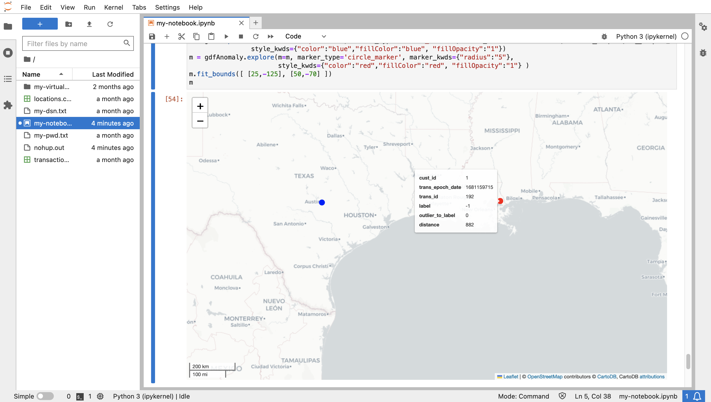
    
    要为其他客户的事务处理重复此过程，您可以滚动到设置了客户 ID 的单元格，更新到其他客户 ID，然后重新运行后续单元格。但是，使用运行所有步骤的脚本更为方便。
    
5.  使用以下链接下载包含异常检测的所有步骤的脚本：
    
    *   [anomaly\_detection.py](./files/anomaly_detection.py)
    
    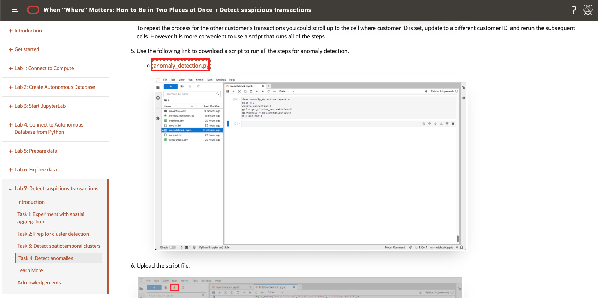
    
6.  单击“Upload（上载）”按钮，导航到您下载的脚本，然后上载脚本文件。
    
    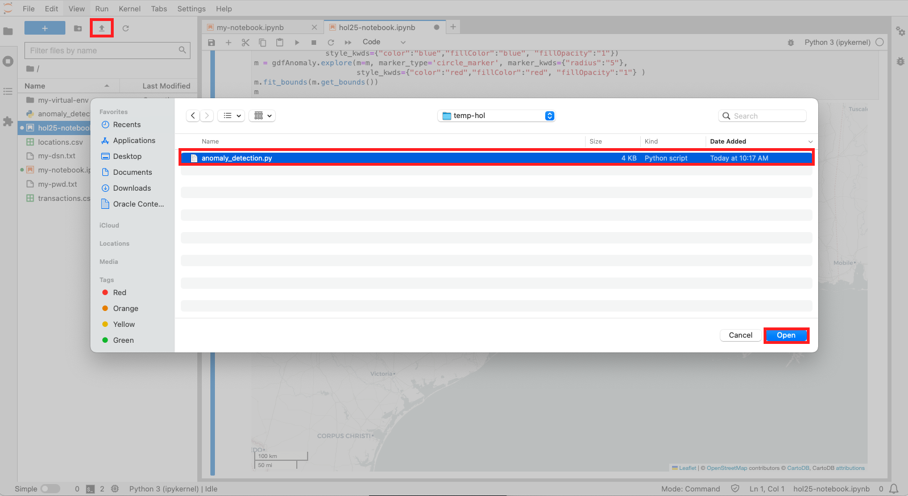
    
7.  运行以下命令以导入该脚本。
    
        <copy>
        from anomaly_detection import *
        </copy>
        
    
    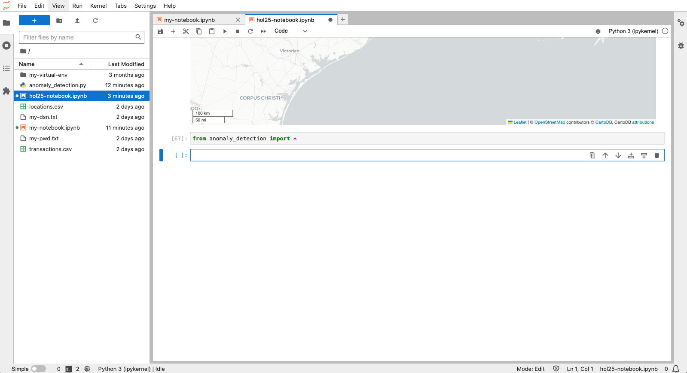
    
    现在，您可以使用脚本中的函数分析其他客户的事务处理。在清空 TRANSACTION\_LABELS 表之后，这些步骤将重现从任务 3 开始的先前步骤，作为一组新标签。
    
    *   create\_connection() 创建数据库连接
    *   get\_cluster\_centroids( ) 检测客户的时空事务处理集群
    *   get\_anomalies( ) 根据重叠时间和超出集群阈值的距离确定可疑交易
    *   get\_map( ) 返回集群映射和关联的可疑事务处理
8.  运行以下命令检测客户 ID = 2 的可疑交易。
    
        <copy>
        cust = 2
        </copy>
        
    
        <copy>
        create_connection()
        gdf = get_cluster_centroids(cust)
        gdfAnomaly = get_anomalies(cust)
        m = get_map()
        </copy>
        
    
    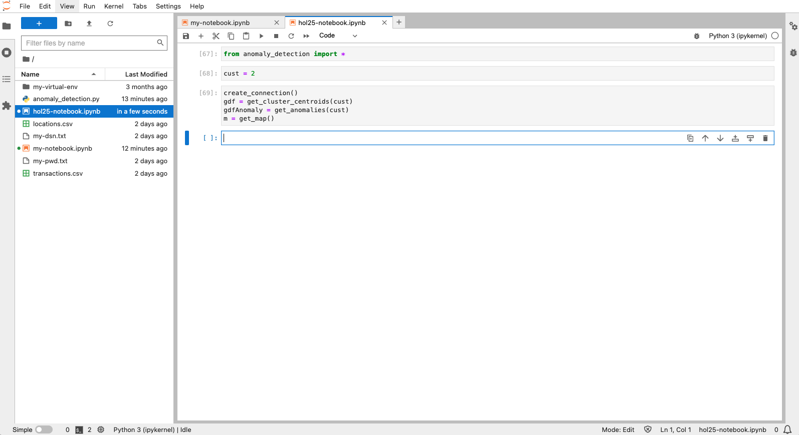
    
9.  运行以下命令列出时空群集。
    
        <copy>
        gdf
        </copy>
        
    
    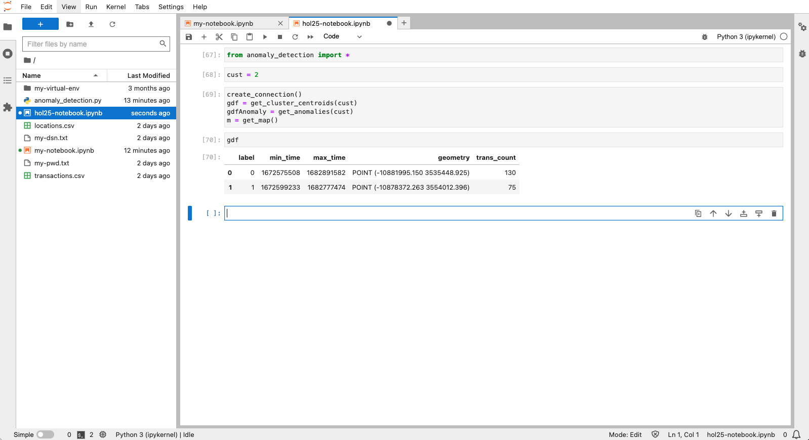
    
10.  运行以下命令以列出关联的异常。
    
        <copy>
        gdfAnomaly
        </copy>
        
    
    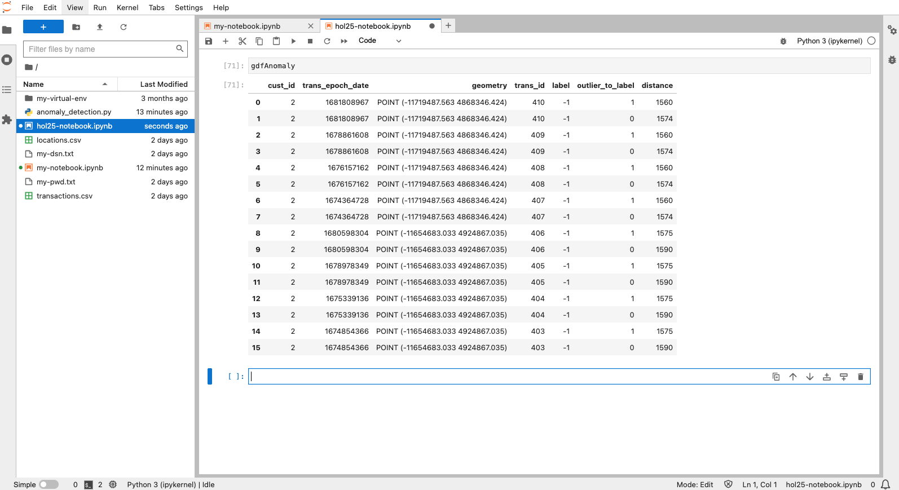
    
11.  运行以下命令以可视化群集和关联的异常。
    
        <copy>
        m.fit_bounds(m.get_bounds())
        m
        </copy>
        

    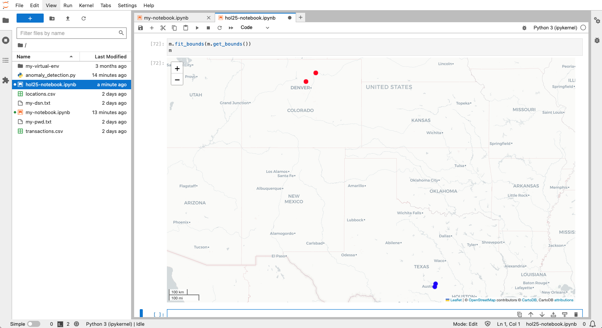  
    
    To detect suspicious for other customers, scroll up to step 8, set a different customer id, and re-run the the subsequent cells to call the functions in the script.
    

我们希望本次研讨会内容丰富，进一步探讨 Oracle Database 的空间功能及其在机器学习和 AI 工作流中的使用。

## 了解详细信息

*   有关空间聚合函数的详细信息，请参见 [https://docs.oracle.com/en/database/oracle/oracle-database/19/spatl/spatial-aggregate-functions.html](https://docs.oracle.com/en/database/oracle/oracle-database/19/spatl/spatial-aggregate-functions.html)
*   有关 st\_dbscan 的详细信息，请参见 [ST-DBSCAN：一种用于聚类空间时间数据的算法](https://www.sciencedirect.com/science/article/pii/S0169023X06000218)和 [https://github.com/eren-ck/st\_dbscan](https://github.com/eren-ck/st_dbscan)

## 确认

*   **作者** - David Lapp，Oracle 数据库产品管理
*   **贡献者** - Rahul Tasker、Denise Myrick、Ramu Gutierrez
*   **上次更新者/日期** - David Lapp，2023 年 8 月