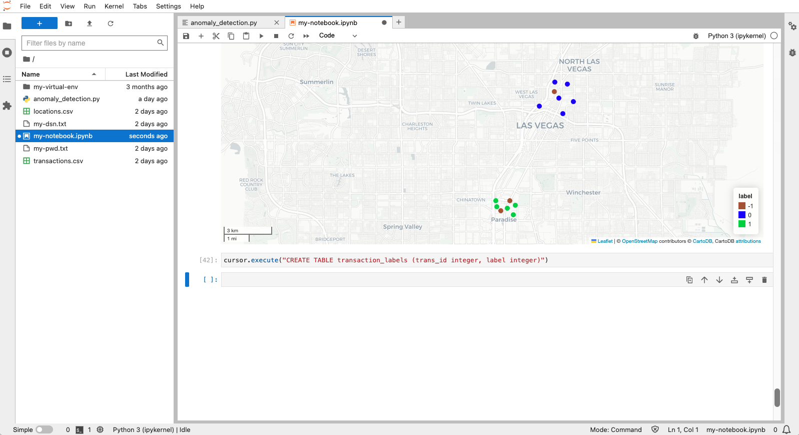
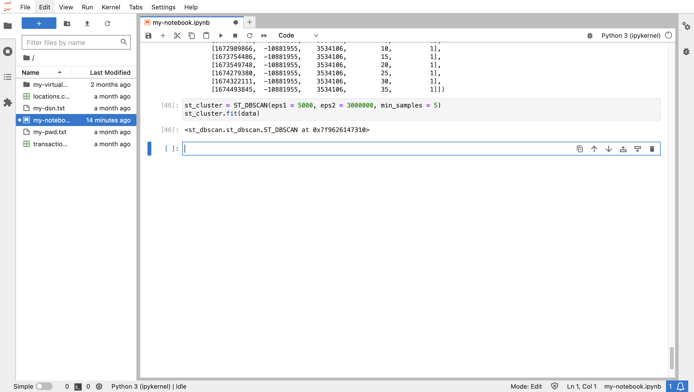
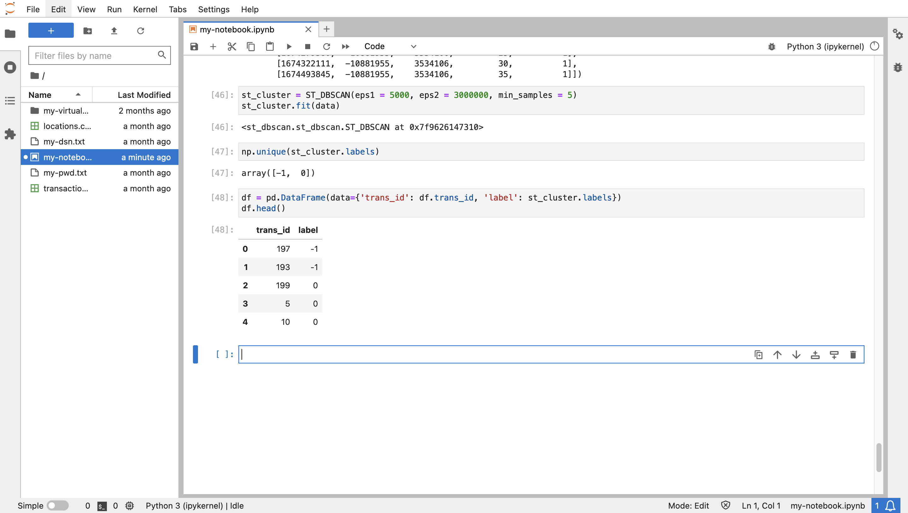
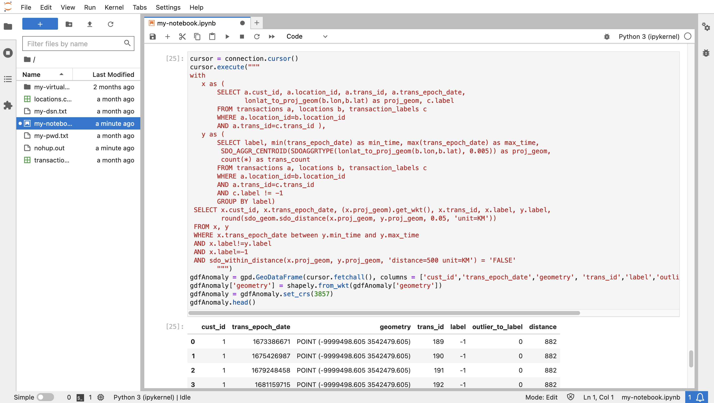

# 偵測可疑交易

## 簡介

Oracle Database 的空間功能提供可擴展且安全的空間資料管理、處理及分析。在 Python 中工作的主要優點是，開放原始碼程式庫可以用來增強 Oracle Database 的原生分析功能。在本實驗中，您可以利用程式庫來根據空間和時間或拼字等同時間叢集來識別叢集。集中區域和時間範圍內發生的一組交易屬於同時間叢集。在時間範圍內發生但遠處集中地區的異動被視為可疑。例如，如果在給定的一週期間，客戶交易集中在紐約市，那麼加州該週中期的交易將會是可疑的。您將在本實驗中識別此類事件。

預估實驗室時間：15 分鐘

### 目標

*   將交易資料從 Oracle Spatial 載入 Python
*   偵測代表預期行為的天體叢集
*   識別代表可疑行為的異常值

### 先決條件

*   完成實驗室 6：探索資料

## 作業 1：空間聚總的實驗

若要計算來自空間時間叢集的交易距離，可以將叢集以單一幾何圖形表示叢集。這是空間聚總的使用案例，其中一組幾何以單一聚總表示。Oracle Spatial 為此目的提供空間聚總函數的套件。此作業可讓您熟悉空間聚總。

1.  從在德州奧斯丁 (TX (-97.7431,30.2672) 的經度 / 緯度座標 10 英里內，從 **LOCATIONS** 表格位置建立 GeoDataFrame 個項目開始。
    
        <copy>
        cursor = connection.cursor()
        cursor.execute("""
         SELECT (lonlat_to_proj_geom(lon,lat)).get_wkt() as geometry
         FROM locations
         WHERE sdo_within_distance(
                   lonlat_to_proj_geom(lon,lat),
                   lonlat_to_proj_geom(-97.7431,30.2672),
                   'distance=10 unit=MILE') = 'TRUE'
               """)
        gdfPoints = gpd.GeoDataFrame(cursor.fetchall(), columns = ['geometry'])
        gdfPoints['geometry'] = shapely.from_wkt(gdfPoints['geometry'])
        gdfPoints.crs = "EPSG:3857"
        gdfPoints.head()
        </copy>
        
    
    
    
2.  接下來建立一個 GeoDataFrame，其中包含先前選取位置的中心位置。此位置稱為「彙總形心」，因此 GeoDataFrame 命名為 gdfAggCent。
    
        <copy>
        cursor.execute("""
         SELECT SDO_AGGR_CENTROID(
                  SDOAGGRTYPE(lonlat_to_proj_geom(lon,lat), 0.005)).get_wkt() as geometry
         FROM locations
         WHERE sdo_within_distance(
                   lonlat_to_proj_geom(lon,lat),
                   lonlat_to_proj_geom(-97.7431,30.2672),
                   'distance=10 unit=MILE') = 'TRUE'
               """)
        gdfAggCent = gpd.GeoDataFrame(cursor.fetchall(), columns = ['geometry'])
        gdfAggCent['geometry'] = shapely.from_wkt(gdfAggCent['geometry'])
        gdfAggCent.crs = "EPSG:3857"
        gdfAggCent
        </copy>
        
    
    
    
3.  接著建立一個 GeoDataFrame，其中包含連結位於德州奧斯丁市奧斯丁附近位置的形狀。這稱為「聚總凸包」，因此 GeoDataFrame 命名為 gdfAggHull。
    
        <copy>
        cursor.execute("""
         SELECT SDO_AGGR_CONVEXHULL(
                  SDOAGGRTYPE(lonlat_to_proj_geom(lon,lat), 0.005)).get_wkt() as geometry
         FROM locations
         WHERE sdo_within_distance(
                   lonlat_to_proj_geom(lon,lat),
                   lonlat_to_proj_geom(-97.7431,30.2672),
                   'distance=10 unit=MILE') = 'TRUE'
               """)
        gdfAggHull = gpd.GeoDataFrame(cursor.fetchall(), columns = ['geometry'])
        gdfAggHull['geometry'] = shapely.from_wkt(gdfAggHull['geometry'])
        gdfAggHull.crs = "EPSG:3857"
        gdfAggHull
        </copy>
        
    
    
    
    其他的空間聚總函數也遵循相同的樣式。
    
4.  您現在可以將所建立的點和兩個空間聚總視覺化。原始位置會以藍色顯示，而彙總形心和彙總凸頭則以紅色顯示。
    
        <copy>
        m = gdfPoints.explore(tiles="CartoDB positron",
                               style_kwds={"color":"blue","fillColor":"blue"})
        m = gdfAggHull.explore(m=m,
                               style_kwds={"color":"red","fillOpacity":"0"} )
        m = gdfAggCent.explore(m=m,
                               marker_kwds={"radius":"8"},
                              style_kwds={"color":"red","fillColor":"red","fillOpacity":".7"} )
        m
        </copy>
        
    
    
    

您下次將識別在天體叢集時間範圍內但距離大於臨界值的可疑交易。由於時間點叢集所涵蓋的區域與可疑交易的距離臨界值相比不重要，因此您將使用聚總中心來代表時間點叢集的位置。

## 作業 2：準備叢集偵測

1.  首先，匯入偵測時間點叢集所需的程式庫。主程式庫是 st\_dbscan。此外，必須使用 pandas 和 numpy 程式庫，才能將輸入設定為 st\_dbscan。
    
        <copy>
        import pandas as pd
        import numpy as np
        from st_dbscan import ST_DBSCAN
        </copy>
        
    
    
    
2.  現在，我們透過一個偵測時間點叢集的範例來執行。執行以下步驟來建立 GeoDataFrame，其中每個位置都有 Epoch 時間和 ID。
    
        <copy>
        gdf = gpd.GeoDataFrame({
            "id": [1, 2, 3, 4, 5, 6, 7, 8, 9, 10, 11, 12, 13, 14, 15],
            "epoch_date": [1704096000, 1687881600, 1687968000, 1688054400, 1688140800, \
                           1688227200, 1672656000, 1672742400, 1672828800,  1016730016, \
                           1673001600, 1673001600, 1672915200, 673001600, 1688054400],
            "geometry": ["POINT(-115.2368 36.2650)",
                        "POINT(-115.1356 36.1823)",
                        "POINT(-115.1492 36.1779)",
                        "POINT(-115.1385 36.1910)",
                        "POINT(-115.1256 36.1804)",
                        "POINT(-115.1329 36.1735)",
                        "POINT(-115.1711 36.1212)",
                        "POINT(-115.1656 36.1228)",
                        "POINT(-115.1782 36.1221)",
                        "POINT(-115.1695 36.1253)",
                        "POINT(-115.1790 36.1254)",
                        "POINT(-115.1388 36.1858)",
                        "POINT(-115.1669 36.1176)",
                        "POINT(-115.1755 36.1199)",
                        "POINT(-115.1297 36.1900)",
            ],})
        # convert to Shapely geometries
        gdf['geometry'] = shapely.from_wkt(gdf['geometry'])
        # assign longitude/latitude coordinate system
        gdf = gdf.set_crs(4326)
        gdf
        </copy>
        
    
    
    

3.ST\_DBSCAN 程式庫要求座標必須使用與距離測量相同的單位。因此，請執行以下作業，根據計量表將座標系統從經度 / 緯度轉換為預估的 x/y 座標。`<copy> # convert to projected x/y coordinates as required for st_dbscan gdf = gdf.to_crs(3857) gdf </copy>`

    
    

4\. 輸入到 ST\_DBSCAN 是 Numpy 陣列。因此，請執行以下步驟，將 GeoDataFrame 轉換為 Numpy 陣列。`<copy> # Convert to pandas dataframe df = pd.DataFrame(data={'time': gdf.epoch_date, 'x': gdf.geometry.x, 'y': gdf.geometry.y, 'id': gdf.id}) data = df.values # Convert to numpy array data = np.int_(data) data </copy>`

     
    

5.  從此處，我們可以對我們的範例資料執行 ST\_DBSCAN。ST\_DBSCAN 是一種使用雜訊 (DBSCAN) 演算法的「以密度為基礎的空間叢集」變化，此演算法延伸為使用空間資料。參數是叢集的臨界值；eps1 是座標系統 (公尺) 的距離臨界值，eps2 是時間臨界值 (秒)，而 min-samples 是項目的最小臨界值。執行下列項目以偵測臨界值在 5KM 內且大約 1 個月內為 5 個或更多項目的叢集。
    
        <copy>
        st_cluster = ST_DBSCAN(eps1 = 5000, eps2 = 3000000, min_samples = 5)
        st_cluster.fit(data)
        </copy>
        
    
    
    

6\. 結果是每個輸入項目的整數標籤。每個標籤 >=0 代表一個叢集。標籤 -1 表示項目不是叢集的一部分。複查結果標籤的不同集合。注意偵測到兩個叢集。`<copy> np.unique(st_cluster.labels) </copy>`

    
    

7.7 公里將整數標籤新增至 GeoDataFrame。`<copy> df = pd.DataFrame(data={'id': df.id, 'label': st_cluster.labels}) label_mapping_dict = dict(zip(df["id"], df["label"])) gdf["label"] = gdf["id"].map(label_mapping_dict) gdf </copy>`

    
    

8.  執行以下步驟可將叢集視覺化。請注意，部分項目在距離臨界值內，但不是時序臨界值。  
    
        <copy>
        gdf.explore(column="label", categorical="True", tiles="CartoDB positron", \
                    cmap=['sienna','blue','limegreen'], marker_kwds={"radius":4}, \
                    style_kwds={"fillOpacity":1})
        </copy>
        
    
    
    

在接下來的步驟中，使用此方法來偵測可疑的財務交易。

9.  叢集偵測的結果是每個資料項目的「標籤」，指出項目是否為叢集的一部分，以及是否為叢集。您將執行叢集分析，並將結果儲存至資料庫以進一步分析。執行下列項目以建立儲存叢集標籤的資料庫表格。
    
        <copy>
        cursor.execute("CREATE TABLE transaction_labels (trans_id integer, label integer)")
        </copy>
        
    
    
    

## 工作 3：偵測點時間叢集

1.  在此研討會中，您將一次分析一位客戶的交易。執行下列項目以設定用於分析的客戶 ID 變數。您可以返回此儲存格，切換至其他客戶進行分析。
    
        <copy>
        cust=1
        </copy>
        
    
    
    
2.  建立客戶交易的 GeoDataframe。請注意 python-oracledb 驅動程式支援的 WHERE 子句 (cust\_id=：cust) 中的連結語法。
    
        <copy>
        cursor.execute("""
         SELECT a.cust_id,  a.trans_id, a.trans_epoch_date,
               (lonlat_to_proj_geom(b.lon,b.lat)).get_wkt()
         FROM transactions a, locations b
         WHERE a.location_id=b.location_id
         AND cust_id=:cust""", cust=cust)
        gdf = gpd.GeoDataFrame(cursor.fetchall(), columns = ['cust_id', 'trans_id', 'epoch_date', 'geometry'])
        gdf['geometry'] = shapely.from_wkt(gdf['geometry'])
        gdf.head()
        </copy>
        
    
    
    
3.  st\_dbscan 程式庫需要使用 numpy 格式的輸入，其中 numpy 是用來處理陣列的程式庫。執行下列兩個步驟，將 GeoDataFrame 轉換為 numpy 陣列。
    
        <copy>
        # first convert to pandas dataframe
        df = pd.DataFrame(data={'time': gdf.epoch_date, 'x': gdf.geometry.x, 'y': gdf.geometry.y, 'trans_id':  gdf.trans_id, 'cust_id':gdf.cust_id})
        df.head()
        </copy>
        
    
        <copy>
        # then convert to numpy array
        data = df.values
        data = np.int_(data)
        data[1:10]
        </copy>
        
    
    
    
4.  您現在可以偵測目前客戶交易的天體叢集。此作業接受三個臨界值參數：距離、時間及最小項目數。在距離與時間臨界值內有鄰接的項目會被視為叢集的一部分，而且最少要符合叢集資格的項目數目。距離是以座標系統的單位為單位，在此情況下為公尺。時間以秒為單位。執行下列項目以偵測臨界值在 5KM 內且大約 1 個月內為 5 個或更多項目的叢集。
    
        <copy>
        st_cluster = ST_DBSCAN(eps1 = 5000, eps2 = 3000000, min_samples = 5)
        st_cluster.fit(data)
        </copy>
        
    
    
    
5.  結果是每個輸入項目的整數標籤。每個標籤 >=0 代表一個叢集。標籤 -1 表示項目不是叢集的一部分。複查結果標籤的不同集合。請注意偵測到一個叢集。
    
        <copy>
        np.unique(st_cluster.labels)
        </copy>
        
    
    
    
6.  執行下列步驟，將叢集標籤新增至交易並列印前幾列。每個異動的標籤為 -1 (表示不屬於叢集的一部分) 或整數 >=0 (表示項目所屬的叢集)。
    
        <copy>
        df = pd.DataFrame(data={'trans_id': df.trans_id, 'label': st_cluster.labels})
        df.head()
        </copy>
        
    
    
    
7.  偵測異常將需要與叢集標籤有關的資料庫查詢。因此，請執行以下步驟，將目前客戶的標示交易插入上一個任務建立的 TRANSACTION\_LABELS 表格。
    
        <copy>
        cursor.executemany("""
         INSERT INTO transaction_labels
         VALUES (:1, :2)""",
         list(df[['trans_id','label']].itertuples(index=False, name=None)))
        connection.commit()
        </copy>
        
    
    
    
8.  執行下列項目以擷取目前客戶的交易與其叢集標籤。
    
        <copy>
        # labelled transactions for customer
        cursor.execute("""
         SELECT a.cust_id, a.location_id, a.trans_id, a.trans_epoch_date,
                (lonlat_to_proj_geom(b.lon,b.lat)).get_wkt(), c.label
         FROM transactions a, locations b, transaction_labels c
         WHERE a.location_id=b.location_id
         AND a.trans_id=c.trans_id
         """)
        gdf = gpd.GeoDataFrame(cursor.fetchall(), columns = ['cust_id', 'location_id', 'trans_id', 'trans_epoch_date', 'geometry','label'])
        gdf['geometry'] = shapely.from_wkt(gdf['geometry'])
        gdf = gdf.set_crs(3857)
        gdf.head()
        </copy>
        
    
    
    
9.  執行下列作業，以視覺化目前客戶的標註交易。在此情況下，您可以根據叢集標籤為項目加入顏色編碼的參數。您也可以將滑鼠移到項目上，查看其屬性，包括叢集標籤。
    
        <copy>
        gdf.explore(column="label", categorical="True", tiles="CartoDB positron", \
                    marker_kwds={"radius":4}, style_kwds={"fillOpacity":1})
        </copy>
        
    
    
    
10.  縮放至德州奧斯汀 (Austin，TX) 區域中，目前客戶的交易位置集中，觀察指出哪個是空間時序叢集一部分的顏色編碼。
    
    
    

## 作業 4：偵測異常

1.  執行以下動作，為目前客戶的天體時間叢集建立聚總中心，其中包含叢集標籤、時間範圍和叢集中交易數的屬性。請注意，第一個客戶只有一個叢集 (標籤 = 0)。
    
        <copy>
        # st cluster centroids for customer
        cursor = connection.cursor()
        cursor.execute("""
         SELECT label, min(trans_epoch_date) as min_time, max(trans_epoch_date) as max_time,
                 SDO_AGGR_CENTROID(
                  SDOAGGRTYPE(lonlat_to_proj_geom(b.lon,b.lat), 0.005)).get_wkt() as geometry,
                 count(*) as trans_count
         FROM transactions a, locations b, transaction_labels c
         WHERE a.location_id=b.location_id
         AND a.trans_id=c.trans_id
         AND c.label != -1
         GROUP BY label
               """)
        gdf = gpd.GeoDataFrame(cursor.fetchall(), columns = ['label','min_time','max_time','geometry','trans_count'])
        gdf['geometry'] = shapely.from_wkt(gdf['geometry'])
        gdf = gdf.set_crs(3857)
        gdf.head()
        </copy>
        
    
    
    
2.  執行下列項目以將時序叢集形心視覺化。
    
        <copy>
        gdf.explore(tiles="CartoDB positron", marker_kwds={"radius":4})
        </copy>
        
    
    
    
3.  若要識別叢集時間範圍內目前客戶交易且位於大於臨界值的距離，您將使用 WITH 執行查詢 ...AS ... 選取 ..WHERE... 語法如下。
    
        WITH
            x as ( [transactions] ),
            y as ( [spatiotemporal cluster aggregate centroids] )
        SELECT [transaction, cluster label, distance from cluster aggregate centroid, ...]
        FROM x, y
        WHERE [transaction time within cluster time frame]
        AND [distance from cluster > threshold]
        
    
    執行下列查詢以傳回可疑交易以及與叢集相關聯的叢集標籤和距離。
    
        <copy>
        cursor = connection.cursor()
        cursor.execute("""
        WITH
           x as (
               SELECT a.cust_id, a.location_id, a.trans_id, a.trans_epoch_date,
                      lonlat_to_proj_geom(b.lon,b.lat) as proj_geom, c.label
               FROM transactions a, locations b, transaction_labels c
               WHERE a.location_id=b.location_id
               AND a.trans_id=c.trans_id ),
           y as (
               SELECT label, min(trans_epoch_date) as min_time, max(trans_epoch_date) as max_time,
                      SDO_AGGR_CENTROID(
                          SDOAGGRTYPE(lonlat_to_proj_geom(b.lon,b.lat), 0.005)) as proj_geom,
                      count(*) as trans_count
               FROM transactions a, locations b, transaction_labels c
               WHERE a.location_id=b.location_id
               AND a.trans_id=c.trans_id
               AND c.label != -1
               GROUP BY label)
         SELECT x.cust_id, x.trans_epoch_date, (x.proj_geom).get_wkt(), x.trans_id, x.label, y.label,
                round(sdo_geom.sdo_distance(x.proj_geom, y.proj_geom, 0.05, 'unit=KM'))
         FROM x, y
         WHERE x.trans_epoch_date between y.min_time and y.max_time
         AND x.label!=y.label
         AND x.label=-1
         AND sdo_within_distance(x.proj_geom, y.proj_geom, 'distance=500 unit=KM') = 'FALSE'
               """)
        gdfAnomaly = gpd.GeoDataFrame(cursor.fetchall(), columns = ['cust_id','trans_epoch_date','geometry', 'trans_id','label','outlier_to_label','distance'])
        gdfAnomaly['geometry'] = shapely.from_wkt(gdfAnomaly['geometry'])
        gdfAnomaly = gdfAnomaly.set_crs(3857)
        gdfAnomaly.head()
        </copy>
        
    
    
    
4.  執行以下步驟可將時序叢集視覺化為藍色標記，並將關聯的可疑異常值當作紅色標記。將游標停留在可疑交易上以查看其屬性。
    
        <copy>
        m = gdf.explore(tiles="CartoDB positron", marker_type='circle_marker',marker_kwds={"radius":"5"},
                        style_kwds={"color":"blue","fillColor":"blue", "fillOpacity":"1"})
        m = gdfAnomaly.explore(m=m, marker_type='circle_marker', marker_kwds={"radius":"5"},
                               style_kwds={"color":"red","fillColor":"red", "fillOpacity":"1"} )
        m.fit_bounds(m.get_bounds())
        m
        </copy>
        
    
    
    
    若要重複其他客戶交易的處理，您可以向上捲動至已設定客戶 ID 的儲存格，更新為不同的客戶 ID，然後重新執行後續儲存格。不過，使用執行所有步驟的命令檔會更方便。
    
5.  使用下列連結下載包含異常偵測所有步驟的命令檔：
    
    *   [anomaly\_detection.py](./files/anomaly_detection.py)
    
    
    
6.  按一下「上傳」按鈕，瀏覽至您下載的指令碼，然後上傳指令碼檔案。
    
    
    
7.  執行下列動作以匯入指令碼。
    
        <copy>
        from anomaly_detection import *
        </copy>
        
    
    
    
    您現在可以使用指令碼中的功能來分析其他客戶的交易。這些動作會在將 TRANSACTION\_LABELS 表格清空為一組新標籤後，從任務 3 開始重現先前的步驟。
    
    *   create\_connection() 建立資料庫連線
    *   get\_cluster\_centroids () 可偵測客戶的時間點交易叢集
    *   get\_anomalies () 根據叢集超過臨界值的重疊時間與距離識別可疑交易
    *   get\_map () 傳回叢集與相關可疑交易的地圖
8.  執行下列步驟以偵測客戶 ID = 2 的可疑交易。
    
        <copy>
        cust = 2
        </copy>
        
    
        <copy>
        create_connection()
        gdf = get_cluster_centroids(cust)
        gdfAnomaly = get_anomalies(cust)
        m = get_map()
        </copy>
        
    
    
    
9.  執行以下步驟列出時間點叢集。
    
        <copy>
        gdf
        </copy>
        
    
    
    
10.  執行下列項目以列出關聯的異常。
    
        <copy>
        gdfAnomaly
        </copy>
        
    
    
    
11.  執行以下命令可將叢集和關聯的異常視覺化。
    
        <copy>
        m.fit_bounds(m.get_bounds())
        m
        </copy>
        

      
    
    To detect suspicious for other customers, scroll up to step 8, set a different customer id, and re-run the the subsequent cells to call the functions in the script.
    

我們希望這場研討會是提供豐富資訊，進一步瞭解 Oracle Database 的空間功能，以及它們在機器學習和 AI 工作流程中的使用情況。

## 進一步瞭解

*   如需空間彙總函數的詳細資訊，請參閱 [https://docs.oracle.com/en/database/oracle/oracle-database/19/spatl/spatial-aggregate-functions.html](https://docs.oracle.com/en/database/oracle/oracle-database/19/spatl/spatial-aggregate-functions.html)
*   如需 st\_dbscan 的詳細資訊，請參閱 [ST-DBSCAN：叢集空間時間資料的演算法](https://www.sciencedirect.com/science/article/pii/S0169023X06000218)與 [https://github.com/eren-ck/st\_dbscan](https://github.com/eren-ck/st_dbscan)

## 確認

*   **作者** - Oracle 資料庫產品管理 David Lapp
*   **貢獻者** - Rahul Tasker，Denise Myrick，Ramu Gutierrez
*   **上次更新者 / 日期** - David Lapp，2023 年 8 月