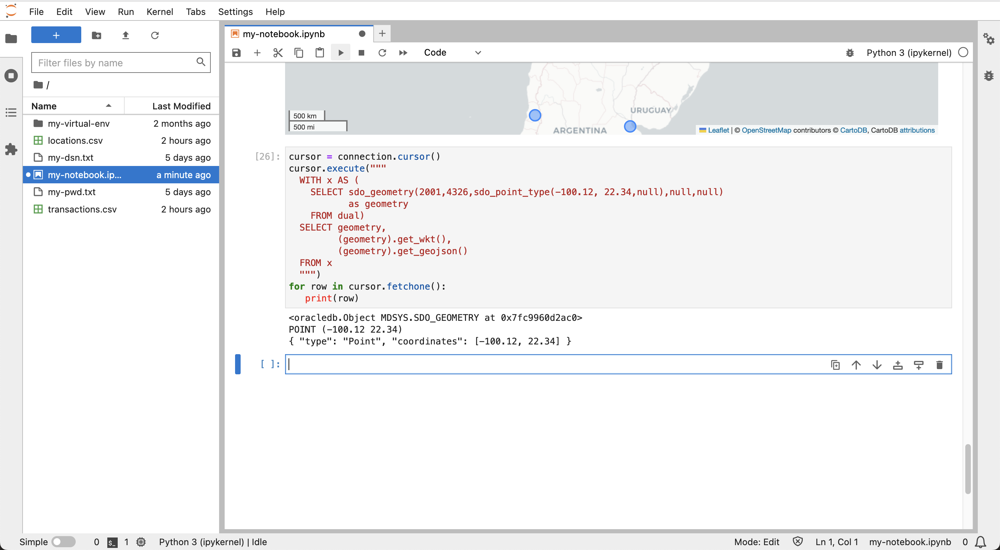
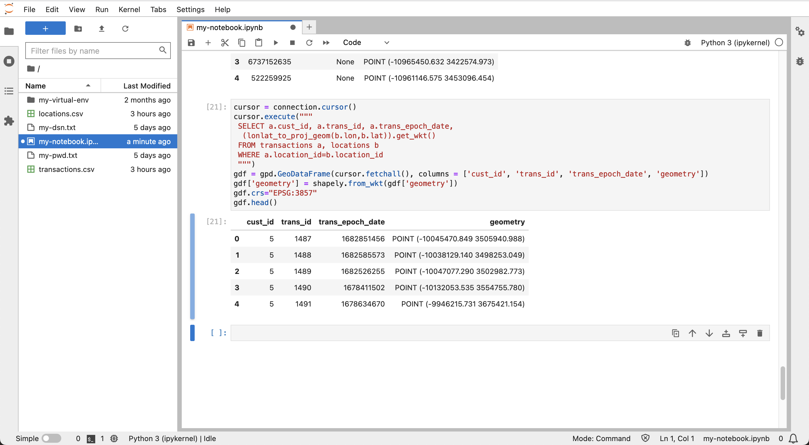

# Explorar datos

## Introducción

Ahora explorará las ubicaciones y los datos de transacciones preparados en el laboratorio anterior. Al gestionar los datos en Autonomous Database, puede realizar operaciones de análisis y procesamiento de backend y, a continuación, incorporar subjuegos de datos adecuados a Python para análisis especializados.

Tiempo de laboratorio estimado: 10 minutos

### Objetivos

*   Incorporación de datos espaciotemporales y resultados de consultas de Autonomous Database a Python
*   Visualizar y explorar los datos en Python

### Requisitos

*   Finalización del laboratorio 5: preparación de datos

## Tarea 1: Manejo de datos espaciales en Python

La biblioteca Python más común para el manejo de datos es Pandas, que proporciona DataFrame como estructura de datos similar a una tabla con columnas y filas. La biblioteca GeoPandas amplía Pandas para el manejo de datos espaciales, donde DataFrame se amplía a GeoDataFrame, incluida una columna de "geometría". La biblioteca Shapely proporciona el tipo de espacio utilizado para rellenar la columna de geometría. Folium es una popular biblioteca de visualización de mapas y es utilizada por GeoPandas.

1.  Importe bibliotecas para el manejo de datos espaciales y la visualización de mapas.
    
        <copy>
        import geopandas as gpd
        import shapely
        import folium
        </copy>
        
    
    
    
2.  Como ejemplo básico de datos espaciales en Python, ejecute lo siguiente para crear manualmente un GeoDataFrame que contenga ubicaciones de puntos para varias ciudades. Los valores de geometría están en formato de texto conocido ("WKT"), ya que es el formato utilizado en GeoDataFrame.
    
        <copy>
        gdf = gpd.GeoDataFrame(
          {
            "city": ["Buenos Aires", "Brasilia", "Santiago", "Bogota", "Caracas"],
            "country": ["Argentina", "Brazil", "Chile", "Colombia", "Venezuela"],
            "geometry": ["POINT(-58.66 -34.58)",
                         "POINT(-47.91 -15.78)",
                         "POINT(-70.66 -33.45)",
                         "POINT(-74.08 4.60)",
                         "POINT(-66.86 10.48)",
                ],})
        gdf["geometry"] = gpd.GeoSeries.from_wkt(gdf["geometry"])
        gdf.set_geometry("geometry")
        gdf.crs="EPSG:4326"
        gdf
        </copy>
        
    
    
    
3.  Para visualizar los datos, ejecute lo siguiente donde especifique tanto el mapa de fondo como el tamaño del marcador. Mueva el mouse sobre un marcador de mapa para ver sus atributos.
    
        <copy>
        gdf.explore(tiles="CartoDB positron", marker_kwds={"radius":8})
        </copy>
        
    
    
    
4.  Oracle Spatial incluye funciones y métodos para convertir del tipo espacial nativo a formatos comunes, incluida la conversión al formato WKT utilizado en GeoDataFrame. Por lo tanto, crear un GeoDataFrame a partir de los resultados de Oracle Spatial es sencillo. La sintaxis de conversión de los métodos de objeto es más compacta que las funciones SQL equivalentes. Por ejemplo, el método **(geometry).get\_wkt()** frente a la función **sdo\_util.to\_wktgeometry(geometry)**. Ejecute lo siguiente para ver un ejemplo básico de conversiones de formato de un formato SDO\_GEOMETRY codificado en formato WKT y GeoJSON mediante métodos de objeto.
    

    ```
    <copy>
    cursor = connection.cursor()
    cursor.execute("""
      WITH x AS (
        SELECT sdo_geometry(2001,4326,sdo_point_type(-100.12, 22.34,null),null,null) 
               as geometry
        FROM dual)
      SELECT geometry, 
             (geometry).get_wkt(), 
             (geometry).get_geojson()
      FROM x
      """)
    for row in cursor.fetchone():
       print(row)
    </copy>
    ```
     
    

5.  En la práctica anterior, configuró la tabla LOCATIONS con un índice espacial basado en funciones. La función es lonlat\_to\_proj\_geom( ) y convierte la longitud, latitud en SDO\_GEOMETRY en el sistema de coordenadas de World Mercator para la compatibilidad con bibliotecas utilizadas en un laboratorio posterior. Ejecute lo siguiente para recuperar geometrías utilizando esa función como formato WKT.

    ```
    <copy>
    cursor = connection.cursor()
    cursor.execute("""
      SELECT lon, lat, (lonlat_to_proj_geom(lon,lat)).get_wkt()
      FROM locations
      """)
    for row in cursor.fetchmany(10):
       print(row)
    </copy>
    ```
     
    

6.  Ejecute lo siguiente para recuperar la tabla LOCATIONS y crear una GeoDataFrame.
    
        <copy>
        cursor.execute("""
         SELECT location_id, owner, (lonlat_to_proj_geom(lon,lat)).get_wkt()
         FROM locations
         """)
        gdf = gpd.GeoDataFrame(cursor.fetchall(), columns = ['location_id', 'owner', 'geometry'])
        gdf['geometry'] = shapely.from_wkt(gdf['geometry'])
        gdf.crs="EPSG:3857"
        gdf.head()
        </copy>
        
    
    
    
7.  Ejecute lo siguiente para visualizar GeoDataFrame.
    
        <copy>
        gdf.explore(tiles="CartoDB positron")
        </copy>
        
    
    
    

## Tarea 2: Explorar datos de transacciones

1.  A continuación, cree un GeoDataFrame a partir de una consulta que una TRANSACTIONS a LOCATIONS. Ejecute lo siguiente para crear GeoDataFrame.
    
        <copy>
        cursor = connection.cursor()
        cursor.execute("""
         SELECT a.cust_id, a.trans_id, a.trans_epoch_date, 
          (lonlat_to_proj_geom(b.lon,b.lat)).get_wkt() 
         FROM transactions a, locations b
         WHERE a.location_id=b.location_id
         """)
        gdf = gpd.GeoDataFrame(cursor.fetchall(), columns = ['cust_id', 'trans_id', 'trans_epoch_date', 'geometry'])
        gdf['geometry'] = shapely.from_wkt(gdf['geometry'])
        gdf.crs="EPSG:3857"
        gdf.head()
        </copy>
        
    
    
    
2.  Ejecute lo siguiente para visualizar GeoDataFrame. Pase el mouse sobre un artículo para ver los atributos de la transacción.
    
        <copy>
        gdf.explore(tiles="CartoDB positron") 
        </copy>
        
    
    
    

Ahora puede **proceder al siguiente laboratorio**.

## Más información

*   Para obtener más información sobre GeoPandas, consulte [https://geopandas.org](https://geopandas.org)

## Reconocimientos

*   **Autor**: David Lapp, Database Product Management, Oracle
*   **Contribuyentes**: Rahul Tasker, Denise Myrick, Ramu Gutiérrez
*   **Última actualización por/fecha**: David Lapp, agosto de 2023