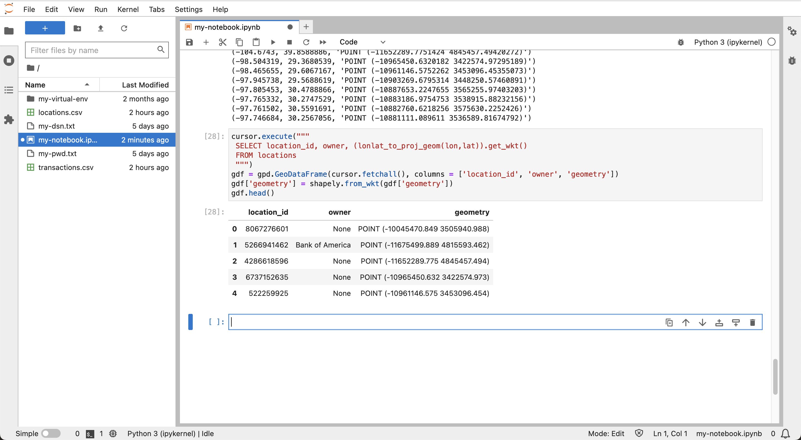

# Explorer les données

## Présentation

Vous allez maintenant explorer les données de lieux et de transactions préparées au cours de l'exercice précédent. En gérant les données dans Autonomous Database, vous pouvez effectuer des opérations de traitement et d'analyse back-end, puis importer des sous-ensembles de données appropriés dans Python pour des analyses spécialisées.

Temps de laboratoire estimé : 10 minutes

### Objectifs

*   Intégration de données spatio-temporelles et de résultats d'interrogation d'Autonomous Database dans Python
*   Visualiser et explorer les données en Python

### Prérequis

*   Achèvement du laboratoire 5 : Préparer les données

## Tâche 1 : gestion des données spatiales en Python

La bibliothèque Python la plus courante pour la gestion des données est Pandas, qui fournit DataFrame en tant que structure de données semblable à une table avec des colonnes et des lignes. La bibliothèque GeoPandas étend Pandas pour la gestion des données spatiales, où DataFrame est étendu à GeoDataFrame, y compris une colonne "géométrique". La bibliothèque Shapely fournit le type spatial utilisé pour remplir la colonne de géométrie. Folium est une bibliothèque de visualisation de carte populaire et est utilisée par GeoPandas.

1.  Importez des bibliothèques pour la gestion des données spatiales et la visualisation des cartes.
    
        <copy>
        import geopandas as gpd
        import shapely
        import folium
        </copy>
        
    
    
    
2.  Comme exemple de base de données spatiales en Python, exécutez la commande suivante pour créer manuellement un GeoDataFrame contenant des emplacements de point pour plusieurs villes. Les valeurs de géométrie sont au format de texte connu (WKT), car il s'agit du format utilisé dans un fichier GeoDataFrame.
    
        <copy>
        gdf = gpd.GeoDataFrame(
          {
            "city": ["Buenos Aires", "Brasilia", "Santiago", "Bogota", "Caracas"],
            "country": ["Argentina", "Brazil", "Chile", "Colombia", "Venezuela"],
            "geometry": ["POINT(-58.66 -34.58)",
                         "POINT(-47.91 -15.78)",
                         "POINT(-70.66 -33.45)",
                         "POINT(-74.08 4.60)",
                         "POINT(-66.86 10.48)",
                ],})
        gdf["geometry"] = gpd.GeoSeries.from_wkt(gdf["geometry"])
        gdf.set_geometry("geometry")
        gdf.crs="EPSG:4326"
        gdf
        </copy>
        
    
    
    
3.  Pour visualiser les données, exécutez la commande suivante où vous indiquez à la fois la carte d'arrière-plan et la taille du marqueur. Passez le curseur sur un marqueur de carte pour voir ses attributs.
    
        <copy>
        gdf.explore(tiles="CartoDB positron", marker_kwds={"radius":8})
        </copy>
        
    
    
    
4.  Oracle Spatial inclut des fonctions et des méthodes permettant de convertir le type spatial natif en formats courants, y compris la conversion au format WKT utilisé dans un fichier GeoDataFrame. Par conséquent, la création d'un GeoDataFrame à partir des résultats Oracle Spatial est simple. La syntaxe de conversion des méthodes objet est plus compacte que les fonctions SQL équivalentes. Par exemple, la méthode **(geometry).get\_wkt()** et la fonction **sdo\_util.to\_wktgeometry(geometry)**. Exécutez la commande suivante pour afficher un exemple de base de conversion de format d'un format SDO\_GEOMETRY codé en dur en formats WKT et GeoJSON à l'aide de méthodes d'objet.
    

    ```
    <copy>
    cursor = connection.cursor()
    cursor.execute("""
      WITH x AS (
        SELECT sdo_geometry(2001,4326,sdo_point_type(-100.12, 22.34,null),null,null) 
               as geometry
        FROM dual)
      SELECT geometry, 
             (geometry).get_wkt(), 
             (geometry).get_geojson()
      FROM x
      """)
    for row in cursor.fetchone():
       print(row)
    </copy>
    ```
     
    

5.  Dans l'exercice précédent, vous avez configuré la table LOCATIONS avec un index spatial basé sur une fonction. La fonction est lonlat\_to\_proj\_geom( ) et convertit la longitude et la latitude en SDO\_GEOMETRY dans le système de coordonnées World Mercator à des fins de compatibilité avec les bibliothèques utilisées dans un laboratoire ultérieur. Exécutez la commande suivante pour extraire les géométries utilisant cette fonction au format WKT.

    ```
    <copy>
    cursor = connection.cursor()
    cursor.execute("""
      SELECT lon, lat, (lonlat_to_proj_geom(lon,lat)).get_wkt()
      FROM locations
      """)
    for row in cursor.fetchmany(10):
       print(row)
    </copy>
    ```
     
    

6.  Exécutez la commande suivante pour extraire la table LOCATIONS et créer un élément GeoDataFrame.
    
        <copy>
        cursor.execute("""
         SELECT location_id, owner, (lonlat_to_proj_geom(lon,lat)).get_wkt()
         FROM locations
         """)
        gdf = gpd.GeoDataFrame(cursor.fetchall(), columns = ['location_id', 'owner', 'geometry'])
        gdf['geometry'] = shapely.from_wkt(gdf['geometry'])
        gdf.crs="EPSG:3857"
        gdf.head()
        </copy>
        
    
    
    
7.  Exécutez la commande suivante pour visualiser GeoDataFrame.
    
        <copy>
        gdf.explore(tiles="CartoDB positron")
        </copy>
        
    
    
    

## Tâche 2 : Explorer les données des transactions

1.  Vous allez ensuite créer un élément GeoDataFrame à partir d'une requête joignant TRANSACTIONS à LOCATIONS. Exécutez la commande suivante pour créer le fichier GeoDataFrame.
    
        <copy>
        cursor = connection.cursor()
        cursor.execute("""
         SELECT a.cust_id, a.trans_id, a.trans_epoch_date, 
          (lonlat_to_proj_geom(b.lon,b.lat)).get_wkt() 
         FROM transactions a, locations b
         WHERE a.location_id=b.location_id
         """)
        gdf = gpd.GeoDataFrame(cursor.fetchall(), columns = ['cust_id', 'trans_id', 'trans_epoch_date', 'geometry'])
        gdf['geometry'] = shapely.from_wkt(gdf['geometry'])
        gdf.crs="EPSG:3857"
        gdf.head()
        </copy>
        
    
    
    
2.  Exécutez la commande suivante pour visualiser GeoDataFrame. Placez le pointeur de la souris sur un élément pour afficher les attributs de transaction.
    
        <copy>
        gdf.explore(tiles="CartoDB positron") 
        </copy>
        
    
    
    

Vous pouvez maintenant **passer à l'exercice suivant**.

## En savoir plus

*   Pour plus d'informations sur GeoPandas, reportez-vous à [https://geopandas.org](https://geopandas.org)

## Accusés de réception

*   **Auteur** - David Lapp, Database Product Management, Oracle
*   **Contributeurs** - Rahul Tasker, Denise Myrick, Ramu Gutierrez
*   **Dernière mise à jour par/date** - David Lapp, août 2023